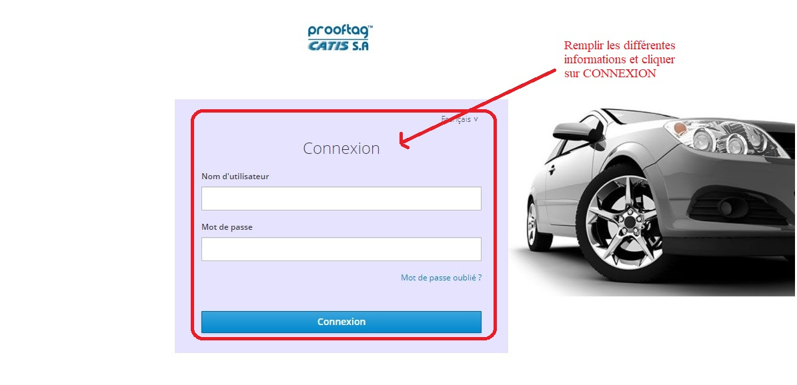

Procédure de gestion de l'assurance
===================================

Suite à prise en charge au niveau de l’hôpital est immédiatement déclenchée par
administration des soins, examens et traumatismes. Ces données enregistrées à l’hôpital
sont au moment t mis à disposition de l’assureur qui aura la capacité d’accepter ou non
la prise en charge d’u traitement ou examen particulier. L’assurance étant tout centre
apte à évaluer la santé technique d’un véhicule et à produire un procès-verbal, il sera dont
capable dans l’application de :

    * Mettre à disposition les données de contrat d’assurance.
    * Relever les différents défauts des véhicules.
    * Prise en charge des accidentés concernant le véhicule assuré en validant les soins et examens à supporter.
    * Identification du véhicule et vérification de la police d’assurance.
    * Prise en charge des véhicules des accidentés.

Connexion à l’application web Assurance
=======================================
Cette procédure est effectuée par les agents d'assurance pour faciliter le suivi des données lorsqu'un accident concerne un véhicule ou plusieurs véhicules parmi ceux qu'ils assurent. 

Sur la barre de recherche de votre navigateur, entrer l’adresse IP du serveur. Dans notre
cas, c’est l’adresse **« 51.195.11.202:8098 »**. Puis appuyer la touche « entrer » du
clavier.

    * **Renseigner vos paramètres de connexion (identifiant et mot de passe)**
  
Vous avez en face de vous une interface de connexion. Renseignez vos paramètres de connexion :

        * Votre identifiant
        * Votre mot de passe

Puis cliquer sur **« CONNEXION »**. 

.. centered:: Connexion à l’application

