Gestion des contrats
====================
Une fois être connecté à l’application, vous êtes redirigez à la page d’accueil qui affiche directement la liste des données des contrats d’assurance.

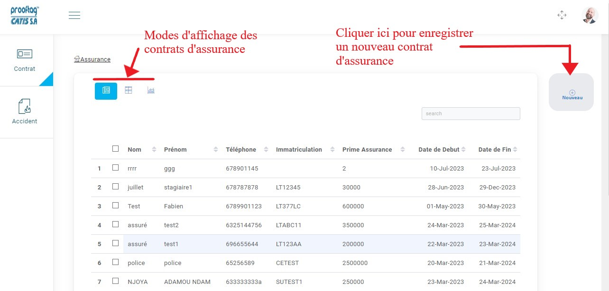
.. centered:: Accueil assurance et affichage des contrats sous forme de tableau.

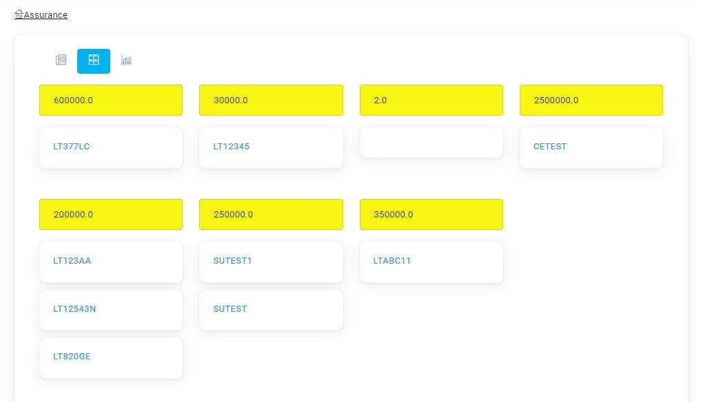
.. centered:: Affichage en fonction de la prime d’assurance.

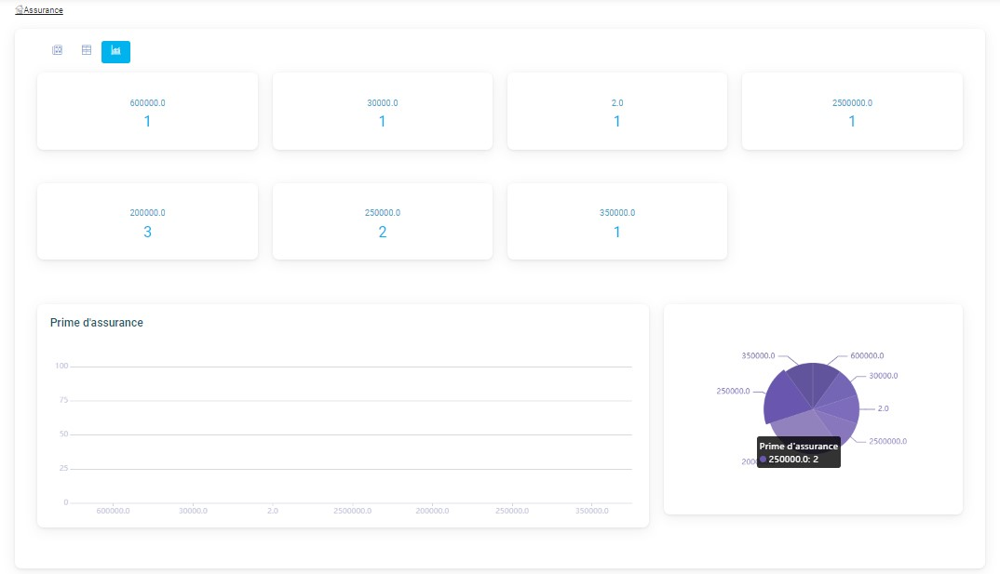
.. centered:: Affichage sous forme de graphe.

Enregistrer un nouveau contrat
------------------------------
Une fois avoir cliqué sur « Nouveau » pour enregistrer un nouveau contrat d’assurance
avec un véhicule, un formulaire vous est présenté où il faudra entrer certaines informations
puis cliquer sur « Enregistrer » pour enregistrer le contrat.

Assurance
^^^^^^^^^
Ici, il vous est demandé de renseigner les informations du contrat.

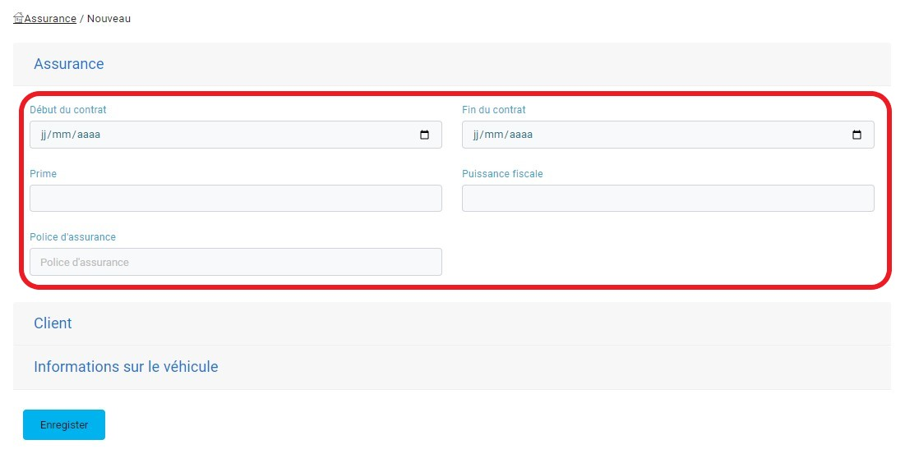
.. centered:: Informations sur le contrat.

Client
^^^^^^
Vous devez à ce niveau renseigner les informations liées au client.

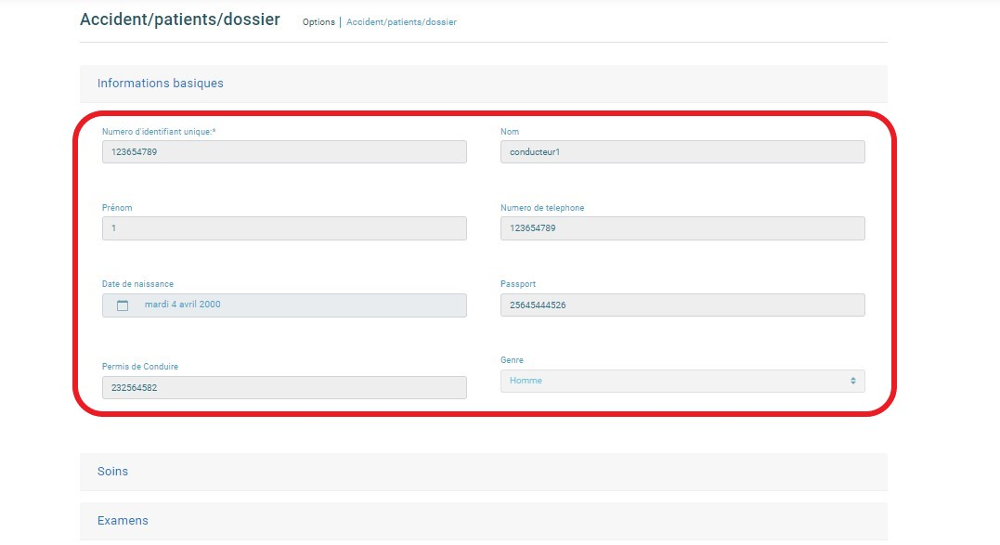
.. centered:: Informations sur le patient.

Information sur le véhicule
^^^^^^^^^^^^^^^^^^^^^^^^^^^
Vous devez à ce niveau renseigner les informations liées au véhicule.

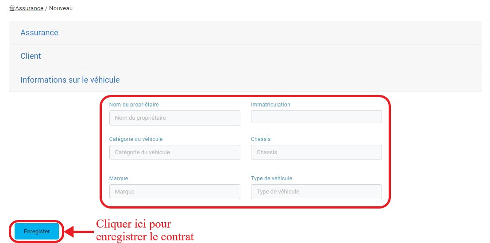
.. centered:: Informations sur le véhicule.

Lorsque l’agent devra entrer l’immatriculation du véhicule, une liste de véhicules ayant fait des contrôles technique lui sera proposée en fonction des caractères d’immatriculation entrés.

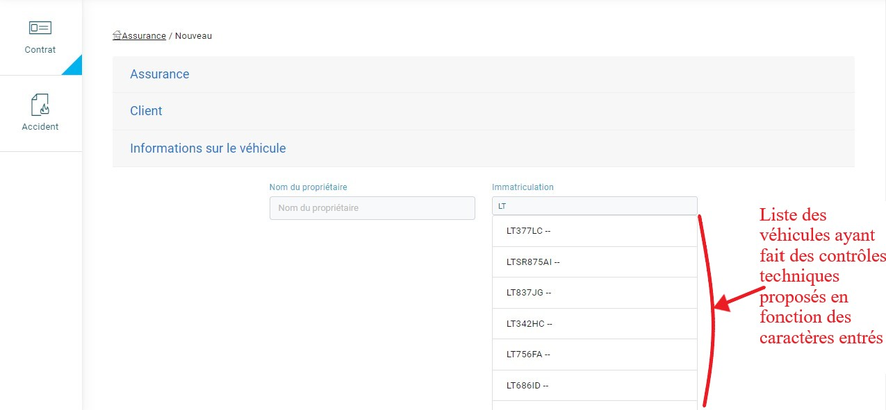
.. centered:: Recherche de l'immatriculation.

Gestion des accidents
=====================
Pour consulter la liste des accidents de son parc, il faut cliquer sur l’onglet « Accidents » de la barre de menu.

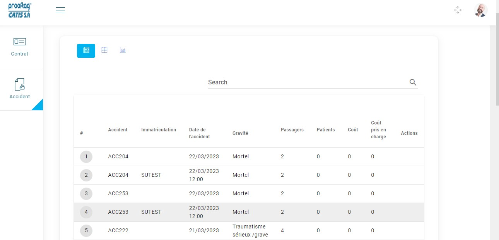
.. centered:: Affichage sous forme de tableau.

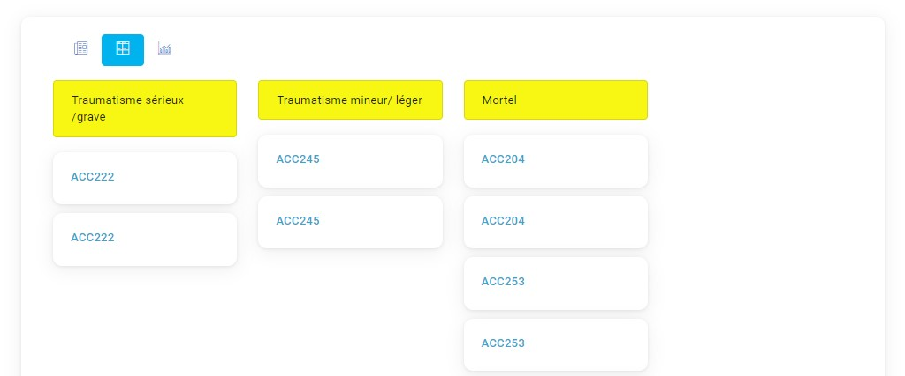
.. centered:: Affichage en fonction de la gravité de l’accident.

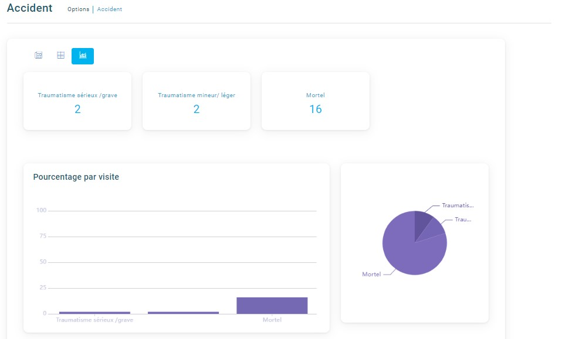
.. centered:: Affichage sous forme de graphes.

Consulter la liste des accidentés
---------------------------------
En fonction des véhicules victime de l’accident, l’agent collecteur ayant déclaré cet accident doit avoir également lié des accidentés aux véhicules victimes.

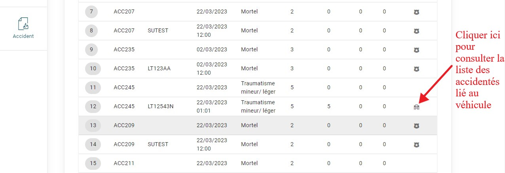
.. centered:: Consulter les dossiers médicaux associés aux différents contrats.

Après avoir cliqué sur l’icône pour la consultation des accidentés vous pouvez avoir les détails sur son dossier médical.

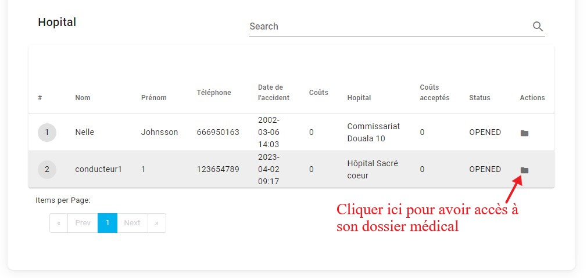
.. centered:: Consulter la liste des examens et soins du patient.

Lorsque vous cliquer sur l’icône pour la consultation du dossier médical, vous serrez
en mesure de voir des informations sur lui, sur les soins et les examens qui lui ont
été proposés puis de valider ces soins et examens en fonction du contrat avec le
véhicule.

.. centered:: Informations sur le patient.

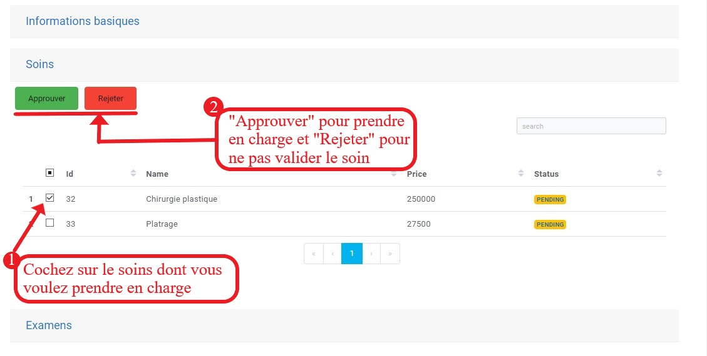
.. centered:: Valider ou rejeter un soin.

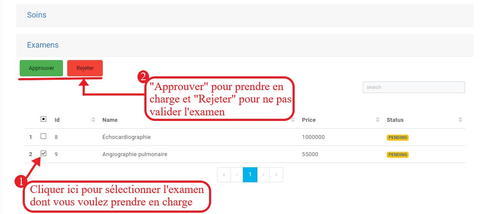
.. centered:: Valider ou rejeter un examen.

Lorsque l’examen ou le soin a été validé par l’assurance son état passe à « ACCEPTED ».

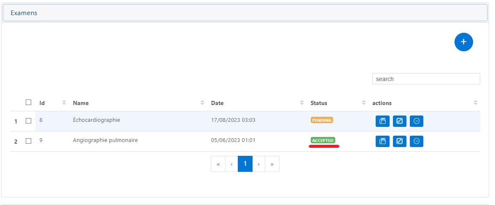
.. centered:: Etat accepté des examens.

Consulter le PV de l’accident
-----------------------------
L’agent de l’assurance a le droit de consulter le PV de l’accident établi par l’agent collecteur. 

Consulter la facture de l’hôpital
---------------------------------
Pour pouvoir s’en charger des frais des soins et examens, l’assurance aura la possibilité de consulter la facture pour vérifier les soins et examens confirmés au niveau de sa structure et effectuer un paiement à l’hôpital.

