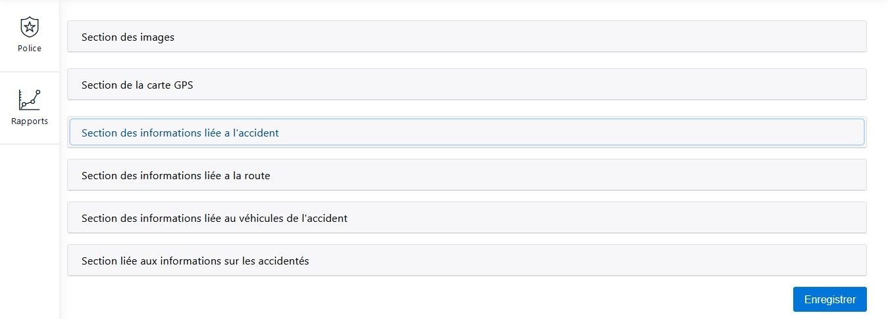
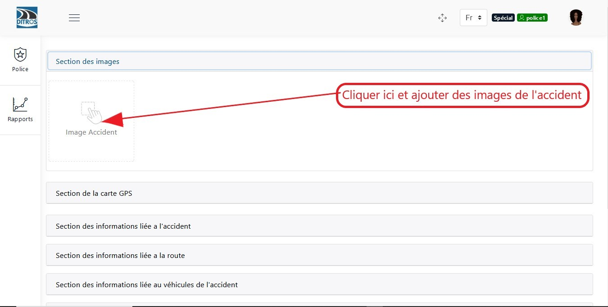
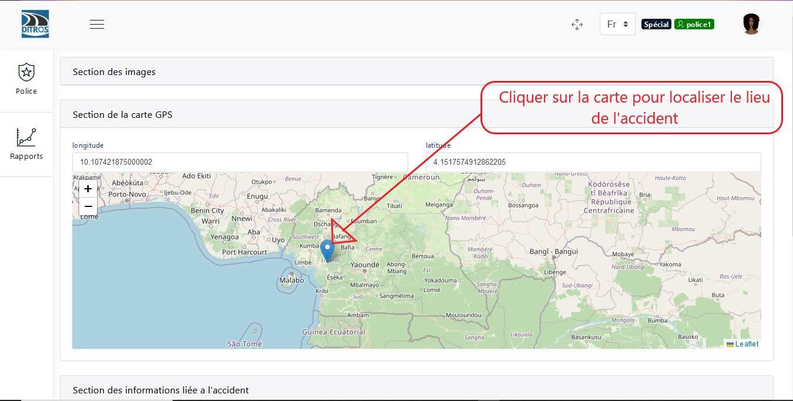
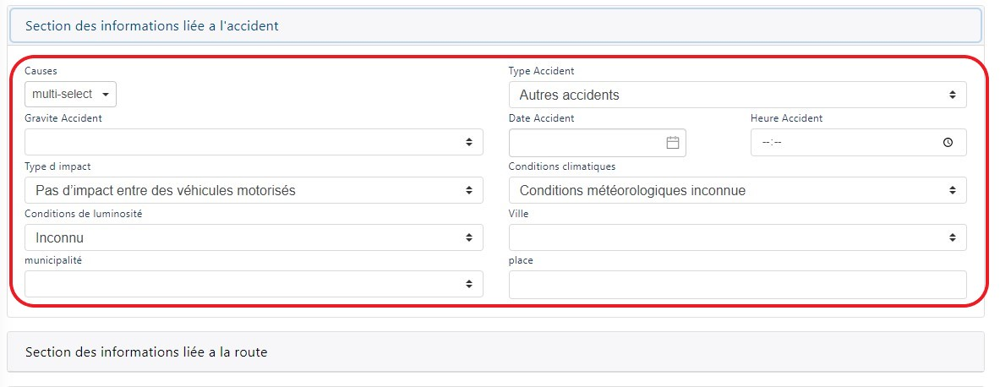
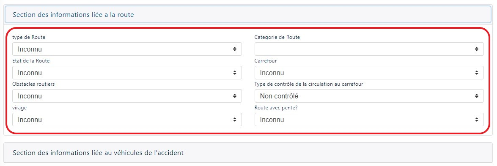
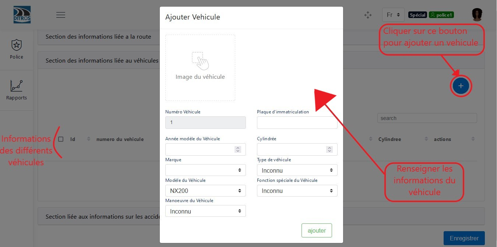
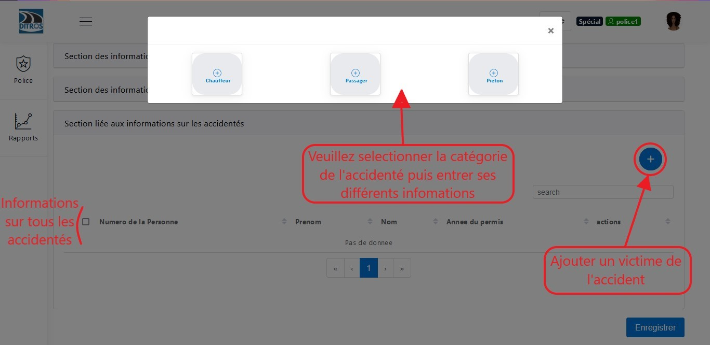

Ajouter un accident
===================
Après avoir entré ses identifiants vous êtes rediriger vers la page d’accueil qui est la suivante:

.. image:: ../Images/img-police1&2/int_acc.jpg
    :name: Accueil police/gendarmerie
.. centered:: Accueil police/gendarmerie

Après avoir cliqué sur l’icône d’ajout d’un accident, plusieurs champs vous seront présenter pour renseigner les informations sur l’accident.

.. centered::  Ajout d’un accident.

Ajouter une image
=================

.. centered::  Ajout de l’image de accident.

Ajouter une localisation de l’accident
--------------------------------------

.. centered::  Ajout de la localisaton.

Section des informations liées à l’accident
-------------------------------------------
Lorsque vous cliquer sur cette section, vous devez juste renseigner les informations qui vous seront demandées dans le formulaire.

.. centered::  Ajout des informations liées à l'accident.

Section des informations liées à la route
-----------------------------------------
Renseigner les informations qui vous seront demandées dans le formulaire.

.. centered::  Ajout des informations liées à la route.

Section des informations liées aux véhicules
--------------------------------------------

.. centered::   Ajout des informations liées aux véhicules.

Section des informations liées aux accidentés
---------------------------------------------

.. centered::   Ajout des informations liées aux accidentés.

Après sélection de la catégorie de l'accidenté, différentes boîtes de dialogues vous sont présentées:
    * Pour le chauffeur
      
    .. image:: ../Images/img-police1&2/chauffeur.jpg
        :name:   Ajout d'un chauffeur victime.
    .. centered::   Ajout d'un chauffeur victime.

    * Pour le passager

    .. image:: ../Images/img-police1&2/passager.jpg
        :name:   Ajout d'un passager victime.
    .. centered::   Ajout d'un passager victime.

    * Pour le piéton 

    .. image:: ../Images/img-police1&2/pieton.jpg
        :name:   Ajout d'un piéton victime.
    .. centered::   Ajout d'un piéton victime.

A la fin de cette procédure veuillez cliquer sur le bouton **« Enregistrer »** pour sauvegarder les informations sur l’accident.
