Enrichir la déclaration
=======================
Après toute la procédure d’ajout d’un accident, Le statut de l’accident passe à «OPENED» et qui sera afficher dans la liste de déclaration.

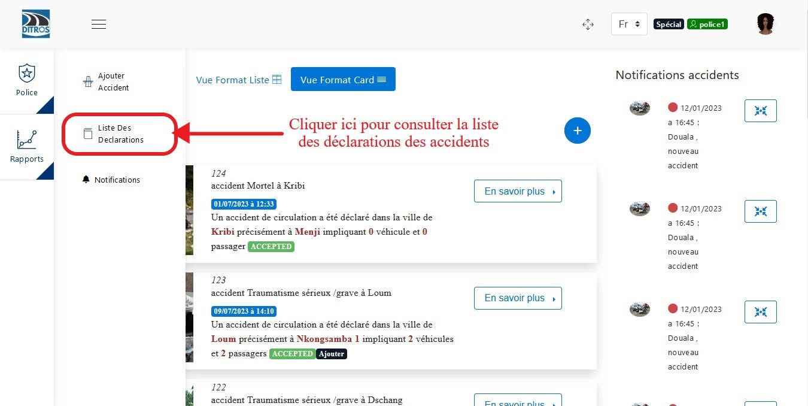
.. centered::  Liste de déclarations.

Une fois accéder à la liste des déclarations vous apercevrez une liste des déclarations du plus récent au plus ancien. Pour enfin terminer la procédure de déclaration d’accident, cliquer sur « En savoir plus » sur l’accident que vous venez d’ajouter dont le statut est « OPENED » et là vous verrez une liste de tache à effectuer. :ref:`Cliquez ici pour en savoir plus sur les statuts. <_knowStatus>`

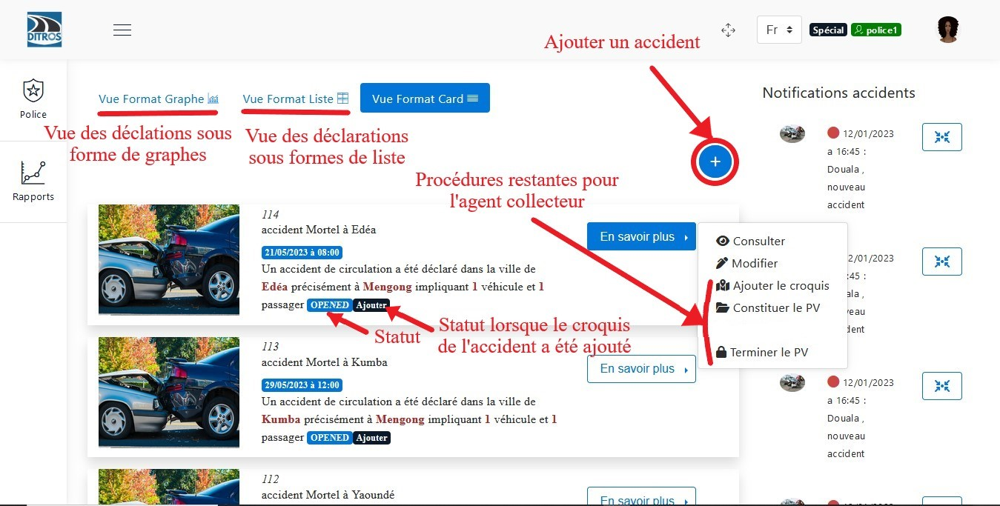
.. centered::  Accueil.

Modifier la déclaration
+++++++++++++++++++++++
En cliquant sur modifier pour la modification de la déclaration, il vous sera présenter une page identique a celle de l’ajout de l’accident dont vous devez cliquer sur différents onglets afin de modifier en fonction de ce que vous voulez.

Modifier une image
------------------

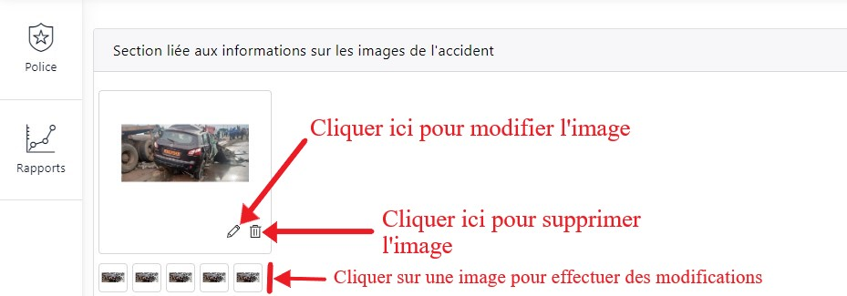
.. centered:: Modification des images de l'accident.

Données GPS
-----------
.. caution:: 
    Dans la modification de la déclaration, il est totalement impossible de modifier la localisation de l’accident.

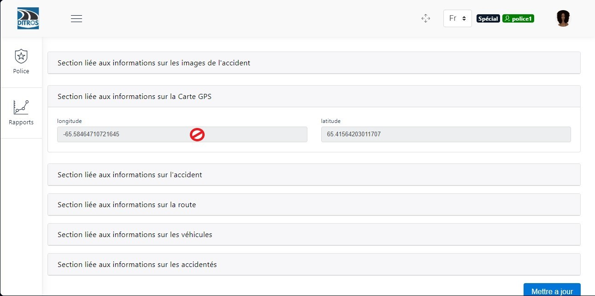
.. centered:: Visualisation des données GPS.

Informations sur l'accident
---------------------------
Ici, il vous suffit juste de modifier à l’endroit où vous avez ajouté ce qu’il ne fallait pas !

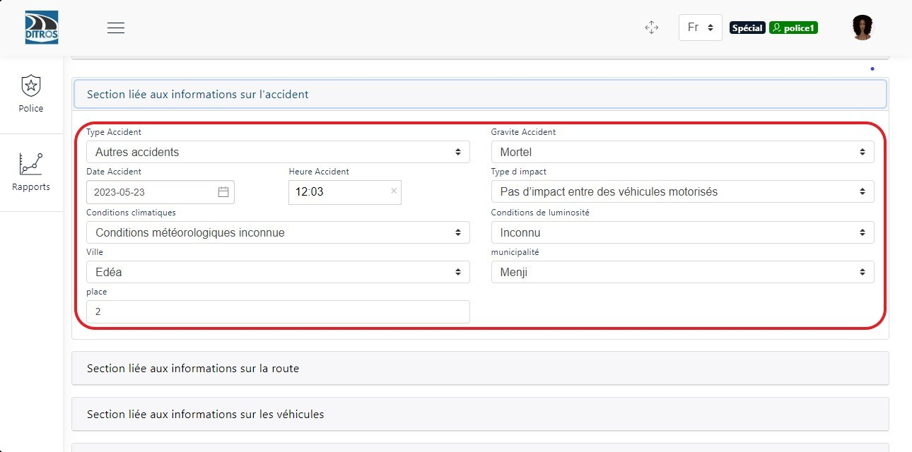
.. centered:: Modification des données sur l'accident.

Informations sur la route
-------------------------
Modifier également ici en fonction de vos besoins.

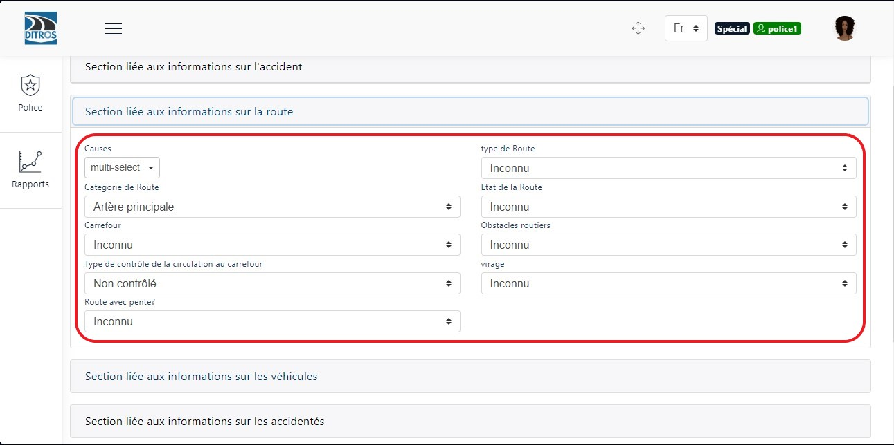
.. centered:: Modification des données sur la route.

Informations sur les véhicules
-------------------------------
Un tableau de véhicule victime de l’accident vous sera affiché et vous pouvez supprimer un véhicule, modifier les informations des véhicules, ajouter des véhicules.

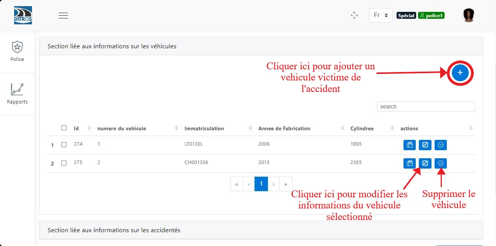
.. centered:: Informations sur les véhicules.

Après avoir cliqué sur l’icône de modification d’un véhicule, une boite de dialogue vous sera proposée pour ainsi modifier les informations relatives à vos besoins.

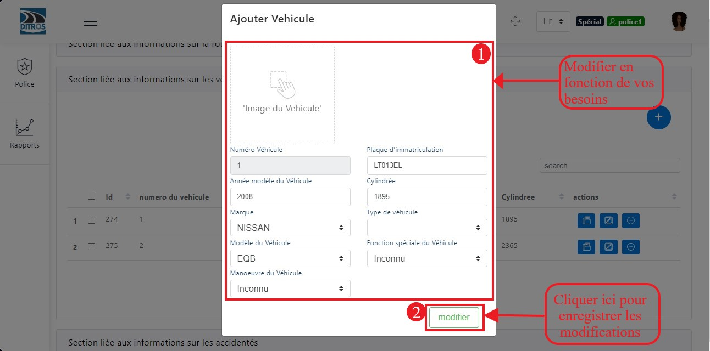
.. centered:: Modification d'un véhicule.

Informations sur les accidentés
-------------------------------
Un tableau de victimes de l’accident vous sera affiché et vous pouvez supprimer une victime, modifier les informations les victimes, ajouter des victimes.

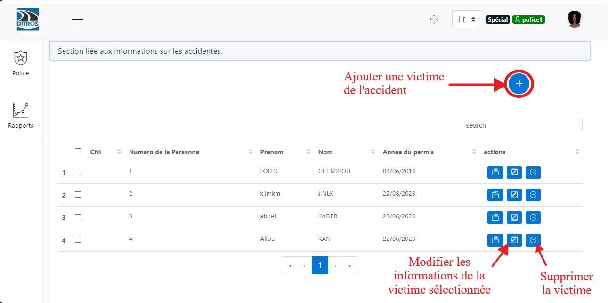
.. centered:: Liste des accidentés.

Après avoir cliqué sur l’icône de modification d’une victime, une boite de dialogue vous sera proposée pour ainsi modifier les informations relatives à vos besoins.

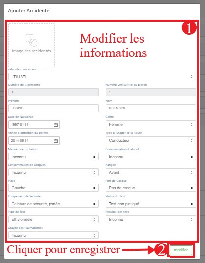
.. centered:: Modification des informations d'une victime.

Cliquer sur le bouton **«Mettre à jour»** après la modification de votre déclaration pour enregistrer.

Lors de l’enregistrement des informations sur les accidentés, il peut lier un accidenté à un véhicule qui sera pour que plus tard l’assurance puisse prendre en charge les accidentés en fonction des contrats avec les véhicules. La liste des véhicules dont il a entré au préalable lui est présentée pour qu’il puisse lier un accidenté à un véhicule.

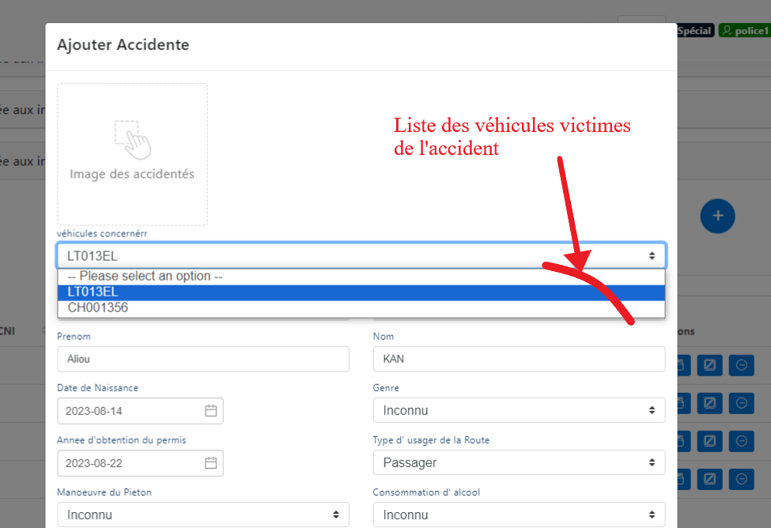
.. centered:: Sélection du véhicule de la victime.

Lorsque l’agent collecteur ajoute un accidenté, il pourra lier l’accidenté a un patient de l’hopital de telle sorte que lorsqu’il entrera les premiers caractères du nom de l’accidenté, une liste de patients sera proposée en fonction des caractères entrés par l’agent dont il pourra sélectionner.

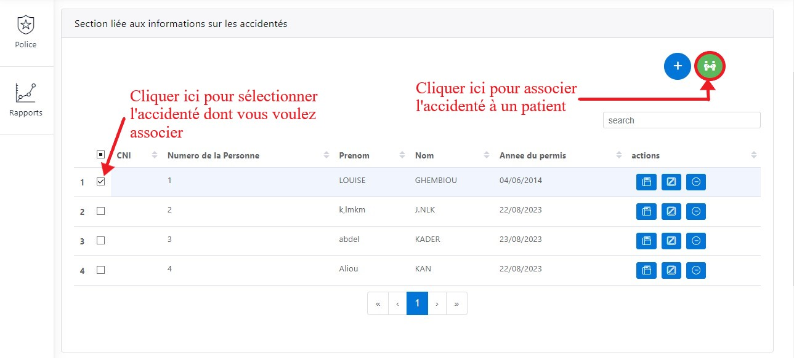
.. centered:: Association d'un victime à un patient.

Une boîte de dialogue vous est proposée pour entrer le nom de l’accidenté. Puis
cliquer sur « associer » pour associer l’accidenté au patient.

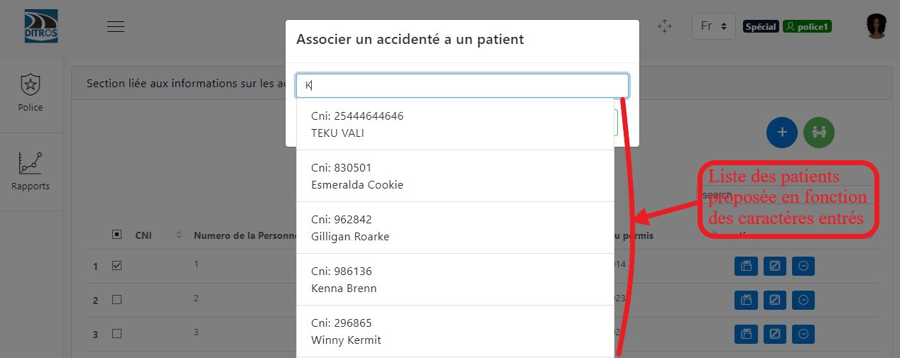
.. centered:: Recherche d'un patient.

Une fois que l’agent collecteur ait associé un accidenté a un patient, il a la possibilité de dissocier ces deux acteurs une fois qu’il se rend compte qu’il a fait une erreur ou qu’il a associé l’accidenté au mauvais patients.

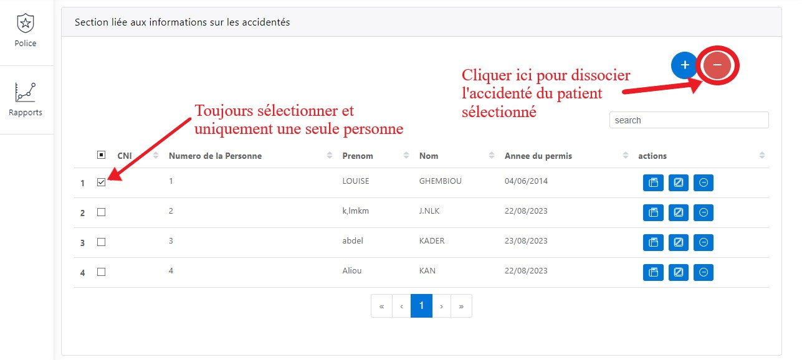
.. centered:: Annulation de l'association.

Ajouter un croquis
++++++++++++++++++
Lorsque vous cliquez sur « Ajoutez le croquis » une interface sera présenter où vous devez faire un croquis du lieu de l’accident soit en l’important de votre tablette ou en le dessinant et ensuite enregistrer votre action.

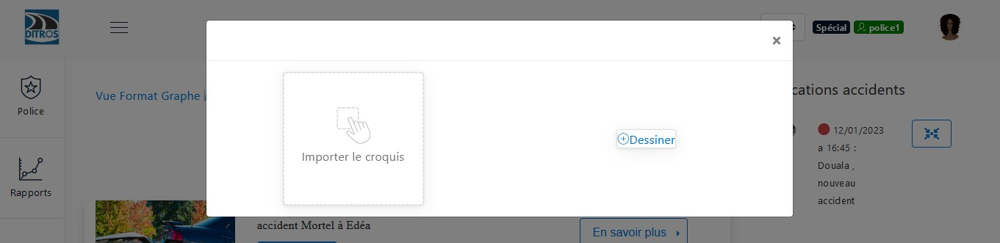
.. centered:: Choix d'insertion du croquis.

Lorsque vous cliquer sur dessiner :

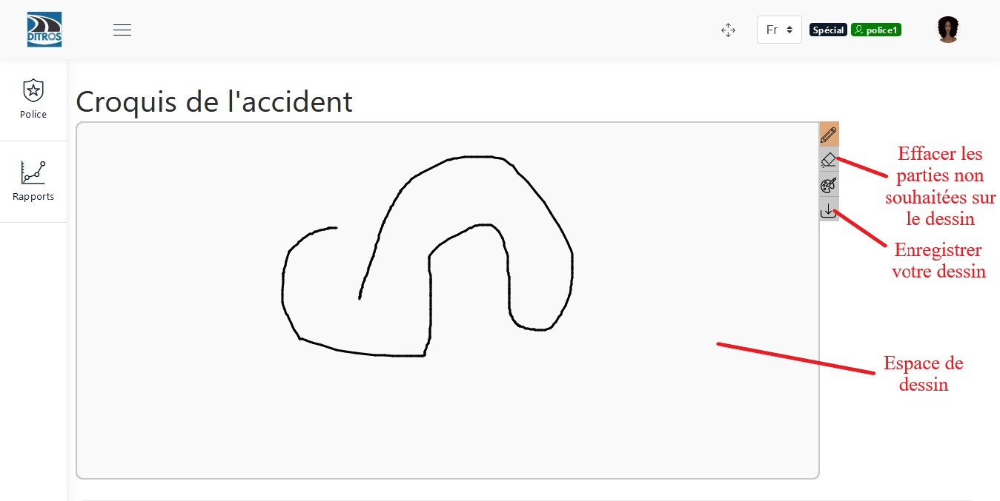
.. centered:: Dessin d'un croquis.

Constituer le PV
================
Pour cette tâche, il vous sera demandé d’entrer certaines informations pour pouvoir vous lier avec l’accident. Après avoir rempli ces différentes informations, cliquer sur « Enregitrer » pour la constitution du PV.

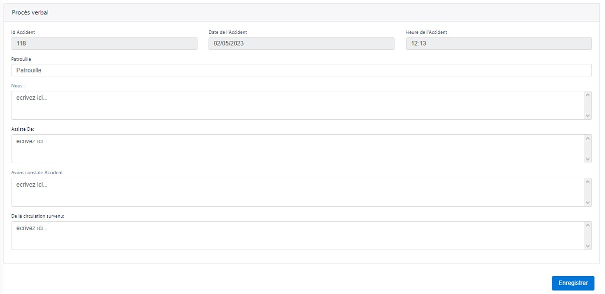
.. centered:: Constituer un PV.

Terminer le PV (Signer le PV)
=============================
Ici, il faudra juste émettre sa signature sur l’interface qui vous sera proposée et ensuite cliquer sur **« Enregistrer »**.

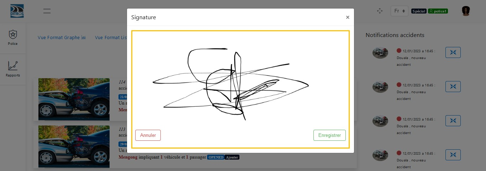
.. centered:: Signature.

A la fin de cette tâche, le statut de l’accident passe à « READY » et la suite de la déclaration s’effectuera par le supérieur agent collecteur.

Actions effectuées par l'agent collecteur en fonction des états de la déclaration
=================================================================================
Que le statut soit « ACCEPTED » ou « ACCEPTED Ajouter », l’agent collecteur ne pourra que consulter la déclaration de nouveau.

.. image:: ../Images/img-police1&2/accepted.jpg
    :name: Action du collecteur à l'état ACCEPTED
.. centered:: Action du collecteur à l'état ACCEPTED.

Lorsque la déclaration est au statut « REJECTED » ou « REJECTED Ajouter » les actions de cet agent sera de consulter la déclaration, modifier la déclaration, modifier le croquis de l’accident, reconstituer le PV et de signer le PV à la fin.

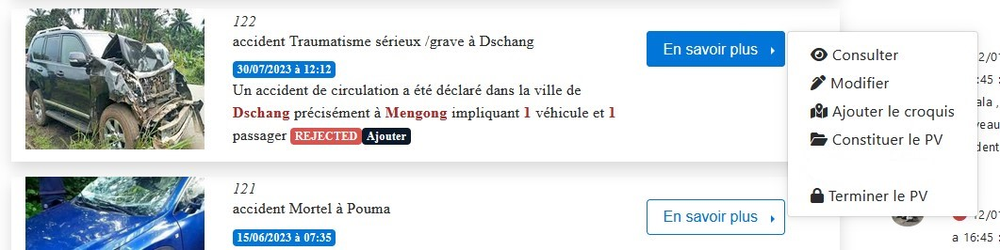
.. centered:: Action du collecteur à l'état REJECTED.

Lorsque l’agent ajoute un accident, le statut de l’accident passe à « OPENED », mais une fois qu’il a ajouté le croquis de l’accident, son état passe à « OPENED Ajouter » et ses différentes actions qu’il pourra effectuer sont les suivantes mais qui ont été mieux détaillé plus haut dans le document.

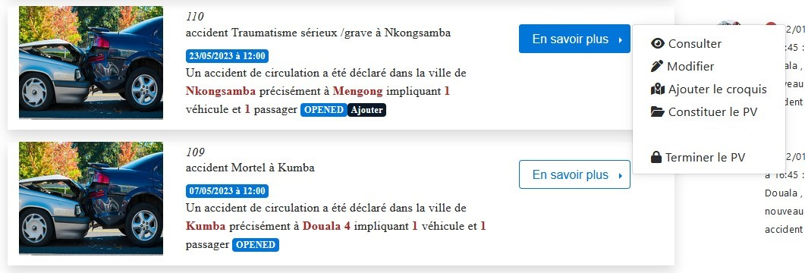
.. centered:: Action du collecteur à l'état OPENED.

Lorsque l’agent collecteur termine l’élaboration de sa déclaration, l’état de la déclaration passe a « READY » et si le croquis a été ajouté il passe a « READY Ajouter » et l’agent collecteur ne pourra que consulter la déclaration.

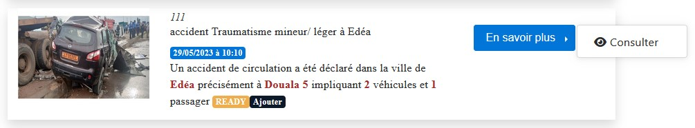
.. centered:: Action du collecteur à l'état READY

