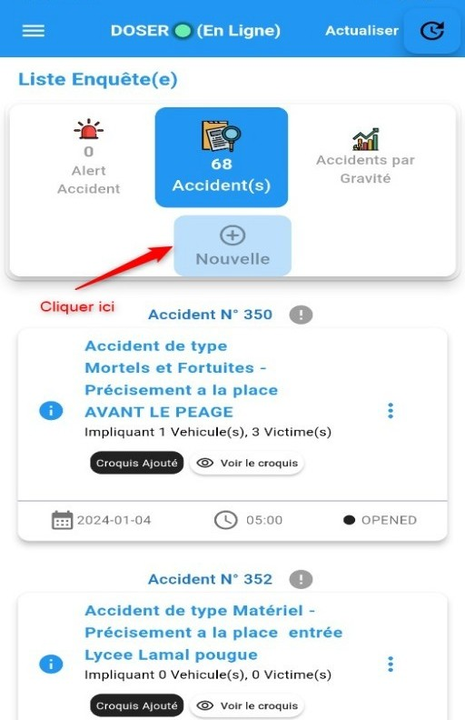

Ajouter d'une déclaration d'accident MOBILE
===========================================

Après avoir entré la clé d’identification qui ne vous est demandé qu’à la première ouverture  vous êtes redirigés vers la page d’accueil où vous pouvez ajouter un nouvel accident 

.. centered:: Ecran d’accueil pour ajouter un nouvel accident

Après avoir cliqué sur **+** , si vous êtes hors connexion un message d’avertissement vous est présenté pour vous demander si vous voulez continuer,
comme indiqué sur l'image suivante

 .. image:: ../Images/img-police1&2/MessageConfirmation.jpg
    :align: center

Après avoir cliqué sur **Creer**, plusieurs étapes vous seront présentées pour renseigner les informations sur l’accident. 
Les informations à renseigner dans ces étapes sont les 
suivantes :

* :ref:`Les informations sur l'agent constatateur <refPoliceAgentConstatateur>`
* :ref:`La précision de la localisation <refPoliceLocalisation>`
* :ref:`Les informations sur l'accident <refPoliceInfosAccident>`
* :ref:`Les informations sur la route <refPoliceRoute>`
* :ref:`Les véhicules concernés <refPoliceVehiculesConsernes>`
* :ref:`Les usagers concernés <refPoliceUsagersConcernes>`
* :ref:`Le croquis <refPoliceCroquis>`
* :ref:`Une déposition <refPoliceDepositions>

L'explication détaillée de la suite de la procédure d'ajout d'une déclaration est la suivante :

.. _refPoliceAgentConstatateur:

Agent constatateur
------------------

Avant d'ajouter un officier il faut tout d'abord reinsigner l'organisation auquel il apartient 
comme indiqué sur l'image suivante.

 .. image:: ../Images/img-police1&2/AjouterLaCompagnie.jpg
    :align: center
 .. centered:: Rechercher la Compagnie

En cliquant sur **+** comme l'indique l'image precedente pour ajouter un agent constatateur.

Remplir les champs du formulaire qui s’affiche.

Si vous êtes en ligne vous pouvez rechercher un policier existant dans le champ de recherche 
en haut du formulaire et une sélection remplira tous les autres champs en dessous déjà renseignés
et vous compléterez seulement les champs vides. Au cas contraire renseigner manuellement le **2** . 
Si le nom n’existe pas encore dans la base de données fais pareil. 

 .. image:: ../Images/img-police1&2/AjoutDesInformationsDeLenquêteur.jpg
    :align: center
 .. centered:: Ajout des informations de l’enquêteur

* **1.** Faire une recherche sur le nom de l’officier déjà préenregistrer
* **2.** Remplir manuellement les champs
* **3.** Ensuite cliquer sur **Enregister**

 .. image:: ../Images/img-police1&2/AgentAjouter.jpg
    :align: center
 .. centered:: Enqueteur enregistrer

Cliquer sur le bouton **Continuer** pour terminer cette étape et passer à l'étape suivante.

.. _refPoliceLocalisation:

Localisation 
------------

Pour renseigner la localisation sur le lieu de l'accident, nous avons deux méthodes :

**Méthode 1 :** Saisie des informations de localisation

Nous renseignons textuellement les informations suivantes :

* Région 
* Département 
* Ville
* Municipalitée
* Quartier
* Le lieu-dit
* Latitude
* Longititude

Puis cliquer sur le bouton **continuer** pour teminer cette étape et passer à l'étape suivante.

 .. image:: ../Images/img-police1&2/PoliceLocalisationMth1.jpg
    :align: center
 .. centered:: Information sur la localisation

**Méthode 2 :** Sélection sur la carte

Pour ceux qui veulent utiliser la carte, chercher la zone de l'accident sur la carte, sélectionner 
la position sur la carte 

.. image:: ../Images/img-police1&2/CarteLocalisation.jpg
    :align: center
.. centered:: Informations sur la localisation

Cliquer sur le bouton **Continuer** pour teminer cette étape et passer 
à l'étape suivante.

Accident  
--------

Remplir les champs du formulaire qui s’ouvre .

.. image:: ../Images/img-police1&2/InformationSurLaccident1.jpg
    :align: center
.. centered:: Section sur l'accident.

* **1.** Renseigner la date et l'heure

* **2.** Ajouter les photos 
     
         * **A.** Prendre une photo

         * **B.** Selectionner la photo dans la galerie 

         * **C.** Supprimer toutes les photos capturer ou Selectionner

         * **D.** Supprimer une photo

Ensuite remplir le reste des champs du formulaire :
*	Soit en sélectionnant digitalement dans la liste proposée

*	Soit en cliquant dans le champ texte pour saisir manuellement à l’aide du clavier disponible

.. centered:: Section sur l'accident.

Passer à l'étape qui suit en cliquant sur le bouton **Continuer**.

.. _refPoliceRoute:

Route 
-----

A cette étape, il faut renseigner les informations sur la route. 

Remplir les champs du formulaire qui s’ouvre :

*	Soit en sélectionnant digitalement dans la liste proposée
*	Soit en cliquant dans le champ texte pour saisir manuellement à l’aide du clavier disponible

.. image:: ../Images/img-police1&2/FormulaireLieeAlaRoute1.jpg
    :align: center
.. centered:: Informations sur la route.

.. image:: ../Images/img-police1&2/FormulaireLieeAlaRoute2.jpg
    :align: center
.. centered:: Informations sur la route.

Ensuite cliquer sur le bouton **Continuer**.
   