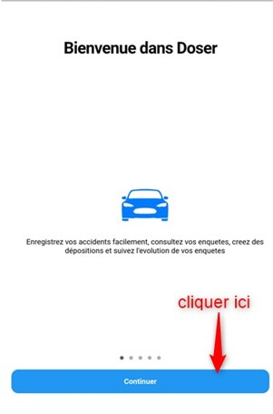
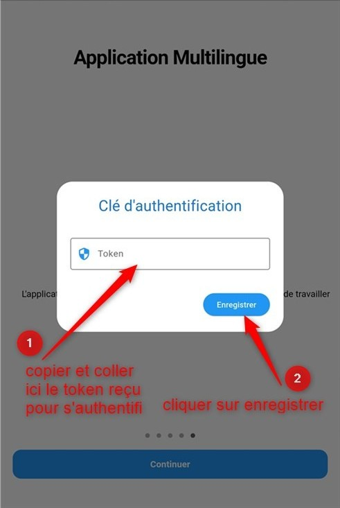

Connexion à l’application MOBILE de DOSER
=========================================
Après l’installation de l’application mobile sur votre handset mobile (téléphone, tablette..)
Double cliquez sur l’icône de l’application Doser.

Des écrans de présentations de l’application se présentent. Après lecture cliquer sur **Continuer**.

.. centered:: Ecran de démarrage de l’application mobile

A la fin des écrans de présentation l’écran d’authentification s’ouvre :

.. centered:: Ecran d’authentification application mobile
