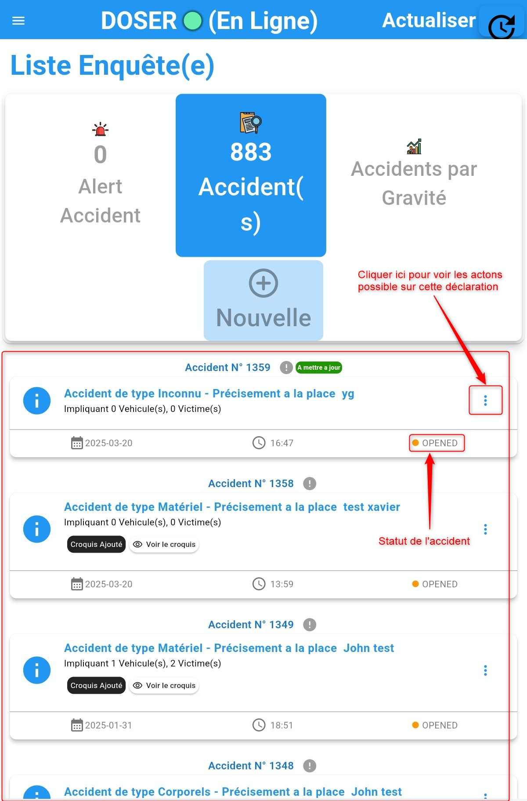
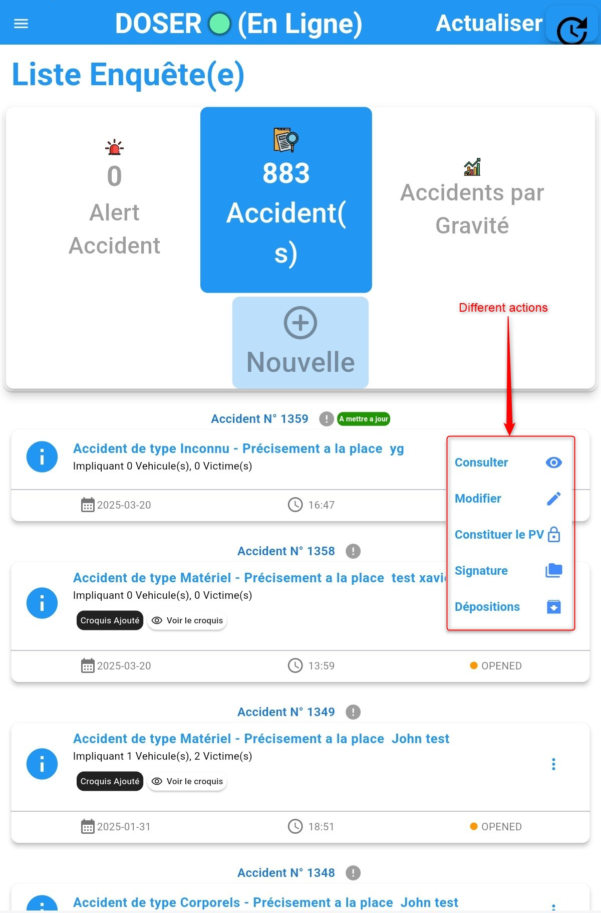
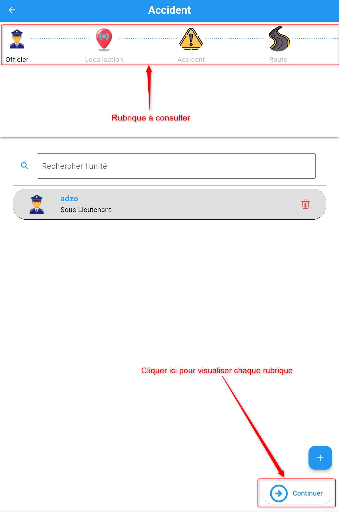
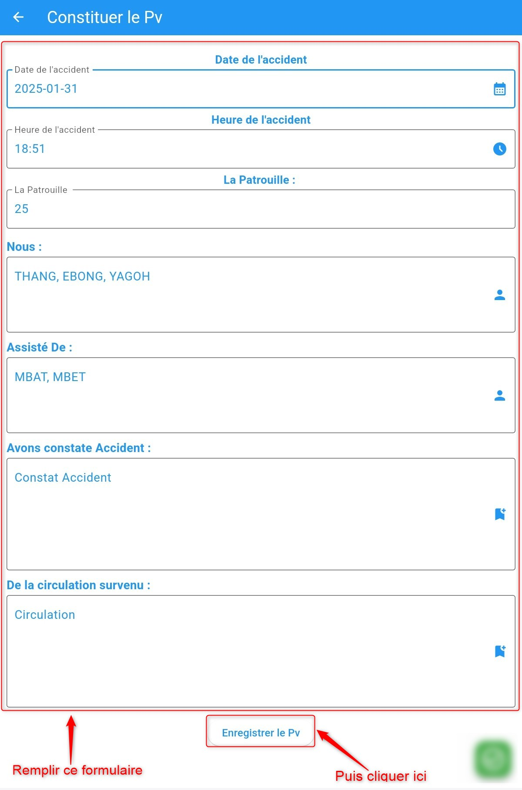
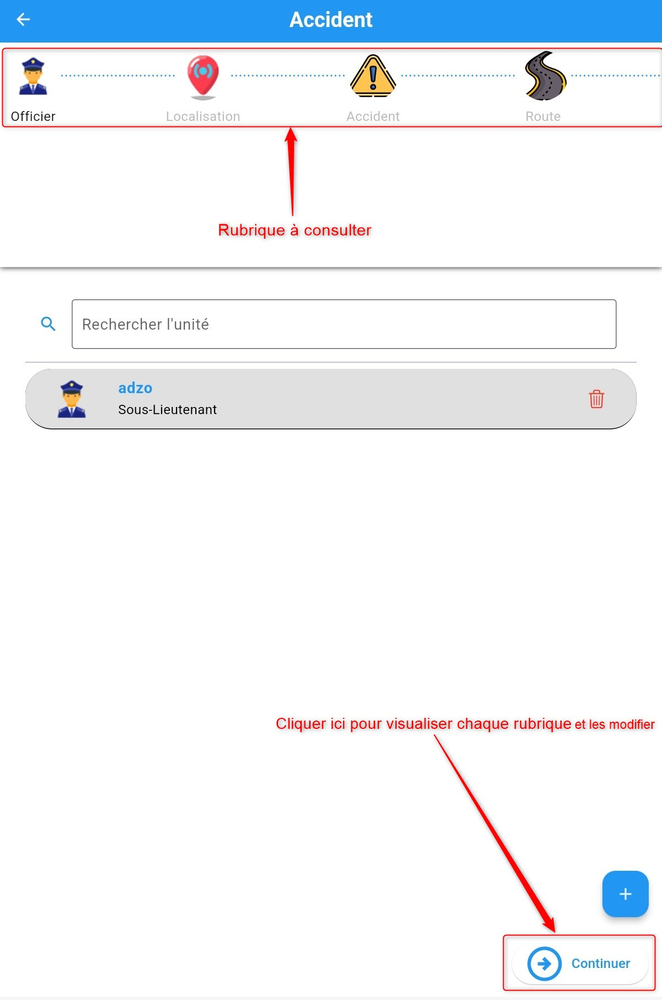
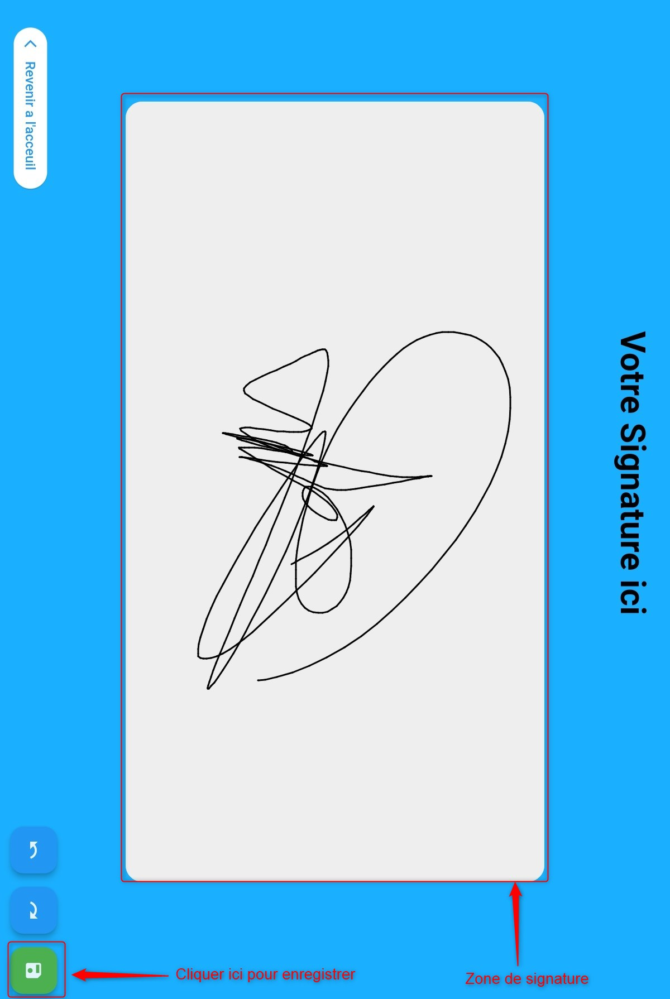
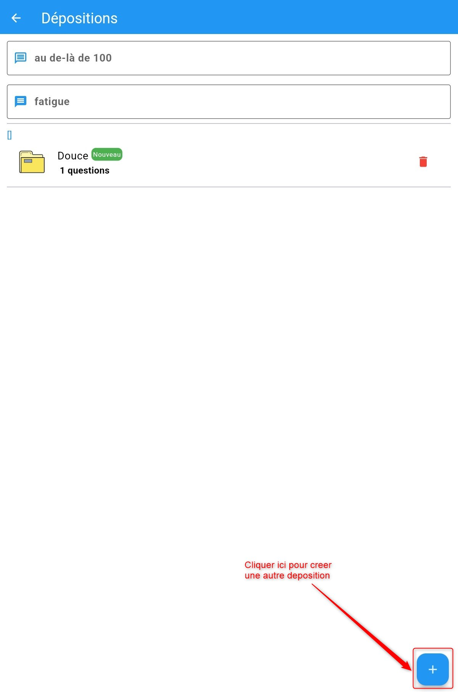

Enrichir la déclaration
=======================
Après toute la procédure d’ajout d’un accident, Le statut de l’accident passe à «OPENED» 
et qui sera afficher dans la liste de déclaration. 
:ref:`Cliquez ici pour en savoir plus sur les statuts des déclarations. <knowStatu>`

.. centered::  Liste de déclarations.

Une fois que vous accédez à la liste des accidents vous apercevrez une liste des
accidents du plus récent au plus ancien. Pour  terminer la procédure de déclaration
d’accident, cliquer sur « **les trois points à droite de l’accident crée** » sur l’accident
que vous venez d’ajouter dont le statut est « **OPENED** » et là vous verrez une liste de taches possibles à effectuer.Ces actions sont :

* :ref:`Visualiser les détails de la déclaration <refPoliceVisualiserDetail>`
* :ref:`Avoir le rapport PDF de la déclaration <refPoliceRapportPD>`
* :ref:`Avoir le procès verbal de la déclaration <refPoliceProcesVerbal>`
* :ref:`Modifier la déclaration <refPoliceModifierDeclaration>`
* :ref:`Ajouter un croquis <refPoliceAjouterDeposition>`
* :ref:`Signer le rapport <refPoliceSignerRapport>`

.. _refPoliceActionsPossiblesDeclaratio:

.. centered::  Actions possibles sur une déclaration.

.. _refPoliceVisualiserDetail:

Visualiser les détails de la déclaration
++++++++++++++++++++++++++++++++++++++++

Pour visualiser les détails sur une déclaration, il faut cliquer sur **Consulté** dans la liste 
des actions qu'on peut effectuer sur une déclaration d'accident. Une fois avoir cliqué sur 
**Consulté** comme présenté :ref:`ici <refPoliceActionsPossiblesDeclaratio>`, l'interface suivante va s'afficher : 

.. centered::  Visualisation des informations de la declaration de l’accident

Cliquer sur **Continuer** pour consulter les 08 rubriques 

.. _refPoliceRapportPD:

Rapport PDF
+++++++++++

Pour avoir le rapport PDF d'une déclaration, il faut cliquer sur **Constituer le PV** dans la liste 
des actions qu'on peut effectuer sur une déclaration d'accident. Une fois avoir cliqué sur 
**Constituer le PV** comme présenté :ref:`ici <refPoliceActionsPossiblesDeclaratio>`, l'interface suivante va s'afficher :

.. centered::  Constituter le rapport

.. _refPoliceModifierDeclaratio:

Modifier la déclaration
+++++++++++++++++++++++

En cliquant sur **Modifier** pour effectuer des  modificationsde la déclaration, il vous sera présenté une page avec
les différents paliers remplis lors de la déclaration d’accident et  vous devez cliquer sur l’onglet dont vous souhaitez
modifier les détails puis cliquer sur enregistrer. Une fois avoir cliqué sur 
**Modifier** comme présenté :ref:`ici <refPoliceActionsPossiblesDeclaratio>`, l'interface suivante va s'afficher :

.. centered::  Modification de la declaration

Cliquer sur **Continuer** pour modifier les 08 rubriques selon les informations convenables 

.. _refPoliceSignerRappor:

Signer le rapport
+++++++++++++++++

Pour signer le rapport, il faut cliquer sur **Signature** dans la liste 
des actions qu'on peut effectuer sur une déclaration d'accident. Une fois avoir cliqué sur 
**Signature** comme présenté :ref:`ici <refPoliceActionsPossiblesDeclaratio>`, 
la fenêtre suivante va s'afficher :

.. centered::  Signature ajoute 

Signer et enregistrer la signature en cliquant sur le bouton enregister comme présenté 
sur l'image ci-dessus.

.. _refPoliceAjouterDeposition:

Ajout la déposition
+++++++++++++++++++

Pour ajouter un croquis à une déclaration, il faut cliquer sur **Déposition** dans la liste 
des actions qu'on peut effectuer sur une déclaration d'accident. Une fois avoir cliqué sur 
**Déposition** comme présenté :ref:`ici <refPoliceActionsPossiblesDeclaratio>`, la fenêtre 
suivante va s'afficher :

.. centered::  Ajouter la déposition  

Apres avoir cliquer sur le bouton de creation de la déposition vous allez etre dirige ici
: :ref:`En savoir plus <refPoliceDeposition>`

