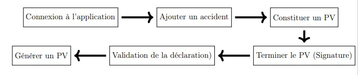
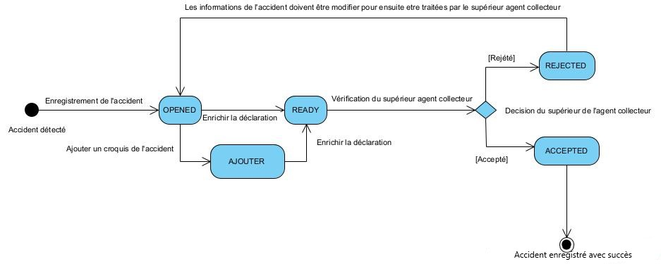

ETATS ET DESCRIPTIONS
=====================

Cette procédure comprend deux étapes : 

* **La déclaration de l’accident :** L’acteur principal de la procédure de déclaration est un agent de police ou de gendarmerie (Agent collecteur).
* **la validation de l’accident :** L’acteur principal de la validation est un agent qui a le droit de valider les déclarations enregistrées

Pour se faire, les différentes étapes à suivre sont les suivantes:

Il est également important de connaitre les différents statuts par lesquels passeront les
véhicules enregistrés sur l’application.

.. centered:: Diagramme des états de la déclaration

.. _knowStatu:
Les différentes descriptions de ces etats sont les suivantes :

.. list-table:: Descriptions des Etats
   :widths: 20 30
   :header-rows: 1
   :class: tight-table

   * - Etats
     - Descriptions
   * - OPENED
     - Lorsque l’accident a été détecté et l’agent de déclaration à entrer les informations qu’il appercoit pour ensuite rédiriger un procès verbal de l’accident. A cette etat l’agent peut consulter ou modifier les informations précédemment entrer lors de la detection de l’accident. Pour la suite de la procédure il devra ajouter le croquis, constituer le PV, générer le PV et enfin signer le PV pour terminer.
   * - READY
     - A cette etat, toutes les imoformations concernant l’application ont été ajouté par l’agent collecteur et c’est au tour du superieur agent collecteur valider ou de rejeter les informations sur l’accident.
   * - REJECTED
     - Ici, le superieur agent collecteur a rejecté les informations liées à l’accident et a généré un motif de son rejet que l’agent collecteur prendra en compte pour pouvoir modifier les informations précédemment fournies.
   * - ACCEPTED
     - Le supérieur agent collecteur a validé les informations de l’accidents et a confirmé avec sa signature à l’appui.
   * - Ajouter
     - C’est lorsque l’agent collecteur ajoute un croquis à sa déclaration quelque soit le statut de la déclaration avant que la déclaration ne soit validée par le supérieur agent collecteur.