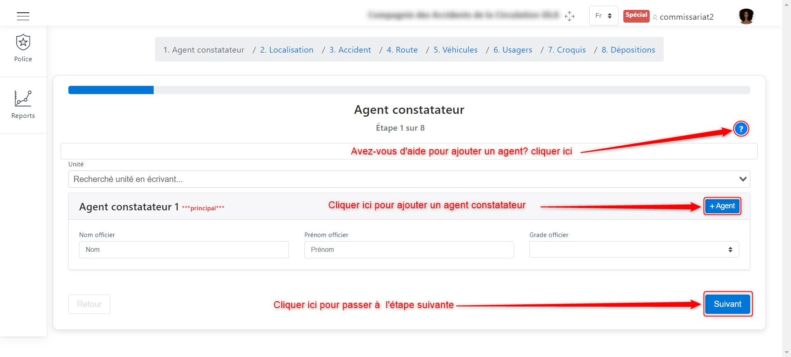
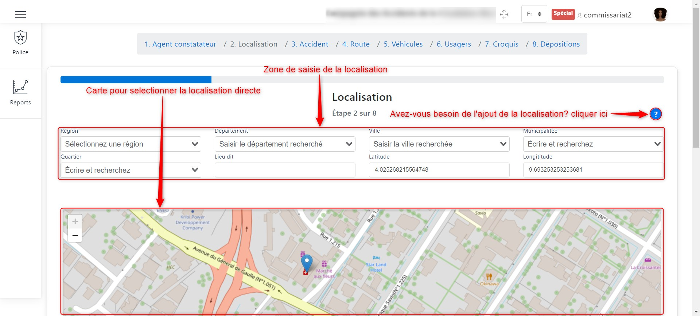
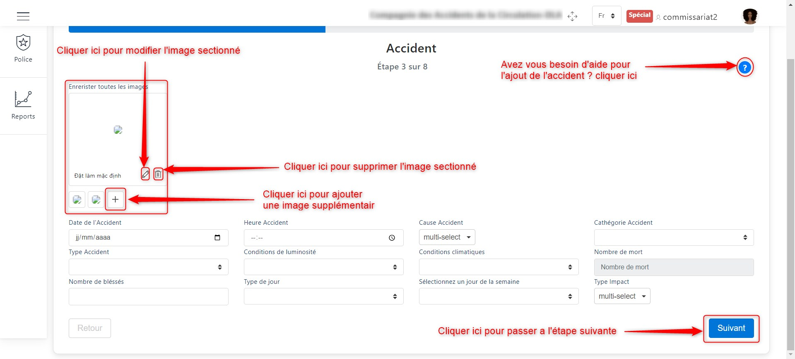
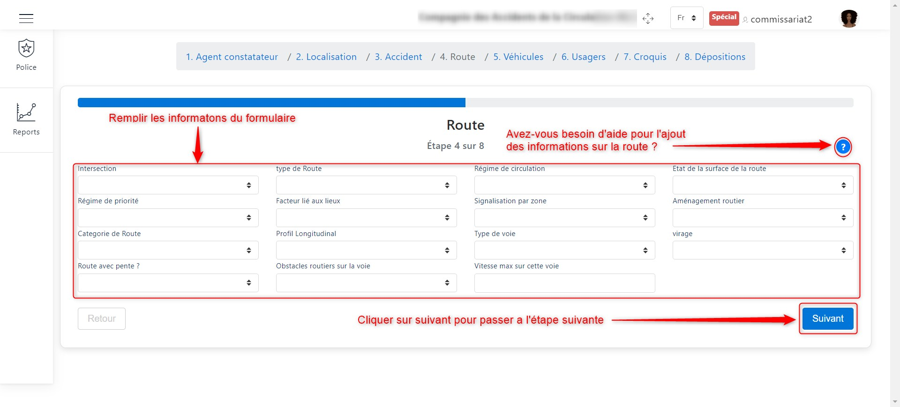
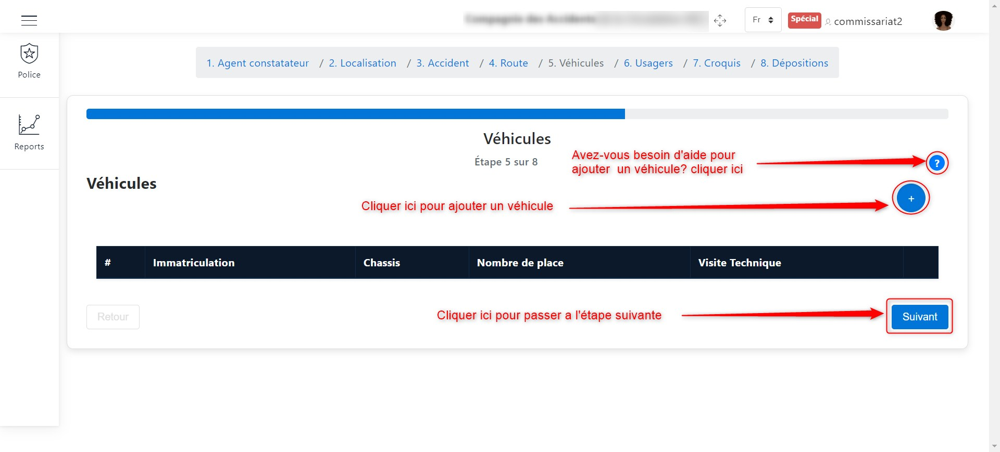
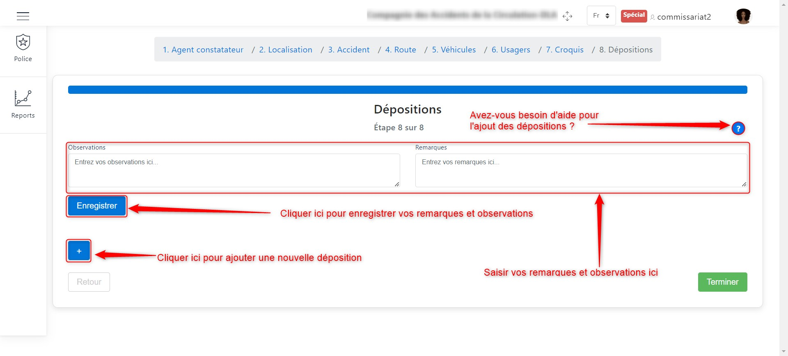

Ajouter d'une déclaration d'accident
====================================

Pour ajouter une déclaration d'accident, deux options s'offrent à nous :

* Soit cliquer sur le bouton **+** dans la page présentant la liste des déclarations d'accident

* Soit cliquer sur **le module police** dans le menu de droite puis sur **ajouter un accident** 

L'image ci-dessous est assez illustrative de ces deux possibilités.

.. image:: ../Images/img-police1&2/int_acc.jpg
    :name: Accueil police/gendarmerie
.. centered:: Accueil police/gendarmerie

Après avoir cliqué sur l’icône d’ajout d’une déclaration d'accident, plusieurs étapes vous seront présentées 
pour renseigner les informations sur l’accident. Les informations à renseigner dans ces étapes sont les 
suivantes :

* :ref:`Les informations sur l'agent constatateur <refPoliceAgentConstatateur>`
* :ref:`La précision de la localisation <refPoliceLocalisation>`
* :ref:`Les informations sur l'accident <refPoliceInfosAccident>`
* :ref:`Les informations sur la route <refPoliceRoute>`
* :ref:`Les véhicules concernés <refPoliceVehiculesConsernes>`
* :ref:`Les usagers concernés <refPoliceUsagersConcernes>`
* :ref:`Le croquis <refPoliceCroquis>`
* :ref:`Une déposition <refPoliceDepositions>`

L'explication détaillée de la suite de la procédure d'ajout d'une déclaration est la suivante :

.. _refPoliceAgentConstatateur:

Agent constatateur
------------------

C'est la première section de la déclaration à remplir; il s'agit ici de renseigner les 
informations d'identification de l'agent constatateur ou des agents constatateurs s'ils 
sont nombreux à faire le constat.

Voici comment se présenter l'interface de cette étape

.. centered:: Agent constatateur

Comme illustré plus haut, nous avons la possibilité d'ajouter plusieurs agents constatateurs, 
en cliquant juste sur le bouton **+ Agent**.

.. centered:: Deuxième agent constatateur

Passer à l'étape qui suit en cliquant sur le bouton **Suivant**.

.. _refPoliceLocalisation:

Localisation 
------------

Pour renseigner la localisation sur le lieu de l'accident, nous avons deux méthodes :

**Méthode 1 :** Saisie des informations de localisation

Nous renseignons textuellement les informations suivantes :

* Région 
* Département 
* Ville
* Municipalitée
* Quartier
* Le lieu-dit
* Latitude
* Longititude

Puis cliquer sur le bouton **Suivant** pour teminer cette étape et passer à l'étape suivante.

**Méthode 2 :** Sélection sur la carte

Pour ceux qui veulent utiliser la carte, chercher la zone de l'accident sur la carte, sélectionner 
la position sur la carte puis cliquer sur le bouton **Suivant** pour teminer cette étape et passer 
à l'étape suivante.

L'image qui suit nous présente les deux méthodes  

.. centered:: Informations sur la localisation

Passer à l'étape qui suit en cliquant sur le bouton **Suivant**.

.. centered:: Bouton suivant.

.. _refPoliceInfosAccident:

Accident  
--------

C'est le moment d'ajouter l'accident. Il faut donc ajouter les photos de l'accident et 
remplir tous les champs de renseignement.

.. centered:: Section sur l'accident.

Passer à l'étape qui suit en cliquant sur le bouton **Suivant**.

.. _refPoliceRoute:

Route 
-----

A cette étape, il faut renseigner les informations sur la route. Remplir 
les champs pour identifier la route.

.. centered:: Informations sur la route.

Passer à l'étape qui suit en cliquant sur le bouton **Suivant**.

.. _refPoliceVehiculesConsernes:

Véhicules concernés 
-------------------

Ici, nous devons renseigner les informations sur les véhicules concernés par 
l'accident. Pour cela, nous devons cliquer sur le bouton **+** comme présenté 
par l'image ci dessous pour ajouter un véhicule.

.. centered:: Renseigner les différents véhicules concernés.

Une fois que nous avons cliqué sur le bouton **+** comme présenté sur l'image ci-dessus, 
nous devons renseigner ses informations comme présenté plus bas

.. centered:: Remplir les informations sur le véhicule concerné.

Lorque nous finissons de remplir le formulaire, nous devons sauvegarder ce dernier comme 
présenté plus bas

.. centered:: Enregister les informations sur le véhicule concerné.

Lorsque nous ajoutons un véhicule, nous pouvons visualiser quelque une de ses informations dans 
le tableau ci-dessous.

.. centered:: Tableau récapitulatif des différents véhicules concernés.

Passer à l'étape qui suit en cliquant sur le bouton **Suivant**.

.. _refPoliceUsagersConcernes:

Usagers concernés
-----------------

Ici, nous devons renseigner les informations sur les usagers concernés par 
l'accident. Pour cela, nous devons cliquer sur le bouton **+** comme présenté 
par l'image ci dessous pour ajouter un usager.

.. centered:: Renseigner les différents véhicules concernés.

Une fois que nous avons cliqué sur le bouton **+** comme présenté sur l'image ci-dessus, 
nous devons renseigner ses informations comme présenté plus bas

.. centered:: Remplir les informations sur le véhicule concerné.

Lorque nous finissons de remplir le formulaire, nous devons sauvegarder ce dernier comme 
présenté plus bas

.. centered:: Enregister les informations sur le véhicule concerné.

Lorsque nous ajoutons un usager, nous pouvons visualiser quelque une de ses informations dans 
le tableau ci-dessous.

.. centered:: Tableau récapitulatif des différents véhicules concernés.

Passer à l'étape qui suit en cliquant sur le bouton **Suivant**.

.. _refPoliceCroquis:

Croquis
-------

Pour insérer le croquis, deux options s'offrent à nous :

* Soit nous dessinons le croquis directement dans l'application
* Soit nous importons une image de croquis

L'image ci-dessous illustre le deux méthodes

.. _refPoliceInsererCroquis:

.. centered:: Insérer un croquis.

**Méthode 1 :** Dessiner dans l'application

Pour dessiner dans l'application, il faut cliquer sur le bouton **Dessiner** 
comme illustré dans la précédente image.

.. centered:: Zone de dessin.

Passer à l'étape qui suit en cliquant sur le bouton **Suivant** comme indiqué par 
:ref:`l'image suivante <refPoliceInsererCroquis>`.

**Méthode 2 :** Importer une image

Pour importer l'image du croquis, il faut cliquer sur le bouton d'importation de 
l'image comme illustré dans :ref:`l'image suivante <refPoliceInsererCroquis>`.
Une fois avoir cliqué sur ce bouton, une fenêtre va s'ouffrir pour vour permettre de 
recherche de l'image du croquis afin de l'importer.

.. centered:: Importer l'image du croquis.

Passer à l'étape qui suit en cliquant sur le bouton **Suivant** comme indiqué par 
:ref:`l'image suivante <refPoliceInsererCroquis>`.

.. _refPoliceDepositions:

Dépositions 
-----------

Arriver dans la section de création des dépositions, nous avons l'interface ci-dessous. 
Ici nous pouvons créer une nouvelle déposition en cliquant sur le bouton **+** comme 
indiqué sur l'image ci-dessous. Nous avons aussi deux champs pour renseigner nos observations 
à droite et nos remarques à gauche.

.. centered:: Créer une déposition.

Lorsque nous cliquons sur le bouton **+** comme présenté plus haut, une fenêtre apparait où nous 
devons rensseigner les informations de la personne qui fait la déposition, la date de la déposition et 
les différentes questions que nous lui avons posées ainsi que les réponses que ce dernier a donné.

.. centered::  Renseigner les informations sur la déposition.

Pour ajouter les questions posées et réponses données lors de l'interview du témoin, nous devons cliquer 
sur le bouton **+Question** et la section pour le remplissage apparaitra comme suit. Une fois avoir rempli 
toutes les informations, il faut cliquer sur le bouton **Enregister** pour terminer avec la déposition.

.. image:: ../Images/img-police1&2/PoliceNewDepositionQuestion.jpg 
.. centered::  Ajouter les questions.

Lorsque nous ajoutons une déposition elle apprarait comme suit :

.. centered::  Liste de dépositions.

Losrque vous cliquer sur le nom du témoin dans l'affichage de la déposition, vous pouvez voir tout l'interview 
du témoin.

Une fois que vous avez saisi toutes les informations sur toutes les déclarations, cliquer sur le bouton **Terminer** 
pour enregistrer toutes les dépositions.

.. image:: ../Images/img-police1&2/PoliceVoirQuestionsRéponses.jpg 
.. centered::  Interview du témoin.
