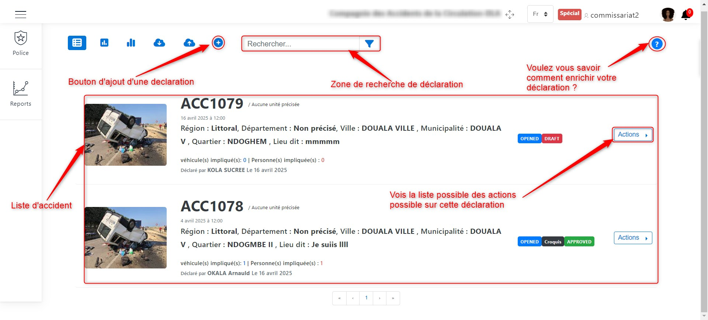
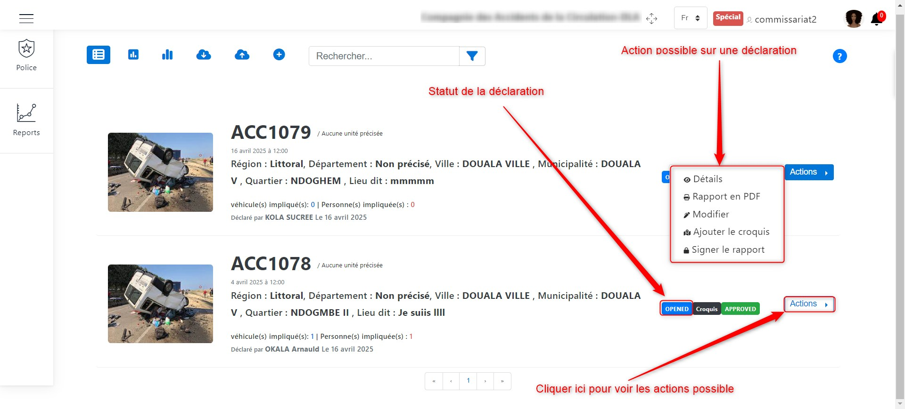
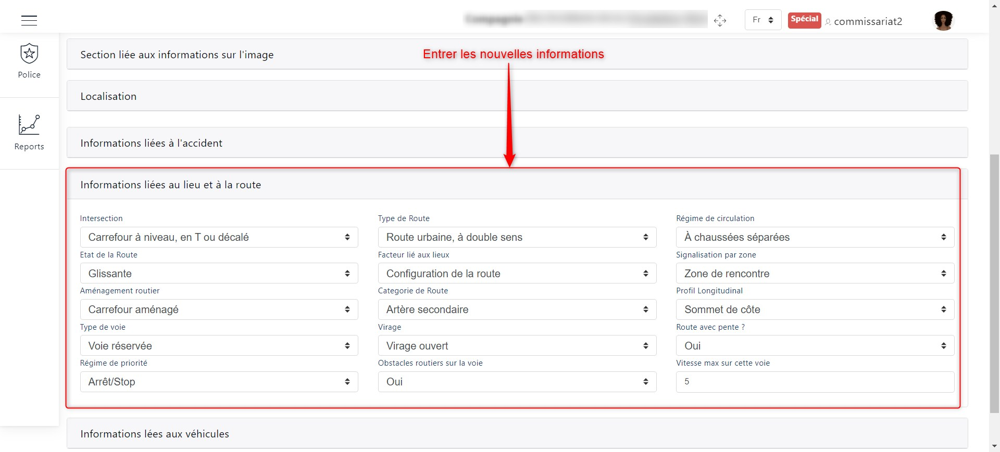
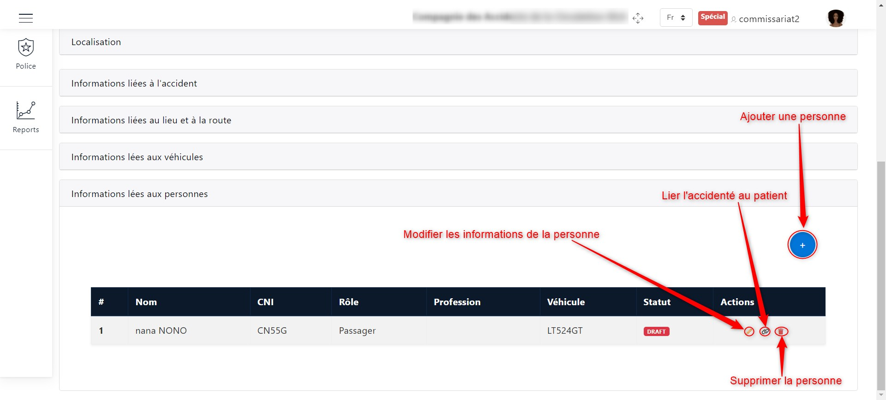
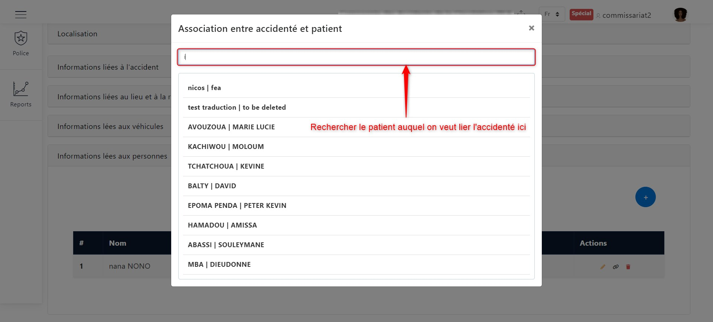
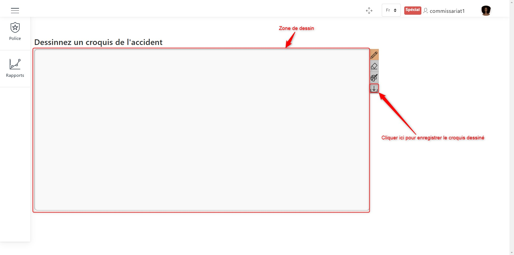
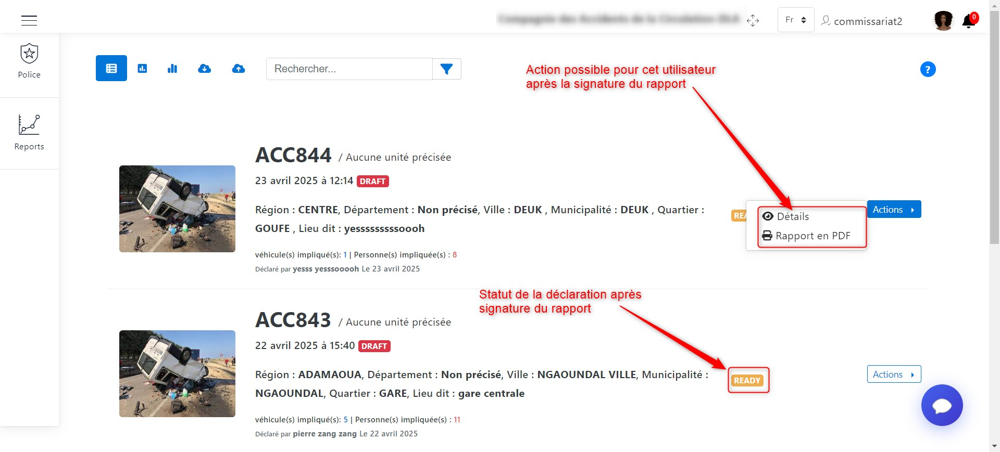

Enrichir la déclaration
=======================
Après toute la procédure d’ajout d’un accident, Le statut de l’accident passe à «OPENED» 
et qui sera afficher dans la liste de déclaration. 
:ref:`Cliquez ici pour en savoir plus sur les statuts des déclarations. <knowStatus>`

.. centered::  Liste de déclarations.

En cliquant sur le bouton **Actions** comme présenté plus haut, l'on peut voir la liste 
des actions possibles sur les déclarations. Ces actions sont :

* :ref:`Visualiser les détails de la déclaration <refPoliceVisualiserDetails>`
* :ref:`Avoir le rapport PDF de la déclaration <refPoliceRapportPDF>`
* :ref:`Modifier la déclaration <refPoliceModifierDeclaration>`
* :ref:`Ajouter un croquis <refPoliceAjouterCroquisDeclaration>`
* :ref:`Signer le rapport <refPoliceSignerRapport>`

.. _refPoliceActionsPossiblesDeclaration:

.. centered::  Actions possibles sur une déclaration.

.. _refPoliceVisualiserDetails:

Visualiser les détails de la déclaration
++++++++++++++++++++++++++++++++++++++++

Pour visualiser les détails sur une déclaration, il faut cliquer sur **Détails** dans la liste 
des actions qu'on peut effectuer sur une déclaration d'accident. Une fois avoir cliqué sur 
**Détails** comme présenté :ref:`ici <refPoliceActionsPossiblesDeclaration>`, l'interface suivante va s'afficher : 

.. centered::  Les sections d'une déclaration.

Pour chacune des sections suivantes, cliquer sur le nom de la section concernée pour pouvoir 
visualiser les détails de la section en question. 

.. centered::  Voir les détails sur la section d'une déclaration.

.. _refPoliceRapportPDF:

Rapport PDF
+++++++++++

Pour avoir le rapport PDF d'une déclaration, il faut cliquer sur **Rapport en PDF** dans la liste 
des actions qu'on peut effectuer sur une déclaration d'accident. Une fois avoir cliqué sur 
**Rapport en PDF** comme présenté :ref:`ici <refPoliceActionsPossiblesDeclaration>`, l'interface suivante va s'afficher :

.. _refPoliceModifierDeclaration:

Modifier la déclaration
+++++++++++++++++++++++

Pour modifier une déclaration, il faut cliquer sur **Modifier** dans la liste des actions qu'on 
peut effectuer sur une déclaration d'accident. Une fois avoir cliqué sur 
**Modifier** comme présenté :ref:`ici <refPoliceActionsPossiblesDeclaration>`, l'interface suivante va s'afficher :

.. centered::  Liste des sections modifiables dans une déclaration.

Les sections que nous pouvons modifier sont :

* La section liée aux informations sur l'image
* La localisation
* Les informations liées à l'accident
* Les informations liées au lieu et à la route 
* Les informations liées aux véhicules 
* Les informations liées aux personnes

Modifier la section liée aux informations sur l'image
-----------------------------------------------------

L'image suivante nous montre comment modifier les images existentes ou ajouter une 
ajouter une image si elle n'existait pas.

.. centered::  Modifier l'image.

Chercher l'image et valider.

Modifier la localisation
------------------------

Nous pouvons ajouter en modifiant entrant la longitude et la latitude ou en sélectionnant sur 
la carte comme le présente l'image ci-dessous

.. centered::  Modifier l'image.

Modifier les informations liées à l'accident
--------------------------------------------

Modifier cette section consiste juste à renseigner les nouvelles valeurs.

.. centered::  Modifier les informations sur l'accident.

Modifier les informations liées au lieu et à la route
-----------------------------------------------------

Modifier cette section consiste juste à renseigner les nouvelles valeurs.

.. centered::  Modifier les informations sur le lieu et la route.

Modifier les informations liées aux véhicules
---------------------------------------------

Ici le nous pouvons modifier les véhicules de l'ancienne déclaration et ajouter des 
véhicules à la déclaration.

.. centered::  Modifier les véhicules de la déclaration.

:ref:`En savoir plus <refPoliceVehiculesConsernes>` sur l'ajout, la supression et 
la modification des véhicules.

Modifier les informations liées aux personnes
---------------------------------------------

Ici le nous pouvons modifier les personnes enregistrées dans l'ancienne déclaration et ajouter 
de nouvelles personnes à la déclaration.

.. centered::  Modifier les information de la personne de la déclaration.

:ref:`En savoir plus <refPoliceUsagersConcernes>` sur l'ajout, la supression et 
la modification des personnes.

Pour lier un accidenté à un patient, nous devons cliquer sur le bouton de liaison présenté ci-dessus, 
puis nous recherchons le patient en question dans la barre de recherche qui va s'afficher comme suit.

.. centered::  Liaison de l'accidenté au patient.

Une fois que nous avons trouvé le patient en question, nous devons le séclectionnons tout simplement.

Lorsque nous avons terminé les modifications que nous voulions faire sur la déclaration d'accident, nous 
devons cliquer sur le bouton **Enregister** en haut de page et valider les donnees modifier si vous avez le droit
 comme présenté sur l'image ci-dessous.

.. image:: ../Images/img-police1&2/PoliceModificationsEnregistrées.jpg
.. centered::  Enregistrer les modifications sur la déclaration.

.. _refPoliceAjouterCroquisDeclaration:

Ajout du croquis
++++++++++++++++

Pour ajouter un croquis à une déclaration, il faut cliquer sur **Ajouter le croquis** dans la liste 
des actions qu'on peut effectuer sur une déclaration d'accident. Une fois avoir cliqué sur 
**Ajouter le croquis** comme présenté :ref:`ici <refPoliceActionsPossiblesDeclaration>`, la fenêtre 
suivante va s'afficher :

.. _refPoliceModifInsererCroquis:

.. centered::  Enregister les modifications sur la déclaration.

Comme nous pouvons le constater sur l'image ci-dessus, deux options s'offrent à nous :

* Soit nous dessinons le croquis directement dans l'application
* Soit nous importons une image de croquis

**Méthode 1 :** Dessiner dans l'application

Pour dessiner dans l'application, il faut cliquer sur le bouton **Dessiner** 
comme illustré dans :ref:`l'image suivante <refPoliceModifInsererCroquis>`. Une fois avoir cliqué, 
nous sommes redirigé vers l'interface de dessin du croquis

.. centered:: Zone de dessin.

Ne pas oublier d'enregistrer son croquis avec le bouton d'enregistrement présenté dans l'image 
ci-dessus.

**Méthode 2 :** Importer une image

Pour importer l'image du croquis, il faut cliquer sur le bouton d'importation de 
l'image comme illustré dans :ref:`l'image suivante <refPoliceModifInsererCroquis>`.
Une fois avoir cliqué sur ce bouton, une fenêtre va s'ouffrir pour vour permettre de 
recherche de l'image du croquis afin de l'importer.

.. image:: ../Images/img-police1&2/PoliceImporterCroquis.jpg
.. centered:: Importer l'image du croquis.

.. _refPoliceSignerRapport:

Signer le rapport
+++++++++++++++++

Pour signer le rapport, il faut cliquer sur Signer le rapport dans la liste 
des actions disponibles pour une déclaration d'accident. Une fois que vous avez cliqué sur 
Signer le rapport, comme présenté :ref:`ici <refPoliceActionsPossiblesDeclaration>`, 
la fenêtre suivante s'affiche :

.. centered:: Signer le rapport.

Signez et enregistrez la signature en cliquant sur le bouton **Enregistrer**, comme présenté 
sur l'image ci-dessus.

La déclaration passe au statut **READY** après avoir été signée. Dans ce cas, l'utilisateur peut 
uniquement consulter les détails et obtenir le rapport en PDF, comme indiqué dans l'image suivante.

.. centered:: Rapport signé.
