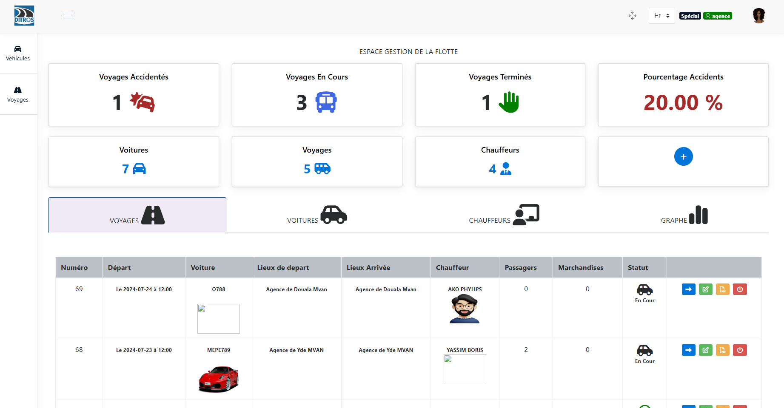

 
Connexion à l’application web de gestion de flottes
===================================================
Cette section est réservée aux particuliers qui disposent d'une flotte de véhicules afin de les aider dans leurs tâches de gestion.

C'est dans ce sens que DOSER propose à ces particuliers une panoplie de fonctionnalités à savoir : 

* la création et le suivie des voyages
* l'ajout des véhicules
* l'ajout des chauffeurs
* l'affectation d'un chauffeur et d'un véhicule à un voyages
* l'ajout des itinéraires
* l'ajout des emplacements (ici il est question des points de départ et des points d'arrivé)

Tout ceci ce dans une interface utilisateur assez intuitive  

Sur la barre de recherche de votre navigateur, entrer l’adresse IP du serveur. Dans notre
cas, c’est l’adresse **« 141.95.103.210:8088 »**. Puis appuyer la touche « entrer » du
clavier.

    * **Renseigner vos paramètres de connexion (identifiant et mot de passe)**
  
Vous avez en face de vous une interface de connexion. Renseignez vos paramètres de connexion :

        * Votre identifiant
        * Votre mot de passe

Puis cliquer sur **« CONNEXION »**. 

.. image:: ../Images/img-police1&2/Connex.jpg
    :name: Connexion à l’application
.. centered:: Connexion à l’application

Une fois connecté vous devez voir apparaitre devant vous une interface similaire à celle ci-dessous : 

.. centered:: Accueil de la gestion de flottes
