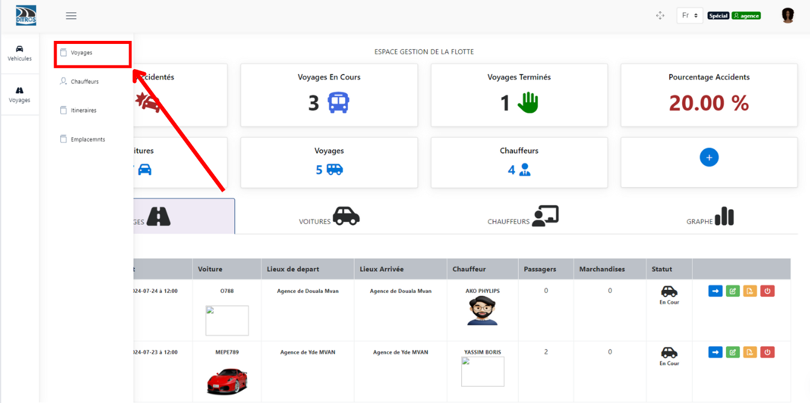
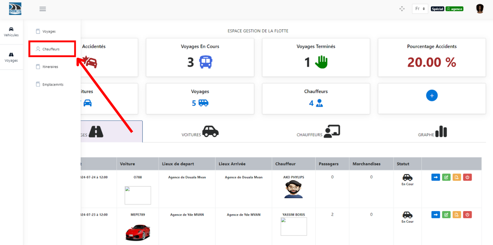
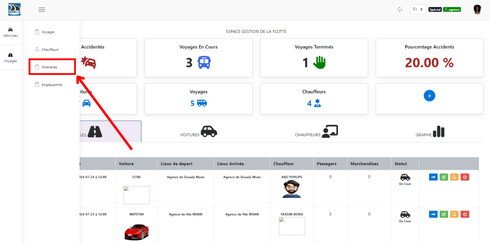
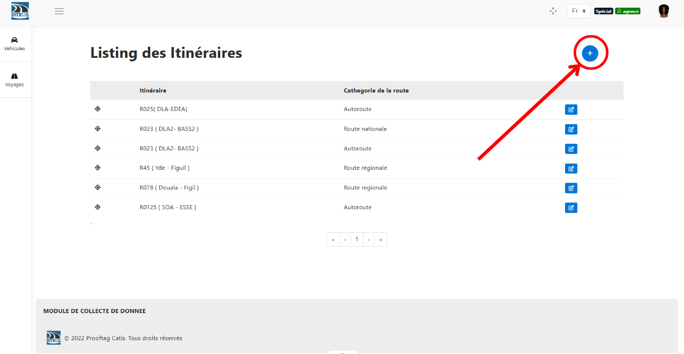

Les différentes fonctionnalités de l'application
================================================

Les actions que l'on peut entreprendre en ce qui concerne la gestion des flottes sont : 

la création des voyages
+++++++++++++++++++++++

La création d'un voyage peut se faire de deux manières différentes; soit directement sur le **Dashboard** soit dans la section **« Voyages »**.

**1** Dans le **Dashboard** :

Pour créer un voyage, nous allons cliquer sur le bouton **+** comme le présente l'interface qui suit : 

.. centered:: Dashboard de la gestion de flottes

Remplir les informations des trois sections suivantes : 

.. image:: ../Images/img-flotte/Ajout_voyage.PNG
    :name: Les sections à remplir
.. centered:: Les sections à remplir

Remplir les informations de **la section des informations liées au voyage :** On renseigne ici les détails du véhicules, le jour & heure du voyage, le chauffeur concerné et les points de départ & d'arrivée

.. centered:: la section des informations liées au voyage

Remplir les informations de **la section liée aux informations sur les passagers :** Il est question dans cette section d'enregistrer tous les passagers qui devront effectuer ce voyage.

.. image:: ../Images/img-flotte/Ajout_voyage2.PNG
    :name: la section liée aux informations sur les passagers
.. centered:: la section liée aux informations sur les passagers

Remplir les informations de **la section liée aux bagages :** Ici on va renseigner les différents bagages. Enfin cliquer sur le bouton **« Enregistrer »** pour finaliser la création du voyage.

.. image:: ../Images/img-flotte/Ajout_voyage3.PNG
    :name: la section liée aux bagages
.. centered:: la section liée aux bagages

**2** Dans la section **« Voyages »** : 

Pour créer un voyage, nous allons aller dans la section **Voyages**, puis cliquer sur **Voyages** :

.. centered:: Dashboard de la gestion de flottes

Remplir les informations des trois sections suivantes : 

.. image:: ../Images/img-flotte/Ajout_voyage.PNG
    :name: Les sections à remplir
.. centered:: Les sections à remplir

Remplir les informations de **la section des informations liées au voyage :** On renseigne ici les détails du véhicules, le jour & heure du voyage, le chauffeur concerné et les points de départ & d'arrivée

.. centered:: la section des informations liées au voyage

Remplir les informations de **la section liée aux informations sur les passagers :** Il est question dans cette section d'enregistrer tous les passagers qui devront effectuer ce voyage.

.. image:: ../Images/img-flotte/Ajout_voyage2.PNG
    :name: la section liée aux informations sur les passagers
.. centered:: la section liée aux informations sur les passagers

Remplir les informations de **la section liée aux bagages :** Ici on va renseigner les différents bagages. Enfin cliquer sur le bouton **« Enregistrer »** pour finaliser la création du voyage.

.. image:: ../Images/img-flotte/Ajout_voyage3.PNG
    :name: la section liée aux bagages
.. centered:: la section liée aux bagages

l'ajout des véhicules
+++++++++++++++++++++

Pour ajouter un véhicule, nous allons aller dans la section **Véhicules**, puis cliquer sur **Voitures** :

.. image:: ../Images/img-flotte/dashboardList.PNG
    :name: L'onglet des voitures
.. centered:: L'onglet des voitures

Cliquons ensuite sur le bouton **+** comme le présente l'interface qui suit :

.. centered:: Liste des voitures

Remplir les informations propres au véhicules, puis cliquer sur **« Enregistrer »** pour finaliser l'ajout.

.. centered:: Les informations du véhicule

l'ajout d'un chauffeur
++++++++++++++++++++++

Pour ajouter un véhicule, nous allons aller dans la section **Voyages**, puis cliquer sur **Chauffeurs** :

.. centered:: L'onglet chauffeurs

Cliquons ensuite sur le bouton **+** comme le présente l'interface qui suit :

.. image:: ../Images/img-flotte/Ajout_chauffeur.PNG
    :name: Liste des chauffeurs
.. centered:: Liste des chauffeurs

Remplir les informations propres au chauffeur, puis cliquer sur **« Enregistrer »** pour finaliser l'ajout.

.. centered:: Les informations du chauffeur

l'ajout d'un itinéraire
+++++++++++++++++++++++

Pour ajouter un itinéraire, nous allons aller dans la section **Voyages**, puis cliquer sur **Itinéraires** :

.. centered:: L'onglet des itinéraires

Cliquons ensuite sur le bouton **+** comme le présente l'interface qui suit :

.. centered:: Liste des itinéraires

Remplir les informations propres à l'itinéraire, puis cliquer sur **« Enregistrer »** pour finaliser l'ajout.

.. image:: ../Images/img-flotte/Ajout_itineraire.PNG
    :name: Les informations de l'itinéraire
.. centered:: Les informations de l'itinéraire

l'ajout des emplacements
++++++++++++++++++++++++

On entend par emplacement ici soit un point de départ et un point d'arrivé.

Pour ajouter un emplacement, nous allons aller dans la section **Voyages**, puis cliquer sur **Emplacements** :

.. image:: ../Images/img-flotte/voyageList3.PNG
    :name: L'onglet des emplacements
.. centered:: L'onglet des emplacements

Cliquons ensuite sur le bouton **+** comme le présente l'interface qui suit :

.. image:: ../Images/img-flotte/Liste_emplacements.PNG
    :name: Liste des emplacements
.. centered:: Liste des emplacements

Remplir les informations propres à l'emplacement, puis cliquer sur **« Enregistrer »** pour finaliser l'ajout.

.. centered:: Les informations sur l'emplacement
