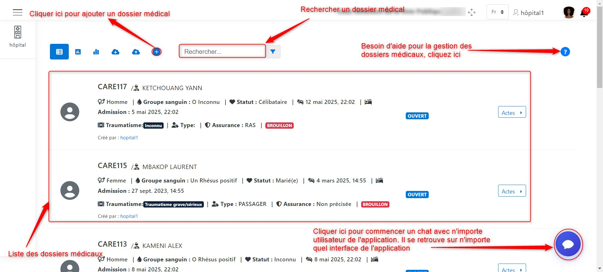
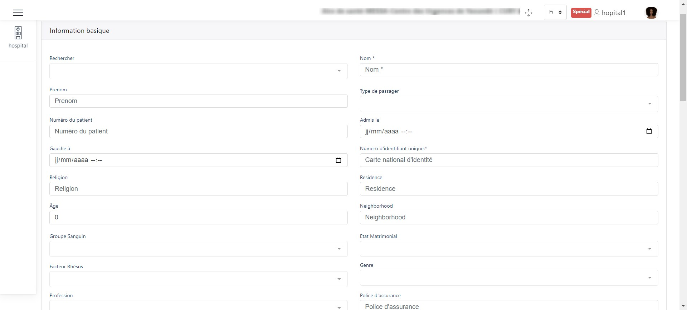
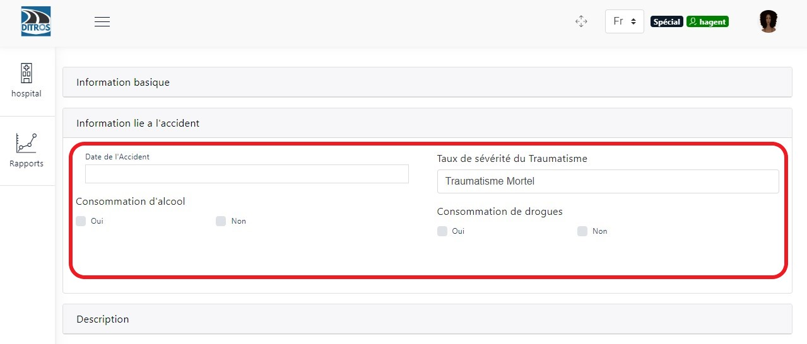
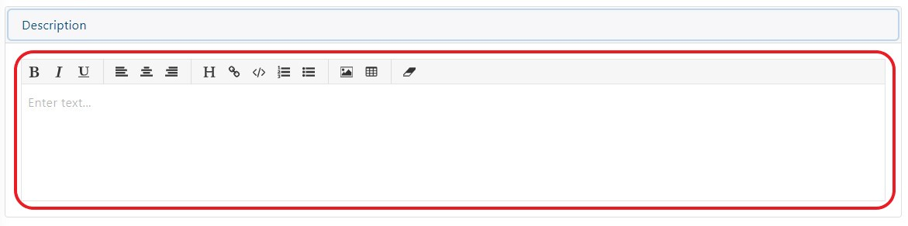
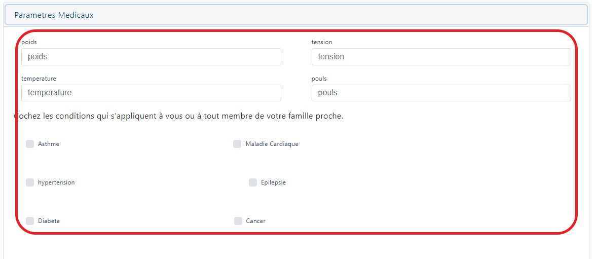
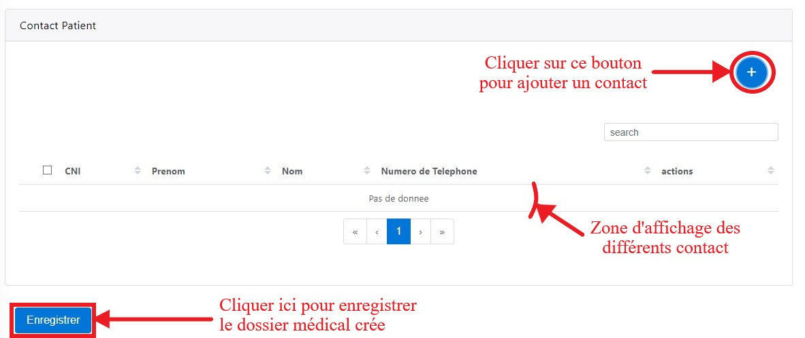
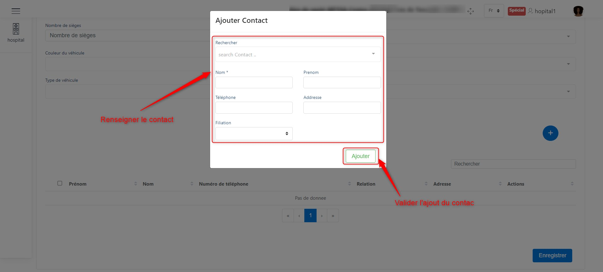
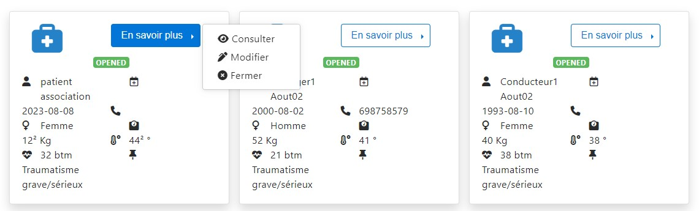
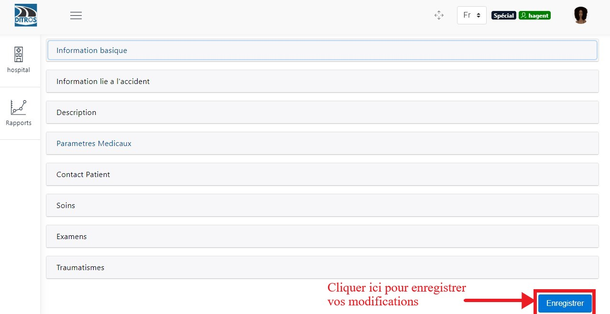

Gestion des dossiers médicaux des patients
==========================================
Juste après la connexion à votre compte, vous aurez accès à une page d’accueil où vous sera présenté la liste des dossiers médicaux existants.

.. centered:: Page d'accueil agent hopital.

Cette interface lui permettra d’ajouter des dossiers médicaux pour lier des victimes aux accidents déclarés par l’agent collecteur.

Ajouter un dossier médical
==========================
Ici, lors de l’arrivée d’une victime de l’accident à l’hôpital, l’agent de l’hôpital crée un dossier médical pour pouvoir renseigner les différentes informations de l’accident et du patient. Pour se faire il a plusieurs champs d’informations à renseigner.

Information basique
-------------------
A ce niveau, l’agent de l’hôpital renseigne toutes les informations du patient.

.. centered:: Informations basique.

Informations liées à l'accident
-------------------------------
A ce niveau l’agent de l’hôpital renseigne toutes les informations de l’accident.

.. centered:: Informations liées à l'accident.

Description
-----------
Dans cette rubrique, il faut ajouter une description de ce que vous observez à propos du patient.

.. centered:: Description.

Paramètres médicaux
-------------------
Renseigner les champs qui vous sont proposés en fonction des observations faites sur le patient.

.. centered:: Paramètres médicaux.

Contacts du patient
-------------------
Ici, il vous est demandé d’entrer les contacts du patient qui sera affiché dans un tableau et vous pouvez en ajouter autant qu’il en possède de contact.

.. centered:: Contact du patient.

Lorsque vous cliquer sur le bouton permettant d’ajouter un contact, une boite de dialogue apparaitra et vous devez entrer ses coordonnées.

.. centered:: Ajouter un nouveau contact.

Enrichir le dossier médical
===========================
Après l’ajout du dossier médical, l’état du dossier passe à « OPENED » et à ce moment l’agent de l’hôpital pourra juste consulter, modifier ou fermer le dossier médical si les traitements effectués sur le patient ont été réglé.

.. centered::  En savoir plus.

Modifier le dossier médical
---------------------------
Lorsque vous cliquez sur « Modifier », des champs de formulaire préalablement rempli
lors de l’ajout du dossier médical vous sont présentés avec les anciennes valeurs dont vous
n’aurez qu’à changer en fonction de vos besoins de modifications. Après avoir modifié ces
différents champs, cliquer sur « Enregistrer » pour enregistrer vos modifications.

.. centered:: Modification d'un dossier médical.

Information basique
~~~~~~~~~~~~~~~~~~~
akigiyageyauzgeagy

