Gestion des dossiers médicaux des patients
==========================================
Juste après la connexion à votre compte, vous aurez accès à une page d’accueil où vous sera présenté la liste des dossiers médicaux existants.

.. image:: ../Images/img-hopit/accue_hop.jpg
    :name: Page d'accueil agent hopital.
.. centered:: Page d'accueil agent hopital.

Cette interface lui permettra d’ajouter des dossiers médicaux pour lier des victimes aux accidents déclarés par l’agent collecteur.

Ajouter un dossier médical
==========================
Ici, lors de l’arrivée d’une victime de l’accident à l’hôpital, l’agent de l’hôpital crée un dossier médical pour pouvoir renseigner les différentes informations de l’accident et du patient. Pour se faire il a plusieurs champs d’informations à renseigner.

Information basique
-------------------
A ce niveau, l’agent de l’hôpital renseigne toutes les informations du patient.

.. image:: ../Images/img-hopit/ajouter_dos.jpg
.. centered:: Informations basique.

Informations liées à l'accident
-------------------------------
A ce niveau l’agent de l’hôpital renseigne toutes les informations de l’accident.

.. image:: ../Images/img-hopit/acc_inf.jpg
.. centered:: Informations liées à l'accident.

Description
-----------
Dans cette rubrique, il faut ajouter une description de ce que vous observez à propos du patient.

.. image:: ../Images/img-hopit/desc.jpg
.. centered:: Description.

Paramètres médicaux
-------------------
Renseigner les champs qui vous sont proposés en fonction des observations faites sur le patient.

.. image:: ../Images/img-hopit/param.jpg
.. centered:: Paramètres médicaux.

Contacts du patient
-------------------
Ici, il vous est demandé d’entrer les contacts du patient qui sera affiché dans un tableau et vous pouvez en ajouter autant qu’il en possède de contact.

.. image:: ../Images/img-hopit/contac.jpg
.. centered:: Contact du patient.

Lorsque vous cliquer sur le bouton permettant d’ajouter un contact, une boite de dialogue apparaitra et vous devez entrer ses coordonnées.

.. image:: ../Images/img-hopit/add_con.jpg
.. centered:: Ajouter un nouveau contact.

Enrichir le dossier médical
===========================
Après l’ajout du dossier médical, l’état du dossier passe à « OPENED » et à ce moment l’agent de l’hôpital pourra juste consulter, modifier ou fermer le dossier médical si les traitements effectués sur le patient ont été réglé.

.. image:: ../Images/img-hopit/en_savo.jpg
.. centered::  En savoir plus.

Modifier le dossier médical
---------------------------
Lorsque vous cliquez sur « Modifier », des champs de formulaire préalablement rempli
lors de l’ajout du dossier médical vous sont présentés avec les anciennes valeurs dont vous
n’aurez qu’à changer en fonction de vos besoins de modifications. Après avoir modifié ces
différents champs, cliquer sur « Enregistrer » pour enregistrer vos modifications.

.. image:: ../Images/img-hopit/modi.jpg
.. centered:: Modification d'un dossier médical.

Information basique
~~~~~~~~~~~~~~~~~~~

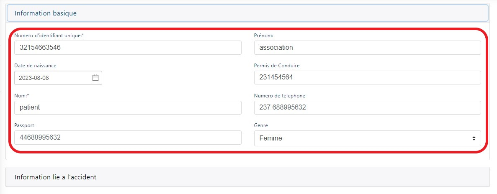
.. centered:: Modification des informations basiques.

Information lié a l’accident
~~~~~~~~~~~~~~~~~~~~~~~~~~~~
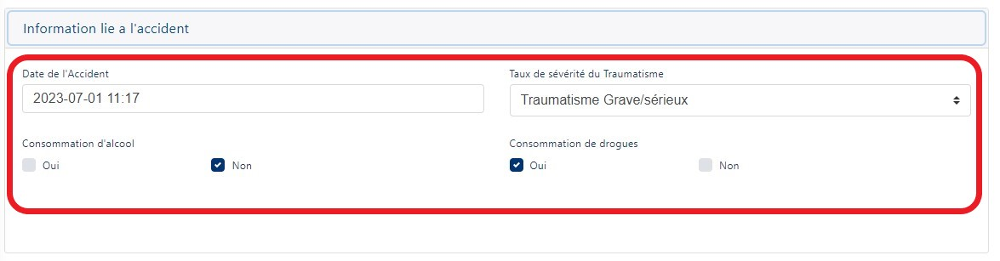
.. centered:: Modification des informations de l’accident.

Description
~~~~~~~~~~~
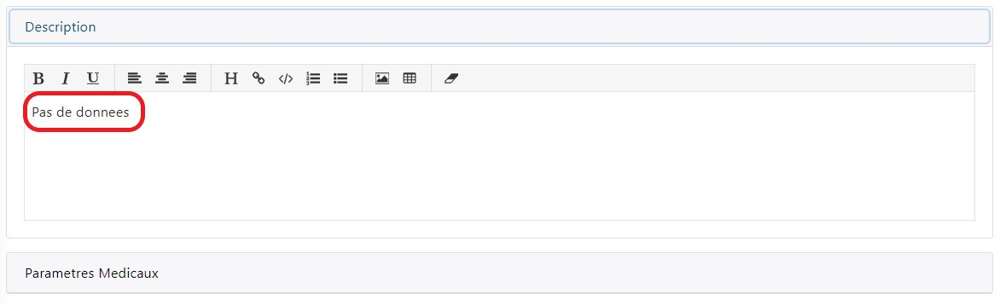
.. centered:: Modification de la description.

Paramètres médicaux
~~~~~~~~~~~~~~~~~~~
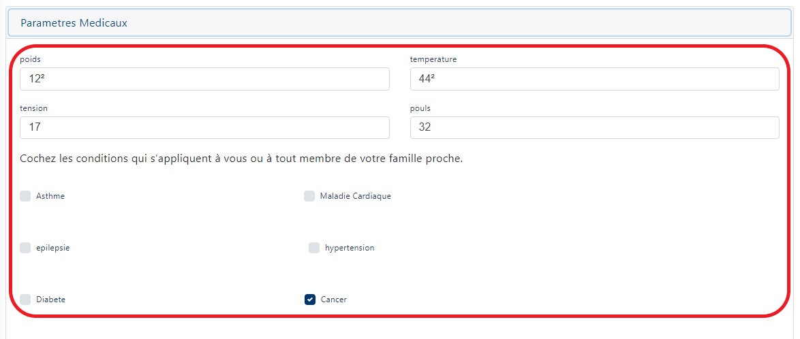
.. centered:: Modification des paramètres médicaux.

Contacts du patient
~~~~~~~~~~~~~~~~~~~
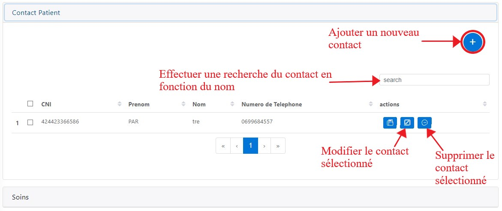
.. centered:: Modification des contacts du patient.

Lorsque vous cliquer sur l’icône de modification d’un contact, une boite de dialogue s’ouvre avec des anciennes valeurs et vous devez modifier les champs que vous voulez et puis cliquer le bouton « Modifier » et vous recevrez un message de confirmation.
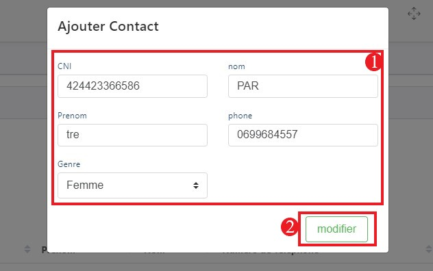
.. centered:: Modification d'un contact d'un patient.

Soins
~~~~~
Lors de l’ajout d’un dossier médical, le champ des soins n’avait pas été ajouté donc c’est lors de l’enrichissement que vous informez les soins dont le patient aura besoin.
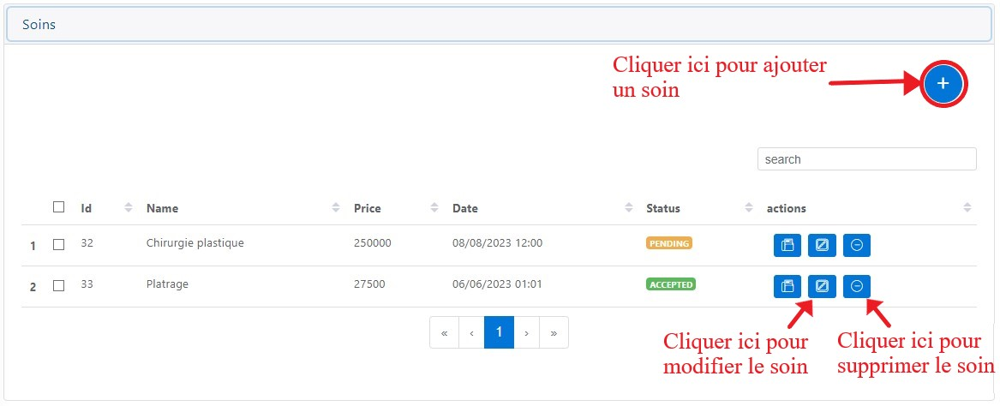
.. centered:: Lites des soins.

Après avoir ajouté un soin il aura pour status « PENDING », mais après la validation du soin par l’assurance le status va changer en « ACCEPTED ».
		
Lorsque vous voulez ajouter un soin, une boite de dialogue vous est proposée dont vous devez entrer la date, l’heure et la valeur des soins puis vous enregistrer le soin en cliquant sur le bouton « Ajouter ».
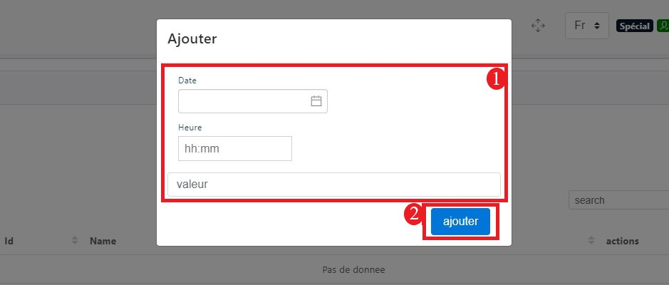
.. centered:: Ajouter un soin.

Examens
~~~~~~~
Lors de l’ajout d’un dossier médical, le champ des examens n’avait pas été ajouté donc c’est lors de l’enrichissement que vous informez les examens dont le patient aura besoin
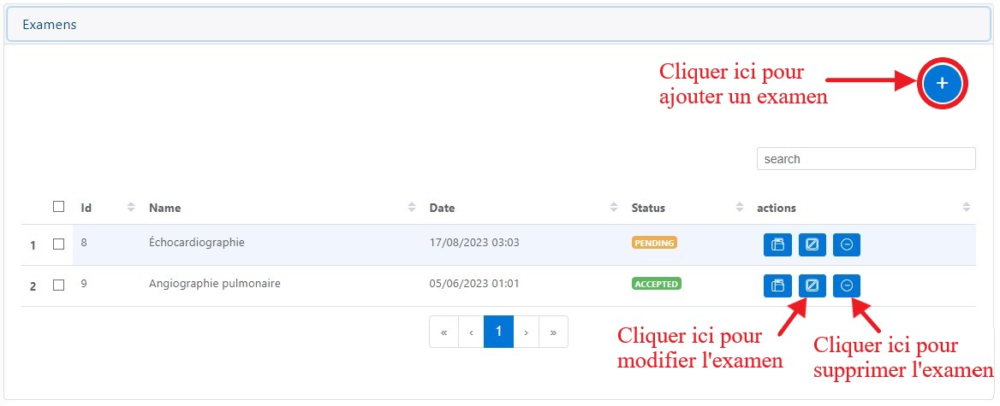
.. centered:: Lites des examens.

Après avoir ajouté un examen il aura pour statut « PENDING », mais après la validation de l’examen par l’assurance le statut va changer en « ACCEPTED ».

Lorsque vous voulez ajouter un examen, une boite de dialogue vous est proposée
dont vous devez entrer la date, l’heure et la valeur des soins puis vous enregistrer
l’examen en cliquant sur le bouton « Ajouter ».

.. centered:: Ajouter un examen.

Traumatismes
~~~~~~~~~~~~
Lors de l’ajout d’un dossier médical, le champ des traumatismes rencontrés chez le
patient n’avait pas été ajouté donc c’est lors de l’enrichissement que vous informez
les traumatismes dont le patient possède.

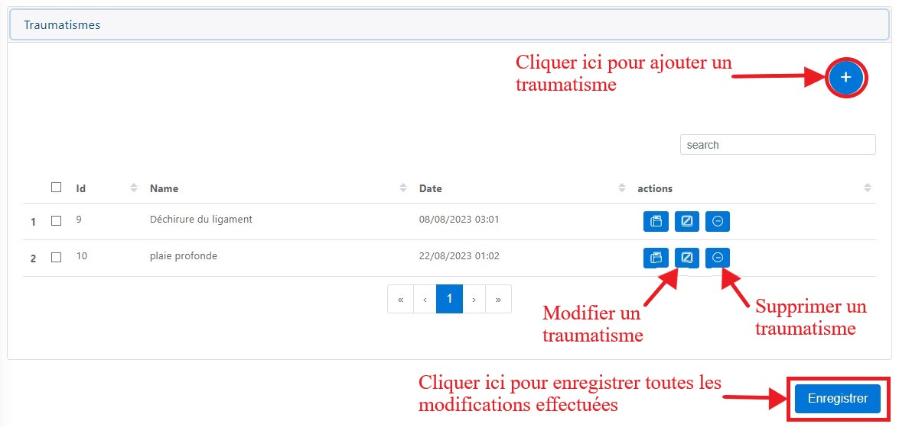
.. centered:: Lites des examens.

Lorsque vous voulez ajouter un traumatisme, une boite de dialogue vous est proposée dont vous devez entrer la date, l’heure et la valeur des soins puis vous enregistrer le traumatisme en cliquant sur le bouton « Ajouter ».

.. centered:: Ajouter un traumatisme.

Fermez le dossier médical
=========================
Lorsque vous cliquez sur le « En savoir plus » du dossier médical à la page d’accueil, vous
pouvez décider de fermer le dossier médical si tous les frais des soins ont déjà été payés.
Lorsque vous décider de fermer le dossier médical, une boite de dialogue de confirmation
vous est affichée dont pour valider la fermeture vous devez cliquer sur « OK » et pour
annuler vous devez cliquer sur « Annuler ». Après la fermeture du dossier, son état passe
à « CLOSED ». A cet état l’agent de l’hôpital ne pourra que consulter et imprimer la
facture du dossier en cliquant sur le bouton « En savoir plus ».

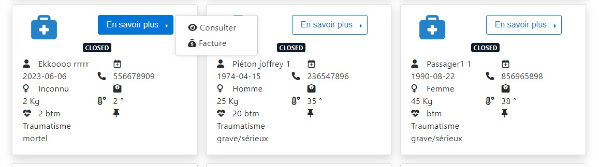
.. centered:: Dossiers médicaux fermés.

Lorsque vous cliquer sur « Facture », pour imprimer la facture cliquer sur « Imprimer ».

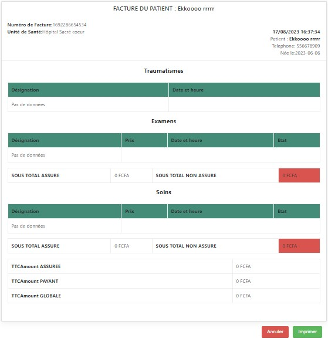
.. centered:: Factures d’un dossier médical fermé.

Liste des soins
================
Pour accéder à la liste des soins cliquer sur l’onglet « hospital » ensuite sur l’onglet « Soins ».

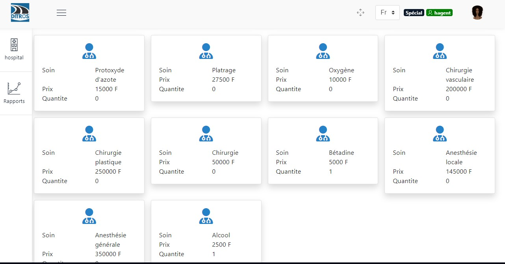
.. centered:: Listes de tous les soins disponibles dans le centre.

Listes des examens
==================
Pour accéder à la liste des soins cliquer sur l’onglet « hospital » ensuite sur l’onglet « Examens ».

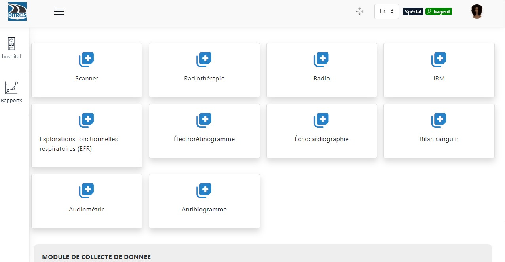
.. centered:: Listes de tous les examens.

Listes des traumatismes
=======================
Pour accéder à la liste des soins cliquer sur l’onglet « hospital » ensuite sur l’onglet « Traumatismes ».

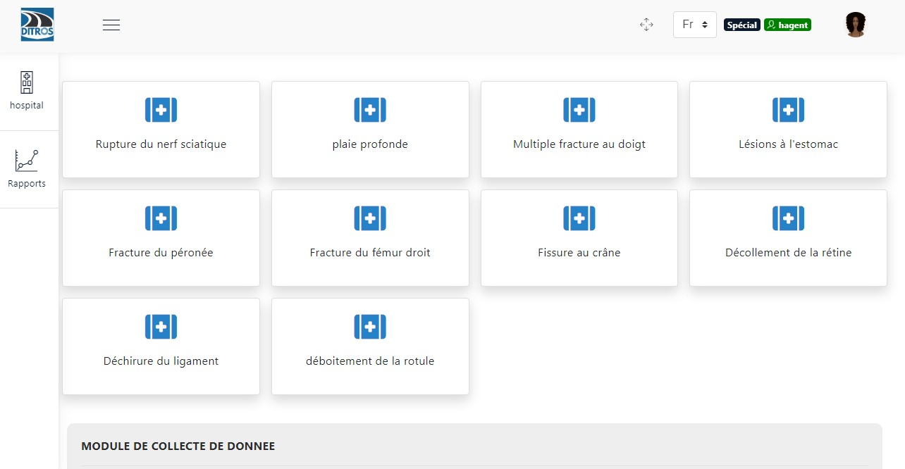
.. centered:: Listes de tous les traumatismes.
