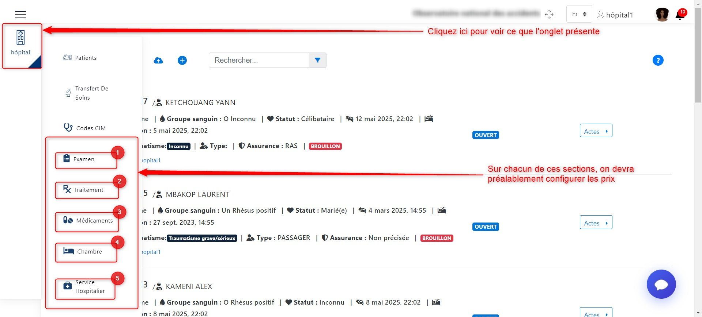
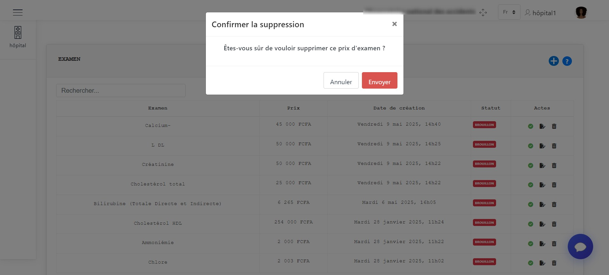
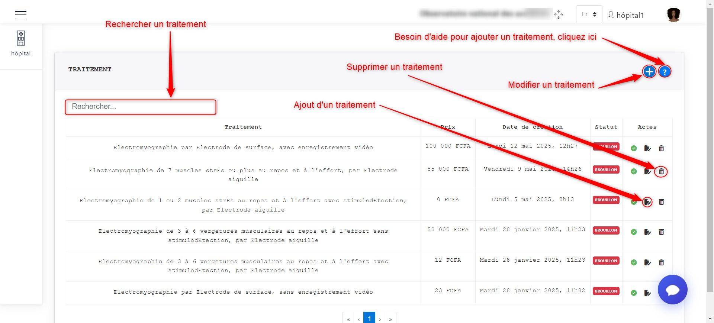
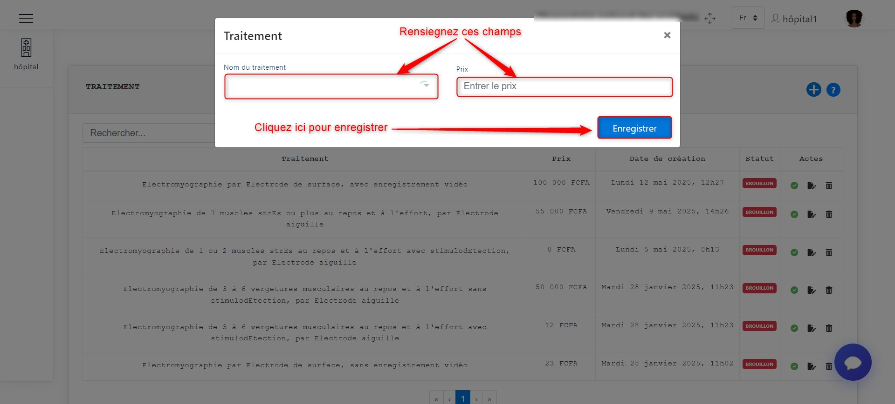
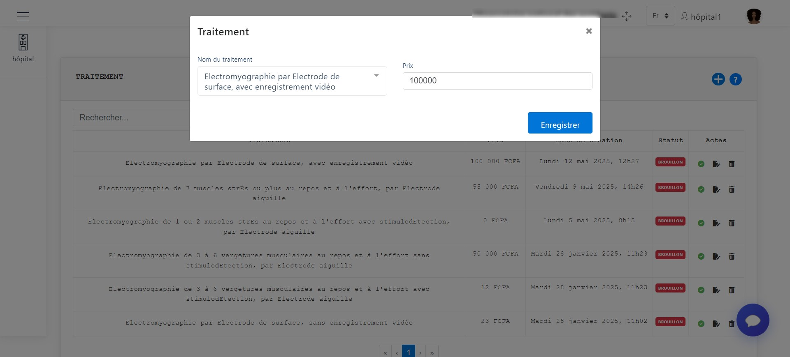
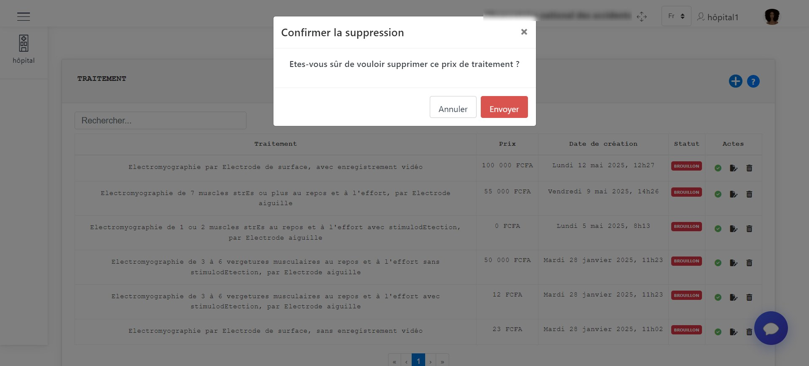
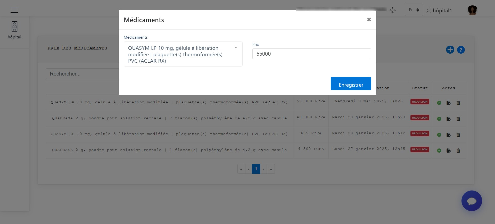
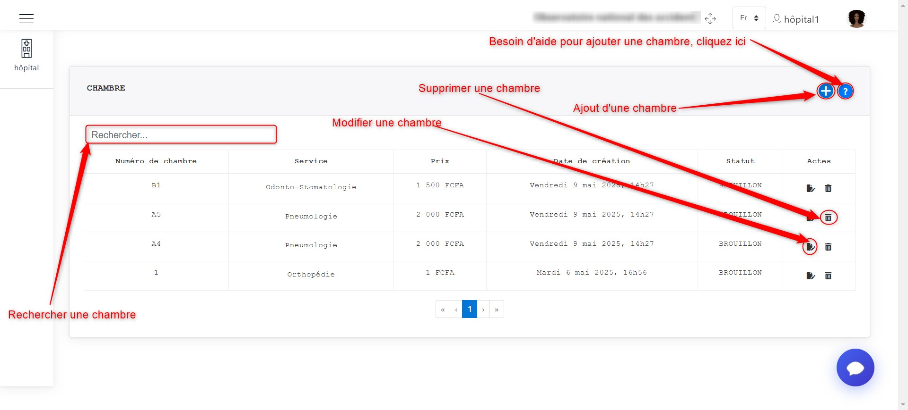
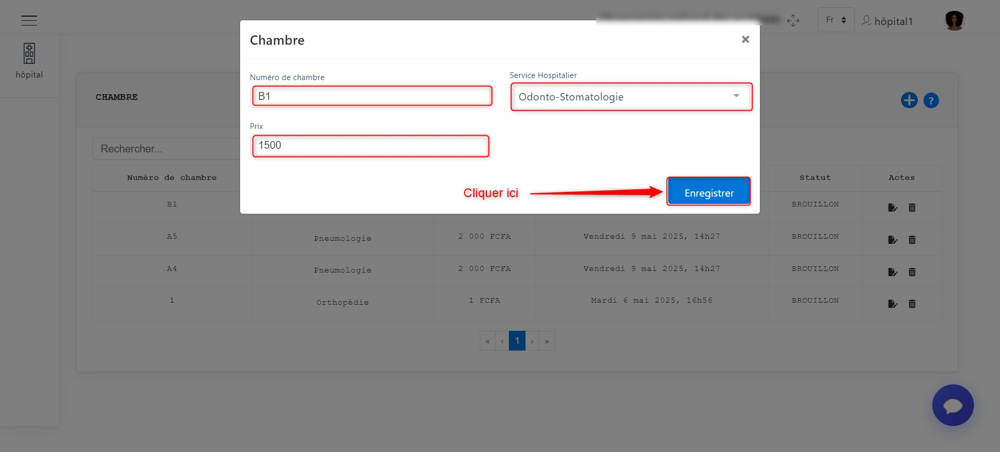

CONFIGURATION DES PRODUITS ET SERVICES
======================================

L'étape de configuration des produits et services est une étape cruciale pour chaque formation hospitalière. 
Avant toute exploitation des fonctionnalités de cette application,
chaque formation hospitalière doit renseigner les prix des différents examens, soins, 
médicaments et de ses différentes catégories de chambres car les prix sont fonction de l'organisation.

**NB :** Cette configuration se fait une fois

.. _refConfiguration:

.. centered:: Configuration des produits et services.

Comme nous pouvons le constater sur l'image ci-dessus, nous avons quatre produits et services principaux 
sur lesquels nous devons configurer les prix à savoir :

**1. Les examens**

**2. Les traitements**

**3. Les médicaments**

**4. Les chambres**

Nous présenterons tour à tour comment configurer les prix de ces produits et services.

Les examens
-----------

Cliquer sur **1** comme présenté sur :ref:`l'image suivante <refConfiguration>`, 
pour accéder à l'interface de configuration des examens.

L'image ci-dessous nous présente l'interface de configuration des examens.
Les actions que nous pouvons effectuer ici sont :

* L'ajout d'un nouvel examen
* La mise à jour des informations sur un examen
* La supression d'un examen

.. _refExams:

.. centered:: Configuration des examens.

Lorsqu'on clique sur **+** pour l'ajout d'un examen comme indiqué :ref:`ici <refExams>`, une fenêtre apparait pour 
renseigner les informations sur l'examen tel que : Le nom de l'examen et son prix.

Cliquer enfin sur le boutton **Enregistrer** pour valider l'ajout de l'examen.
L'image ci-dessous est illustrative de ce scénario.

.. centered:: Ajouter un examen.

Pour modifier un examen, nous devons cliquer sur le boutton de modification de l'examen 
comme présenté sur :ref:`l'image suivante <refExams>`. Une fenêtre apparaitra pour 
effectuer la modification sur les précedentes informations de l'examen.

Cliquer enfin sur le boutton **Enregistrer** pour valider la modification de l'examen.
L'image ci-dessous est illustrative de ce scénario.

.. centered:: Modifier un examen.

Pour supprimer un examen, nous devons cliquer sur le boutton de suppression de l'examen 
comme présenté sur :ref:`l'image suivante <refExams>`. Une fenêtre apparaitra pour 
effectuer la suppression dudit examen.

Cliquer enfin sur le boutton **Supprimer** pour valider la suppression de l'examen 
ou sur le boutton **Annuler** pour annuler la suppression.
L'image ci-dessous est illustrative de ce scénario.

.. centered:: Supprimer un examen.

Les traitements
---------------

Cliquer sur **2** comme présenté sur :ref:`l'image suivante <refConfiguration>`, 
pour accéder à l'interface de configuration des traitements.

L'image ci-dessous nous présente l'interface de configuration des traitements.
Les actions que nous pouvons effectuer ici sont :

* L'ajout d'un nouveau traitement
* La mise à jour des informations sur un traitement
* La supression d'un traitement

.. _refTraitement:

.. centered:: Configuration des traitements.

Lorsqu'on clique sur **+** pour l'ajout d'un traitement comme indiqué :ref:`ici <refTraitement>`, une fenêtre apparait pour 
renseigner les informations sur le traitement tel que : Le nom du traitement et son prix.

Cliquer enfin sur le boutton **Enregistrer** pour valider l'ajout du traitement.
L'image ci-dessous est illustrative de ce scénario.

.. centered:: Ajouter un traitement.

Pour modifier un traitement, nous devons cliquer sur le boutton de modification du traitement  
comme présenté sur :ref:`l'image suivante <refTraitement>`. Une fenêtre apparaitra pour 
effectuer la modification sur les précedentes informations du traitement.

Cliquer enfin sur le boutton **Enregistrer** pour valider la modification du traitement.
L'image ci-dessous est illustrative de ce scénario.

.. centered:: Modifier un traitement.

Pour supprimer un traitement, nous devons cliquer sur le boutton de suppression du traitement  
comme présenté sur :ref:`l'image suivante <refTraitement>`. Une fenêtre apparaitra pour 
effectuer la suppression dudit traitement.

Cliquer enfin sur le boutton **Supprimer** pour valider la suppression du traitement  
ou sur le boutton **Annuler** pour annuler la suppression.
L'image ci-dessous est illustrative de ce scénario.

.. centered:: Supprimer un traitement.

Les médicaments
---------------

Cliquer sur **3** comme présenté sur :ref:`l'image suivante <refConfiguration>`, 
pour accéder à l'interface de configuration des médicaments.

L'image ci-dessous nous présente l'interface de configuration des médicaments.
Les actions que nous pouvons effectuer ici sont :

* L'ajout d'un nouveau médicament
* La mise à jour des informations sur un médicament
* La supression d'un médicament

.. _refMedicament:

.. centered:: Configuration des médicaments.

Lorsqu'on clique sur **+** pour l'ajout d'un médicament comme indiqué :ref:`ici <refMedicament>`, une fenêtre apparait pour 
renseigner les informations sur le médicament tel que : Le nom du médicament et son prix.

Cliquer enfin sur le boutton **Enregistrer** pour valider l'ajout du médicament.
L'image ci-dessous est illustrative de ce scénario.

.. centered:: Ajouter un médicament.

Pour modifier un médicament, nous devons cliquer sur le boutton de modification du médicament  
comme présenté sur :ref:`l'image suivante <refMedicament>`. Une fenêtre apparaitra pour 
effectuer la modification sur les précedentes informations du médicament.

Cliquer enfin sur le boutton **Enregistrer** pour valider la modification du médicament.
L'image ci-dessous est illustrative de ce scénario.

.. centered:: Modifier un médicament.

Pour supprimer un médicament, nous devons cliquer sur le boutton de suppression du médicament 
comme présenté sur :ref:`l'image suivante <refMedicament>`. Une fenêtre apparaitra pour 
effectuer la suppression dudit médicament.

Cliquer enfin sur le boutton **Supprimer** pour valider la suppression du médicament 
ou sur le boutton **Annuler** pour annuler la suppression.
L'image ci-dessous est illustrative de ce scénario.

.. centered:: Supprimer un médicament.

Les chambres
------------

Cliquer sur **4** comme présenté sur :ref:`l'image suivante <refConfiguration>`, 
pour accéder à l'interface de configuration des chambres.

L'image ci-dessous nous présente l'interface de configuration des chambres.
Les actions que nous pouvons effectuer ici sont :

* L'ajout d'une nouvelle chambre
* La mise à jour des informations sur une chambre
* La supression d'une chambre

.. _refChambre:

.. centered:: Configuration des chambres.

Lorsqu'on clique sur **+** pour l'ajout d'une chambre comme indiqué :ref:`ici <refChambre>`, une fenêtre apparait pour 
renseigner les informations sur la chambre tel que : Le numéro de la chambre, le service hospitalier concerné et son prix.

Cliquer enfin sur le boutton **Enregistrer** pour valider l'ajout de la chambre.
L'image ci-dessous est illustrative de ce scénario.

.. centered:: Ajouter une chambre.

Pour modifier une chambre, nous devons cliquer sur le boutton de modification de la chambre 
comme présenté sur :ref:`l'image suivante <refChambre>`. Une fenêtre apparaitra pour 
effectuer la modification sur les précedentes informations de la chambre.

Cliquer enfin sur le boutton **Enregistrer** pour valider la modification de la chambre.
L'image ci-dessous est illustrative de ce scénario.

.. centered:: Modifier une chambre.

Pour supprimer une chambre, nous devons cliquer sur le boutton de suppression de la chambre 
comme présenté sur :ref:`l'image suivante <refChambre>`. Une fenêtre apparaitra pour 
effectuer la suppression de ladite chambre.

Cliquer enfin sur le boutton **Supprimer** pour valider la suppression de la chambre 
ou sur le boutton **Annuler** pour annuler la suppression.
L'image ci-dessous est illustrative de ce scénario.

.. centered:: Supprimer une chambre.

VISUALISATION DES ICD CODES
===========================

Pour visualiser
