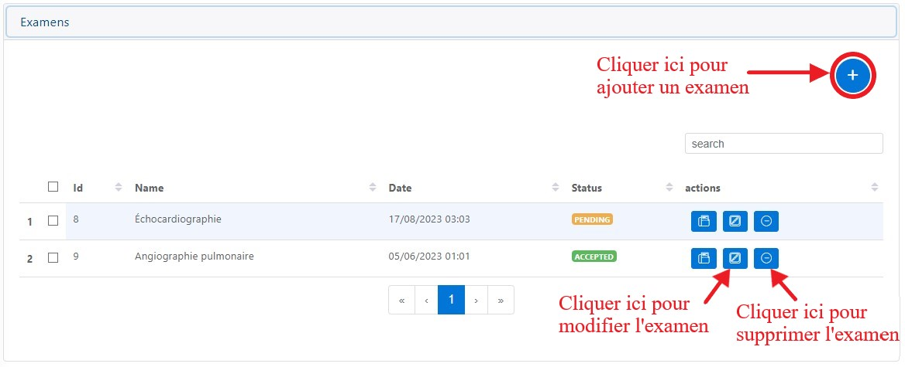

Gestion des dossiers médicaux des patients
==========================================
Juste après la connexion à votre compte, vous aurez accès à une page d’accueil où vous sera présenté la liste des dossiers médicaux existants.

.. image:: ../Images/img-hopit/accue_hop.jpg
    :name: Page d'accueil agent hopital.
.. centered:: Page d'accueil agent hopital.

Ajouter un dossier médical
==========================

.. _refProcedureAjoutDossierMedical

Il faut cliquer sur **+** pour avoir accès à l'interface lui permettra d’ajouter des dossiers médicaux.
Ces dossiers medicaux aiderons à gérer l’hospitalisation du patient, sa prise en
charge et assurer la liaison des victimes aux accidents déclarés par l’agent collecteur.
Ici, lors de l’arrivée d’une victime de l’accident à l’hôpital, 
l’agent de l’hôpital crée un dossier médical, puis il renseigne les différentes informations sur l’accident et sur le patient. 
Pour se faire il a plusieurs champs d’informations à renseigner.

.. image:: ../Images/img-hopit/ajouter_dos.jpg
.. centered:: Informations basiques.

Comme nous pouvons le constater, les informations à remplir concerne :

* Les informations basiques du patient
* Les informations liées à l'accident
* Une description du patient
* Les paramètres médicaux
* L'adresse du patient 

.. image:: ../Images/img-hopit/ajouterAutre_dos.jpg
.. centered:: Autres informations du patient.

N'oubliez pas d'entrer les contacts du patient.
Cela se fait en cliquant sur le bouton **+** comme indiqué sur l'image qui suit :

**NB :** vous pouvez ajouter autant de contact qu’il en possède.

.. image:: ../Images/img-hopit/AjouterContact.jpg
.. centered:: Ajouter un contact.

Lorsque vous cliquer sur le bouton **+** pour ajouter un contact, 
une boite de dialogue apparaitra et vous devez entrer ses coordonnées
et valider l'ajout en cliquant sur le bouton **Ajouter**.

.. image:: ../Images/img-hopit/add_con.jpg
.. centered:: Ajouter un nouveau contact.

Enfin cliquer sur le bouton **Enregistrer** pour finaliser l'ajout du dossier médical.

.. centered:: Finaliser le dossier médical.

En cliquant sur la zone représentée par **1** sur l'image ci-dessous, nous pouvons 
visualiser ou cacher les informations du dossier médical.

.. image:: ../Images/img-hopit/Visualiser_dos.jpg
.. centered:: Visualiser le dossier médical.

Enrichir le dossier médical
===========================
Après l’ajout du dossier médical, l’état du dossier passe à « OPENED » et à ce moment,
l’agent de l’hôpital pourra juste consulter, modifier, visualiser sous format PDF ou tranférer le dossier médical en question.

.. image:: ../Images/img-hopit/DossierMedicaux.jpg
.. centered::  Dossiers médicaux & Etats.

L'image ci-dessous nous présente la liste des opérations que l'on peut effectuer sur un dossier médical pour l'enrichir.

.. _refOperationsDossierMedical

.. image:: ../Images/img-hopit/OperationsDossierMedical.jpg
.. centered::  Opérations sur un dossier médical.

Les chiffres ci-dessus illustrent les opérations que l'on peut effectuer sur un dossier médical comme suit :

**1** Transfert de soins

**2** Modifier le dossier médical

**3** Visualisation sous le format PDF

**4** Ajout du document médical

Transférer les soins
--------------------

Cliquer sur **1** comme présenté sur :ref:`l'image suivante <refOperationsDossierMedical>`, 
pour faire un transfert de soins.

Une fenêtre s'affiche où vous devez renseigner les informations sur l'hôpital où le transfert 
sera opéré, le statut du soin, la méthode de transfert et une description de l'état des soins. 
Cliquer sur le boutton **Create** pour valider le transfert.

L'image ci-dessous présente le fenêtre qui doit apparaitre après avoir cliqué sur le boutton **1**.

.. image:: ../Images/img-hopit/TransfertSoins.jpg
.. centered::  Transfert de soins.

Modifier le dossier médical
---------------------------

Cliquer sur **2** comme présenté sur :ref:`l'image suivante <refOperationsDossierMedical>`, 
pour modifier les informations précédemment enregistrées sur le dossier médical. Modifier 
les informations que vous souhaitez modifier puis cliquer sur le boutton **Enregistrer** au bas de la page.

L'image suivante présente l'interface de modification des informations sur le dossier médical 
et la seconde présente le boutton d'enregistrement dudit dossier.

.. image:: ../Images/img-hopit/ModificationDossierMedical.jpg
.. centered::  Modification des informations sur le dossier médical.

.. centered::  Valider les modifications sur le dossier médical.

**NB :** Pour des problèmes sur la procédure de remplissage des informations, bien vouloir se reférer à 
:ref:`la procédure d'ajout d'un dossier médical <refProcedureAjoutDossierMedical>`.

Visualisation sous le format PDF
--------------------------------

Cliquer sur **3** comme présenté sur :ref:`l'image suivante <refOperationsDossierMedical>`, 
pour visualiser le dossier médical sous format PDF.

L'image qui suit montre l'onglet de visualisation du dossier médical sous le format PDF avec les fonctionnalités 
de téléchargement et d'impression mis en exergue.

.. centered::  Visualisation du dossier médical sous format PDF.

Ajout du document médical
-------------------------

Cliquer sur **4** comme présenté sur :ref:`l'image suivante <refOperationsDossierMedical>`, 
pour ajouter le document médical. L'image suivante nous présente l'interface que nous obtenons : 

.. image:: ../Images/img-hopit/DocumentMedical.jpg
.. centered::  Parties du document médical.

Le document médical est constitué de :

* Paramètres médicaux
* Examens des soins
* Soins taitement
* Soins médicaments
* Diagnostics
* Salle de soins

Toutefois, nous pouvons toujours visualiser les informations du patient en cliquant sur son nom.

Lorsque vous cliquez sur « Modifier », des champs de formulaire préalablement rempli
lors de l’ajout du dossier médical vous sont présentés avec les anciennes valeurs dont vous
n’aurez qu’à changer en fonction de vos besoins de modifications. Après avoir modifié ces
différents champs, cliquer sur **« Enregistrer »** pour enregistrer vos modifications.

.. image:: ../Images/img-hopit/modi.jpg
.. centered:: Modification d'un dossier médical.

Information basique
~~~~~~~~~~~~~~~~~~~

.. image:: ../Images/img-hopit/base_mofi.jpg
.. centered:: Modification des informations basiques.

Information lié a l’accident
~~~~~~~~~~~~~~~~~~~~~~~~~~~~
.. image:: ../Images/img-hopit/acc_modif.jpg
.. centered:: Modification des informations de l’accident.

Description
~~~~~~~~~~~
.. image:: ../Images/img-hopit/desc_modif.jpg
.. centered:: Modification de la description.

Paramètres médicaux
~~~~~~~~~~~~~~~~~~~
.. image:: ../Images/img-hopit/param_modif.jpg
.. centered:: Modification des paramètres médicaux.

Contacts du patient
~~~~~~~~~~~~~~~~~~~
.. image:: ../Images/img-hopit/contac_modif.jpg
.. centered:: Modification des contacts du patient.

Lorsque vous cliquer sur l’icône de modification d’un contact, une boite de dialogue s’ouvre avec des anciennes valeurs et vous devez modifier les champs que vous voulez et puis cliquer le bouton « Modifier » et vous recevrez un message de confirmation.

.. image:: ../Images/img-hopit/contac_det.jpg
.. centered:: Modification d'un contact d'un patient.

Soins
~~~~~
Lors de l’ajout d’un dossier médical, le champ des soins n’avait pas été ajouté donc c’est lors de l’enrichissement que vous informez les soins dont le patient aura besoin.

.. image:: ../Images/img-hopit/soins.jpg
.. centered:: Lites des soins.

Après avoir ajouté un soin il aura pour status « PENDING », mais après la validation du soin par l’assurance le status va changer en « ACCEPTED ».
		
Lorsque vous voulez ajouter un soin, une boite de dialogue vous est proposée dont vous devez entrer la date, l’heure et la valeur des soins puis vous enregistrer le soin en cliquant sur le bouton « Ajouter ».

.. image:: ../Images/img-hopit/add_soin.jpg
.. centered:: Ajouter un soin.

Examens
~~~~~~~
Lors de l’ajout d’un dossier médical, le champ des examens n’avait pas été ajouté donc c’est lors de l’enrichissement que vous informez les examens dont le patient aura besoin

.. centered:: Lites des examens.

Après avoir ajouté un examen il aura pour statut « PENDING », mais après la validation de l’examen par l’assurance le statut va changer en « ACCEPTED ».

Lorsque vous voulez ajouter un examen, une boite de dialogue vous est proposée
dont vous devez entrer la date, l’heure et la valeur des soins puis vous enregistrer
l’examen en cliquant sur le bouton « Ajouter ».

.. image:: ../Images/img-hopit/add_soin.jpg
.. centered:: Ajouter un examen.

Traumatismes
~~~~~~~~~~~~
Lors de l’ajout d’un dossier médical, le champ des traumatismes rencontrés chez le
patient n’avait pas été ajouté donc c’est lors de l’enrichissement que vous informez
les traumatismes dont le patient possède.

.. image:: ../Images/img-hopit/Traula.jpg
.. centered:: Lites des examens.

Lorsque vous voulez ajouter un traumatisme, une boite de dialogue vous est proposée dont vous devez entrer la date, l’heure et la valeur des soins puis vous enregistrer le traumatisme en cliquant sur le bouton « Ajouter ».

.. image:: ../Images/img-hopit/add_soin.jpg
.. centered:: Ajouter un traumatisme.

Fermez le dossier médical
=========================
Lorsque vous cliquez sur le « En savoir plus » du dossier médical à la page d’accueil, vous
pouvez décider de fermer le dossier médical si tous les frais des soins ont déjà été payés.
Lorsque vous décider de fermer le dossier médical, une boite de dialogue de confirmation
vous est affichée dont pour valider la fermeture vous devez cliquer sur « OK » et pour
annuler vous devez cliquer sur « Annuler ». Après la fermeture du dossier, son état passe
à « CLOSED ». A cet état l’agent de l’hôpital ne pourra que consulter et imprimer la
facture du dossier en cliquant sur le bouton « En savoir plus ».

.. image:: ../Images/img-hopit/close.jpg
.. centered:: Dossiers médicaux fermés.

Lorsque vous cliquer sur « Facture », pour imprimer la facture cliquer sur « Imprimer ».

.. image:: ../Images/img-hopit/fact.jpg
.. centered:: Factures d’un dossier médical fermé.

Liste des soins
================
Pour accéder à la liste des soins cliquer sur l’onglet « hospital » ensuite sur l’onglet « Soins ».

.. image:: ../Images/img-hopit/soin.jpg
.. centered:: Listes de tous les soins disponibles dans le centre.

Listes des examens
==================
Pour accéder à la liste des soins cliquer sur l’onglet « hospital » ensuite sur l’onglet « Examens ».

.. image:: ../Images/img-hopit/exame.jpg
.. centered:: Listes de tous les examens.

Listes des traumatismes
=======================
Pour accéder à la liste des soins cliquer sur l’onglet « hospital » ensuite sur l’onglet « Traumatismes ».

.. image:: ../Images/img-hopit/Trauma.jpg
.. centered:: Listes de tous les traumatismes.
