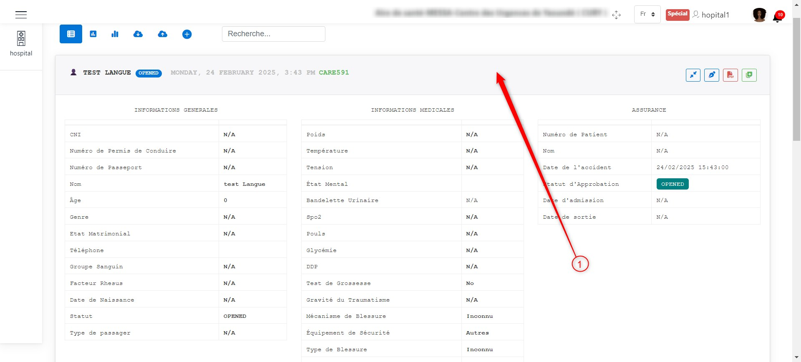
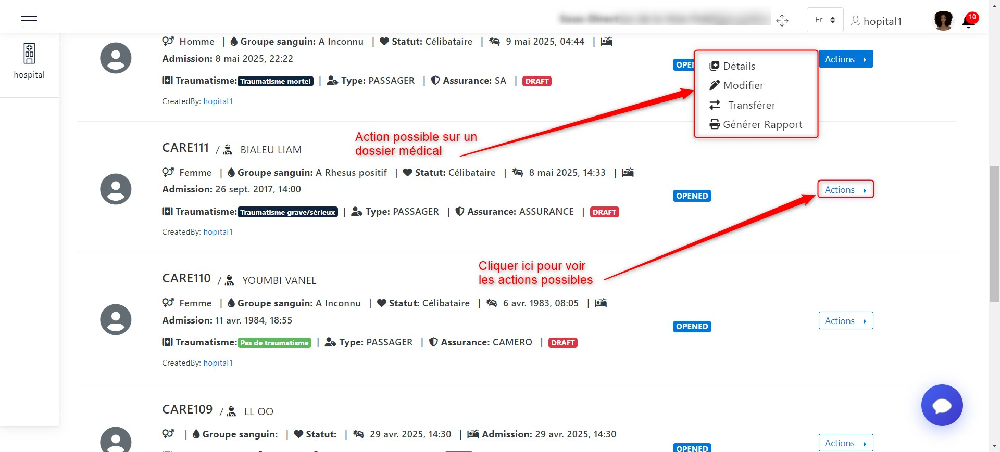
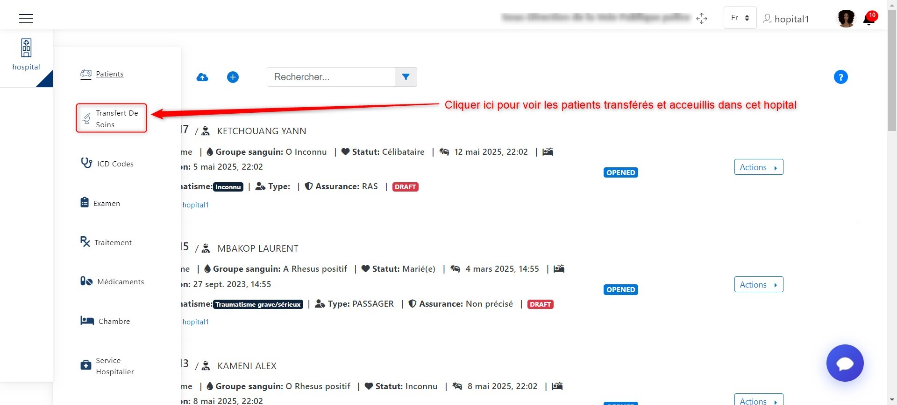
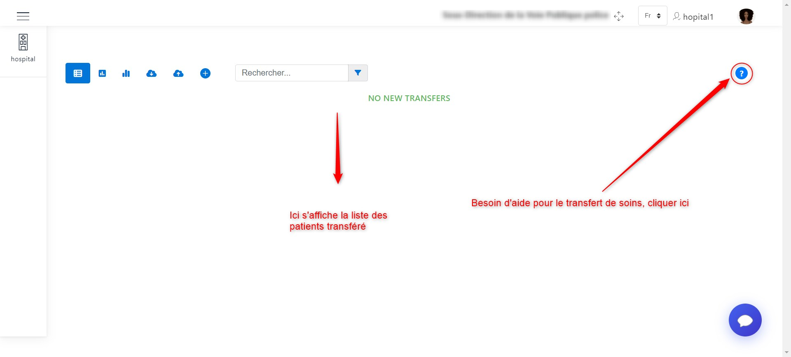
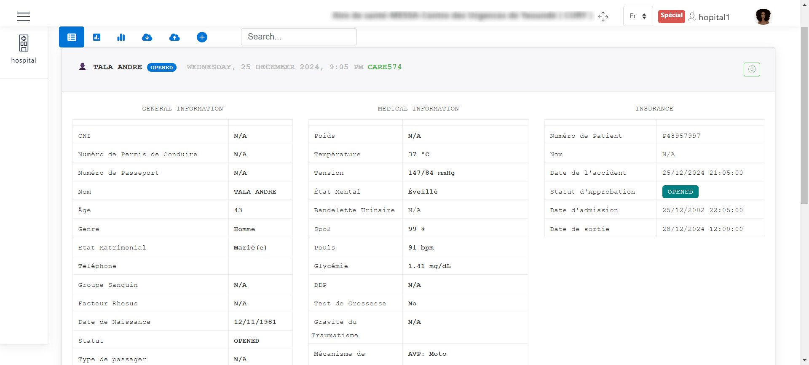
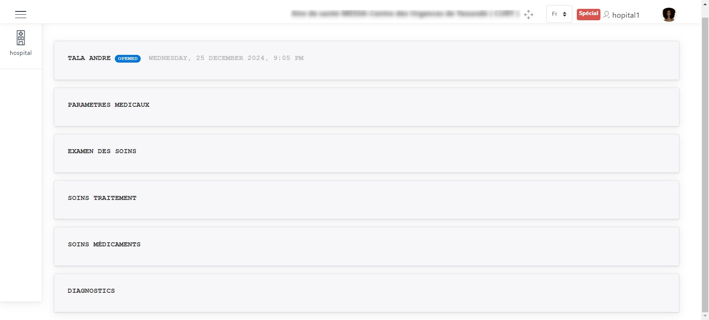

Gestion des dossiers médicaux des patients
==========================================
Juste après la connexion à votre compte, vous aurez accès à une page d’accueil où vous sera présenté 
la liste des dossiers médicaux existants.

.. image:: ../Images/img-hopit/accue_hop.jpg
    :name: Page d'accueil agent hopital.
.. centered:: Page d'accueil agent hopital.

.. _refProcedureAjoutDossierMedical:

Ajouter un dossier médical
==========================

Il faut cliquer sur **+** pour avoir accès à l'interface lui permettra d’ajouter des dossiers médicaux.
Ces dossiers medicaux aiderons à gérer l’hospitalisation du patient, sa prise en
charge et assurer la liaison des victimes aux accidents déclarés par l’agent collecteur.
Ici, lors de l’arrivée d’une victime de l’accident à l’hôpital, 
l’agent de l’hôpital crée un dossier médical, puis il renseigne les différentes informations sur 
l’accident et sur le patient. Pour se faire il a plusieurs champs d’informations à renseigner.

.. image:: ../Images/img-hopit/ajouter_dos.jpg
.. centered:: Informations basiques.

Comme nous pouvons le constater, les informations à remplir concerne :

* Les informations basiques du patient
* Les informations liées à l'accident
* Une description du patient
* Les paramètres médicaux
* L'adresse du patient 

.. centered:: Autres informations du patient.

N'oubliez pas d'entrer les contacts du patient.
Cela se fait en cliquant sur le bouton **+** comme indiqué sur l'image qui suit :

**NB :** vous pouvez ajouter autant de contact qu’il en possède.

.. centered:: Ajouter un contact.

Lorsque vous cliquer sur le bouton **+** pour ajouter un contact, 
une boite de dialogue apparaitra et vous devez entrer ses coordonnées
et valider l'ajout en cliquant sur le bouton **Ajouter**.

.. image:: ../Images/img-hopit/add_con.jpg
.. centered:: Ajouter un nouveau contact.

Enfin cliquer sur le bouton **Enregistrer** pour finaliser l'ajout du dossier médical.

.. image:: ../Images/img-hopit/finaliser_dos.jpg
.. centered:: Finaliser le dossier médical.

En cliquant sur la zone représentée par **1** sur l'image ci-dessous, nous pouvons 
visualiser ou cacher les informations du dossier médical.

.. centered:: Visualiser le dossier médical.

Enrichir le dossier médical
===========================
Après l’ajout du dossier médical, l’état du dossier passe à « OPENED » et à ce moment,
l’agent de l’hôpital pourra juste consulter, modifier, visualiser sous format PDF ou tranférer 
le dossier médical en question.

.. image:: ../Images/img-hopit/DossierMedicaux.jpg
.. centered::  Dossiers médicaux & Etats.

L'image ci-dessous nous présente la liste des opérations que l'on peut effectuer sur un dossier 
médical pour l'enrichir.

.. _refOperationsDossierMedical:

.. centered::  Opérations sur un dossier médical.

Les chiffres ci-dessus illustrent les opérations que l'on peut effectuer sur un dossier médical 
comme suit :

**1** :ref:`Transfert de soins <TransfererSoins>`

**2** :ref:`Modifier le dossier médical <ModifierDossierMedical>`

**3** :ref:`Visualisation sous le format PDF <VisualisationPDF>`

**4** :ref:`Ajout du document médical <AjoutDocumentrMedical>`

.. _TransfererSoins:

Transférer les soins
--------------------

Cliquer sur **1** comme présenté sur :ref:`l'image suivante <refOperationsDossierMedical>`, 
pour faire un transfert de soins.

Une fenêtre s'affiche où vous devez renseigner les informations sur l'hôpital où le transfert 
sera opéré, le statut du soin, la méthode de transfert et une description de l'état des soins. 
Cliquer sur le boutton **Create** pour valider le transfert.

L'image ci-dessous présente le fenêtre qui doit apparaitre après avoir cliqué sur le boutton **1**.

.. image:: ../Images/img-hopit/TransfertSoins.jpg
.. centered::  Transfert de soins.

.. _ModifierDossierMedical:

Modifier le dossier médical
---------------------------

Cliquer sur **2** comme présenté sur :ref:`l'image suivante <refOperationsDossierMedical>`, 
pour modifier les informations précédemment enregistrées sur le dossier médical. Modifier 
les informations que vous souhaitez modifier puis cliquer sur le boutton **Enregistrer** au bas de la page.

L'image suivante présente l'interface de modification des informations sur le dossier médical 
et la seconde présente le boutton d'enregistrement dudit dossier.

.. image:: ../Images/img-hopit/ModificationDossierMedical.jpg
.. centered::  Modification des informations sur le dossier médical.

.. image:: ../Images/img-hopit/ValiderModificationsDossierMedical.jpg
.. centered::  Valider les modifications sur le dossier médical.

**NB :** Pour des problèmes sur la procédure de remplissage des informations, bien vouloir se reférer à 
:ref:`la procédure d'ajout d'un dossier médical <refProcedureAjoutDossierMedical>`.

.. _VisualisationPDF:

Visualisation sous le format PDF
--------------------------------

Cliquer sur **3** comme présenté sur :ref:`l'image suivante <refOperationsDossierMedical>`, 
pour visualiser le dossier médical sous format PDF.

L'image qui suit montre l'onglet de visualisation du dossier médical sous le format PDF avec les fonctionnalités 
de téléchargement et d'impression mis en exergue.

.. image:: ../Images/img-hopit/VisualisationDossierMedical.jpg
.. centered::  Visualisation du dossier médical sous format PDF.

.. _AjoutDocumentrMedical:

Ajout du document médical
-------------------------

Cliquer sur **4** comme présenté sur :ref:`l'image suivante <refOperationsDossierMedical>`, 
pour ajouter le document médical. L'image suivante nous présente l'interface que nous obtenons : 

.. image:: ../Images/img-hopit/DocumentMedical.jpg
.. centered::  Parties du document médical.

Le document médical est constitué de :

* :ref:`Paramètres médicaux <ParametresMedicaux>`
* :ref:`Examens des soins <ExamensSoins>`
* :ref:`Soins traitement <SoinsTraitement>`
* :ref:`Soins médicaments <SoinsMedicaments>`
* :ref:`Diagnostics <Diagnostics>`
* :ref:`Salle de soins <SalleDeSoins>`

Toutefois, nous pouvons toujours visualiser les informations du patient en cliquant sur son nom.

.. centered::  Informations sur le patient.

Dans toute la suite nous expliquerons comment remplir les éléments du dossier médical.

.. _ParametresMedicaux: 

Paramètre médicaux
~~~~~~~~~~~~~~~~~~

L'image ci-dessous nous présente le formulaire à partir duquel nous récupérons les paramètres 
médicaux du patient.

.. centered::  Formulaire des paramètres médicaux.

Une fois avoir rempli le formulaire, il faut cliquer sur le boutton **Enregistrer** pour sauvegarder 
les paramètres entrés.

.. centered::  Sauvegarder des paramètres médicaux.

.. _ExamensSoins:

Examens des soins
~~~~~~~~~~~~~~~~~

L'image ci-dessous nous présente l'interface de prescription des examens à un patient.
Les actions que nous pouvons effectuer ici sont :

* La prescription d'un nouvel examen
* La mise à jour des informations sur la prescription
* La supression de la prescription

.. _refExamsSoins:

.. centered:: Prescription des examens.

Lorsqu'on clique sur **+** pour la prescription d'un examen comme indiqué :ref:`ici <refExamsSoins>`, 
une fenêtre apparait pour renseigner les informations sur la prescription.

Cliquer enfin sur le boutton **Créer** pour valider l'ajout de la prescription.
L'image ci-dessous est illustrative de ce scénario.

.. centered:: Ajouter une prescription.

Pour modifier une prescription, nous devons cliquer sur le boutton de modification de la prescription 
comme présenté sur :ref:`l'image suivante <refExamsSoins>`. Une fenêtre apparaitra pour 
effectuer la modification sur les précedentes informations de la prescription.

Cliquer enfin sur le boutton **Enregistrer** pour valider la modification de la prescription.
L'image ci-dessous est illustrative de ce scénario.

.. image:: ../Images/img-hopit/ModifierPrescriptionExamenSoins.jpg
.. centered:: Modifier une prescription.

Pour supprimer une prescription, nous devons cliquer sur le boutton de suppression de la prescription 
comme présenté sur :ref:`l'image suivante <refExamsSoins>`. Une fenêtre apparaitra pour 
effectuer la suppression dudit examen.

Cliquer enfin sur le boutton **Supprimer** pour valider la suppression de la prescription 
ou sur le boutton **Annuler** pour annuler la suppression.
L'image ci-dessous est illustrative de ce scénario.

.. centered:: Supprimer une prescription.

.. _SoinsTraitement:

Soins traitement
~~~~~~~~~~~~~~~~

Les actions que nous pouvons effectuer ici sont :

* La prescription d'un traitement
* La mise à jour des informations sur la prescription du traitement
* La supression de la prescription du traitement

La description de ces actions est similaires à ceux de :ref:`la prescription ci-dessus <refExamsSoins>`.

.. _SoinsMedicaments: 

Soins médicaments
~~~~~~~~~~~~~~~~~

Les actions que nous pouvons effectuer ici sont :

* La prescription d'un nouveau médicament
* La mise à jour des informations sur la prescription du médicament
* La supression de la prescription du médicament

La description de ces actions est similaires à ceux de :ref:`la prescription ci-dessus <refExamsSoins>`.

.. _Diagnostics:

Diagnostics
~~~~~~~~~~~

Les actions que nous pouvons effectuer ici sont :

* La prescription d'un nouveau diagnostic
* La mise à jour des informations sur la prescription du diagnostic
* La supression de la prescription du diagnostic

La description de ces actions est similaires à ceux de :ref:`la prescription ci-dessus <refExamsSoins>`.

.. _SalleDeSoins:

Salle de soins
~~~~~~~~~~~~~~

Les  que nous pouvons effectuer ici sont :

* La création de l'affectation à une salle de soins
* La mise à jour des informations sur l'affectation
* La supression de l'affectation

La description de ces actions est similaires à ceux de :ref:`la prescription ci-dessus <refExamsSoins>`.

Liste de patients transférés dans l'hôpital
===========================================

Pour avoir la liste des patients transférés et des patients admis dans l'hôpital avec un dossier médical 
existant, il faut cliquer sur le boutton **Transfert De Soins** comme présenté sur l'image ci-dessous.

.. centered:: Boutton d'accès à la liste des patients transférés.

Une fois avoir cliqué sur le boutton **Transfert De Soins**, vous pouvez visualiser la liste 
des patients transférés et des patients admis dans l'hôpital avec un dossier médical.

.. _refListePatientsTransferes:

.. centered:: Liste des patients transférés.

Sur l'interface ci-dessus, nous pouvons :

* visualiser Les informations sur le patient
* consulter ses antécedents médicaux 

Pour visualiser les informations sur le patient transféré, il suffit de cliquer sur son nom comme nous présente 
:ref:`l'image suivante <refListePatientsTransferes>`.

Vous obtiendrez une intrface similaire à l'image ci-dessous.

.. centered:: Informations du patient transféré.

Pour visualiser les antécedents médicaux du patient transféré, il suffit de cliquer sur le boutton de consultation 
des antécédents médicaux comme nous présente :ref:`l'image suivante <refListePatientsTransferes>`.

Vous obtiendrez une intrface similaire à l'image ci-dessous.

.. centered:: Antécédants médicaux du patient transféré.

Nous pouvons remarquer que le document médical est constitué de :

* Paramètres médicaux
* Examens des soins
* Soins traitement
* Soins médicaments
* Diagnostics

**NB :** Pour visualiser chaque section du dossier médical il suffit de cliquer sur la section en question.
