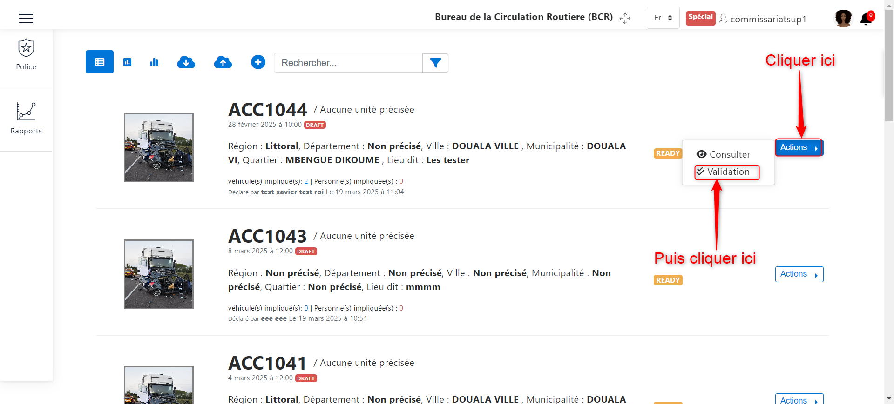
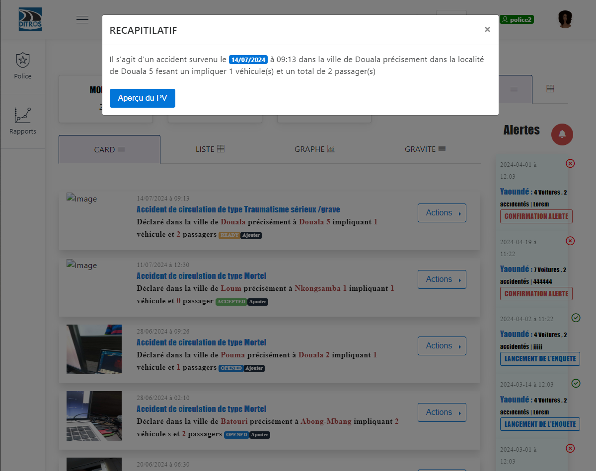
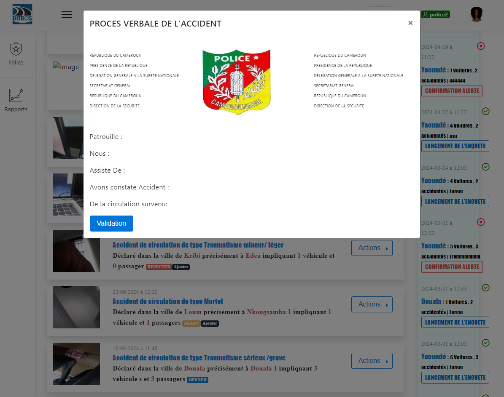
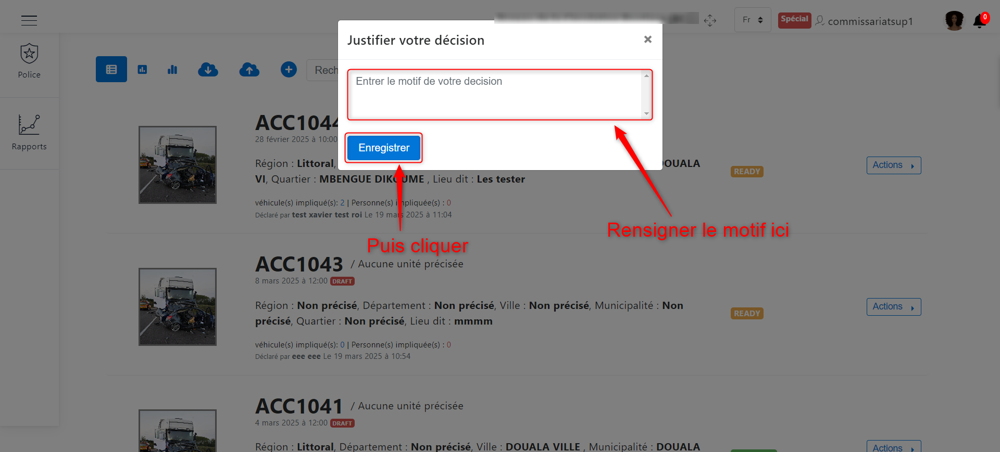
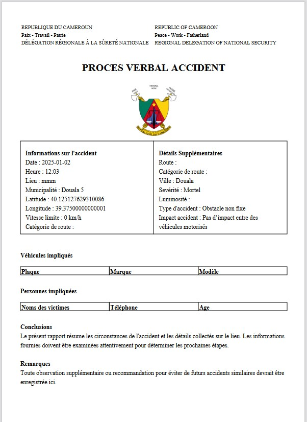
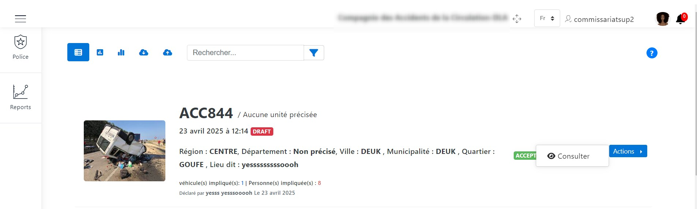
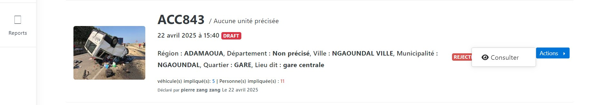
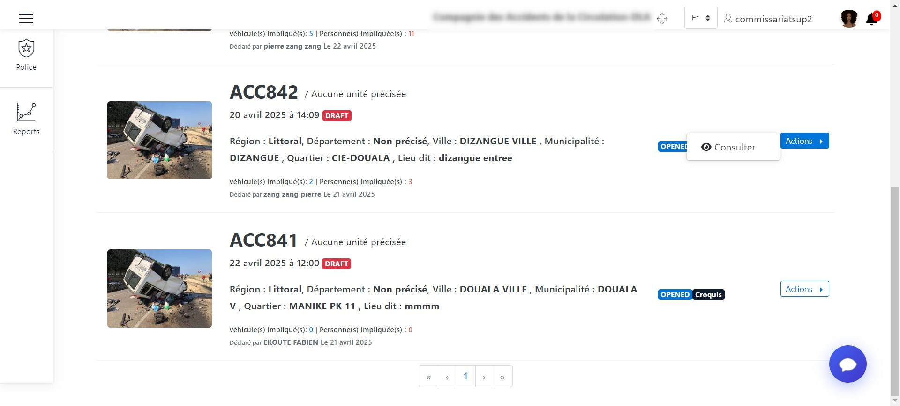
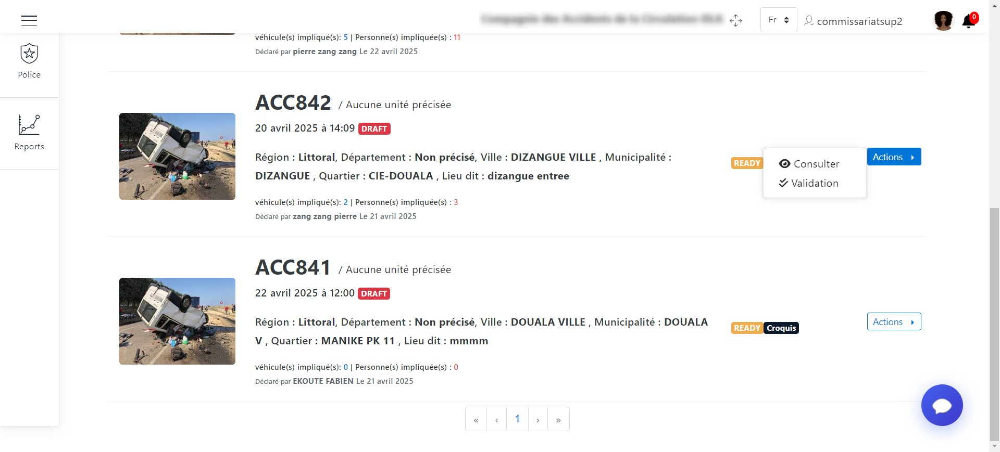

Validation du PV
================
**« NB : »** Il est bon à savoir que tout policier n'a pas le pouvoir de valider un PV.

Lorsque vous avez le droit, vous verrez sur l’interface de présentation des déclarations, certaines déclarations dont le statut est à **« READY »**. Pour valider cette dernière, il faudra cliquer sur le bouton **« Actions »** et ensuite cliquer sur **« Validation »** comme suit :

.. centered:: Valider le PV

Puis cliquez sur **« Aperçu du PV »**

.. centered:: Voir l'apperçu du PV

cliquez sur **« Validation »**

.. centered:: Apperçu du PV

Sur l’interface qui lui sera demandée, il devra prendre une décision en fonction du PV de l’accident. Lorsqu’il sera question de rejeter la déclaration, il devra choisir **« Annuler »** puis renseigner obligatoirement un motif pour choix afin que l’agent collecteur soit notifié de la raison prise par son supérieur ensuite l’etat de la déclaration va passer a **« REJECTED »**, mais lorsque il sera question d’accepter la déclartion il devra choisir **« Accepter »** puis signer, renseigner (facultatif) et confirmer. L’etat de la déclaration passera à **« ACCEPTED »**. 

.. image:: ../Images/img-police1&2/Valider_pv4.PNG
    :name: Choix de validation
.. centered:: Choix de validation

.. centered:: Motif

Génerer le PV de l'accident
===========================
Après toute cette procédure qui a abouti à une déclaration d’un accident vérifié, il est donc maintenant en la capacité de celui qui a le droit de générer un PV pour l’accident pour ses quelconques besoins.

.. centered:: Générer PV

Vous avez donc la possibilité d’imprimer ce PV en cliquant sur **« Imprimer »**.

Actions effectuées par l'agent supérieur collecteur en fonction des états de la déclaration
===========================================================================================
Que le statut soit « ACCEPTED » ou « ACCEPTED Ajouter », le supérieur agent collecteur ne pourra que consulter la déclaration de nouveau.

.. centered:: Action du supérieur de l'agent collecteur à l'état ACCEPTED

Lorsque la déclaration est au statut « REJECTED » ou « REJECTED Ajouter » les actions de cet agent sera de consulter la déclaration et de consulter le PV.

.. centered:: Action du supérieur de l'agent collecteur à l'état REJECTED

Que le statut soit « OPENED » ou « OPENED Ajouter », le supérieur agent collecteur ne pourra que consulter la déclaration de nouveau. 

.. centered:: Action du supérieur de l'agent collecteur à l'état OPENED

Lorsque l’agent collecteur termine l’élaboration de sa déclaration, l’état de la déclaration passe a « READY » et si le croquis a été ajouté il passe a « READY Ajouter » et à ce moment le supérieur agent collecteur pourra consulter la déclaration, consulter le PV, valider la déclaration et annuler ou effacer la déclaration.

.. centered:: Action du supérieur de l'agent collecteur à l'état READY

