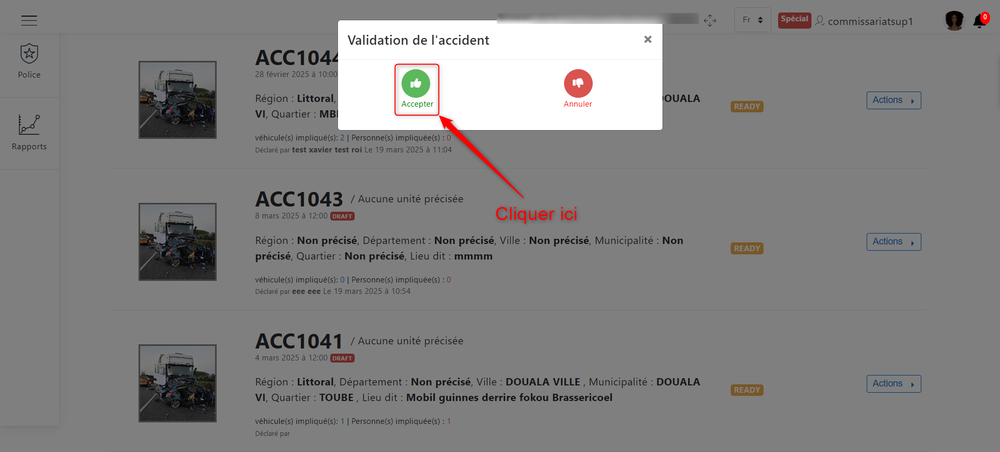

Validation du PV
================
Dans l’interface de présentation des déclarations, certaines déclarations ont le statut « **READY** » .Rendu
à ce statut le clic sur le bouton “ **Actions** ” permet de consulter la déclaration, consulter le PV et valider.
Pour valider cette dernière il faut que votre compte de connexion à l’application ait le droit requis pour le
faire. il faudra cliquer sur le bouton « **Actions** » et ensuite cliquer sur « Validation » comme suit :

.. centered:: Valider le PV

Sur l’interface qui lui sera demandée, il devra prendre une décision en fonction du PV de l’accident.
Lorsqu’il sera question de rejeter la déclaration, il devra choisir « **Annuler** » puis renseigner
obligatoirement un motif de refus afin que l’agent collecteur soit notifié de la raison prise par son supérieur
ensuite l’état de la déclaration va passer a « **REJECTED** », mais lorsqu’il sera question d’accepter la
déclaration il devra choisir « **Accepter** » puis signer, renseigner (facultatif) et confirmer. L’état de la
déclaration passera à « **ACCEPTED** ».

Pour ce cas nous allons cliquer sur **« Accepter »**
 

.. centered:: Choix de validation

.. centered:: Motif

Enregistrer la signature après acceptation

.. centered:: Enregistrer la signature 

Clôturer le processus
===========================
Après toute cette procédure qui a abouti à une déclaration d’un accident validé, l’agent collecteur peut créer le
procès verbal de l’accident.
Pour cela cliquer sur le bouton d’action des déclarations avec le statut accepted et choisir creer le PV

.. image:: ../Images/img-police1&2/gen_pv.jpg
    :name: Générer PV
.. centered:: Générer PV

Vous avez donc la possibilité d’imprimer ce PV en cliquant sur **« Imprimer »** ou de l'**Enregistrer**.

Actions effectuées par l'agent supérieur collecteur en fonction des états de la déclaration
===========================================================================================
Que le statut soit « ACCEPTED » ou « ACCEPTED Ajouter », le supérieur agent collecteur ne pourra que consulter la déclaration de nouveau.

.. image:: ../Images/img-police1&2/accepted.jpg
    :name: Action du supérieur de l'agent collecteur à l'état ACCEPTED
.. centered:: Action du supérieur de l'agent collecteur à l'état ACCEPTED

Lorsque la déclaration est au statut « REJECTED » ou « REJECTED Ajouter » les actions de cet agent sera de consulter la déclaration et de consulter le PV.

.. image:: ../Images/img-police1&2/rej_sup.jpg
    :name: Action du supérieur de l'agent collecteur à l'état REJECTED
.. centered:: Action du supérieur de l'agent collecteur à l'état REJECTED

Que le statut soit « OPENED » ou « OPENED Ajouter », le supérieur agent collecteur ne pourra que consulter la déclaration de nouveau. 

.. centered:: Action du supérieur de l'agent collecteur à l'état OPENED

Lorsque l’agent collecteur termine l’élaboration de sa déclaration, l’état de la déclaration passe a « READY » et si le croquis a été ajouté il passe a « READY Ajouter » et à ce moment le supérieur agent collecteur pourra consulter la déclaration, consulter le PV, valider la déclaration et annuler ou effacer la déclaration.

.. image:: ../Images/img-police1&2/read_sup.jpg
    :name: Action du supérieur de l'agent collecteur à l'état READY
.. centered:: Action du supérieur de l'agent collecteur à l'état READY

