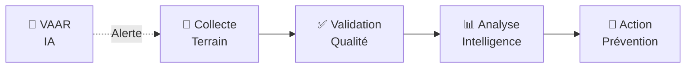

# Documentation Commerciale DOSER

Bienvenue dans la documentation commerciale de la plateforme DOSER. Cette section présente la vision stratégique, les bénéfices et la valeur ajoutée de DOSER pour les décideurs et partenaires.

## 🎯 À Propos de DOSER

**DOSER** (Système de Données de Sécurité Routière) est une plateforme intégrée 360° qui transforme la gestion des accidents de la route en combinant :

- 🌐 **Technologies avancées** : IA, Big Data, SIG
- 🤝 **Écosystème collaboratif** : Tous les acteurs connectés
- 📊 **Intelligence décisionnelle** : 4 niveaux d'analyse
- 🌍 **Conformité internationale** : OMS, AIPCR, ISO 39001

## 📋 Documents Disponibles

### 🎯 [Vision Stratégique](vision-strategique.md)

**Le positionnement stratégique de DOSER**

Comprenez pourquoi DOSER est unique et comment il se positionne face aux alternatives mondiales.

**Contenu** :
- L'écosystème DITROS complet (11 solutions)
- Bénéfices stratégiques pour les gouvernements
- Contribution à la Décennie d'Action ONU
- Positionnement concurrentiel
- Moteur analytique à 4 niveaux

**Public** : Décideurs, Responsables gouvernementaux, Directeurs IT

---

### 📄 [Brochure Commerciale](brochure-commerciale.md)

**Présentation synthétique de DOSER**

Document de présentation concis et impactant pour une première découverte de DOSER.

**Contenu** :
- Vue d'ensemble de la solution
- Modules fonctionnels
- Technologies et innovation
- Bénéfices et ROI
- Références et succès

**Public** : Prospects, Partenaires, Investisseurs

---

### 🎯 [Présentation Solution](presentation-solution.md)

**Support de présentation détaillé**

Deck de présentation visuel pour démonstrations et réunions commerciales.

**Contenu** :
- Problématique et contexte
- Solution DOSER en détail
- Architecture technique
- Cas d'usage par acteur
- Roadmap et évolutions
- Modèle économique

**Public** : Équipes commerciales, Présentations clients

---

## 🌍 Pourquoi DOSER ?

### Le Défi Mondial

```
1,19 M de décès/an dans le monde
19,5 décès/100k hab. en Afrique (taux le plus élevé)
50% de réduction visée d'ici 2030 (ONU)
```

### La Réponse DOSER

**De la Donnée à l'Action**



## 💡 Proposition de Valeur

### Pour les Gouvernements

| Bénéfice | Impact |
|----------|--------|
| **💡 Gouvernance éclairée** | Décisions basées sur des preuves |
| **💰 Optimisation budgétaire** | Ciblage des 5% de routes = 50% d'accidents |
| **🔍 Prévention proactive** | Anticiper plutôt que réagir |
| **🤝 Collaboration interministérielle** | Une seule source de vérité |
| **🌍 Crédibilité internationale** | Conformité OMS, AIPCR, ISO 39001 |

### Pour les Acteurs de Terrain

| Acteur | Bénéfice |
|--------|----------|
| **👮 Forces de l'Ordre** | Application mobile intuitive, mode hors ligne |
| **🏥 Services de Santé** | Interface médicale spécialisée, partage de dossiers |
| **🏢 Assurances** | Traitement automatisé, réduction de fraude |
| **📊 Analystes** | Tableaux de bord dynamiques, IA prédictive |

## 🏆 Différenciateurs Clés

### vs Systèmes Traditionnels (BAAC)

| Critère | BAAC | DOSER |
|---------|------|-------|
| **Sources** | Police uniquement | Multi-sources intégrées |
| **Analyse** | Descriptive | Descriptive + Prédictive + Prescriptive |
| **Collaboration** | Limitée | Native et intégrée |
| **Conformité** | Nationale | OMS + AIPCR + ISO 39001 |

### vs Solutions Modernes

**DOSER est la seule plateforme** offrant :
- ✅ Collecte terrain → Analyse prescriptive (bout en bout)
- ✅ Multi-sources natives (Police, Santé, Assurance)
- ✅ IA intégrée (VAAR + Analyse prédictive)
- ✅ Services complets inclus (Formation, Support 24/7)

## 📊 Écosystème DITROS

DOSER fait partie de **DITROS** (Digital Technologies for Road Safety), une suite complète de 11 solutions couvrant les 4 piliers de la sécurité routière :

### 🛣️ Routes Sûres
- DIPEX, PARKEO, GEOROUTE

### 🚗 Véhicules Sûrs
- SEVITEV, CERDIDOC, FLOTAX

### 👤 Usagers Sûrs
- SIMECOLE, VIGIROUTE

### 🚨 Intervention Efficace
- ALLOVOIE, **DOSER**

> **Avantage unique** : Analyses croisées impossibles avec des solutions isolées

## 💼 Modèle Commercial

### Services Inclus

- ✅ **Formation complète** des utilisateurs
- ✅ **Support technique 24/7** (HelpDesk)
- ✅ **Mises à jour régulières**
- ✅ **Accompagnement personnalisé**
- ✅ **Hébergement sécurisé** (mode SaaS)
- ✅ **Ressources e-learning** (MOOC)

## 📞 Nous Contacter

### Coordonnées

**PROOFTAG-CATIS S.A / DITROS**  
📍 Hôtel de l'Air, Bonanjo, 4601 Douala - CAMEROUN  
📧 commercial@ditros.org  
🌐 doser.ditros.org

---

> **"Transformer les données en actions. Transformer les actions en vies sauvées."**  
> *Mission DOSER*

