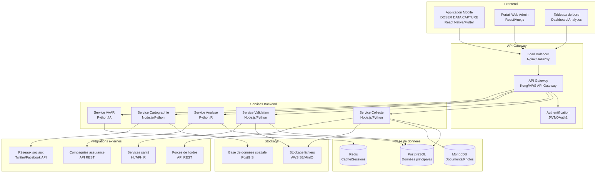

# Document d'Architecture Technique (DAT)

## Vue d'ensemble

Le système DOSER (Système de Données de Sécurité Routière) est une plateforme intégrée 360° de gestion des accidents de la route au Cameroun. Cette architecture technique décrit l'organisation des composants, leurs interactions et les technologies utilisées pour transformer les données en actions et sauver des vies.

## 🎯 Objectifs du Système

- **Centraliser** la collecte de données d'accidents de diverses sources
- **Standardiser** les procédures de collecte et de validation
- **Analyser** les données pour identifier les tendances et points noirs
- **Alerter** en temps réel via l'intelligence artificielle
- **Faciliter** la prise de décisions éclairées pour la sécurité routière

## 🏗️ Architecture Globale

### Schéma d'architecture



## 📱 Composants Frontend

### Application Mobile DOSER DATA CAPTURE
- **Technologie** : React Native ou Flutter
- **Fonctionnalités** :
  - Saisie de constats d'accidents en mode hors-ligne
  - Capture photo avec géolocalisation précise
  - Création de croquis interactifs
  - Synchronisation automatique des données
  - Interfaces adaptées aux différents rôles

### Portail Web Administrateur
- **Technologie** : React.js ou Vue.js
- **Fonctionnalités** :
  - Validation des constats d'accidents
  - Gestion des utilisateurs et permissions
  - Configuration du système
  - Monitoring et logs en temps réel

### Tableaux de Bord Analytics
- **Technologie** : D3.js, Chart.js, ou PowerBI
- **Fonctionnalités** :
  - Visualisation des statistiques d'accidents
  - Cartographie interactive des points noirs
  - Rapports automatisés et personnalisables
  - Indicateurs de performance en temps réel

## 🔧 Services Backend

### Service de Collecte
- **Responsabilité** : Gestion des constats d'accidents
- **Technologies** : Node.js/Python, Express/FastAPI
- **Endpoints principaux** :
  - `POST /api/accidents` - Création d'un constat
  - `GET /api/accidents` - Liste des constats
  - `PUT /api/accidents/{id}` - Modification d'un constat
  - `POST /api/accidents/{id}/photos` - Upload de photos

### Service de Validation
- **Responsabilité** : Validation et contrôle qualité
- **Technologies** : Node.js/Python, Express/FastAPI
- **Endpoints principaux** :
  - `POST /api/validation/validate` - Valider un constat
  - `POST /api/validation/reject` - Rejeter un constat
  - `GET /api/validation/pending` - Constats en attente
  - `GET /api/validation/statistics` - Statistiques de validation

### Service d'Analyse
- **Responsabilité** : Traitement et analyse des données
- **Technologies** : Python/R, Pandas, NumPy, Scikit-learn
- **Endpoints principaux** :
  - `GET /api/analytics/statistics` - Statistiques générales
  - `POST /api/analytics/reports` - Génération de rapports
  - `GET /api/analytics/trends` - Analyse des tendances
  - `GET /api/analytics/predictions` - Prédictions IA

### Service de Cartographie
- **Responsabilité** : Visualisation géographique
- **Technologies** : Node.js/Python, PostGIS, Leaflet/Mapbox
- **Endpoints principaux** :
  - `GET /api/maps/accidents` - Données géographiques
  - `GET /api/maps/heatmap` - Heatmap des accidents
  - `GET /api/maps/points-noirs` - Points noirs identifiés
  - `GET /api/maps/clusters` - Clusters d'accidents

### Service VAAR (Vigilance et Alerte)
- **Responsabilité** : Surveillance IA des réseaux sociaux
- **Technologies** : Python, BERT, YOLOv5, Transformers
- **Endpoints principaux** :
  - `POST /api/vaar/analyze` - Analyse d'un contenu
  - `GET /api/vaar/alerts` - Alertes générées
  - `GET /api/vaar/statistics` - Statistiques VAAR
  - `POST /api/vaar/configure` - Configuration des modèles

## 🗄️ Base de Données

### PostgreSQL (Base principale)
```sql
-- Tables principales
CREATE TABLE accidents (
    id UUID PRIMARY KEY,
    date_accident TIMESTAMP NOT NULL,
    lieu VARCHAR(255) NOT NULL,
    latitude DECIMAL(10,8),
    longitude DECIMAL(11,8),
    type_accident VARCHAR(100),
    conditions_meteo VARCHAR(50),
    etat_chaussee VARCHAR(50),
    statut VARCHAR(20) DEFAULT 'brouillon',
    agent_constatateur_id UUID,
    created_at TIMESTAMP DEFAULT NOW(),
    updated_at TIMESTAMP DEFAULT NOW()
);

CREATE TABLE vehicules (
    id UUID PRIMARY KEY,
    accident_id UUID REFERENCES accidents(id),
    immatriculation VARCHAR(20),
    type_vehicule VARCHAR(50),
    marque VARCHAR(100),
    modele VARCHAR(100),
    couleur VARCHAR(50),
    degre_endommagement VARCHAR(20)
);

CREATE TABLE personnes (
    id UUID PRIMARY KEY,
    accident_id UUID REFERENCES accidents(id),
    role VARCHAR(50), -- conducteur, passager, pieton, temoin
    etat VARCHAR(50), -- indemne, blesse_leger, blesse_grave
    nom VARCHAR(100),
    telephone VARCHAR(20),
    adresse TEXT
);

CREATE TABLE vaar_alerts (
    id UUID PRIMARY KEY,
    source VARCHAR(50), -- twitter, facebook, etc.
    content TEXT,
    confidence_score DECIMAL(3,2),
    location_lat DECIMAL(10,8),
    location_lng DECIMAL(11,8),
    processed_at TIMESTAMP DEFAULT NOW()
);
```

### MongoDB (Documents et médias)
```javascript
// Collection pour les documents associés
{
  _id: ObjectId,
  accident_id: String,
  type_document: String, // photo, schema, document
  nom_fichier: String,
  chemin_stockage: String,
  metadonnees: {
    taille: Number,
    format: String,
    date_creation: Date,
    geolocalisation: {
      latitude: Number,
      longitude: Number
    }
  }
}
```

### Redis (Cache et sessions)
- **Sessions utilisateurs** avec expiration
- **Cache des requêtes fréquentes** (statistiques, cartes)
- **Queue de traitement** des notifications
- **Cache des modèles IA** pour VAAR

## 🔗 Intégrations Externes

### Forces de l'ordre
- **Protocole** : API REST
- **Format** : JSON
- **Authentification** : API Key ou OAuth2
- **Données échangées** : Constats, alertes, statistiques

### Services de santé
- **Protocole** : HL7 FHIR
- **Format** : JSON/XML
- **Données échangées** : Informations sur les blessés, état des victimes

### Compagnies d'assurance
- **Protocole** : API REST
- **Format** : JSON
- **Données échangées** : Vérification des polices, informations sur les véhicules

### Réseaux sociaux (VAAR)
- **APIs** : Twitter API, Facebook Graph API
- **Technologies** : Webhooks, Streaming API
- **Traitement** : Temps réel, batch processing

## 🔒 Sécurité

### Authentification et autorisation
- **JWT** pour l'authentification des utilisateurs
- **RBAC** (Role-Based Access Control) pour les autorisations
- **OAuth2** pour les intégrations externes
- **2FA** pour les comptes sensibles

### Chiffrement
- **HTTPS** pour toutes les communications
- **Chiffrement AES-256** pour les données sensibles
- **Hachage bcrypt** pour les mots de passe
- **Chiffrement de bout en bout** pour les données médicales

### Audit et logging
- **Logs d'audit** pour toutes les actions sensibles
- **Monitoring** en temps réel avec Prometheus
- **Alertes** pour les anomalies de sécurité
- **Conformité** RGPD et réglementations locales

## 🚀 Déploiement

### Environnements
- **Développement** : Docker Compose local
- **Staging** : Kubernetes sur cloud privé
- **Production** : Kubernetes sur cloud public (AWS/Azure)

### Infrastructure
- **Conteneurisation** : Docker
- **Orchestration** : Kubernetes
- **CI/CD** : GitLab CI ou GitHub Actions
- **Monitoring** : Prometheus + Grafana
- **Logs** : ELK Stack (Elasticsearch, Logstash, Kibana)

## 📊 Performance et Scalabilité

### Optimisations
- **Cache Redis** pour les requêtes fréquentes
- **CDN** pour les assets statiques
- **Indexation** optimisée des bases de données
- **Pagination** pour les grandes listes
- **Compression** des images et documents

### Monitoring
- **Métriques** : Temps de réponse, débit, erreurs
- **Alertes** : Seuils de performance
- **Dashboards** : Vue d'ensemble en temps réel
- **APM** : Application Performance Monitoring

## 🔄 Maintenance et Évolution

### Versioning
- **API** : Versioning sémantique (v1, v2, etc.)
- **Base de données** : Migrations versionnées
- **Déploiement** : Blue-green ou rolling updates
- **Compatibilité** : Rétrocompatibilité maintenue

### Documentation
- **API** : OpenAPI/Swagger
- **Code** : Documentation inline
- **Architecture** : Diagrammes à jour
- **Procédures** : Runbooks opérationnels

---

*Pour plus d'informations sur l'implémentation, consultez la [documentation développeur](developpers/api-reference.md).*
