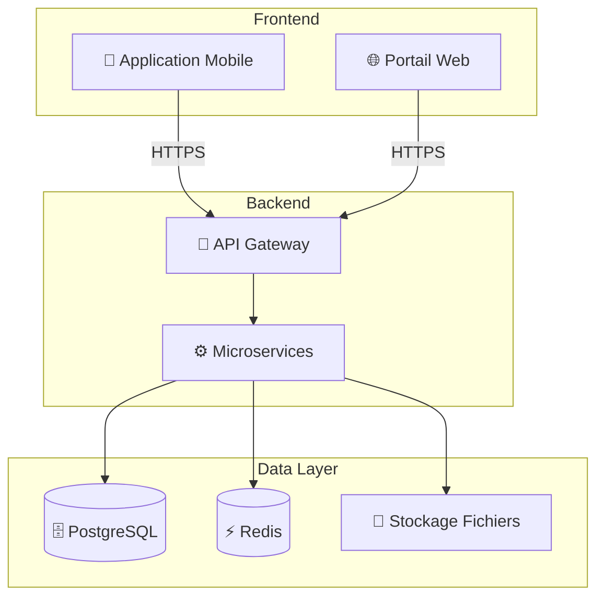

# Guides d'Implémentation DOSER

Bienvenue dans les guides d'implémentation de la plateforme DOSER. Cette section contient toute la documentation nécessaire pour installer, déployer et maintenir DOSER dans votre environnement.

## 📋 Vue d'ensemble

Les guides d'implémentation sont destinés aux :
- **Équipes d'implémentation** technique
- **Administrateurs système**
- **Responsables IT**
- **Équipes de déploiement**

## 📦 [Installation et Déploiement](installation.md)

Guide complet pour installer DOSER dans votre infrastructure.

**Contenu** :
- Prérequis système
- Installation des composants
- Configuration de base
- Déploiement de l'application mobile
- Déploiement du portail web
- Configuration réseau et sécurité

## 🚀 [Guide de Déploiement](deployment.md)

Stratégies et procédures pour un déploiement réussi.

**Contenu** :
- Planification du déploiement
- Stratégies de déploiement (progressif, pilote, complet)
- Formation des utilisateurs
- Migration des données existantes
- Tests d'acceptation

## 🔄 [Guide de Maintenance](maintenance.md)

Procédures pour maintenir DOSER en conditions optimales.

**Contenu** :
- Maintenance préventive
- Mises à jour et upgrades
- Monitoring et surveillance
- Optimisation des performances
- Résolution des problèmes courants

## 💾 [Procédures de Sauvegarde](backup-procedures.md)

Stratégies de sauvegarde et de récupération des données.

**Contenu** :
- Stratégie de sauvegarde 3-2-1
- Sauvegarde des bases de données
- Sauvegarde des médias
- Tests de restauration
- Plan de reprise après sinistre (DRP)

## 🏗️ Architecture d'Implémentation

### Infrastructure Recommandée

### Configuration Minimale

| Composant | Minimum | Recommandé | Production |
|-----------|---------|------------|------------|
| **CPU** | 4 cores | 8 cores | 16+ cores |
| **RAM** | 8 GB | 16 GB | 32+ GB |
| **Stockage** | 100 GB | 500 GB | 1+ TB |
| **Bande passante** | 10 Mbps | 100 Mbps | 1+ Gbps |

## 🔐 Sécurité

Les considérations de sécurité pour l'implémentation incluent :

- ✅ **Chiffrement** : TLS/SSL pour toutes les communications
- ✅ **Authentification** : OAuth 2.0 et JWT
- ✅ **Autorisation** : Contrôle d'accès basé sur les rôles (RBAC)
- ✅ **Audit** : Journalisation complète des actions
- ✅ **Conformité** : RGPD et normes locales

Pour plus de détails, consultez le [Plan de Sécurité](../developer/security-plan.md).

## 📊 Suivi de l'Implémentation

### Phases d'Implémentation

1. **Phase 1 : Préparation** (2-4 semaines)
   - Audit de l'infrastructure
   - Planification du déploiement
   - Formation des équipes techniques

2. **Phase 2 : Installation** (1-2 semaines)
   - Installation des composants
   - Configuration initiale
   - Tests d'intégration

3. **Phase 3 : Déploiement Pilote** (4-8 semaines)
   - Déploiement dans une région test
   - Formation des utilisateurs pilotes
   - Collecte des retours

4. **Phase 4 : Déploiement National** (variable)
   - Extension progressive
   - Formation massive
   - Support continu

### Indicateurs de Succès

- ✅ **Disponibilité** : >99.5% uptime
- ✅ **Performance** : Temps de réponse <2s
- ✅ **Adoption** : >80% des utilisateurs formés actifs
- ✅ **Qualité des données** : >95% de complétude

## 🆘 Support d'Implémentation

### Ressources Disponibles

- **📞 Hotline Technique** : Support 24/7 pendant le déploiement
- **👥 Accompagnement** : Équipe dédiée sur site
- **📚 Documentation** : Guides détaillés et tutoriels
- **🎓 Formation** : Sessions de formation personnalisées

### Contacts

**PROOFTAG-CATIS S.A / DITROS**  
📍 Hôtel de l'Air, Bonanjo, 4601 Douala - CAMEROUN  
📧 support-technique@ditros.org  
📱 Hotline : [À définir]

---

Pour des informations techniques approfondies, consultez la [Documentation Développeur](../developer/index.md).

