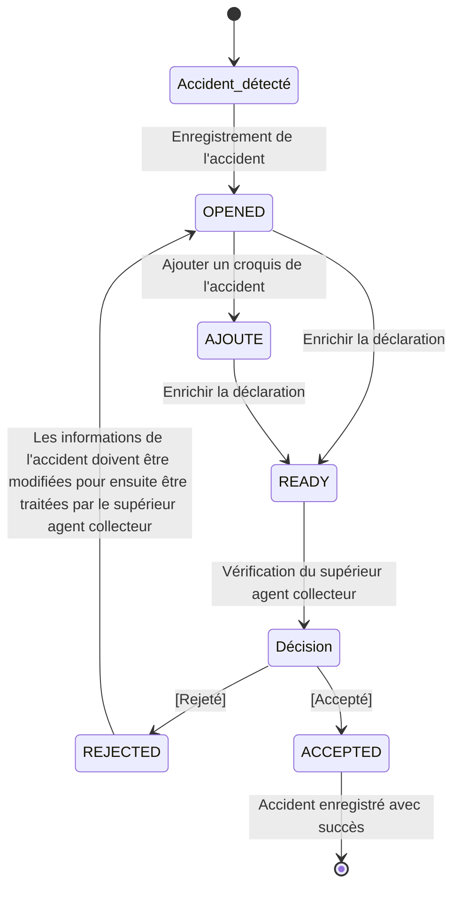

# Guide des Forces de l'Ordre

## Vue d'ensemble

Les Forces de l'Ordre (Police et Gendarmerie) jouent un rôle central dans le système DOSER en tant qu'acteurs principaux de la collecte de données sur le terrain et de la coordination des interventions d'urgence.

### Spécifications Techniques
- **Plateforme** : Application mobile sous Android (version minimum 6)
- **Appareils** : Tablettes et smartphones compatibles
- **Délai d'enregistrement** : 60 jours maximum pour les données d'accidents

### Missions Opérationnelles
- **Enregistrement** des données sur les accidents (délai 60 jours)
- **Identification** et enregistrement des véhicules et personnes accidentées
- **Collecte** d'informations sur les blessés et dégâts corporels
- **Validation** des données avant intégration au système (Module VAAR)
- **Acheminement** des formulaires papiers
- **Production** du procès-verbal
- **Recueil** des dépositions
- **Vérification** des documents et titres

### Missions principales

- **Intervention** sur les lieux d'accidents
- **Collecte** de données standardisées via DOSER DATA CAPTURE
- **Coordination** avec les autres services d'urgence
- **Validation** et transmission des informations
- **Suivi** des procédures judiciaires

## Parcours utilisateur

### Description des processus et états

### Processus de Déclaration d'Accident

La déclaration d'un accident comprend deux phases principales :

1. **La déclaration** (faite par un agent constatateur)
2. **La validation** (faite par un agent validateur)

### États Principaux de la Déclaration

| État | Description |
|------|-------------|
| **OPENED** | Accident déclaré et informations saisies. Modification possible, ajout ou modification des croquis, véhicules, personnes, impression du rapport et signature. |
| **READY** | Toutes les informations saisies, attente de validation ou rejet par le validateur. |
| **REJECTED** | Déclaration rejetée avec motif, à modifier par l'agent collecteur. |
| **ACCEPTED** | Déclaration validée et signée par le validateur. |
| **AJOUTE** | Croquis ajouté, quel que soit le statut, avant validation finale. |

### Diagramme des États de la Déclaration

## Procédures détaillées

### Utilisation de DOSER DATA CAPTURE

### Cas d'Usage Spécifiques

#### 1. Application Mobile DOSER DATA CAPTURE : L'Intelligence sur le Terrain

Au cœur de la collecte de données se trouve l'application mobile, un outil essentiel conçu pour les réalités du terrain, même dans des environnements sans connexion Internet stable.

**Architecture "Offline-First" :**
- Toutes les données et formulaires nécessaires sont stockés localement
- Permet aux agents de travailler sans interruption
- Synchronisation intelligente dès qu'un réseau est disponible

**Saisie Rapide et Sécurisée :**
- Connexion via simple scan de code QR
- Accès protégé par un code PIN
- Interface visuelle avec icônes et couleurs pour une saisie intuitive et rapide

**Pour la Police/Gendarmerie :**
- Remplace les fiches papier traditionnelles
- Saisie en temps réel des informations sur l'accident, véhicules et personnes
- Utilisation du GPS pour une géolocalisation précise
- Intégration de l'appareil photo pour capturer des preuves numériques (photos, vidéos)
- Renforce la fiabilité des rapports d'accident

#### 2. Traiter et Valider les Alertes
- **Réception** des alertes d'accidents via le module VAAR
- **Analyse** de la gravité et de l'urgence
- **Déploiement** des équipes appropriées
- **Coordination** avec les services de secours

#### 2. Localisation Géographique
- **Utilisation** des outils de géolocalisation intégrés (GPS)
- **Détermination** de l'emplacement exact de l'accident avec précision métrique
- **Vérification** de la cohérence géographique avec les données cartographiques
- **Transmission** des coordonnées précises aux services de secours et d'analyse
- **Enregistrement automatique** de la position GPS lors de la saisie des données
- **Intégration** avec les systèmes de cartographie pour l'analyse des points noirs

#### 3. Déterminer les Circonstances
- **Recueil** d'informations sur les circonstances
- **Analyse** de la dynamique de l'accident
- **Identification** des causes potentielles
- **Documentation** des facteurs contributifs

#### 4. Identification des Personnes
- **Collecte** des informations personnelles des conducteurs
- **Identification** des passagers impliqués
- **Recueil** des données des tiers concernés
- **Vérification** des identités et documents

#### 5. Constatations Techniques
- **Vérification** des données du compteur de vitesse
- **Mesure** de la vitesse enclenchée
- **Analyse** des paramètres techniques du véhicule
- **Documentation** des preuves matérielles

#### 6. Recueil des Témoignages
- **Identification** des témoins présents
- **Interrogation** des témoins oculaires
- **Enregistrement** des déclarations
- **Validation** de la cohérence des témoignages

#### 7. Élaboration d'un Croquis
- **Création** d'un plan détaillé de l'accident via l'interface tactile
- **Indication** des positions précises des véhicules avec géolocalisation
- **Relevé** des indices et marques sur la chaussée
- **Documentation** de l'orientation et des distances
- **Intégration** des photos prises sur le terrain dans le croquis
- **Synchronisation** automatique du croquis avec les données GPS
- **Export** du croquis numérique pour les rapports et analyses

### Fonctionnalités spécialisées

### Interface Police/Gendarmerie
- **Formulaires** adaptés aux procédures judiciaires
- **Templates** de constats standardisés
- **Workflows** de validation hiérarchique
- **Intégration** avec les systèmes judiciaires
- **Interface tactile** optimisée pour l'utilisation sur le terrain
- **Saisie vocale** pour les notes rapides
- **Mode hors ligne** complet pour toutes les fonctionnalités

### Outils d'Investigation
- **Analyse** des traces de freinage
- **Calcul** de la vitesse d'impact
- **Reconstruction** de la chronologie
- **Expertise** technique intégrée
- **Capture photo/vidéo** haute résolution pour l'analyse forensique
- **Mesure automatique** des distances via GPS et caméra
- **Enregistrement audio** des témoignages sur le terrain
- **Synchronisation** des données multimédia avec le rapport

### Constatations Techniques Avancées
- **Vérification des données du compteur de vitesse** : Lecture et enregistrement de la vitesse enclenchée au moment de l'impact
- **Analyse de l'ordinateur de bord** : Extraction des données de conduite (vitesse, freinage, accélération)
- **Vérification du chronotachygraphe** : Pour les véhicules professionnels, contrôle des temps de conduite et de repos
- **Examen sommaire de l'état des véhicules** : Évaluation des dommages pour déterminer la dynamique de l'accident
- **Collecte et analyse des indices** : Traces de freinage, débris, état des feux tricolores, signalisation

### Coordination Multi-Services
- **Communication** avec les services de santé
- **Coordination** avec les compagnies d'assurance
- **Transmission** aux services techniques
- **Suivi** des interventions

### Procédures légales et médicales

### Dépistage et Tests
- **Dépistage d'alcoolémie sur place** : Utilisation d'éthylomètres portables pour les conducteurs
- **Tests de stupéfiants** : Dépistage rapide des substances illicites
- **Procédures en milieu hospitalier** : Coordination avec les services médicaux pour les tests approfondis
- **Documentation des résultats** : Enregistrement des taux d'alcoolémie et des substances détectées

### Enregistrement des Plaintes
- **Collecte des déclarations** : Recueil des plaintes déposées par les victimes
- **Documentation des blessures** : Description détaillée des lésions subies
- **Coordination avec les assurances** : Transmission des informations aux compagnies d'assurance
- **Suivi des procédures** : Mise à jour du statut des plaintes et des indemnisations

### Certificats Médicaux
- **Obtention des certificats médicaux initiaux** : Collecte des attestations descriptives des lésions
- **Coordination avec les hôpitaux** : Liaison avec les services de santé pour les certificats
- **Validation des documents** : Vérification de l'authenticité et de la complétude
- **Archivage sécurisé** : Conservation des certificats dans le dossier d'accident

### Association Patients-Victimes
- **Liaison des dossiers** : Association de chaque patient traité à son dossier d'accident
- **Suivi médical coordonné** : Mise à jour des informations de santé
- **Communication avec les familles** : Information des proches sur l'état des victimes
- **Coordination multi-services** : Liaison entre police, santé, et assurances

---

### Utilisation de l'interface web DOSER

### Vue d'Ensemble

L'interface web DOSER constitue une alternative puissante à l'application mobile, particulièrement adaptée aux situations suivantes :

📍 **Déclarations depuis le bureau** : Saisie détaillée et analyse approfondie des accidents nécessitant plus de temps et de ressources  
🚨 **Transformation d'alertes VAAR** : Conversion des alertes du Module de Vigilance et d'Alerte (issues des réseaux sociaux, médias, publications citoyennes) en déclarations d'accident officielles  
📊 **Enrichissement de données** : Ajout de documents complémentaires, analyses techniques et coordination multi-services  
🖥️ **Travail de bureau** : Finalisation des constats, génération de rapports et coordination avec les services administratifs

### Configuration Technique Requise

Pour garantir une utilisation optimale de l'interface web, les spécifications minimales suivantes sont requises :

| Composant | Spécification Minimale | Recommandé |
|-----------|------------------------|------------|
| **Processeur** | Intel Core i5 CPU 2.30 GHz | Intel Core i7 ou supérieur |
| **Mémoire RAM** | 8 Go | 16 Go |
| **Système d'exploitation** | Windows 10 64 bits | Windows 11 64 bits |
| **Espace disque** | 300 Go disponibles | 500 Go SSD |
| **Navigateur web** | Chrome 90+, Firefox 88+, Edge 90+ | Chrome ou Edge (dernière version) |
| **Connexion Internet** | ADSL 2 Mbps minimum | Fibre optique 10 Mbps+ |
| **Résolution écran** | 1366 x 768 pixels | 1920 x 1080 pixels (Full HD) |

**⚠️ Note importante** : L'utilisation d'un navigateur à jour est essentielle pour garantir la sécurité et la compatibilité avec toutes les fonctionnalités.

### Accès et Authentification

#### Connexion à la Plateforme

1. **Ouvrir le navigateur web** (Chrome, Firefox ou Microsoft Edge recommandés)
2. **Saisir l'adresse du serveur** : `http://51.195.80.167:8098`
3. **Renseigner les identifiants** :
   - **Identifiant** : Fourni par votre hiérarchie (format : matricule ou nom d'utilisateur)
   - **Mot de passe** : Mot de passe personnel sécurisé
4. **Cliquer sur "CONNEXION"** pour accéder à l'interface

#### Sécurité et Bonnes Pratiques

- 🔐 **Mot de passe fort** : Minimum 8 caractères avec majuscules, minuscules, chiffres et caractères spéciaux
- 🔄 **Changement régulier** : Renouveler le mot de passe tous les 90 jours
- 🚫 **Confidentialité** : Ne jamais partager ses identifiants
- 🔒 **Déconnexion** : Toujours se déconnecter après utilisation, surtout sur un poste partagé
- 💾 **Sauvegarde** : Sauvegarder régulièrement les données en cours de saisie

### Interface Principale

#### Tableau de Bord d'Accueil

Après authentification, l'agent accède au **tableau de bord principal** qui affiche :

**📊 Vue d'Ensemble :**
- **Statistiques personnelles** : Nombre de constats créés, validés, en attente
- **Alertes actives** : Notifications du module VAAR nécessitant traitement
- **Constats en cours** : Liste des déclarations au statut OPENED
- **Constats en attente de validation** : Déclarations soumises (statut READY)
- **Constats rejetés** : Déclarations nécessitant correction (statut REJECTED)

**🔔 Notifications :**
- Alertes VAAR non traitées
- Déclarations rejetées par le validateur
- Messages de la hiérarchie
- Mises à jour système

**⚡ Actions Rapides :**
- ➕ **Nouveau Constat** : Créer une nouvelle déclaration d'accident
- 🚨 **Traiter Alerte VAAR** : Convertir une alerte en déclaration
- 📋 **Mes Constats** : Accéder à la liste complète des déclarations
- 📊 **Statistiques** : Consulter les indicateurs de performance

### Création d'une Déclaration d'Accident

#### Étape 1 : Initialisation du Constat

**Accès :**
- **Option 1** : Cliquer sur le bouton `➕ Ajouter` dans la page d'accueil
- **Option 2** : Menu de droite > Module Police/Gendarmerie > Ajouter un accident
- **Option 3** : Convertir une alerte VAAR en déclaration

**Informations de l'Enquêteur :**
- **Nom et prénom** de l'agent constatateur (pré-rempli)
- **Matricule** ou identifiant de service
- **Unité d'affectation** : Brigade, commissariat, gendarmerie
- **Date et heure d'intervention** : Horodatage automatique modifiable
- **Numéro de procès-verbal** : Référence administrative

**Cliquer sur "Suivant"** pour passer à l'étape de localisation.

#### Étape 2 : Localisation Géographique

**Saisie de la Localisation :**
- **Région** : Sélection dans la liste déroulante
- **Département** : Sélection contextuelle
- **Arrondissement/Commune** : Précision administrative
- **Lieu précis** : Route, intersection, quartier, point kilométrique
- **Coordonnées GPS** : Saisie manuelle ou sélection sur carte interactive
  - Latitude (format décimal : ex. 3.8480° N)
  - Longitude (format décimal : ex. 11.5021° E)
  - Précision GPS en mètres

**Carte Interactive :**
- **Cliquer sur la carte** pour positionner le marqueur d'accident
- **Zoom** : Ajuster le niveau de détail
- **Vue satellite** : Basculer entre carte et vue aérienne
- **Vérification** : Confirmer la cohérence entre l'adresse et les coordonnées

**Cliquer sur "Suivant"** pour continuer.

#### Étape 3 : Informations sur l'Accident

**Données Temporelles :**
- **Date de l'accident** : Sélection via calendrier
- **Heure exacte** : Format 24h (HH:MM)
- **Heure d'arrivée sur les lieux** : Pour calcul du délai d'intervention

**Type et Gravité :**
- **Type d'accident** : Collision, renversement, sortie de route, heurt piéton, etc.
- **Gravité** :
  - 🚗 Matériel uniquement
  - 🤕 Blessés légers
  - 🚑 Blessés graves
  - 💀 Mortel (un ou plusieurs décès)
- **Nombre de véhicules impliqués** : 1, 2, 3 ou plus

**Conditions Environnementales :**
- **Météo** : Ensoleillé, nuageux, pluie, brouillard, neige, etc.
- **État de la chaussée** : Sèche, mouillée, glissante, enneigée, verglacée
- **Visibilité** : Bonne, réduite, très réduite, nulle
- **Luminosité** : Jour, crépuscule, nuit avec éclairage, nuit sans éclairage

**Cliquer sur "Suivant"**.

#### Étape 4 : Informations sur la Route

**Caractéristiques de la Voie :**
- **Type de route** : Nationale, départementale, communale, autoroute, urbaine
- **Numéro de route** : Ex. RN1, RD12, etc.
- **Configuration** : Ligne droite, virage, intersection, rond-point, passage à niveau
- **Nombre de voies** : 1, 2, 3 ou plus par sens
- **Largeur de la chaussée** : En mètres

**Signalisation et Équipements :**
- **Panneaux présents** : Stop, cédez le passage, limitation de vitesse, etc.
- **État de la signalisation** : Bonne, dégradée, absente
- **Marquage au sol** : Présent et visible, effacé, absent
- **Feux tricolores** : Présents et fonctionnels, en panne, absents
- **Éclairage public** : Présent et allumé, présent mais éteint, absent

**Cliquer sur "Suivant"**.

#### Étape 5 : Ajout des Véhicules

Pour **chaque véhicule impliqué** :

**Identification du Véhicule :**
- **Marque** : Toyota, Peugeot, Renault, etc.
- **Modèle** : Camry, 308, Clio, etc.
- **Immatriculation** : Format local (ex. LT-1234-YA)
- **Type de véhicule** : Voiture particulière, moto, camion, bus, vélo, piéton
- **Couleur** : Principale et secondaire si applicable
- **Année de fabrication** : Pour évaluation technique

**Dommages Observés :**
- **Localisation des dommages** : Avant, arrière, côté gauche, côté droit, toit, dessous
- **Gravité des dommages** : Légers, moyens, importants, destruction totale
- **Description détaillée** : Texte libre pour précisions techniques
- **Position finale** : Sur la chaussée, accotement, fossé, etc.

**Documents du Véhicule :**
- **Photo du véhicule** : Minimum 4 angles (avant, arrière, côtés)
- **Photo de la carte grise** : Recto et verso
- **Photo de l'assurance** : Attestation en cours de validité
- **Photo du permis de conduire** : Si conducteur présent

**Actions :**
- **Cliquer sur "Enregistrer"** pour sauvegarder le véhicule
- **Cliquer sur "➕ Ajouter un véhicule"** pour un véhicule supplémentaire
- **Cliquer sur "Suivant"** après avoir ajouté tous les véhicules

#### Étape 6 : Ajout des Personnes (Usagers)

Pour **chaque personne impliquée** :

**Identification :**
- **Nom et prénom** : État civil complet
- **Date de naissance** : Ou âge si date inconnue
- **Sexe** : Masculin, Féminin
- **Nationalité** : Pour les procédures administratives
- **Adresse** : Domicile habituel
- **Téléphone** : Pour contact ultérieur

**Qualité et Rôle :**
- **Conducteur** : Du véhicule A, B, C, etc.
- **Passager** : Position dans le véhicule (avant droit, arrière gauche, etc.)
- **Piéton** : Impliqué dans l'accident
- **Témoin** : Présent sur les lieux

**État de Santé :**
- **Indemne** : Aucune blessure apparente
- **Blessé léger** : Soins sur place ou consultation
- **Blessé grave** : Hospitalisation nécessaire
- **Décédé** : Sur le coup ou pendant le transport

**Documents de la Personne :**
- **Photo de la CNI/Passeport** : Pièce d'identité valide
- **Photo du permis de conduire** : Si conducteur
- **Certificat médical** : Si blessé (à joindre ultérieurement si nécessaire)
- **Certificat de décès** : Si décédé (fourni par services médicaux)

**Tests et Contrôles :**
- **Test d'alcoolémie** : Résultat en g/L ou mg/L
- **Test de stupéfiants** : Positif/Négatif, substances détectées
- **Contrôle des documents** : Validité du permis, assurance, contrôle technique

**Actions :**
- **Cliquer sur "Enregistrer"** pour sauvegarder la personne
- **Cliquer sur "➕ Ajouter une personne"** pour une personne supplémentaire
- **Cliquer sur "Suivant"** après avoir ajouté toutes les personnes

#### Étape 7 : Création du Croquis

**Deux Options Disponibles :**

**Option A : Dessiner le Croquis**
1. **Cliquer sur "📐 Dessiner"**
2. **Utiliser les outils de dessin** :
   - **Formes** : Rectangles (véhicules), cercles (personnes), lignes (trajectoires)
   - **Symboles** : Panneaux, feux, marquages, obstacles
   - **Texte** : Annotations et légendes
   - **Couleurs** : Différenciation des éléments
3. **Placer les éléments** :
   - Véhicules avec leur orientation
   - Personnes (conducteurs, piétons)
   - Signalisation routière
   - Traces de freinage, débris
   - Point d'impact
4. **Ajouter l'échelle** : Indication des distances réelles
5. **Orienter le croquis** : Indiquer le Nord
6. **Enregistrer le croquis**

**Option B : Importer un Croquis**
1. **Cliquer sur "📁 Importer"**
2. **Sélectionner le fichier** : Image (JPG, PNG, PDF) ou scan d'un croquis papier
3. **Valider l'import**

**Bonnes Pratiques :**
- ✅ Respecter les proportions et l'échelle
- ✅ Indiquer clairement les distances
- ✅ Utiliser des symboles normalisés
- ✅ Annoter les éléments importants
- ✅ Indiquer le sens de circulation

**Cliquer sur "Suivant"**.

#### Étape 8 : Rédaction du Procès-Verbal

**Observations de l'Agent :**
- **Circonstances de l'accident** : Description narrative détaillée
- **Constatations sur place** :
  - Traces de freinage (longueur en mètres)
  - Débris et leur position
  - État des feux tricolores
  - Conditions de visibilité
  - Facteurs contributifs identifiés
- **Éléments techniques** :
  - Vitesse estimée ou mesurée
  - Distance de freinage
  - Point d'impact
  - Trajectoires des véhicules
- **Remarques particulières** : Tout élément pertinent pour l'enquête

**Rédaction Professionnelle :**
- **Style** : Factuel, précis, objectif
- **Structure** : Chronologique et logique
- **Détails** : Suffisamment précis pour reconstitution
- **Neutralité** : Éviter les jugements, rapporter les faits

**Cliquer sur "Suivant"**.

#### Étape 9 : Enregistrement des Dépositions

**Pour chaque déposition** :

1. **Cliquer sur "➕ Déposition"**
2. **Identifier le déclarant** :
   - Sélectionner dans la liste des personnes déjà enregistrées
   - Ou ajouter un nouveau témoin
3. **Qualité** : Conducteur, passager, témoin oculaire, témoin indirect
4. **Texte de la déposition** :
   - Transcription fidèle des déclarations
   - Entre guillemets pour les citations directes
   - Mention des contradictions éventuelles
5. **Signature** : Confirmation par le déclarant (si possible)

**Actions :**
- **Enregistrer** la déposition
- **Ajouter** d'autres dépositions si nécessaire
- **Cliquer sur "Terminer"** pour finaliser la création

**⚠️ Important** : À ce stade, la déclaration est créée avec le statut **OPENED**. Elle peut être modifiée et enrichie avant signature.

### Enrichissement et Modification d'une Déclaration

#### Accès aux Déclarations en Cours

Dans la **liste des déclarations**, les constats au statut **OPENED** peuvent être enrichis :

**Actions Disponibles :**
- **📄 Générer le Rapport PDF** : Visualiser et imprimer le constat complet
- **✏️ Modifier la Déclaration** : Corriger ou compléter les informations
- **🎨 Ajouter/Modifier le Croquis** : Améliorer le schéma
- **✍️ Signer la Déclaration** : Finaliser et soumettre pour validation

#### Modification des Éléments

**Images et Photos :**
- **Ajouter** : Télécharger de nouvelles photos
- **Supprimer** : Retirer les photos floues ou non pertinentes
- **Remplacer** : Mettre à jour avec des photos de meilleure qualité
- **Annoter** : Ajouter des légendes explicatives

**Localisation :**
- **Corriger les coordonnées GPS** : Ajuster la précision
- **Modifier l'adresse** : Préciser le lieu exact
- **Mettre à jour la carte** : Repositionner le marqueur

**Informations Accident et Route :**
- **Ajuster les détails** : Corriger les données temporelles ou environnementales
- **Compléter** : Ajouter des informations manquantes

**Véhicules :**
- **Ajouter un véhicule** : Si oublié initialement
- **Modifier** : Corriger immatriculation, dommages, etc.
- **Supprimer** : Retirer un véhicule enregistré par erreur
- **Ajouter des documents** : Photos complémentaires

**Personnes :**
- **Ajouter une personne** : Témoin supplémentaire, passager oublié
- **Modifier** : Corriger identité, état de santé
- **Supprimer** : Retirer une personne enregistrée par erreur
- **Mettre à jour** : Ajouter certificat médical, résultats de tests

**Procès-Verbal et Dépositions :**
- **Compléter le PV** : Ajouter observations complémentaires
- **Ajouter des dépositions** : Témoignages recueillis ultérieurement
- **Modifier** : Corriger transcriptions

**Cliquer sur "Enregistrer"** après chaque modification.

#### Signature et Soumission

**Étape Finale avant Validation :**

1. **Vérifier la complétude** : S'assurer que toutes les informations nécessaires sont présentes
2. **Cliquer sur "✍️ Signer le Rapport"**
3. **Dessiner la signature** : Utiliser la souris ou l'écran tactile
4. **Confirmer** : Cliquer sur "Enregistrer"

**⚠️ Attention** : Une fois signée, la déclaration passe au statut **READY** et est transmise au validateur. Elle ne peut plus être modifiée par l'agent constatateur.

### Gestion des Statuts et Workflow

#### Statut OPENED (En Cours)

**Actions possibles :**
- ✅ Modifier toutes les informations
- ✅ Ajouter/supprimer des éléments
- ✅ Générer des rapports PDF provisoires
- ✅ Signer pour soumettre à validation

#### Statut AJOUTE (Croquis Ajouté)

**Description :** Un croquis a été ajouté récemment à la déclaration.

**Actions possibles :**
- ✅ Toutes les actions du statut OPENED
- ✅ Modifier le croquis

#### Statut READY (Prêt pour Validation)

**Description :** La déclaration est signée et en attente de validation par le supérieur hiérarchique.

**Actions possibles :**
- ✅ Consulter en lecture seule
- ✅ Générer le rapport PDF final
- ❌ Aucune modification possible

#### Statut REJECTED (Rejeté)

**Description :** Le validateur a rejeté la déclaration avec un motif.

**Actions possibles :**
- ✅ Consulter le motif du rejet
- ✅ Modifier selon les remarques du validateur
- ✅ Re-signer et re-soumettre
- ✅ Voir l'historique des rejets

**Procédure :**
1. **Lire attentivement** le motif du rejet
2. **Corriger** les éléments signalés
3. **Vérifier** la complétude après corrections
4. **Re-signer** la déclaration
5. **Re-soumettre** pour validation

#### Statut ACCEPTED (Accepté)

**Description :** La déclaration est validée et définitive.

**Actions possibles :**
- ✅ Consulter en lecture seule
- ✅ Générer et imprimer le rapport PDF officiel
- ✅ Transmettre aux services concernés
- ❌ Aucune modification possible

### Transformation d'Alertes VAAR en Déclarations

#### Contexte

Le **Module VAAR (Vigilance et Alerte sur les Accidents de la Route)** surveille en continu les sources d'information (réseaux sociaux, médias, publications citoyennes) pour détecter les accidents. Ces alertes doivent être converties en déclarations officielles.

#### Procédure de Conversion

**Étape 1 : Accès aux Alertes VAAR**
- **Tableau de bord** > **Alertes VAAR**
- **Liste des alertes** non traitées avec priorité

**Étape 2 : Sélection d'une Alerte**
- **Cliquer sur l'alerte** pour voir les détails
- **Informations disponibles** :
  - Source de l'alerte (Facebook, X, WhatsApp, média, citoyen)
  - Date et heure de détection
  - Localisation estimée (si disponible)
  - Description automatique (IA)
  - Photos/vidéos associées
  - Niveau de gravité estimé

**Étape 3 : Validation de l'Alerte**
- **Vérifier la pertinence** : S'agit-il bien d'un accident ?
- **Évaluer la fiabilité** : Source crédible ?
- **Confirmer la localisation** : Coordonnées cohérentes ?

**Étape 4 : Conversion en Déclaration**
- **Cliquer sur "Convertir en Déclaration"**
- **Pré-remplissage automatique** :
  - Localisation (si disponible)
  - Date/heure estimées
  - Photos/vidéos de la source
  - Description initiale
- **Compléter manuellement** :
  - Informations manquantes
  - Vérification sur le terrain
  - Collecte de preuves complémentaires

**Étape 5 : Finalisation**
- **Enrichir** avec les données terrain
- **Signer** la déclaration
- **Soumettre** pour validation

**⚠️ Important** : Les alertes VAAR doivent être vérifiées sur le terrain avant conversion définitive en déclaration officielle.

### Génération de Rapports

#### Rapport PDF Standard

**Contenu du Rapport :**
- **Page de garde** : Référence, date, agent, unité
- **Résumé exécutif** : Type, gravité, localisation
- **Informations détaillées** :
  - Circonstances de l'accident
  - Conditions environnementales
  - Véhicules impliqués avec photos
  - Personnes impliquées avec état
  - Croquis de l'accident
  - Procès-verbal complet
  - Dépositions
- **Signatures** : Agent constatateur et validateur
- **Annexes** : Photos, documents scannés

**Génération :**
1. **Accéder à la déclaration**
2. **Cliquer sur "Actions" > "Rapport en PDF"**
3. **Télécharger** le fichier PDF
4. **Imprimer** si nécessaire

#### Rapports Statistiques

**Accès :**
- **Menu** > **Statistiques** > **Mes Rapports**

**Types de Rapports :**
- **Rapport mensuel** : Nombre de constats, taux de validation, délais
- **Rapport par type d'accident** : Répartition des gravités
- **Rapport géographique** : Cartographie des accidents
- **Rapport de performance** : Indicateurs individuels

### Bonnes Pratiques et Recommandations

#### Qualité des Données

✅ **Exhaustivité** : Remplir tous les champs obligatoires  
✅ **Précision** : Vérifier l'exactitude des informations  
✅ **Cohérence** : Assurer la logique entre les différents éléments  
✅ **Clarté** : Rédiger de manière compréhensible  
✅ **Objectivité** : Rapporter les faits sans jugement  

#### Gestion du Temps

⏱️ **Délai réglementaire** : 60 jours maximum pour enregistrer une déclaration  
⏱️ **Saisie rapide** : Privilégier la saisie le jour même de l'accident  
⏱️ **Enrichissement progressif** : Compléter au fur et à mesure des informations disponibles  
⏱️ **Validation rapide** : Soumettre dès que le constat est complet  

#### Sécurité et Confidentialité

🔒 **Protection des données** : Ne jamais divulguer d'informations personnelles  
🔒 **Accès sécurisé** : Toujours se déconnecter après utilisation  
🔒 **Sauvegarde** : Enregistrer régulièrement pendant la saisie  
🔒 **Confidentialité** : Respecter le secret de l'instruction  

### Support et Assistance

#### Problèmes Techniques

**Connexion impossible :**
- Vérifier l'adresse du serveur
- Contrôler les identifiants
- Tester la connexion Internet
- Contacter le support technique

**Erreur de sauvegarde :**
- Vérifier la connexion Internet
- Réessayer après quelques minutes
- Copier les données saisies (texte)
- Contacter le support si le problème persiste

**Photos non téléchargées :**
- Vérifier le format (JPG, PNG acceptés)
- Réduire la taille si > 5 Mo
- Vérifier la connexion Internet
- Utiliser un autre navigateur

#### Contacts Utiles

📧 **Support technique** : support@doser.cm  
📞 **Hotline** : +237 XXX XXX XXX (24/7)  
💬 **Chat en ligne** : Disponible dans l'interface  
📚 **Documentation** : [Guide complet en ligne](../user/quick-start/agents-constatateurs.md)

---

### Workflow opérationnel

### Phase 1 : Arrivée sur les Lieux
1. **Sécurisation** de la zone d'accident
2. **Évaluation** de la situation
3. **Appel** des services de secours si nécessaire
4. **Démarrage** de l'application DOSER DATA CAPTURE
5. **Connexion** via scan QR ou authentification PIN
6. **Activation** du mode GPS pour géolocalisation automatique

### Phase 2 : Collecte des Données
1. **Saisie** des informations générales via interface tactile
2. **Documentation** photographique complète (photos/vidéos haute résolution)
3. **Recueil** des témoignages (enregistrement audio possible)
4. **Élaboration** du croquis de l'accident via interface tactile
5. **Saisie** des données véhicules et personnes
6. **Validation** en temps réel des informations saisies

### Phase 3 : Finalisation
1. **Vérification** de la complétude des données
2. **Validation** des informations saisies
3. **Synchronisation** automatique avec le serveur (si connexion disponible)
4. **Transmission** aux services compétents
5. **Archivage** du constat (local et serveur)
6. **Génération** du rapport final avec toutes les preuves numériques

### Phase 4 : Procédures Complémentaires
1. **Documentation météorologique** : Conditions météo, état de la chaussée, visibilité
2. **Mesures prises sur les lieux** : Sécurisation, déviation du trafic, évacuation
3. **Dépistage et tests** : Alcoolémie, stupéfiants, coordination avec les services médicaux
4. **Enregistrement des plaintes** : Collecte des déclarations des victimes
5. **Obtention des certificats médicaux** : Coordination avec les hôpitaux
6. **Association patients-victimes** : Liaison des dossiers médicaux et d'accident

### Cas particuliers

### Accidents avec Blessés Graves
- **Priorité** absolue aux soins médicaux
- **Coordination** renforcée avec les services de santé
- **Documentation** accélérée des éléments essentiels
- **Transmission** immédiate des informations critiques
- **Dépistage immédiat** : Tests d'alcoolémie et de stupéfiants sur place
- **Certificats médicaux prioritaires** : Obtention rapide des attestations
- **Enregistrement des plaintes** : Collecte des déclarations des victimes
- **Association patients-victimes** : Liaison immédiate des dossiers

### Accidents Mortels
- **Procédures** judiciaires spécialisées
- **Préservation** de la scène de crime
- **Coordination** avec les services d'investigation
- **Documentation** exhaustive des preuves
- **Dépistage obligatoire** : Tests d'alcoolémie et de stupéfiants sur tous les conducteurs
- **Certificats médicaux légaux** : Obtention des attestations de décès
- **Enregistrement des plaintes** : Collecte des déclarations des familles
- **Association victimes-dossiers** : Liaison avec les services de médecine légale

### Accidents Multi-Véhicules
- **Coordination** entre plusieurs équipes
- **Documentation** croisée des témoignages
- **Reconstruction** chronologique complexe
- **Gestion** des responsabilités multiples
- **Dépistage systématique** : Tests d'alcoolémie et de stupéfiants sur tous les conducteurs
- **Constatations techniques** : Vérification des compteurs de vitesse et ordinateurs de bord
- **Enregistrement des plaintes** : Collecte des déclarations de toutes les victimes
- **Certificats médicaux multiples** : Coordination avec plusieurs hôpitaux

## Rapports & indicateurs

### Indicateurs de performance

### Métriques Opérationnelles
- **Temps** de réponse moyen
- **Taux** de complétude des constats
- **Qualité** de la documentation
- **Efficacité** des interventions

### Métriques de Qualité
- **Précision** de la géolocalisation
- **Cohérence** des informations
- **Qualité** des photos et croquis
- **Satisfaction** des partenaires

## FAQ & assistance

### Sécurité et confidentialité

### Protection des Données
- **Chiffrement** des informations sensibles
- **Contrôle d'accès** strict
- **Audit trail** complet
- **Conformité** réglementaire

### Gestion des Accès
- **Authentification** forte
- **Permissions** granulaires
- **Révocation** en cas de problème
- **Formation** continue

### Support et formation

### Ressources Disponibles
- **Formation** initiale et continue
- **Documentation** technique détaillée
- **Support** technique 24/7
- **Communauté** d'utilisateurs

### Contacts
- **Support technique** : support@doser.cm
- **Formation** : formation@doser.cm
- **Urgences** : 117 (Police) / 119 (Gendarmerie)

---

*Pour plus d'informations sur les procédures techniques, consultez le [guide de l'application mobile](../modules/collecte-donnees.md).*
