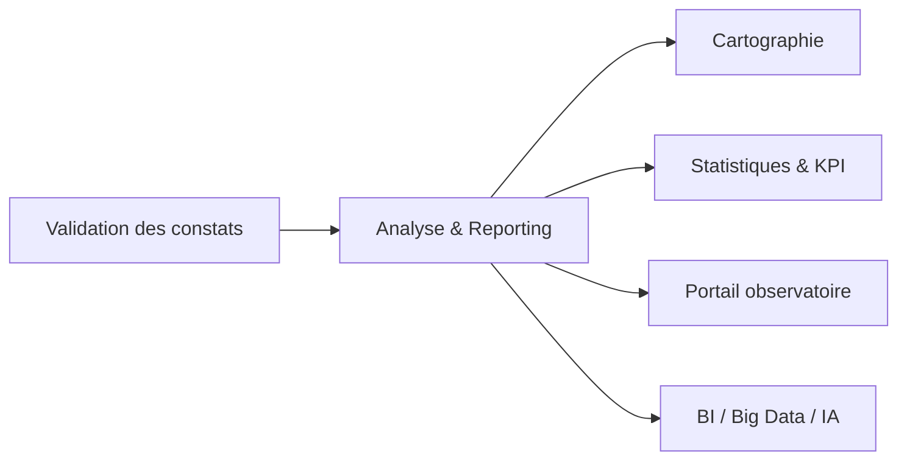
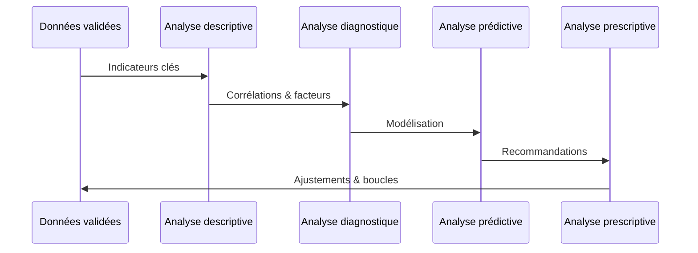

# Analyse & Reporting

Le module Analyse & Reporting est le **cerveau décisionnel** de DOSER. Il transforme les données validées en insights, recommandations et scénarios d’action pour les décideurs, les analystes et les partenaires.

## Rôle dans le cycle DOSER

- **Consolider** les données multi-sources (collecte, hôpitaux, assurances, FLOTAX, GEOROUTE).  
- **Déployer** les quatre niveaux d’analyse (descriptive → prescriptive).  
- **Diffuser** les résultats via dashboards, rapports, API, Open Data.

## Quatre niveaux d’analyse

1. **Descriptive** : volumes, tendances, répartitions spatio-temporelles.  
2. **Diagnostique** : exploration des causes, facteurs aggravants, comportements à risque.  
3. **Prédictive** : anticipation des pics d’accidents, simulations météo/trafic, probabilité par zone.  
4. **Prescriptive** : recommandations ciblées (contrôles, investissements, campagnes), scénarios « what-if ».

## Tableaux de bord & visualisations

- **Dashboard exécutif** : KPIs nationaux, objectifs Décennie ONU, alertes critiques.  
- **Dashboards métiers** : forces de l’ordre, santé, assurances, infrastructures.  
- **Visualisations avancées** : heatmaps, diagrammes de causes, timelines, comparaisons avant/après.

!!! tip "Personnalisation"
    Les dashboards peuvent être filtrés par région, période, type d’usager ou module DITROS pour répondre aux besoins de chaque acteur.

## Rapports automatisés

- **Quotidiens** : incidents majeurs, alertes VAAR, interventions en cours.  
- **Hebdomadaires** : tendances, points noirs, recommandations opérationnelles.  
- **Mensuels / trimestriels** : bilan complet, analyse des facteurs de risque, suivi des plans d’action.  
- **Annuels** : évaluation stratégique, contribution aux engagements internationaux, projections pluriannuelles.

Les rapports sont diffusés en PDF, Excel, CSV, JSON, et peuvent être programmés (scheduling) ou exposés via API.

## Intelligence artificielle & data science

- **Clustering** des zones et profils d’accidents.  
- **Régression** pour les prévisions (fréquence, gravité).  
- **Détection d’anomalies** (outliers, comportements atypiques).  
- **Traitement du langage naturel** sur les rapports texte, médias sociaux (VAAR).  
- **Score d’exposition au risque** par segment de route, flotte, type d’usager.

## Intégrations clés

- **GEOROUTE** (SIG) pour contextualiser les accidents.  
- **FLOTAX** pour analyser les comportements des flottes.  
- **SEVITEV / CERDIDOC** pour relier conformité véhicule ↔ accident.  
- **CKAN** pour publier des données agrégées en open data.  
- **HelpDesk** pour remonter les demandes d’amélioration fonctionnelle.

## Acteurs & usages

- **Observatoire national** : pilotage stratégique, rapports officiels.  
- **Ministères & décideurs** : arbitrage budgétaire, priorisation des politiques publiques.  
- **Analystes** : investigations approfondies, modélisation, simulations.  
- **Bailleurs / partenaires** : suivi des engagements, reporting standardisé.

## Indicateurs de performance

- Taux d’accidents par 100 000 habitants / type d’usager.  
- Évolution de la gravité (blessés, décès) par région.  
- Temps moyen de traitement post-accident.  
- Taux de complétude des dossiers.  
- Impact des mesures (avant/après campagne, intervention infrastructurelle).

## Bonnes pratiques

1. **Mettre à jour** les référentiels (territoires, usagers, véhicules) pour garantir la cohérence des analyses.  
2. **Documenter** les sources et méthodologies pour assurer la reproductibilité.  
3. **Croiser** systématiquement les données internes et partenaires (hôpitaux, assurances).  
4. **Animer** des revues de performance mensuelles pour déclencher des actions concrètes.

---

- [Pilier Intervention post-accident](piliers/post-accident.md)  
- [Cartographie des accidents](cartographie-accidents.md)  
- [Documentation développeur](../developer/index.md)
