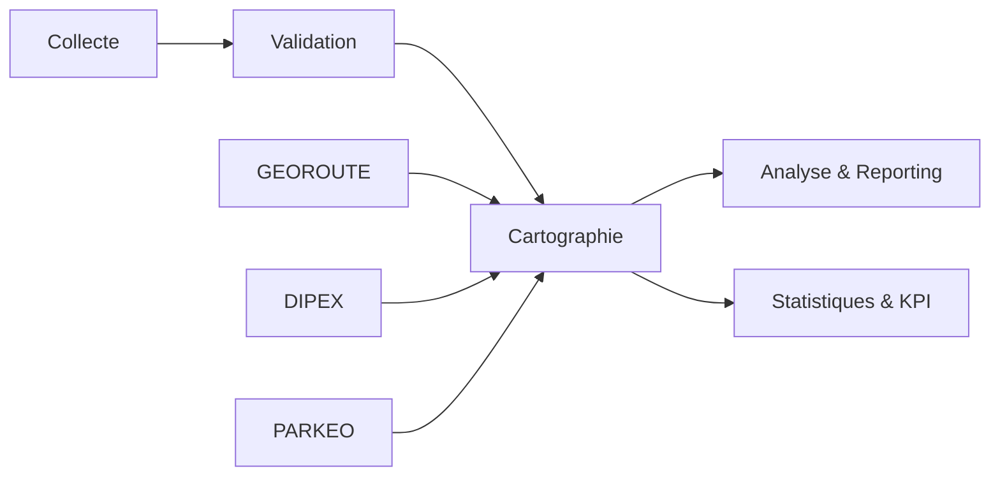
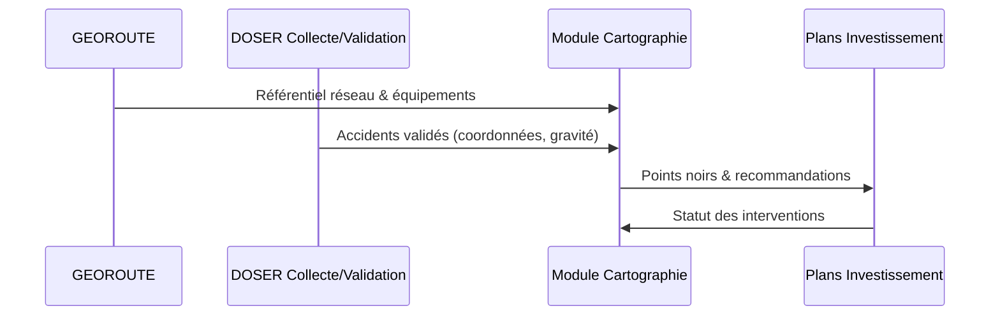

# Cartographie des accidents

Le module de cartographie fournit une **vue géospatiale unifiée** des accidents et des facteurs environnementaux. Il exploite les données structurées de DOSER et les référentiels GEOROUTE/DITROS pour prioriser les interventions sur le réseau routier.

## Position dans l’écosystème

- **Référentiel** : repose sur GEOROUTE (réseau, équipements, chantiers) pour assurer la précision géographique.  
- **Contexte** : intègre DIPEX (trafic, incidents) et PARKEO (stationnement) pour comprendre les conditions locales.  
- **Export** : alimente les dashboards et rapports du module Analyse & Reporting.

## Objectifs

- Localiser précisément chaque accident et visualiser les zones de concentration.  
- Identifier les **points noirs** et comprendre les facteurs infrastructurels.  
- Simuler l’impact des interventions (travaux, nouveaux équipements, contrôles).  
- Partager une cartographie unique entre toutes les parties prenantes.

## Fonctionnalités principales

- **Cartes interactives** : zoom multi-échelles, légendes dynamiques, filtres temporels.  
- **Heatmaps et clusters** : densité par gravité, type d’usager, horaire, conditions météo.  
- **Points noirs automatisés** : détection par algorithmes (fréquence, gravité, tendance), classification par niveaux de risque.  
- **Analyse infrastructurelle** : corrélation accident ↔ état de la route, éclairage, signalisation, travaux récents.  
- **Plans d’intervention** : visualisation des projets programmés, suivi de l’impact après travaux.

## Analyses et filtres

- **Temporalité** : plages horaires, saisons, périodes spéciales (vacances, événements).  
- **Typologie** : collision, piéton, deux-roues, matériel, multi-véhicules.  
- **Gravité** : blessés légers/graves, décès, dégâts matériels.  
- **Contexte** : météo, luminosité, état chaussée, infrastructures disponibles.  
- **Acteurs** : forces de l’ordre, hôpitaux, flottes impliquées.

## Indicateurs suivis

- Nombre et taux d’accidents par tronçon / commune / type de voie.  
- Évolution des points noirs avant/après intervention.  
- Délai moyen d’intervention sur les zones à risque.  
- Taux de couverture des équipements de sécurité (éclairage, signalisation, barrières).  
- Contribution aux KPI Décennie ONU (réduction blessés/décès sur zones ciblées).

## Intégrations clés

- **GEOROUTE** : référence spatiale et attributs infrastructures.  
- **Analyse & Reporting** : exploitation des cartes dans les dashboards et rapports.  
- **Open Data** : publication de couches anonymisées (points noirs, statistiques par zone).  
- **HelpDesk** : remontée des demandes d’ajout/actualisation de couches cartographiques.

## Bonnes pratiques

1. **Mettre à jour** régulièrement les couches GEOROUTE (travaux, nouvelles voies).  
2. **Vérifier** la qualité des coordonnées dès la collecte (GPS, correction manuelle).  
3. **Associer** chaque point noir à une feuille de route d’intervention et suivre l’impact.  
4. **Croiser** les données cartographiques avec les modules DIPEX/PARKEO pour comprendre la congestion et le stationnement.  
5. **Partager** les cartes avec les gestionnaires d’infrastructures pour des décisions concertées.

---

- [Pilier Routes sûres](piliers/routes-sures.md)  
- [Analyse & Reporting](analyse-reporting.md)  
- [Index des modules](index.md)
