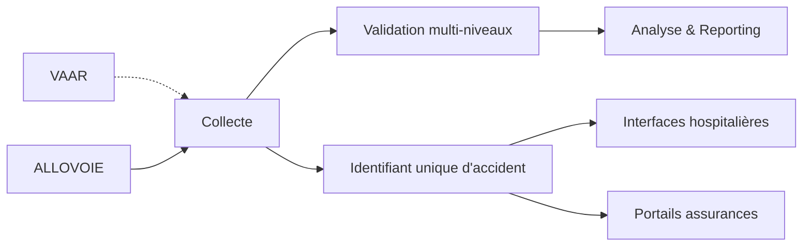

# Module de Collecte de Données - DOSER DATA CAPTURE

## Vue d'ensemble

L'**application mobile DOSER DATA CAPTURE** est un outil essentiel au cœur du système de gestion des données de sécurité routière DOSER. Conçue pour une utilisation sur le terrain, elle permet la collecte, la validation et la synchronisation des données d'accidents, même dans des environnements sans connexion Internet stable. Cette application regroupe des fonctionnalités de collecte pour les forces de l'ordre (Police/Gendarmerie) et pour le personnel médical (Hôpitaux/Morgues), en s'adaptant à leurs besoins spécifiques.

## 🎯 Objectifs

- **Standardiser** la collecte de données d'accidents sur le terrain
- **Faciliter** la saisie multimédia en temps réel par tous les acteurs
- **Assurer** la qualité et la cohérence des données avec validation intégrée
- **Permettre** le travail hors-ligne avec synchronisation intelligente
- **Adapter** l'interface aux besoins spécifiques de chaque type d'utilisateur

## 🧭 Position dans l’écosystème DOSER

- **Point d’entrée** du pilier post-accident : chaque constat génère un identifiant unique partagé avec les hôpitaux, assureurs et centres d’analyse.
- **Alimentation** des alertes VAAR/ALLOVOIE : les signaux détectés basculent automatiquement dans un flux de collecte structuré.
- **Base analytique** : la qualité de la saisie conditionne la pertinence des validations, rapports et cartes produits ensuite.

!!! info "Capitaliser sur la donnée dès le terrain"
    Une collecte complète réduit les retours correctifs, accélère la validation et fiabilise les indicateurs de performance.

## 📱 Application Mobile DOSER DATA CAPTURE

### Résumé des Fonctionnalités Clés

#### 1. Connexion et Sécurité

##### Accès Rapide et Sécurisé
- **Connexion rapide par QR Code** : Les utilisateurs peuvent se connecter en scannant un code QR, qui renseigne instantanément l'adresse du serveur. Les informations de connexion précédentes sont mémorisées pour plus de commodité.
- **Verrouillage PIN** : L'application peut être verrouillée par un code PIN à 4 chiffres après la connexion, protégeant ainsi les données sensibles entre les sessions.
- **Prise en charge multi-comptes** : Un même appareil peut gérer et permettre de basculer entre plusieurs comptes utilisateur DOSER.
- **Authentification biométrique** (empreinte, reconnaissance faciale) pour une sécurité renforcée
- **Chiffrement** des données sensibles au repos et en transit

##### Sécurité et Accès Basé sur les Rôles
- **Respect des autorisations** : L'application garantit le respect des autorisations des utilisateurs et des rôles définis
- **Stockage local sécurisé** : Protection des informations sensibles sur l'appareil
- **Audit trail complet** : Traçabilité de toutes les actions effectuées
- **Expiration automatique** des sessions pour éviter les accès non autorisés

#### 2. Interface et Personnalisation

##### Configuration Adaptative
- **Configuration personnalisable** : L'apparence des programmes (icônes et couleurs) est configurable depuis le serveur, ce qui permet d'adapter l'interface aux besoins spécifiques des différents acteurs.
- **Saisie visuelle des données** : L'utilisation d'icônes et de couleurs pour les options de saisie rend le processus plus intuitif, ce qui est particulièrement utile pour les utilisateurs sur le terrain.
- **Prise en charge linguistique** : L'application offre une traduction complète de l'interface et des métadonnées, permettant une utilisation multilingue.
- **Thèmes adaptés** : Interfaces spécifiques pour chaque type d'acteur (Forces de l'ordre, Personnel médical, Assurances)

#### 3. Navigation et Fluidité

##### Expérience Utilisateur Optimisée
- **Écran d'accueil unifié** : Tous les programmes et formulaires de saisie de données d'accidents sont intégrés dans un seul écran d'accueil, affiché avec leurs icônes et couleurs respectives pour une navigation simplifiée.
- **Actions contextuelles** : Les boutons et actions disponibles s'adaptent automatiquement en fonction du formulaire de collecte en cours.
- **Indicateurs d'exhaustivité** : Des indicateurs en temps réel guident les utilisateurs pour s'assurer que toutes les sections d'un formulaire sont complètes.
- **Workflows intuitifs** : Processus de saisie guidé étape par étape pour éviter les erreurs

## 🔄 Le "Mode Hors Ligne d'abord" et la Synchronisation Intelligente

L'un des **principes fondamentaux** de l'application est sa capacité à fonctionner de manière fiable hors ligne.

### Stockage et Fonctionnement Hors Ligne
- **Stockage local fiable** : Toutes les données nécessaires (formulaires, informations des personnes et véhicules impliqués, etc.) sont stockées localement sur l'appareil. Cela permet aux utilisateurs de travailler sans interruption, même sans connexion Internet.
- **Architecture "Offline-First"** : La saisie, la validation et la gestion des données sont possibles sans connexion. Les utilisateurs peuvent travailler en mode déconnecté et synchroniser les informations dès qu'un réseau est disponible.
- **Indicateur de statut** : Affichage en temps réel de l'état de la connexion et du mode de fonctionnement

### Synchronisation Configurable et Intelligente
- **Synchronisation configurable** : Les administrateurs peuvent définir la quantité de données à synchroniser depuis le serveur. Les données sont mises en cache localement pour une recherche rapide.
- **Détection automatique** : L'application détecte automatiquement la disponibilité du réseau et déclenche la synchronisation
- **Synchronisation progressive** : Upload prioritaire des données critiques (informations de base) avant les médias volumineux
- **Gestion des erreurs** : L'application affiche clairement le statut de la synchronisation (terminée, en échec ou en attente) et permet aux utilisateurs de relancer la synchronisation si nécessaire.
- **Gestion des conflits** : Résolution intelligente des conflits de données lors de la synchronisation
- **Historique** : Traçabilité complète de toutes les synchronisations effectuées

## 🔍 Suivi et Processus de Collecte

L'application simplifie le suivi des cas et des événements grâce à des fonctionnalités avancées :

### Tableau de Bord et Suivi
- **Tableau de bord de suivi** : Les utilisateurs disposent d'un tableau de bord pour suivre les relations entre les différents éléments de l'accident (personnes, véhicules), même en mode hors ligne.
- **Vue d'ensemble** : Visualisation rapide de l'état de complétude de chaque section du formulaire
- **Alertes contextuelles** : Notifications pour les champs obligatoires manquants ou les incohérences détectées

### Détection de Doublons
- **Recherche automatique de doublons** : Lors de la saisie d'informations sur de nouvelles personnes ou de nouveaux véhicules, l'application vérifie automatiquement les doublons dans les données stockées localement (en mode hors ligne) ou sur le serveur (en mode en ligne).
- **Vérification intelligente** : Algorithmes de correspondance floue pour identifier les entrées similaires
- **Fusion des données** : Possibilité de fusionner les doublons détectés tout en préservant l'intégrité des données

### Architecture Évolutive
- **Évolutive et Modulaire** : L'application peut être adaptée à différents programmes et déploiements à l'échelle nationale, avec une interface personnalisable en fonction des besoins de chaque acteur.
- **Extensibilité** : Ajout facile de nouveaux formulaires et types de données sans modification du code de base
- **Interopérabilité** : Standards ouverts pour l'échange de données avec d'autres systèmes

#### Collecte Multimédia
- **Photos** de la scène d'accident sous tous les angles avec compression automatique
- **Croquis** interactifs créés directement dans l'application
- **Géolocalisation** précise (GPS, GLONASS, Galileo) avec vérification de cohérence
- **Enregistrements audio** des témoignages avec horodatage

#### Interfaces Adaptées aux Rôles
- **Forces de l'Ordre** : Constatations et procédures judiciaires
- **Personnel de Santé** : Données médicales et état des victimes
- **Agents d'Assurance** : Évaluation des dommages
- **Services de Secours** : Coordination des interventions

## 📋 Formulaires de Collecte

### Informations Générales
- **Date et heure** de l'accident
- **Lieu précis** (adresse + coordonnées GPS)
- **Conditions météorologiques**
- **État de la chaussée**
- **Type d'accident** (collision, sortie de route, etc.)

### Véhicules Impliqués
- **Immatriculation** (saisie manuelle ou scan)
- **Type de véhicule** (voiture, moto, camion, etc.)
- **Marque et modèle**
- **Couleur et caractéristiques**
- **Degré d'endommagement**
- **Informations d'assurance**

### Personnes Concernées
- **Rôle** (conducteur, passager, piéton, témoin)
- **État** (indemne, blessé léger, blessé grave, décédé)
- **Informations personnelles** (nom, téléphone, adresse)
- **Informations médicales** (type de blessures, orientation)

### Documentation Visuelle
- **Photos de la scène** (vue d'ensemble, détails)
- **Photos des véhicules** (dégâts, position)
- **Photos des victimes** (si autorisé)
- **Croquis de l'accident** (position des véhicules, sens de circulation)
- **Documents officiels** (permis, carte grise, assurance)

## 🔧 Fonctionnalités Techniques

### Géolocalisation Avancée
- **Précision** < 5 mètres
- **Modes de localisation** : GPS, réseau, WiFi
- **Vérification** de la cohérence géographique
- **Adresse automatique** générée depuis les coordonnées

### Synchronisation Intelligente
- **Détection automatique** de la connectivité
- **Synchronisation progressive** des données
- **Gestion des conflits** de données
- **Historique** des synchronisations

### Gestion des Médias
- **Compression automatique** des images
- **Optimisation** de la qualité/taille
- **Stockage temporaire** local
- **Upload prioritaire** des données critiques

## 👥 Cas d'Utilisation par Acteur

### 🚔 Pour la Police/Gendarmerie

L'application mobile DOSER DATA CAPTURE transforme la manière dont les forces de l'ordre gèrent les accidents sur le terrain.

#### Workflow Opérationnel
1. **Arrivée sur les lieux** et sécurisation de la zone
2. **Saisie en temps réel** des données sur smartphone/tablette
3. **Géolocalisation automatique** des coordonnées précises
4. **Documentation photographique** : scène, véhicules, dommages
5. **Collecte complète** : caractéristiques accident, véhicules, personnes
6. **Recueil** des témoignages avec enregistrements audio
7. **Validation hors ligne** : contrôles de cohérence en temps réel
8. **Finalisation** et synchronisation dès que le réseau est disponible

#### Fonctionnalités Spécifiques
- **Saisie immédiate** sur les lieux sans attendre le retour au bureau
- **GPS intégré** pour analyse des points noirs
- **Caméra** pour preuves numériques (photos/vidéos)
- **Croquis interactifs** de la scène d'accident
- **Identification** des conducteurs, passagers, témoins
- **Validation automatique** des données critiques

### 🏥 Pour les Hôpitaux et les Morgues

Pour le personnel médical, l'application web ou mobile de DOSER permet de rationaliser l'accueil et l'enregistrement des victimes.

#### Workflow Opérationnel
1. **Accueil et triage** des victimes arrivant aux urgences
2. **Enregistrement** des paramètres médicaux vitaux
3. **Documentation** des blessures et traumatismes
4. **Saisie** des soins prodigués et traitements administrés
5. **Liaison** avec l'identifiant unique de l'accident
6. **Coordination** avec les autres acteurs (police, assurances)
7. **Suivi** de l'évolution de l'état des victimes
8. **Production** de rapports et certificats médicaux

#### Fonctionnalités Spécifiques
- **Enregistrement** des informations cruciales sur les victimes
- **Centralisation** des dossiers par identifiant unique d'accident
- **Suivi post-accident** de l'état de chaque victime
- **Liaison** des fiches médicales entre différents hôpitaux
- **Information** automatique des assurances
- **Gestion des cas mortels** : identification, préparation, certificats de décès
- **Respect du secret médical** avec accès sécurisé

### Agents d'Assurance
1. **Évaluation** des dommages matériels et corporels
2. **Vérification** des polices d'assurance
3. **Documentation** photographique des dégâts
4. **Estimation** des coûts de réparation
5. **Transmission** aux compagnies d'assurance

## 📊 Qualité des Données

### Contrôles Automatiques
- **Validation** des formats (immatriculations, téléphones)
- **Cohérence** des dates et heures
- **Complétude** des champs obligatoires
- **Géolocalisation** dans les limites du territoire

### Contrôles Manuels
- **Vérification** de la cohérence des informations
- **Validation** de la qualité des photos
- **Contrôle** de la précision des croquis
- **Vérification** des témoignages

## 🔒 Sécurité et Confidentialité

### Protection des Données
- **Chiffrement** AES-256 des données sensibles
- **Authentification** forte des utilisateurs
- **Audit trail** complet des actions
- **Conformité** RGPD et réglementations locales

### Gestion des Accès
- **Rôles** et permissions granulaires
- **Expiration** automatique des sessions
- **Révocation** des accès en cas de problème
- **Monitoring** des accès suspects

## 📈 Métriques et Performance

### Indicateurs de Qualité
- **Taux de complétude** des formulaires
- **Qualité** des photos et croquis
- **Précision** de la géolocalisation
- **Temps** de saisie moyen

### Indicateurs d'Usage
- **Nombre** de constats saisis
- **Taux** d'utilisation hors-ligne
- **Fréquence** de synchronisation
- **Satisfaction** des utilisateurs

## 🚀 Évolutions Futures

### Améliorations Prévues
- **Reconnaissance vocale** pour la saisie mains-libres
- **IA** pour l'optimisation des formulaires et suggestions contextuelles
- **Réalité augmentée** pour les croquis 3D de la scène
- **Intégration** avec les capteurs IoT des véhicules connectés

### Nouvelles Fonctionnalités
- **Mode collaboratif** multi-utilisateurs en temps réel
- **Templates** personnalisables par région ou type d'accident
- **Workflows** adaptatifs selon le contexte
- **Analytics** en temps réel et tableaux de bord interactifs

## 📝 Synthèse et Bénéfices

### Principaux Avantages de DOSER DATA CAPTURE

En intégrant ces fonctionnalités, l'application DOSER DATA CAPTURE assure une **collecte de données plus rapide, plus fiable et plus complète**, permettant aux autorités de disposer d'informations précises et actualisées pour mieux comprendre et prévenir les accidents de la route.

#### Pour les Forces de l'Ordre
✅ Remplacement des fiches papier par un processus numérique
✅ Saisie en temps réel sur le terrain
✅ Géolocalisation précise pour analyse des points noirs
✅ Documentation photographique et preuves numériques
✅ Validation automatique des données

#### Pour le Personnel Médical
✅ Rationalisation de l'accueil et de l'enregistrement des victimes
✅ Centralisation des dossiers par identifiant unique
✅ Suivi post-accident et coordination inter-hôpitaux
✅ Gestion complète des cas mortels (morgues)
✅ Partage sécurisé avec les autres acteurs

#### Pour Tous les Utilisateurs
✅ **Mode hors-ligne fiable** : Travail sans interruption même sans connexion
✅ **Synchronisation intelligente** : Upload automatique dès que le réseau est disponible
✅ **Interface personnalisée** : Adaptée aux besoins de chaque acteur
✅ **Multi-comptes** : Gestion de plusieurs utilisateurs sur un même appareil
✅ **Sécurité renforcée** : Verrouillage PIN, chiffrement, audit trail
✅ **Détection de doublons** : Évite les saisies redondantes
✅ **Architecture évolutive** : Déploiement à l'échelle nationale

---

*Pour la mise en œuvre, voir le [guide d’installation](../implementation/installation.md). Pour la vision globale, parcourez le [pilier Intervention post-accident](piliers/post-accident.md) et l’[index des modules](index.md).*
