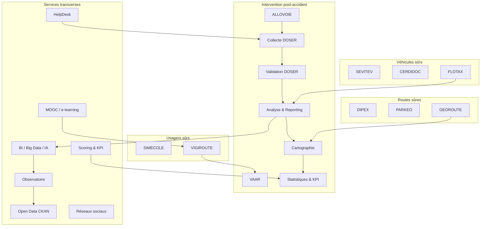
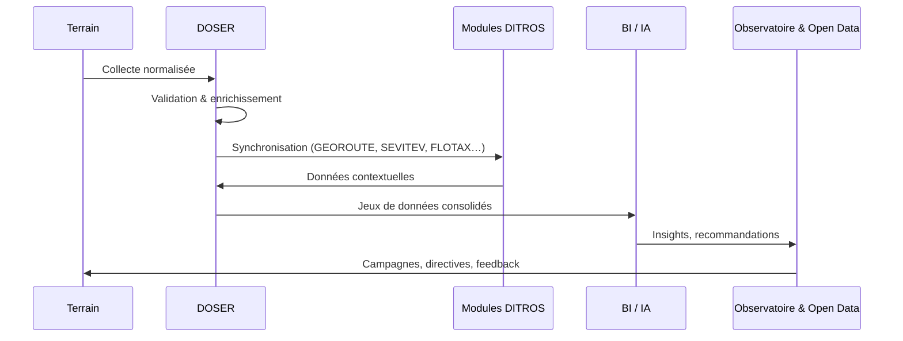

# Modules & Écosystème DOSER – DITROS

DOSER s’inscrit au cœur d’un écosystème élargi, DITROS (Digital Technologies for Road Safety), qui couvre l’ensemble des piliers du « Safe System ». Cette section présente les modules fonctionnels, leurs interactions et les services transverses qui transforment la donnée en action.

## Carte d’ensemble

## Tableau de synthèse

| Module | Pilier | Objectif | Acteurs clés | Données principales | Intégration DOSER |
| --- | --- | --- | --- | --- | --- |
| DIPEX | Routes sûres | Gestion des péages & exploitation routière | Gestionnaires d’infrastructures | Trafic, incidents, flux financiers | Priorisation des investissements, analyse congestion |
| PARKEO | Routes sûres | Gestion intelligente du stationnement | Collectivités, opérateurs urbains | Occupation, infractions, paiement | Corrélation congestion / accidentologie |
| GEOROUTE | Routes sûres | Référentiel SIG des infrastructures | Ministères, urbanistes | Réseau routier, chantiers, équipements | Cartographie des points noirs, analyses spatiales |
| SEVITEV | Véhicules sûrs | Sécurisation contrôle technique | Centres agréés, autorités | Résultats visites, défauts | Détection défaillances véhicules impliqués |
| CERDIDOC | Véhicules sûrs | Sécurisation titres & documents | Ministères, forces de l’ordre | Permis, cartes grises, licences | Vérification statutaire lors des constats |
| FLOTAX | Véhicules sûrs | Suivi & géolocalisation des flottes | Transporteurs, agences de voyage | Trajets, vitesse, incidents | Analyse comportements chauffeurs |
| SIMECOLE | Usagers sûrs | Formation & simulateurs | Auto-écoles, citoyens | Parcours pédagogiques, évaluations | Ajustement campagnes pédagogiques |
| VIGIROUTE | Usagers sûrs | Contrôle & prévention routière | Forces de l’ordre, ministères | Infractions, contrôles, historiques | Corrélation comportements / accidents |
| ALLOVOIE | Post-accident | Coordination urgence | Secours, SAMU | Alertes, délais, ressources | Synchronisation interventions ↔ constats |
| Collecte DOSER | Post-accident | Saisie structurée des constats | Forces de l’ordre, hôpitaux | Scènes, victimes, véhicules | Point d’entrée de la donnée |
| Validation DOSER | Post-accident | Contrôle qualité & enrichissement | Agents validation, observatoire | Règles métier, compléments | Garantie fiabilité, scoring |
| Analyse & Reporting | Post-accident | Tableaux de bord & IA | Analystes, décideurs | Indicateurs agrégés, tendances | 4 niveaux d’analyse |
| Cartographie | Post-accident | Visualisation SIG | Planificateurs, MINTP | Localisation, points noirs | Priorisation infrastructure |
| VAAR | Post-accident | Vigilance & alertes IA | Centre d’analyse, secours | Flux réseaux sociaux, médias | Alerte anticipée, enrichissement |
| Statistiques & KPI | Post-accident | Suivi performance | Observatoire, bailleurs | KPI ONU, scores, tendances | Reporting, redevabilité |

### Services transverses

- **BI / Big Data / IA** : moteur analytique (descriptif → prescriptif).  
- **Observatoire** : portail décisionnel, dashboards, rapport nationaux.  
- **Open Data CKAN** : diffusion des données ouvertes et API publiques.  
- **HelpDesk** : support 24/7, base de connaissances, suivi tickets.  
- **MOOC / e-learning** : formation continue, certifications, communauté.  
- **Réseaux sociaux** : campagnes de sensibilisation, veille accidents.  
- **Scoring & KPI** : indicateurs par acteur, suivi Décennie ONU.

## Parcours recommandés

- **Décideurs** : commencez par [Piliers & Modules](piliers/routes-sures.md) pour comprendre la couverture complète, puis consultez la section [Vision](../vision/index.md).  
- **Opérationnels** : consultez les fiches détaillées de la section [Intervention post-accident](piliers/post-accident.md) et les [Guides par rôle](../user/index.md).  
- **Analystes & techniciens** : explorez [Analyse et Reporting](analyse-reporting.md), [Cartographie](cartographie-accidents.md) et [Services transverses](services-transverses.md).

## Intégration continue

## Aller plus loin

- **Routes sûres** : [Découvrir les modules d’infrastructure](piliers/routes-sures.md)  
- **Véhicules sûrs** : [Explorer les solutions de conformité](piliers/vehicules-surs.md)  
- **Usagers sûrs** : [Renforcer formation & prévention](piliers/usagers-surs.md)  
- **Intervention post-accident** : [Plongez dans le cœur de DOSER](piliers/post-accident.md)  
- **Services transverses** : [Comprendre les leviers de support](services-transverses.md)

!!! note "Besoin d’une vue opérationnelle immédiate ?"
    Les pages historiques (collecte, validation, analyse, cartographie, VAAR, statistiques) restent accessibles et sont consolidées dans le pilier **Intervention post-accident**.

- [Guides utilisateur](../user/index.md)  
- [Documentation développeur](../developer/index.md)  
- [Guides d’implémentation](../implementation/index.md)

