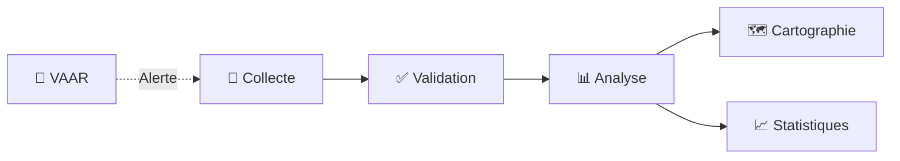
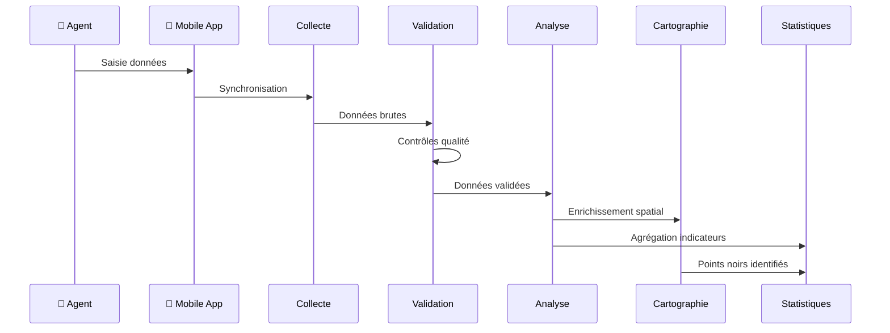

# Modules Fonctionnels DOSER

Bienvenue dans la documentation des modules fonctionnels de la plateforme DOSER. Chaque module est conçu pour répondre à un besoin spécifique dans la gestion des accidents de la route.

## 📋 Vue d'ensemble

DOSER est composé de **6 modules principaux** qui couvrent l'ensemble du cycle de gestion des accidents :

## 📱 [Collecte de Données](collecte-donnees.md)

**Application Mobile DOSER DATA CAPTURE**

Module de collecte de données sur le terrain via application mobile.

**Fonctionnalités clés** :
- ✅ Mode hors ligne complet
- ✅ Synchronisation intelligente
- ✅ Capture multimédia (photos, vidéos, audio)
- ✅ Géolocalisation automatique
- ✅ Interfaces adaptées par acteur
- ✅ Validation en temps réel

**Utilisateurs** : Agents Constatateurs, Services de Santé

---

## ✅ [Validation des Constats](validation-constats.md)

**Portail Web de Validation**

Module de validation multi-niveaux des données collectées.

**Fonctionnalités clés** :
- ✅ Workflow de validation configurable
- ✅ Contrôle qualité automatique
- ✅ Détection des incohérences
- ✅ Enrichissement des données
- ✅ Traçabilité complète
- ✅ Tableau de bord de validation

**Utilisateurs** : Agents de Validation, Superviseurs

---

## 📊 [Analyse et Reporting](analyse-reporting.md)

**Module Business Intelligence**

Analyse avancée et génération de rapports automatisés.

**Fonctionnalités clés** :
- ✅ Tableaux de bord dynamiques
- ✅ 4 niveaux d'analyse (descriptive, diagnostique, prédictive, prescriptive)
- ✅ Rapports automatisés
- ✅ Export multi-formats
- ✅ Analyse prédictive par IA
- ✅ Identification des facteurs de risque

**Utilisateurs** : Analystes, Décideurs, Ministères

---

## 🗺️ [Cartographie des Accidents](cartographie-accidents.md)

**Module SIG (Système d'Information Géographique)**

Visualisation géographique et analyse spatiale des accidents.

**Fonctionnalités clés** :
- ✅ Cartes interactives
- ✅ Identification des points noirs
- ✅ Heatmaps de concentration
- ✅ Analyse de clustering
- ✅ Corrélation infrastructure/accidents
- ✅ Visualisations 3D

**Utilisateurs** : Planificateurs, Analystes, MINTP

---

## 🚨 [Module VAAR](module-vaar.md)

**Vigilance et Alerte sur les Accidents de la Route**

Module d'intelligence artificielle pour la détection proactive d'accidents.

**Fonctionnalités clés** :
- ✅ Surveillance réseaux sociaux (Facebook, X, TikTok, WhatsApp)
- ✅ Analyse IA (NLP + Computer Vision)
- ✅ Génération d'alertes en temps réel
- ✅ Enrichissement automatique des données
- ✅ Validation manuelle des alertes
- ✅ Conversion en déclaration d'accident

**Utilisateurs** : Centre d'Analyse, Services d'Urgence

---

## 📈 [Statistiques et Métriques](statistiques-metriques.md)

**Tableaux de Bord et Indicateurs**

Module de suivi des indicateurs clés de performance.

**Fonctionnalités clés** :
- ✅ KPIs en temps réel
- ✅ Évolution temporelle
- ✅ Comparaisons géographiques
- ✅ Métriques par acteur
- ✅ Indicateurs de qualité des données
- ✅ Objectifs Décennie ONU 2021-2030

**Utilisateurs** : Tous les acteurs, Observatoire

---

## 🔄 Intégration des Modules

### Flux de Données

### Workflow Complet

1. **Collecte** : Données saisies sur le terrain
2. **Validation** : Contrôle et enrichissement
3. **Analyse** : Transformation en insights
4. **Cartographie** : Visualisation spatiale
5. **Statistiques** : Suivi des indicateurs
6. **VAAR** : Détection proactive (parallèle)

## 🎯 Par Type d'Utilisateur

### Pour les Agents de Terrain
- [Collecte de Données](collecte-donnees.md)
- Application mobile hors ligne

### Pour les Validateurs
- [Validation des Constats](validation-constats.md)
- Portail web de validation

### Pour les Analystes
- [Analyse et Reporting](analyse-reporting.md)
- [Cartographie](cartographie-accidents.md)
- [Statistiques](statistiques-metriques.md)

### Pour le Centre d'Analyse
- [Module VAAR](module-vaar.md)
- Tous les modules d'analyse

## 📚 Documentation Complémentaire

- **Guides Utilisateur** : [Documentation par rôle](../user/index.md)
- **Guides Technique** : [Documentation développeur](../developer/index.md)
- **Guides Implémentation** : [Déploiement](../implementation/index.md)

---

**Besoin d'aide ?** Consultez les [Guides Utilisateur](../user/index.md) ou contactez le support : support@ditros.org

