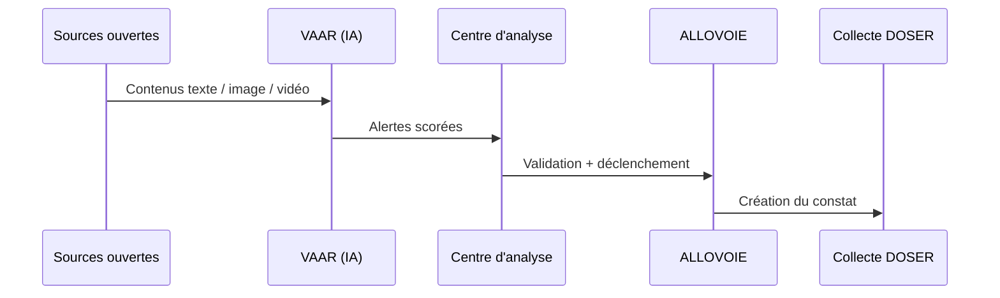
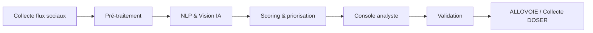

# Module VAAR – Vigilance et Alerte sur les Accidents de la Route

VAAR est le **système de détection proactive** de DOSER. Il capte les signaux faibles (réseaux sociaux, médias, sources ouvertes), les enrichit via l’intelligence artificielle, puis alimente la chaîne post-accident pour accélérer les interventions.

## Position dans le cycle

- **Amont** : surveille les réseaux sociaux (Facebook, X, TikTok, WhatsApp publics), médias, forums, flux RSS.  
- **Pivot** : produit un paquet d’alerte structuré (localisation, gravité, sources, score de confiance).  
- **Aval** : après validation humaine, l’alerte devient un constat dans DOSER et enclenche ALLOVOIE / collecte terrain.

## Pipeline IA

1. **Collecte** : ingestion continue des contenus textuels, images, vidéos et métadonnées.  
2. **Pré-traitement** : suppression des doublons, nettoyage, normalisation linguistique (français, anglais, langues locales).  
3. **Analyse IA** :  
   - *NLP* (modèles Transformers) pour extraire lieux, dates, véhicules, gravité, victimes.  
   - *Vision* (YOLOv5/OpenCV) pour reconnaître véhicules accidentés, estimer dégâts, lire panneaux.  
   - *Fusion* : agrégation des signaux pour produire un score de confiance.  
4. **Scoring & priorisation** : seuils configurables, classement des alertes par criticité et fraîcheur.  
5. **Validation humaine** : analyste vérifie la véracité (via dashboards), complète si besoin, escalade vers ALLOVOIE.  
6. **Intégration DOSER** : génération d’un dossier pré-rempli (localisation, heures, médias) pour accélérer la collecte.

## Fonctionnalités clés

- **Surveillance multimodale** : texte, image, vidéo, métadonnées GPS.  
- **Détection multilingue** : français, anglais, langues locales via modèles mixtes.  
- **Tableau de bord analyste** : alertes en file d’attente, filtres par région, gravité, source.  
- **Enrichissement automatique** : génération de résumés, ajout de cartes, regroupement des sources concordantes.  
- **Intégration directe** : envoi vers ALLOVOIE, pré-remplissage du module Collecte, notifications aux forces de l’ordre.  
- **Historique** : archivage des alertes, rapports de performance des modèles.

## Paramétrage & administration

- **Sources surveillées** : configuration granulaires (hashtags, pages officielles, flux RSS, comptes certifiés).  
- **Seuils de confiance** : ajustables par type d’événement (multi-collisions, incendies, victimes multiples).  
- **Zones d’intérêt** : priorisation de certains corridors, agglomérations, axes sensibles.  
- **Escalade** : règles d’escalade automatique vers ALLOVOIE ou vers un superviseur régional.  
- **Audit** : journalisation complète des traitements IA et des validations humaines.

## Indicateurs de performance

- Temps moyen de détection (source → alerte) < 5 minutes.  
- Précision globale > 85 %, rappel > 80 %, faux positifs < 15 %.  
- Nombre d’alertes validées vs rejetées (mesure de confiance).  
- Impact sur le délai d’intervention (avant/après VAAR).  
- Corrélation entre alertes VAAR et constats confirmés.

## Cas d’usage

- **Services d’urgence** : intervention anticipée grâce aux alertes priorisées.  
- **Forces de l’ordre** : mobilisation de patrouilles avec localisation précise.  
- **Observatoire** : suivi des tendances d’accidents déclarés par la population.  

!!! warning "Validation humaine indispensable"
    Les analystes du centre d’analyse restent responsables de la validation finale pour éviter les faux positifs et contextualiser chaque alerte.

## Technologies

- **IA** : Transformers multilingues (NLP), YOLOv5/OpenCV (vision), scoring probabiliste.  
- **Infrastructure** : pipelines temps réel, bases vectorielles pour la recherche sémantique, conteneurs orchestrés.  
- **Sécurité** : anonymisation, chiffrement, conformité RGPD, audit trail complet.

## Évolutions prévues

- Intégration de capteurs IoT / caméras urbaines.  
- Modèles prédictifs pour anticiper les zones d’accident récurrentes.  
- API partenaires pour permettre aux médias ou plateformes tierces d’envoyer directement des signalements.  
- Couplage avec les campagnes de prévention (réseaux sociaux DOSER) pour répondre aux tendances émergentes.

---

- [Collecte de données](collecte-donnees.md)  
- [Intervention post-accident](piliers/post-accident.md)  
- [Documentation développeur](../developer/index.md)
