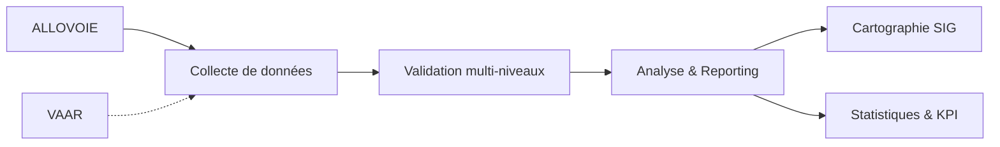
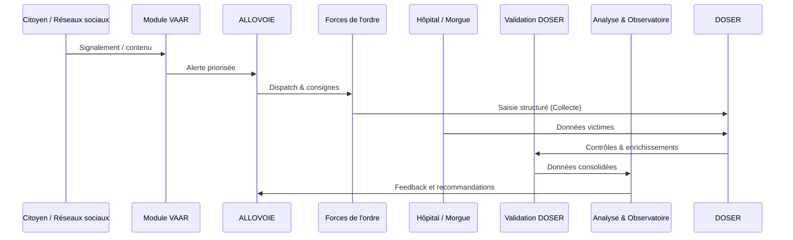

# Intervention post-accident

Le pilier « Intervention post-accident » regroupe le cœur fonctionnel de DOSER : collecte structurée, validation multi-niveaux, analyse approfondie, cartographie, statistiques et vigilance proactive. Il s’articule avec le module ALLOVOIE pour coordonner les secours.

## ALLOVOIE — Centre d’urgence intégré

- **Objectif** : traiter les alertes, coordonner les interventions des services de secours et accélérer la prise en charge des victimes.  
- **Fonctionnalités** : centralisation des appels, dispatch des équipes, suivi des délais, journalisation des actions.  
- **Lien avec DOSER** : chaque intervention validée devient un enregistrement d’accident enrichi.

## Modules DOSER

- **[Collecte de données](../collecte-donnees.md)**  
  Application mobile et portails web, mode hors ligne, géolocalisation, captures multimédia, QR code, PIN, formulaires adaptés par acteur.

- **[Validation des constats](../validation-constats.md)**  
  Workflow configurable, contrôles automatiques, scoring qualité, enrichissement par les analystes, traçabilité complète.

- **[Analyse & Reporting](../analyse-reporting.md)**  
  Tableaux de bord dynamiques, 4 niveaux d’analyse (descriptive → prescriptive), exports multi-formats, alertes IA.

- **[Cartographie des accidents](../cartographie-accidents.md)**  
  SIG intégré (PostGIS + GEOROUTE), points noirs, heatmaps, corrélations infrastructurelles, scénarios d’investissement.

- **[Module VAAR](../module-vaar.md)**  
  Vigilance automatisée (NLP, vision par ordinateur), surveillance réseaux sociaux, validation humaine, conversion en constats.

- **[Statistiques & métriques](../statistiques-metriques.md)**  
  KPIs ONU 2021-2030, suivi par acteur, scoring, tableaux comparatifs, rapports standardisés.

## Flux d’intervention

## Cas d’usage

- **Réduction des délais** : mesurer le temps d’intervention des secours et optimiser les déploiements.  
- **Analyse complète des accidents** : visualiser la chaîne de traitement d’un accident (scène → soins → indemnisation).  
- **Pilotage opérationnel** : fournir aux autorités des tableaux de bord quotidiens/hebdomadaires pour suivre les incidents majeurs.  
- **Réponse proactive** : déclencher des campagnes ciblées lorsque VAAR détecte des signaux faibles.

## Acteurs clés

- Forces de l’ordre (police, gendarmerie).  
- Services de secours et santé (SAMU, hôpitaux, morgues).  
- Compagnies d’assurance.  
- Centre d’analyse / Observatoire national.

## Indicateurs à surveiller

- Temps moyen d’intervention du premier secours.  
- Taux de complétude des constats.  
- Score qualité des enregistrements.  
- Evolution des points noirs et facteurs de risque.  
- Respect des objectifs Décennie ONU.

!!! warning "Qualité de la donnée = succès du pilier"
    Sensibilisez les équipes de terrain, assurez les formations régulières et exploitez les retours du HelpDesk pour maintenir une saisie exemplaire.

- [Retour aux modules](../index.md)

