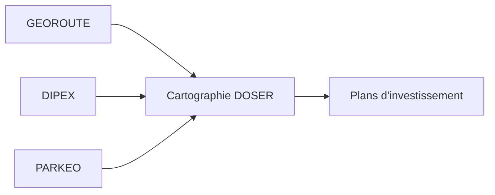

# Routes sûres

Les modules « Routes sûres » de l’écosystème DITROS offrent une visibilité complète sur l’infrastructure routière, l’exploitation et la mobilité urbaine. Ils alimentent directement DOSER pour prioriser les investissements et relier les accidents aux facteurs infrastructurels.

## Modules

### DIPEX — Gestion des péages et de l’exploitation routière

- **Objectif** : superviser les opérations de péage, les incidents et la maintenance sur le réseau.  
- **Fonctionnalités** : suivi du trafic, détection d’incidents, alertes opérationnelles, reporting financier.  
- **Intégration DOSER** : corrélation entre congestion, incidents de péage et accidentologie pour cibler les interventions.

### PARKEO — Stationnement intelligent

- **Objectif** : fluidifier la gestion du stationnement urbain et réduire la congestion.  
- **Fonctionnalités** : suivi de l’occupation, contrôle des infractions, paiement digital, pilotage de zones.  
- **Intégration DOSER** : analyse du lien entre densité de stationnement, congestion et accidents urbains.

### GEOROUTE — Système d’information géographique des infrastructures

- **Objectif** : offrir un référentiel cartographique à jour du réseau routier.  
- **Fonctionnalités** : cartographie des tronçons, inventaire des équipements (signalisation, éclairage), suivi des travaux.  
- **Intégration DOSER** : localisation fine des accidents, identification des points noirs, analyses de corrélation infrastructure/risques.

## Cas d’usage

- **Planification** : prioriser la réhabilitation des tronçons accidentogènes.  
- **Mobilité urbaine** : ajuster les politiques de stationnement pour réduire les collisions.  
- **Maintenance** : croiser incidents répétés avec état de l’infrastructure pour planifier des interventions.

## Acteurs clés

- Ministère des Transports / Travaux publics.  
- Collectivités territoriales et agences urbaines.  
- Concessionnaires et exploitants autoroutiers.  
- Observatoire national de la sécurité routière.

## Indicateurs à surveiller

- Taux d’accidents par type d’infrastructure.  
- Corrélation congestion ↔ accidentologie.  
- Temps moyen de résolution d’incident.  
- Couverture des équipements de sécurité (éclairage, signalisation).

!!! tip "Bonnes pratiques"
    1. Maintenir le référentiel GEOROUTE synchronisé avec les travaux.  
    2. Mettre en place des revues trimestrielles DIPEX/DOSER pour ajuster les plans d’investissement.  
    3. Exploiter PARKEO pour identifier les zones urbaines nécessitant des actions de modération de trafic.

- [Retour aux modules](../index.md)

