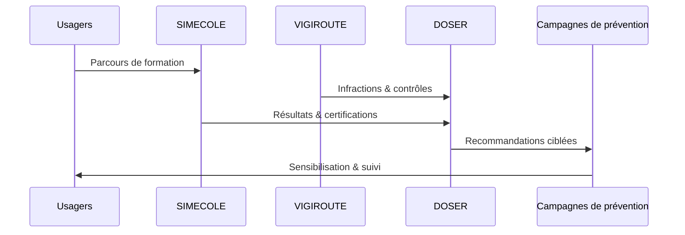

# Usagers sûrs

Les modules « Usagers sûrs » ciblent la formation, la prévention et le contrôle des comportements. Ils complètent les capacités d’analyse de DOSER pour agir sur le facteur humain, première cause d’accidents graves.

## Modules

### SIMECOLE — Formation nouvelle génération

- **Objectif** : moderniser l’apprentissage et la certification des conducteurs.  
- **Fonctionnalités** : simulateurs (réalité augmentée/virtuelle), parcours pédagogiques, évaluations en ligne, suivi des performances.  
- **Intégration DOSER** : relier niveau de formation et accidentologie pour ajuster les programmes.

### VIGIROUTE — Contrôle et prévention routière

- **Objectif** : renforcer les contrôles de terrain et prévenir les comportements dangereux.  
- **Fonctionnalités** : planification des contrôles, enregistrement des infractions, dispositifs mobiles, génération de statistiques.  
- **Intégration DOSER** : corrélation entre historique d’infractions, facteurs de risque et accidents.

## Cas d’usage

- Mesurer l’impact des programmes de formation sur les accidents par catégorie de conducteur.  
- Déployer des campagnes ciblées (port du casque, vitesse, alcool) basées sur les analyses DOSER.  
- Prioriser les contrôles VIGIROUTE dans les zones identifiées comme points noirs.  
- Associer les assureurs à des programmes d’incitations basés sur le scoring comportemental.

## Acteurs clés

- Ministère des Transports / Education routière.  
- Forces de l’ordre, autorités de contrôle.  
- Auto-écoles, opérateurs de formation.  
- Associations citoyennes, ONG de prévention.

## Indicateurs à surveiller

- Taux de réussite aux formations et certifications SIMECOLE.  
- Nombre et typologie des infractions VIGIROUTE.  
- Evolution du scoring comportemental.  
- Impact des campagnes de sensibilisation (comparaison avant/après).

!!! tip "Amplifier l’impact"
    - Relier les données VIGIROUTE aux modules VAAR pour détecter rapidement les zones à risque.  
    - Utiliser les parcours SIMECOLE pour gamifier la prévention et fidéliser les publics à risque.  
    - Diffuser les résultats via les réseaux sociaux DOSER pour sensibiliser en continu.

- [Retour aux modules](../index.md)

