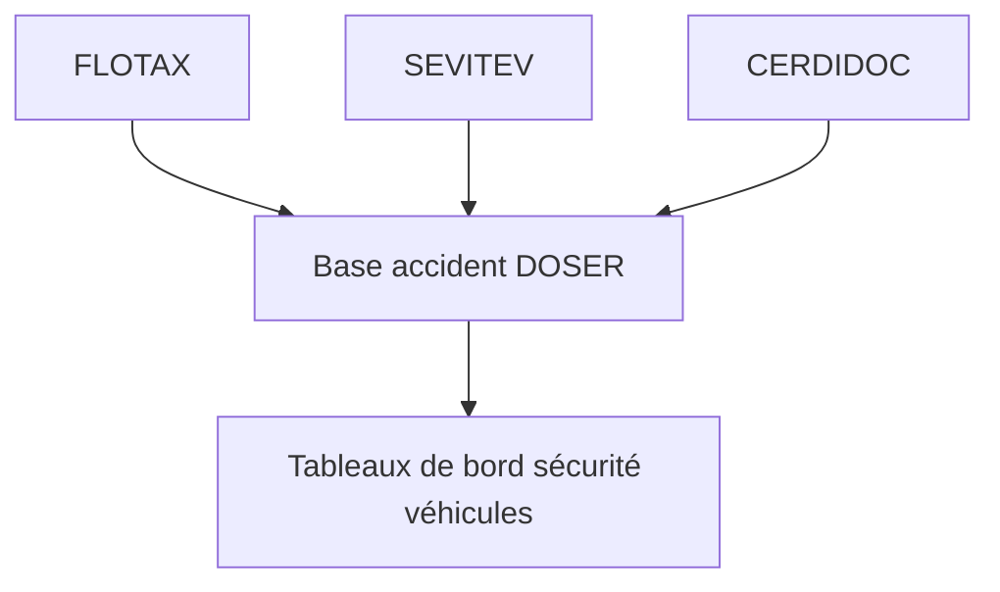

# Véhicules sûrs

Les modules « Véhicules sûrs » garantissent la conformité technique du parc roulant, sécurisent les documents officiels et offrent une visibilité en temps réel sur les flottes. Ils complètent DOSER pour comprendre l’impact des véhicules sur la sinistralité.

## Modules

### SEVITEV — Sécurisation du contrôle technique

- **Objectif** : digitaliser et sécuriser le contrôle technique des véhicules.  
- **Fonctionnalités** : enregistrement des visites, traçabilité des défauts, certification numérique.  
- **Intégration DOSER** : corréler les défaillances techniques avec les accidents pour cibler les actions réglementaires.

### CERDIDOC — Sécurisation des titres et documents

- **Objectif** : empêcher la fraude documentaire sur les permis, cartes grises et licences.  
- **Fonctionnalités** : vérification en temps réel, signatures numériques, alertes de falsification.  
- **Intégration DOSER** : garantir la validité des identités et documents lors des constats.

### FLOTAX — Suivi et géolocalisation des flottes

- **Objectif** : superviser les véhicules commerciaux et optimiser leur exploitation.  
- **Fonctionnalités** : suivi GPS, détection de comportements à risque (vitesse, freinage brusque), gestion des conducteurs.  
- **Intégration DOSER** : analyser les comportements de conduite avant un accident et déployer des actions ciblées.

## Cas d’usage

- Identifier les séries de véhicules impliqués dans des incidents récurrents.  
- Déployer des campagnes de maintenance ciblées pour les flottes à risque.  
- Accélérer la vérification documentaire lors des contrôles routiers.  
- Alimenter les compagnies d’assurance en données sur les comportements des conducteurs.

## Acteurs clés

- Ministère des Transports / Immatriculation.  
- Centres de contrôle technique agréés.  
- Compagnies de transport, agences de voyage.  
- Assurances et forces de l’ordre.

## Indicateurs à surveiller

- Taux de conformité aux visites techniques.  
- Nombre de fraudes documentaires détectées.  
- Indice de conduite à risque par flotte / conducteur.  
- Temps moyen de traitement des vérifications documentaires.

!!! tip "Exploiter les synergies"
    - Lier les alertes FLOTAX aux campagnes de formation (SIMECOLE).  
    - Utiliser les historiques SEVITEV pour prioriser les contrôles de terrain.  
    - Partager les scores de conformité avec les assureurs pour encourager les comportements sûrs.

- [Retour aux modules](../index.md)

