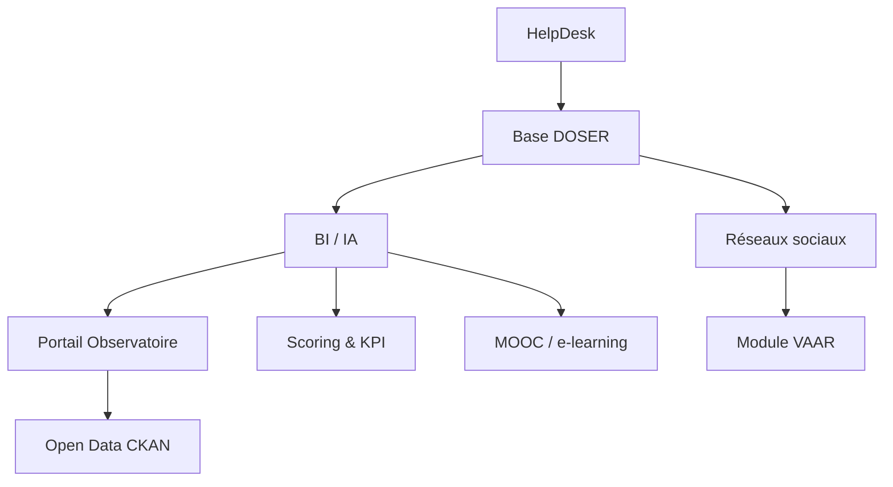

# Services transverses

Les services transverses amplifient l’impact de DOSER en transformant les données en décisions, en accompagnant les utilisateurs et en garantissant la diffusion auprès de toutes les parties prenantes.

## BI / Big Data / IA

- **Rôle** : moteur analytique qui pilote les quatre niveaux d’analyse (descriptive, diagnostique, prédictive, prescriptive).  
- **Fonctionnalités** : pipelines de données, modèles prédictifs, scénarios « what-if », recommandations automatiques.  
- **Bénéfices** : aide à la décision, optimisation des ressources, ciblage des interventions.

## Portail observatoire

- **Rôle** : plateforme décisionnelle pour les ministères, autorités et partenaires.  
- **Fonctionnalités** : dashboards interactifs, cartes thématiques, rapports périodiques, alertes.  
- **Bénéfices** : vision consolidée, pilotage stratégique, transparence.

## Open Data CKAN

- **Rôle** : diffusion des données ouvertes et documentation associée.  
- **Fonctionnalités** : catalogues de jeux de données, API, visualisations publiques.  
- **Bénéfices** : transparence, engagement citoyen, soutien à la recherche.

## HelpDesk & support 24/7

- **Rôle** : assistance technique et fonctionnelle en continu.  
- **Fonctionnalités** : gestion des tickets, base de connaissances, chat, hotline.  
- **Bénéfices** : adoption réussie, réduction des frictions, escalade rapide.

## MOOC / e-learning

- **Rôle** : développement des compétences pour tous les profils.  
- **Fonctionnalités** : cours en ligne, vidéos, quiz, certifications, suivi de progression.  
- **Bénéfices** : standardisation des pratiques, montée en compétence rapide, communauté apprenante.

## Réseaux sociaux & communication

- **Rôle** : sensibilisation, diffusion d’alertes et engagement citoyen.  
- **Fonctionnalités** : publication multicanal (Facebook, X, Instagram, YouTube), campagnes thématiques, monitoring d’impact.  
- **Bénéfices** : amplification des messages de prévention, collecte de signaux faibles (intégrés à VAAR).

## Scoring & KPI

- **Rôle** : mesure de performance par acteur, suivi des objectifs ONU 2021-2030.  
- **Fonctionnalités** : scoring par flotte, par territoire, par campagne ; calcul automatique des KPI.  
- **Bénéfices** : pilotage par la performance, contractualisation avec les partenaires, reporting bailleurs.

## Recommandations opérationnelles

1. **Institutionnaliser le HelpDesk** dans les accords de service pour garantir la réactivité.  
2. **Planifier des cycles de formation** réguliers (MOOC + ateliers terrain) pour maintenir la qualité de saisie.  
3. **Publier un calendrier de diffusion Open Data** pour assurer transparence et confiance.  
4. **Mesurer l’impact des campagnes** via les indicateurs du scoring et ajuster les actions.

- [Retour aux modules](index.md)
- [Vision & stratégie](../vision/index.md)

