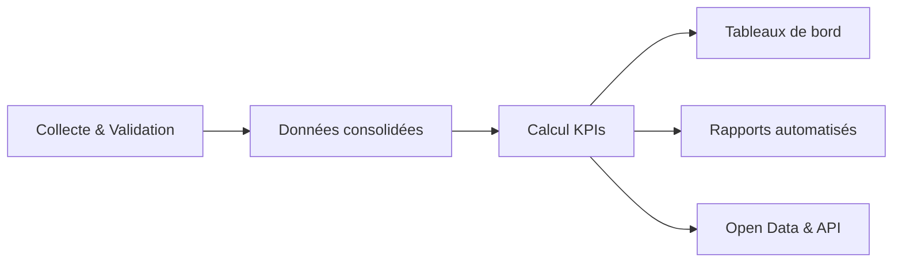

# Statistiques & Métriques

Le module Statistiques & Métriques fournit une **vue consolidée des indicateurs** de sécurité routière, de performance opérationnelle et de qualité de données. Il alimente la prise de décision des autorités, des bailleurs et des partenaires, tout en assurant le suivi des engagements internationaux.

## Alignement stratégique

| Cadre | Indicateurs suivis | Objectifs | Diffusion |
| --- | --- | --- | --- |
| Décennie d’action ONU 2021-2030 | Décès, blessés graves, taux par type d’usager | -50 % à horizon 2030 | Rapports nationaux, dashboards exécutifs |
| Safe System (routes, véhicules, usagers, post-accident) | Points noirs, conformité véhicules, comportements, délais d’intervention | Amélioration continue | Tableaux de bord piliers |
| Gouvernance nationale | Qualité de données, temps de validation, couverture régionale | Redevabilité & audits | Observatoire, Open Data |
| Bailleurs / partenaires | KPIs opérationnels, investissements, impacts | Reporting contractuel | Rapports trimestriels, API |

## Architecture des indicateurs

- **Sources** : constats DOSER, hôpitaux, assurances, modules DITROS (FLOTAX, GEOROUTE, VAAR).  
- **Calculs** : moteur analytique (module Analyse & Reporting) génère indicateurs et scores.  
- **Diffusion** : dashboards web, exports programmés, portails publics anonymisés.

## Catégories d’indicateurs

### 1. Sécurité routière
- Taux de mortalité / blessés graves par 100 000 habitants.  
- Répartition par type d’usager (piétons, deux-roues, automobilistes).  
- Points noirs priorisés (classement A/B/C).  
- Contribution des interventions (avant/après travaux, campagnes, contrôles).

### 2. Opérations & interventions
- Temps moyen d’intervention (secours, forces de l’ordre, hôpitaux).  
- Délai entre accident détecté (VAAR/ALLOVOIE) et saisie du constat.  
- Nombre d’accidents traités par région / service.  
- Taux de dossiers complétés dans les délais cibles.

### 3. Qualité des données
- Score de complétude des constats (champs critiques renseignés).  
- Cohérence géographique (coordonnées valides, alignement GEOROUTE).  
- Taux de validations sans retour correctif.  
- Alignement multi-sources (constats ↔ hôpitaux ↔ assurances).

### 4. Performance système
- Disponibilité plateforme (uptime), latence API, volume synchronisations mobiles.  
- Taux de succès des exports PDF / rapports.  
- Utilisation des modules (connections par rôle, adoption régionale).

## Scorecards par acteur

| Acteur | Indicateurs clés | Représentation |
| --- | --- | --- |
| Forces de l’ordre | Temps d’intervention, constats validés, qualité de saisie | Dashboard opérationnel, alertes |
| Santé / SAMU | Délai prise en charge, flux victimes, corrélation blessures | Tableau de bord santé, rapports mensuels |
| Assurances | Dossiers indemnisés, fréquence sinistres, suspicion fraude | Rapports partenaires, API |
| Ministères | Avancement objectifs ONU, budget vs impact, points noirs traités | Tableau de bord exécutif |
| Observatoire | Tendances nationales, recommandations, suivi de plans | Rapports trimestriels, open data |

## Exemples de KPI

- **KPI-SR-01** : Taux de décès routiers (objectif < 13,7 / 100 000 hab. en 2030).  
- **KPI-OP-05** : Temps médian d’arrivée du premier secours (< 10 min en zone urbaine).  
- **KPI-QD-02** : Complétude des constats sur champs critiques (> 95 %).  
- **KPI-DATA-04** : Correspondance hôpital ↔ constat (< 48 h pour 90 % des dossiers).  
- **KPI-VAAR-03** : Précision des alertes validées (> 85 %).  
- **KPI-OPEN-01** : Nombre de jeux de données publiés / mis à jour (mensuel).

## Tableaux de bord & rapports

- **Tableau de bord national** : synthèse quotidienne, objectifs ONU, points critiques.  
- **Portail Observatoire** : filtres par région, période, type d’usager, accès décideurs.  
- **Rapports automatisés** : quotidien (incidents majeurs), hebdomadaire (tendances), mensuel (analyses détaillées), annuel (bilan stratégique).  
- **Exports ouverts** : CSV/JSON anonymisés, visualisations publiques via CKAN.

## Bonnes pratiques

1. **Mettre à jour** les référentiels (population, réseau routier) pour garantir des ratios pertinents.  
2. **Organiser des revues mensuelles** avec les acteurs pour valider les indicateurs et lancer des actions correctives.  
3. **Documenter la méthodologie** de chaque KPI (formule, source, responsables).  
4. **Comparer périodiquement** les résultats avec les standards OMS et benchmarks régionaux.  
5. **Capitaliser sur VAAR** pour affiner les indicateurs de détection précoce et de temps de réponse.

---

- [Analyse & Reporting](analyse-reporting.md)  
- [Services transverses](services-transverses.md)  
- [Vision & Stratégie](../vision/valeur-strategique.md)
