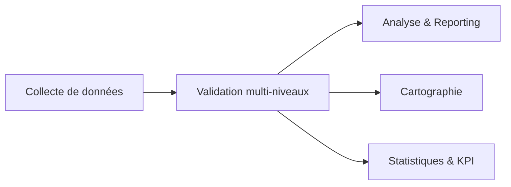
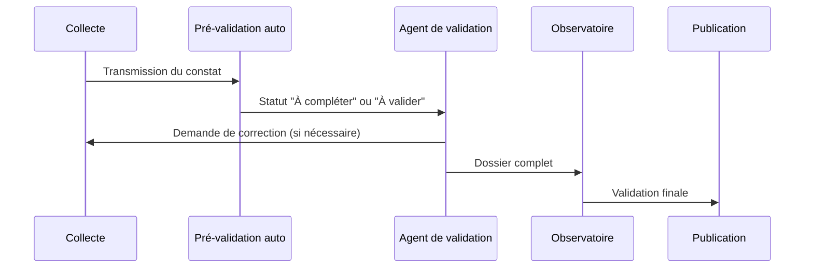

# Validation des constats

Le module de validation est la *deuxième ligne de défense* du pilier post-accident. Il transforme les constats bruts en dossiers fiables, exploitables par l’analyse, la cartographie et les partenaires institutionnels.

## Rôle et périmètre

- **Contrôler** la complétude et la cohérence des constats saisis sur le terrain.  
- **Enrichir** les enregistrements avec des informations complémentaires (photographies, diagnostics médicaux, évaluations des dommages).  
- **Tracer** chaque action de validation pour assurer redevabilité et auditabilité.  
- **Orchestrer** le workflow multi-acteurs (forces de l’ordre, observatoire, assurances, ministères).

## Fonctionnalités clés

- **Workflow configurable** : étapes, rôles, règles d’assignation par type d’accident ou gravité.  
- **Contrôles automatiques** : formats, valeurs aberrantes, cohérence inter-champs, géolocalisation.  
- **Score qualité** : indicateurs de complétude et de fiabilité (A, B, C) avec seuils de publication.  
- **Enrichissement** : ajout de pièces jointes, compléments médicaux, estimation des dommages matériels.  
- **Historique et audit** : journal complet des modifications et validations.  
- **Relances & notifications** : rappels aux équipes de terrain lorsque des corrections sont requises.

## Workflow type

1. **Pré-validation automatique**  
   - Vérifications syntaxiques, champs obligatoires, coordonnées GPS, doublons.
2. **Validation fonctionnelle**  
   - Agent de validation vérifie la cohérence, complète les informations manquantes, sollicite les acteurs concernés.
3. **Validation analytique**  
   - Analyste / observatoire applique les contrôles métier avancés (matrices IA, comparaison multi-sources).
4. **Publication**  
   - Enregistrement disponible pour les modules Analyse, Cartographie, Statistiques, Open Data (selon niveau de sensibilité).

## Contrôles automatiques

- **Cohérence temporelle** : date postérieure, délai raisonnable entre accident et saisie.  
- **Cohérence géographique** : distance entre lieu de l’accident et hospitalisation, alignement avec référentiel GEOROUTE.  
- **Vérification multi-sources** : rapprochement avec données hôpital, assurance, VAAR.  
- **Règles métier** : compatibilité between type d’accident et nombre de victimes, typologie de véhicule, conditions météo.

!!! warning "Alertes IA"
    Les contrôles avancés s’appuient sur des modèles statistiques pour détecter les outliers (ex. âge improbable, duplication de véhicule, trajectoire incohérente).

## Acteurs impliqués

- **Agents de validation** (forces de l’ordre, services régionaux).  
- **Centre d’analyse / observatoire** : validation analytique, recommandations.  
- **Assurances** : ajout d’informations sur les sinistres et indemnisation.  
- **Services de santé** : confirmation des diagnostics et suivi des victimes.

## Indicateurs de performance

- Temps moyen entre collecte et validation finale.  
- Taux de dossiers validés du premier coup.  
- Volume d’alertes IA déclenchées / résolues.  
- Score qualité moyen par région / service.  
- Nombre de dossiers publiés dans l’Open Data.

## Bonnes pratiques

1. **Former les équipes** aux règles métier et à l’utilisation des contrôles automatisés.  
2. **Analyser les retours** pour identifier les champs fréquemment incomplets et ajuster les guides terrain.  
3. **Synchroniser** régulièrement avec les hôpitaux / assurances pour enrichir les dossiers sans attendre.  
4. **Exploiter les KPI** pour piloter la performance des services de validation.

- [Revenir au pilier post-accident](piliers/post-accident.md)  
- [Explorer la collecte de données](collecte-donnees.md)  
- [Analyse & Reporting](analyse-reporting.md)
