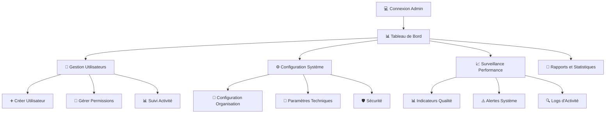

# 🚀 Guide Rapide : Administrateurs

**Durée estimée** : 20 minutes  
**Niveau** : Avancé  
**Version** : 1.0

---

## 📋 Ce que vous allez apprendre

À la fin de ce guide, vous saurez :

✅ Accéder à l'interface d'administration DOSER  
✅ Gérer les utilisateurs et leurs permissions  
✅ Configurer les paramètres système  
✅ Surveiller les performances et la qualité  
✅ Générer des rapports et statistiques  
✅ Gérer les sauvegardes et la maintenance  

---

## 🎯 Votre Rôle en Tant qu'Administrateur

En tant qu'administrateur DOSER, vous êtes le **pilote du système**. Votre mission :

🔧 **Configurer** le système selon les besoins de votre organisation  
👥 **Gérer** les utilisateurs, rôles et permissions  
📊 **Surveiller** les performances et la qualité des données  
🛡️ **Sécuriser** l'accès et protéger les données sensibles  
📈 **Analyser** les statistiques pour améliorer les processus  
🔧 **Maintenir** le système en bon état de fonctionnement  

---

## 💻 Accès à l'Interface d'Administration

### Configuration PC Requise

| Composant | Spécification Minimale |
|-----------|------------------------|
| **Processeur** | Intel Core i5 CPU 2.30 GHz |
| **RAM** | 8 Go |
| **Système** | Windows 10 64 bits |
| **Espace disque** | 300 Go |
| **Navigateur** | Chrome, Firefox, Edge (dernière version) |

### Connexion à l'Interface Web

1. **Ouvrir votre navigateur** (Chrome, Firefox ou Edge recommandés)
2. **Entrer l'adresse** : `http://51.195.80.167:8098`
3. **Renseigner vos identifiants** :
   - Identifiant administrateur
   - Mot de passe administrateur
4. **Cliquer sur "CONNEXION"**

⚠️ **Important** : Votre compte doit avoir les **droits d'administrateur** pour accéder aux fonctionnalités d'administration.

---

## 🎬 Workflow Complet avec Captures d'Écran

### Vue d'Ensemble du Workflow



### Workflow Détaillé par Écrans

#### Écran 1 : Connexion à l'Interface d'Administration
```
┌─────────────────────────────────────────────────────┐
│  🔐 DOSER - Administration                         │
│                                                      │
│  Serveur: http://51.195.80.167:8098                │
│                                                      │
│  Identifiant: [_________________________]          │
│  Mot de passe: [_________________________]         │
│                                                      │
│  [🔑 Se connecter]                                 │
│                                                      │
│  ⚠️ Accès réservé aux administrateurs              │
└─────────────────────────────────────────────────────┘
```

#### Écran 2 : Tableau de Bord Administrateur
```
┌─────────────────────────────────────────────────────────────────┐
│  📊 Tableau de Bord Administrateur - Admin: MARTIN Jean        │
│                                                                  │
│  📈 Vue d'Ensemble Système:                                     │
│  ├─ 👥 Utilisateurs actifs: 45/50                               │
│  ├─ 📋 Déclarations aujourd'hui: 23                            │
│  ├─ ✅ Validations en attente: 8                               │
│  ├─ 🚨 Alertes système: 2                                      │
│  └─ 💾 Espace disque: 78% utilisé                              │
│                                                                  │
│  🎯 Actions Rapides:                                            │
│  ┌──────────────────────────────────────────────────────────┐  │
│  │ [👥 Gérer Utilisateurs] [⚙️ Configuration] [📊 Rapports]│  │
│  │ [🛡️ Sécurité] [💾 Sauvegarde] [🔍 Logs]                │  │
│  └──────────────────────────────────────────────────────────┘  │
│                                                                  │
│  📊 Statistiques Temps Réel:                                    │
│  ┌──────────────────────────────────────────────────────────┐  │
│  │ Déclarations/heure: 3.2  |  Taux validation: 87%      │  │
│  │ Temps moyen traitement: 18min  |  Qualité: 92%         │  │
│  └──────────────────────────────────────────────────────────┘  │
└─────────────────────────────────────────────────────────────────┘
```

#### Écran 3 : Gestion des Utilisateurs
```
┌─────────────────────────────────────────────────────────────────┐
│  👥 Gestion des Utilisateurs                                   │
│                                                                  │
│  🔍 Recherche: [Nom, email, rôle...] [🔍]                     │
│                                                                  │
│  📋 Liste des Utilisateurs:                                    │
│  ┌──────────────────────────────────────────────────────────┐  │
│  │ Nom          | Rôle           | Statut    | Dernière Con.│  │
│  ├──────────────────────────────────────────────────────────┤  │
│  │ MBARGA Paul   | Agent Constat. | 🟢 Actif  | 15/10 16h  │  │
│  │ DUPONT Jean   | Validateur     | 🟢 Actif  | 15/10 15h  │  │
│  │ KOUAM Marie   | Services Santé | 🟡 Inactif| 14/10 18h  │  │
│  │ ATEBA Ali     | Assurance      | 🔴 Bloqué | 13/10 12h  │  │
│  └──────────────────────────────────────────────────────────┘  │
│                                                                  │
│  Actions: [➕ Nouveau] [✏️ Modifier] [🔐 Permissions] [📊 Stats]│
└─────────────────────────────────────────────────────────────────┘
```

#### Écran 4 : Création d'un Nouvel Utilisateur
```
┌─────────────────────────────────────────────────────┐
│  ➕ Créer un Nouvel Utilisateur                    │
│                                                      │
│  👤 Informations Personnelles:                     │
│  Nom: [________________]                           │
│  Prénom: [________________]                        │
│  Email: [________________]                         │
│  Téléphone: [________________]                     │
│                                                      │
│  🔐 Informations de Connexion:                     │
│  Identifiant: [________________]                   │
│  Mot de passe: [________________]                  │
│  Confirmation: [________________]                   │
│                                                      │
│  🏢 Organisation:                                  │
│  Service: [Police ▼]                              │
│  Brigade: [Yaoundé-Centre ▼]                      │
│                                                      │
│  🎭 Rôles et Permissions:                          │
│  ☑️ Agent Constatateur                            │
│  ☐ Agent Validateur                               │
│  ☐ Services Santé                                 │
│  ☐ Assurance                                       │
│  ☐ Administrateur                                  │
│                                                      │
│  [❌ Annuler] [✅ Créer l'Utilisateur]            │
└─────────────────────────────────────────────────────┘
```

#### Écran 5 : Configuration des Permissions
```
┌─────────────────────────────────────────────────────┐
│  🔐 Gestion des Permissions - MBARGA Paul          │
│                                                      │
│  📋 Permissions par Module:                         │
│                                                      │
│  📱 DOSER DATA CAPTURE:                             │
│  ☑️ Créer déclarations                             │
│  ☑️ Modifier ses déclarations                      │
│  ☑️ Synchroniser données                           │
│  ☐ Valider déclarations autres                    │
│                                                      │
│  💻 Interface Web:                                  │
│  ☑️ Consulter ses déclarations                     │
│  ☑️ Exporter rapports                              │
│  ☐ Accès statistiques avancées                     │
│  ☐ Gestion utilisateurs                            │
│                                                      │
│  📊 Rapports:                                       │
│  ☑️ Rapports personnels                            │
│  ☐ Rapports équipe                                 │
│  ☐ Rapports organisation                           │
│  ☐ Rapports nationaux                              │
│                                                      │
│  [❌ Annuler] [✅ Sauvegarder]                     │
└─────────────────────────────────────────────────────┘
```

#### Écran 6 : Surveillance des Performances
```
┌─────────────────────────────────────────────────────────────────┐
│  📊 Surveillance des Performances                              │
│                                                                  │
│  📈 Indicateurs Clés:                                           │
│  ┌──────────────────────────────────────────────────────────┐  │
│  │ Déclarations/jour: 45  |  Validation: 87%              │  │
│  │ Temps moyen: 18min     |  Qualité: 92%                 │  │
│  │ Erreurs système: 0.2%  |  Disponibilité: 99.8%         │  │
│  └──────────────────────────────────────────────────────────┘  │
│                                                                  │
│  🚨 Alertes Actives:                                            │
│  ┌──────────────────────────────────────────────────────────┐  │
│  │ ⚠️ Espace disque: 78% utilisé (seuil: 80%)              │  │
│  │ ⚠️ 3 utilisateurs inactifs depuis >7 jours             │  │
│  └──────────────────────────────────────────────────────────┘  │
│                                                                  │
│  📊 Graphiques Temps Réel:                                      │
│  [📈 Déclarations/heure] [📊 Qualité] [🔍 Erreurs]            │
└─────────────────────────────────────────────────────────────────┘
```

#### Écran 7 : Configuration Système
```
┌─────────────────────────────────────────────────────┐
│  ⚙️ Configuration Système                          │
│                                                      │
│  🏢 Paramètres Organisation:                        │
│  Nom: [Direction des Transports Routiers]           │
│  Code: [DITROS]                                     │
│  Région: [Centre ▼]                                │
│  Adresse: [Yaoundé, Cameroun]                       │
│                                                      │
│  🔧 Paramètres Techniques:                          │
│  Sauvegarde auto: [☑️ Activée] (toutes les 6h)     │
│  Logs système: [☑️ Activés] (niveau: INFO)          │
│  Notifications: [☑️ Email] [☑️ SMS]                │
│                                                      │
│  🛡️ Sécurité:                                       │
│  Session timeout: [30] minutes                       │
│  Tentatives connexion: [3] max                      │
│  Mot de passe: [☑️ Complexité requise]              │
│                                                      │
│  📊 Limites Système:                                │
│  Utilisateurs max: [50]                             │
│  Déclarations/jour: [100]                           │
│  Stockage: [500] Go                                 │
│                                                      │
│  [❌ Annuler] [✅ Sauvegarder]                     │
└─────────────────────────────────────────────────────┘
```

#### Écran 8 : Génération de Rapports
```
┌─────────────────────────────────────────────────────┐
│  📄 Génération de Rapports                         │
│                                                      │
│  📊 Type de Rapport:                                │
│  ☑️ Statistiques générales                         │
│  ☐ Performance utilisateurs                        │
│  ☐ Qualité des données                             │
│  ☐ Utilisation système                             │
│                                                      │
│  📅 Période:                                        │
│  Du: [01/10/2025] Au: [31/10/2025]                 │
│                                                      │
│  🎯 Filtres:                                        │
│  Service: [Tous ▼]                                  │
│  Type accident: [Tous ▼]                            │
│  Gravité: [Tous ▼]                                  │
│                                                      │
│  📤 Format de Sortie:                               │
│  ☑️ PDF  ☑️ Excel  ☐ CSV                           │
│                                                      │
│  📧 Envoi par Email:                                │
│  Email: [admin@ditros.org]                          │
│                                                      │
│  [❌ Annuler] [📊 Générer le Rapport]              │
└─────────────────────────────────────────────────────┘
```

#### Écran 9 : Gestion des Sauvegardes
```
┌─────────────────────────────────────────────────────┐
│  💾 Gestion des Sauvegardes                        │
│                                                      │
│  📅 Sauvegardes Disponibles:                        │
│  ┌─────────────────────────────────────────────┐   │
│  │ 15/10/2025 06:00 | Base complète | 2.3 GB │   │
│  │ 15/10/2025 12:00 | Incrémentale   | 45 MB  │   │
│  │ 14/10/2025 18:00 | Base complète  | 2.2 GB │   │
│  │ 14/10/2025 00:00 | Incrémentale   | 38 MB  │   │
│  └─────────────────────────────────────────────┘   │
│                                                      │
│  🔧 Actions:                                        │
│  [💾 Nouvelle Sauvegarde] [📥 Restaurer] [🗑️ Supprimer]│
│                                                      │
│  ⚙️ Configuration:                                  │
│  Fréquence: [Toutes les 6h]                         │
│  Rétention: [30 jours]                              │
│  Compression: [☑️ Activée]                          │
│                                                      │
│  📊 Espace Utilisé: 15.2 GB / 50 GB (30%)          │
└─────────────────────────────────────────────────────┘
```

#### Écran 10 : Consultation des Logs
```
┌─────────────────────────────────────────────────────┐
│  🔍 Logs d'Activité Système                        │
│                                                      │
│  🔍 Filtres:                                        │
│  Date: [15/10/2025] Niveau: [INFO ▼] Utilisateur: [Tous ▼]│
│                                                      │
│  📋 Logs Récents:                                   │
│  ┌─────────────────────────────────────────────┐   │
│  │ 15:30 | INFO  | MBARGA Paul | Connexion    │   │
│  │ 15:25 | INFO  | Système    | Sauvegarde OK │   │
│  │ 15:20 | WARN  | DUPONT Jean| Validation lente│   │
│  │ 15:15 | ERROR | Système    | Erreur DB     │   │
│  │ 15:10 | INFO  | KOUAM Marie| Déclaration   │   │
│  └─────────────────────────────────────────────┘   │
│                                                      │
│  📊 Statistiques:                                   │
│  Erreurs aujourd'hui: 2  |  Avertissements: 5      │
│  Connexions: 45  |  Déclarations: 23               │
│                                                      │
│  [🔄 Actualiser] [📥 Exporter] [🔍 Rechercher]      │
└─────────────────────────────────────────────────────┘
```

---

## 🔧 Fonctionnalités Principales d'Administration

### 1. Gestion des Utilisateurs

#### Créer un Nouvel Utilisateur

1. **Accéder** au module "Gestion des Utilisateurs"
2. **Cliquer** sur "Nouvel Utilisateur"
3. **Remplir** les informations :
   - Informations personnelles (nom, prénom, email, téléphone)
   - Identifiants de connexion
   - Organisation et service
   - Rôles et permissions
4. **Valider** la création

#### Gérer les Permissions

**Types de permissions disponibles :**
- **Agent Constatateur** : Créer et modifier des déclarations
- **Agent Validateur** : Valider ou rejeter des déclarations
- **Services Santé** : Accès aux données médicales
- **Assurance** : Accès aux données d'assurance
- **Administrateur** : Accès complet au système

**Configuration granulaire :**
- Permissions par module (mobile, web, rapports)
- Accès par niveau (personnel, équipe, organisation, national)
- Restrictions temporelles et géographiques

### 2. Configuration Système

#### Paramètres Organisation

- **Informations générales** : Nom, code, région, adresse
- **Structure hiérarchique** : Services, brigades, équipes
- **Zones de compétence** : Délimitations géographiques

#### Paramètres Techniques

- **Sauvegardes automatiques** : Fréquence et rétention
- **Logs système** : Niveau de détail et conservation
- **Notifications** : Email, SMS, alertes système
- **Limites système** : Utilisateurs, déclarations, stockage

#### Sécurité

- **Gestion des sessions** : Timeout, tentatives de connexion
- **Politique de mots de passe** : Complexité, expiration
- **Audit des accès** : Traçabilité des connexions
- **Chiffrement des données** : Protection des informations sensibles

### 3. Surveillance et Maintenance

#### Indicateurs de Performance

**Métriques système :**
- Nombre de déclarations par jour/heure
- Taux de validation et rejet
- Temps moyen de traitement
- Qualité des données
- Disponibilité du système

**Métriques utilisateurs :**
- Activité par utilisateur
- Performance par rôle
- Erreurs et problèmes récurrents
- Formation et support nécessaires

#### Alertes et Notifications

**Types d'alertes :**
- ⚠️ **Espace disque** : Seuil de 80% utilisé
- ⚠️ **Utilisateurs inactifs** : Plus de 7 jours sans connexion
- ⚠️ **Erreurs système** : Base de données, réseau, sécurité
- ⚠️ **Performance** : Temps de réponse élevés

### 4. Rapports et Statistiques

#### Types de Rapports

**Rapports opérationnels :**
- Statistiques générales d'accidents
- Performance des équipes
- Qualité des données
- Utilisation du système

**Rapports de gestion :**
- Activité des utilisateurs
- Coûts et ressources
- Évolution des indicateurs
- Recommandations d'amélioration

#### Formats de Sortie

- **PDF** : Rapports officiels et présentation
- **Excel** : Données détaillées et analyses
- **CSV** : Export pour autres systèmes
- **Email** : Envoi automatique programmé

---

## ⚠️ Problèmes Fréquents et Solutions

### Je ne peux pas créer un utilisateur

**Solutions :**
1. Vérifiez que vous avez les droits d'administrateur
2. Vérifiez que l'email n'est pas déjà utilisé
3. Vérifiez la complexité du mot de passe
4. Contactez le support technique

### Les sauvegardes ne se font pas

**Solutions :**
1. Vérifiez l'espace disque disponible
2. Vérifiez les permissions d'écriture
3. Vérifiez la configuration de la tâche planifiée
4. Testez une sauvegarde manuelle

### Les rapports ne se génèrent pas

**Solutions :**
1. Vérifiez les données disponibles pour la période
2. Vérifiez les permissions d'accès aux données
3. Vérifiez l'espace disque pour les fichiers temporaires
4. Contactez le support technique

---

## 📚 Pour Aller Plus Loin

### Manuel Complet

Pour une documentation exhaustive :
📕 [Manuel Complet Administrateurs](../../manuel/administrateurs.md)

### Ressources Complémentaires

- 📖 [Guide de sécurité avancée](../../manuel/securite-avancee.md)
- 📖 [Procédures de maintenance](../../manuel/maintenance.md)
- 📖 [Optimisation des performances](../../manuel/performance.md)

---

## 🆘 Besoin d'Aide ?

### Support Administrateur

**📧 Email** : admin-support@doser.cm  
**📞 Hotline** : +237 XXX XXX XXX (24/7)  
**💬 Chat** : Support technique dans l'application  
**🔧 Urgences** : support-urgent@doser.cm

### Contacts Utiles

**👨‍🏫 Formation** : formation-admin@ditros.org  
**🐛 Signaler un bug** : bugs-admin@ditros.org  
**💡 Suggestions** : feedback-admin@ditros.org  
**🛡️ Sécurité** : security@ditros.org

---

## ✅ Checklist d'Administration

Avant de quitter ce guide :

### Configuration de Base
- [ ] J'ai accédé à l'interface d'administration
- [ ] J'ai configuré les paramètres de base
- [ ] J'ai créé les utilisateurs nécessaires
- [ ] J'ai configuré les permissions

### Surveillance
- [ ] J'ai configuré les alertes système
- [ ] Je sais consulter les logs d'activité
- [ ] Je sais générer des rapports
- [ ] Je sais surveiller les performances

### Maintenance
- [ ] J'ai configuré les sauvegardes automatiques
- [ ] Je sais effectuer une sauvegarde manuelle
- [ ] Je sais restaurer des données
- [ ] Je connais les procédures d'urgence

---

## 🎉 Félicitations !

**Vous savez maintenant administrer le système DOSER !**

Vous pouvez :
- ✅ Gérer efficacement les utilisateurs et permissions
- ✅ Configurer le système selon vos besoins
- ✅ Surveiller les performances en temps réel
- ✅ Générer des rapports détaillés
- ✅ Maintenir le système en bon état

**Prochaine étape** : Consultez le [Manuel Complet](../../manuel/administrateurs.md) pour découvrir toutes les fonctionnalités avancées.

---

*Guide créé le : 20 octobre 2025*  
*Dernière mise à jour : 20 octobre 2025*  
*Version : 1.0 | Pages : 30*
