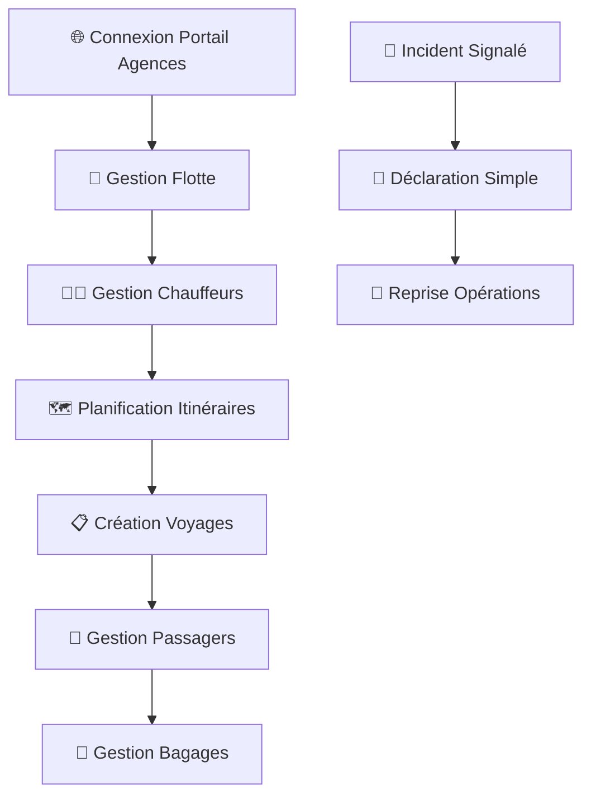

# 🚀 Guide Rapide : Agences de Voyage

**Durée estimée** : 25 minutes  
**Niveau** : Débutant  
**Version** : 4.0

---

## 📋 Ce que vous allez apprendre

À la fin de ce guide, vous saurez :

✅ Déclarer un accident impliquant vos véhicules/passagers  
✅ Consulter les statistiques de sécurité de vos trajets  
✅ Gérer les déclarations pour vos clients  
✅ Suivre les sinistres et coordonner avec les assurances  
✅ Accéder aux rapports de sécurité routière  

---

## 🎬 Workflow Complet avec Captures d'Écran

### Vue d'Ensemble du Workflow



### Workflow Détaillé par Écrans

#### Écran 1 : Connexion au Portail Agences
```
┌─────────────────────────────────────┐
│  🚌 DOSER - Agences de Voyage      │
│                                     │
│  Serveur: http://51.195.80.167:8098│
│                                     │
│  Identifiant: [________________]   │
│  Mot de passe: [________________]  │
│                                     │
│  [🔑 CONNEXION]                    │
│                                     │
│  Statut: 🟢 Prêt                   │
│                                     │
│  Configuration Système Requise:     │
│  • Processeur: Intel Core i5 2.30GHz│
│  • RAM: 8 Go minimum               │
│  • Windows 10 64 bits              │
│  • Espace disque: 300 Go           │
└─────────────────────────────────────┘
```

#### Écran 2 : Tableau de Bord Agence
```
┌─────────────────────────────────────┐
│  📊 Tableau de Bord - Agence        │
│                                     │
│  [🚌 Gestion Flotte]               │
│  [📋 Manifests Passagers]          │
│  [🚨 Déclarer Accident]            │
│  [📊 Statistiques Sécurité]        │
│  [💰 Coordination Assurances]      │
│  [⚙️  Paramètres]                  │
│                                     │
│  🚌 Flotte:                        │
│  ┌─────────────────────────────────┐│
│  │  🟢 12 véhicules actifs         ││
│  │  🟡 2 en maintenance            ││
│  │  🔴 1 accidenté                 ││
│  └─────────────────────────────────┘│
│                                     │
│  📊 Statistiques:                  │
│  • 0 accident ce mois              │
│  • 2 500 km parcourus              │
│  • 98% disponibilité flotte        │
│                                     │
│  Actions Rapides:                   │
│  • Nouveau manifest                │
│  • Déclarer accident               │
│  • Consulter statistiques          │
└─────────────────────────────────────┘
```

#### Écran 3 : Gestion de la Flotte
```
┌─────────────────────────────────────┐
│  🚌 Gestion de la Flotte            │
│                                     │
│  [➕ Ajouter Véhicule]             │
│  [📋 Liste Véhicules]              │
│  [👨‍💼 Conducteurs]                │
│  [🔧 Maintenance]                  │
│                                     │
│  📋 Véhicules Actifs:              │
│  ┌─────────────────────────────────┐│
│  │  AB-123-CD | Bus 50 places      ││
│  │  ✅ Assurance OK                ││
│  │  ✅ Visite technique OK         ││
│  │  👨‍💼 Chauffeur: MARTIN Jean    ││
│  └─────────────────────────────────┘│
│                                     │
│  ┌─────────────────────────────────┐│
│  │  EF-456-GH | Minibus 20 places  ││
│  │  ⚠️ Assurance expire dans 15j   ││
│  │  ✅ Visite technique OK         ││
│  │  👨‍💼 Chauffeur: DIALLO Ali     ││
│  └─────────────────────────────────┘│
│                                     │
│  [📊 Statistiques Flotte]          │
└─────────────────────────────────────┘
```

#### Écran 4 : Création Manifest Passagers
```
┌─────────────────────────────────────┐
│  📋 Nouveau Manifest Passagers      │
│                                     │
│  Voyage: [Douala → Yaoundé    ]    │
│  Date: [17/10/2025]                │
│  Heure: [08:00]                    │
│  Véhicule: [AB-123-CD ▼]           │
│  Conducteur: [MARTIN Jean ▼]       │
│                                     │
│  📋 Passagers:                     │
│  ┌─────────────────────────────────┐│
│  │  #1 | KOUAM Jean | Siège 5      ││
│  │  #2 | FONTAINE Marie | Siège 12 ││
│  │  #3 | TCHOUPOU Paul | Siège 18  ││
│  │  ... | ... | ...                ││
│  └─────────────────────────────────┘│
│                                     │
│  [➕ Ajouter Passager]             │
│  [📤 Importer CSV]                 │
│  [✅ Valider Manifest]             │
└─────────────────────────────────────┘
```

#### Écran 5 : Déclaration d'Accident
```
┌─────────────────────────────────────┐
│  🚨 Déclaration d'Accident          │
│                                     │
│  Véhicule: [AB-123-CD ▼]           │
│  Conducteur: [MARTIN Jean ▼]       │
│  Date: [17/10/2025]                │
│  Heure: [14:30]                    │
│  Lieu: [Douala, Carrefour Deido]   │
│                                     │
│  Type: [Collision ▼]               │
│  Gravité: [Avec blessés ▼]         │
│                                     │
│  👥 Passagers Impliqués:           │
│  ┌─────────────────────────────────┐│
│  │  KOUAM Jean | Blessé léger      ││
│  │  FONTAINE Marie | Indemne       ││
│  │  TCHOUPOU Paul | Blessé grave   ││
│  └─────────────────────────────────┘│
│                                     │
│  [📸 Ajouter Photos]               │
│  [✅ Soumettre Déclaration]        │
└─────────────────────────────────────┘
```

#### Écran 6 : Coordination avec Agents Constatateurs
```
┌─────────────────────────────────────┐
│  👮 Coordination Agents Constatateurs│
│                                     │
│  📋 Constats reçus: 3               │
│  📊 En attente: 1                   │
│  ✅ Traités: 2                      │
│                                     │
│  [📋 Voir Constats]                 │
│  [📊 Statistiques]                  │
│  [🔄 Synchronisation]               │
│                                     │
│  Dernière sync: 14:30               │
│  Statut: 🟢 Connecté               │
│                                     │
│  📋 Constats Récents:              │
│  ┌─────────────────────────────────┐│
│  │  #CONST-2025-001 | 17/10/2025   ││
│  │  Agent: Sgt. MARTIN             ││
│  │  Lieu: Douala, Carrefour Deido  ││
│  │  Statut: [Traité ✅]            ││
│  └─────────────────────────────────┘│
└─────────────────────────────────────┘
```

#### Écran 7 : Statistiques de Sécurité
```
┌─────────────────────────────────────┐
│  📊 Statistiques de Sécurité        │
│                                     │
│  📈 Performance Mois:               │
│  • 0 accident grave                │
│  • 1 accident matériel             │
│  • 2 500 km parcourus              │
│  • Taux: 0.4 accident/1000km       │
│                                     │
│  🏆 Classement:                    │
│  • Votre agence: 15ème/50          │
│  • Score sécurité: 85/100          │
│  • Évolution: +5 points            │
│                                     │
│  🎯 Recommandations:               │
│  • Formation conducteurs           │
│  • Maintenance véhicules           │
│  • Optimisation itinéraires        │
│                                     │
│  [📊 Rapport Détaillé]             │
│  [📤 Exporter Données]             │
└─────────────────────────────────────┘
```

#### Écran 8 : Coordination Assurances
```
┌─────────────────────────────────────┐
│  💰 Coordination Assurances         │
│                                     │
│  📋 Sinistres en cours: 2           │
│  📊 Montant total: 1.5M FCFA       │
│  ✅ Réglés ce mois: 1               │
│                                     │
│  [📋 Voir Sinistres]               │
│  [📊 Statistiques]                  │
│  [🔄 Synchronisation]               │
│                                     │
│  📋 Sinistres Actifs:              │
│  ┌─────────────────────────────────┐│
│  │  #SIN-2025-001 | 15/10/2025     ││
│  │  Montant: 800 000 FCFA          ││
│  │  Statut: [En expertise 🟠]      ││
│  └─────────────────────────────────┘│
│                                     │
│  ┌─────────────────────────────────┐│
│  │  #SIN-2025-002 | 17/10/2025     ││
│  │  Montant: 700 000 FCFA          ││
│  │  Statut: [Proposition 🟣]       ││
│  └─────────────────────────────────┘│
└─────────────────────────────────────┘
```

### Comparaison des Workflows

| Aspect | Interface Web Agence | Coordination avec Agents |
|--------|---------------------|-------------------------|
| **Durée** | 30 minutes | Temps réel |
| **Complétude** | Gestion complète | Données terrain |
| **Fonctionnalités** | Toutes disponibles | Collecte de base |
| **Contexte** | Bureau/Poste fixe | Terrain/Urgence |
| **Configuration** | Requise | Pré-configurée |
| **Rapports** | PDF détaillés | Synchronisation |
| **Gestion** | Flotte complète | Données accident |

### États des Dossiers

🟢 **ACTIF**
- Véhicule en service normal
- Tous documents à jour
- Conducteur assigné
- Actions : Consulter, Modifier, Planifier maintenance

🟡 **EN_MAINTENANCE**
- Véhicule en réparation
- Maintenance programmée
- Conducteur réassigné
- Actions : Suivre réparation, Planifier retour

🔴 **ACCIDENTE**
- Véhicule impliqué dans accident
- En attente expertise
- Conducteur suspendu
- Actions : Suivre expertise, Coordonner réparation

⚫ **HORS_SERVICE**
- Véhicule retiré de la flotte
- Fin de vie ou vente
- Conducteur réassigné
- Actions : Archiver, Vendre, Démanteler

### Procédures d'Urgence

**Cas Critique (Accident Grave)**
- **Action** : Traitement prioritaire (24h)
- **Enregistrement** : Marquer comme "URGENT", notification automatique
- **Suivi** : Coordination immédiate avec les autorités

**Accident Multi-Victimes**
- **Action** : Coordination entre plusieurs services
- **Enregistrement** : Lier les dossiers, répartition des responsabilités
- **Suivi** : Tableau de bord partagé

---

## 🌐 Étape 1 : Accès au Portail Agences (2 min)

### Connexion

1. Ouvrez votre navigateur
2. Allez sur : **https://doser.ditros.org/agence**
3. Entrez votre **nom d'utilisateur** (fourni lors de l'enregistrement)
4. Entrez votre **mot de passe**
5. Cliquez sur **Connexion**

### Premier Accès

Lors de la première connexion :
1. Complétez le profil de votre agence :
   - Nom commercial
   - Numéro d'agrément
   - Adresse du siège
   - Contact responsable sécurité
2. Enregistrez vos véhicules
3. Configurez les notifications

---

## 🚌 Étape 2 : Enregistrer Vos Véhicules (3 min)

### Ajouter un Véhicule

1. Menu > **Gestion Flotte** > **Ajouter Véhicule**
2. Remplissez les informations :
   - **Immatriculation**
   - **Type** : Bus, Minibus, Taxi, VIP
   - **Marque et modèle**
   - **Nombre de places**
   - **Année de mise en circulation**
   - **Numéro de châssis**

3. **Assurance** :
   - Compagnie d'assurance
   - Numéro de police
   - Date d'expiration
   - Couverture (passagers, responsabilité civile)

4. **Documents** :
   - Carte grise (upload)
   - Attestation assurance
   - Certificat de visite technique

5. Cliquez sur **"Enregistrer"**

### Gestion de la Flotte

Le tableau de bord affiche :
- ✅ Véhicules actifs
- ⚠️ Alertes (assurance/visite technique expirée)
- 📊 Statistiques par véhicule
- 🔴 Véhicules impliqués dans accidents

---

## 🚨 Étape 3 : Déclarer un Accident (4 min)

### 3.1 Nouvelle Déclaration

1. Sur le tableau de bord, cliquez sur **"Déclarer un Accident"**
2. OU : Menu > **Accidents** > **Nouvelle Déclaration**

### 3.2 Informations de Base

1. **Véhicule impliqué** :
   - Sélectionnez dans votre flotte
   - Ou saisissez immatriculation si sous-traitant

2. **Conducteur** :
   - Nom du chauffeur
   - Numéro permis de conduire
   - Téléphone

3. **Circonstances** :
   - Date et heure
   - Lieu précis (départ, destination, lieu accident)
   - Type de trajet (ligne régulière, voyage spécial)

### 3.3 Passagers Impliqués

1. Cliquez sur **"Ajouter Passagers"**
2. Pour chaque passager blessé/décédé :
   - Nom et prénoms
   - Numéro de siège
   - État (indemne, blessé léger, grave, décédé)
   - Contact famille
   - Destination finale

💡 **Astuce** : Si vous avez la liste de passagers (manifest), vous pouvez l'importer en CSV.

### 3.4 Description de l'Accident

1. **Type d'accident** :
   - Collision frontale
   - Sortie de route
   - Renversement
   - Incendie
   - Autre

2. **Cause probable** :
   - Défaillance technique
   - Erreur humaine
   - État de la route
   - Conditions météo
   - Autre usager

3. **Photos** :
   - Véhicule endommagé
   - Lieu de l'accident
   - Documents (constat amiable si établi)

### 3.5 Validation et Envoi

1. Vérifiez toutes les informations
2. Cliquez sur **"Soumettre la Déclaration"**
3. Vous recevez un numéro de référence

✓ **Résultat** : Les assurances et autorités sont automatiquement notifiées

---

## 📊 Étape 4 : Consulter les Statistiques (1 min)

### Tableau de Bord Sécurité

Le portail vous fournit :

1. **Vos Statistiques** :
   - Nombre d'accidents (mois/année)
   - Taux par km parcouru
   - Gravité moyenne
   - Comparaison avec moyenne nationale

2. **Par Trajet** :
   - Itinéraires à risque
   - Horaires sensibles
   - Points noirs identifiés

3. **Par Véhicule** :
   - Historique des accidents
   - Performance sécurité
   - Alertes maintenance

4. **Recommandations** :
   - Actions préventives
   - Formations conducteurs
   - Zones de vigilance

### Export des Données

1. Sélectionnez la période
2. Choisissez le format (PDF, Excel)
3. Cliquez sur **"Exporter"**

💡 **Usage** : Pour rapports mensuels, audits sécurité, formations

---

## 🔍 Suivi et Coordination

### Suivre un Sinistre

1. Menu > **Mes Déclarations**
2. Sélectionnez la déclaration
3. Consultez :
   - Statut (en cours, validée, clôturée)
   - Constat officiel (si disponible)
   - État des victimes
   - Avancement assurance

### Coordination avec Assurance

Le système facilite :
- ✅ Transmission automatique à votre assureur
- ✅ Partage de documents (photos, constat)
- ✅ Suivi des indemnisations passagers
- ✅ Historique des échanges

### Communication Familles

Pour les accidents graves :
1. Le système génère la liste des contacts famille
2. Vous pouvez envoyer des notifications groupées
3. Partager des informations sur l'état des victimes
4. Coordonner les visites hôpital/rapatriement

---

## 📋 Cas d'Usage Détaillés

### 1. Gestion de Flotte - Enregistrement Véhicule

**Contexte** : Nouveau véhicule à ajouter à la flotte

**Informations Collectées** :
- Données véhicule (immatriculation, type, marque, modèle)
- Caractéristiques (nombre de places, puissance, carburant)
- Documents (carte grise, assurance, visite technique)
- Conducteur assigné

**Actions Effectuées** :
- Enregistrement dans la base de données
- Vérification des documents
- Configuration des alertes de maintenance
- Affectation du conducteur

### 2. Création Manifest Passagers

**Contexte** : Nouveau voyage à programmer

**Informations Collectées** :
- Détails du voyage (itinéraire, date, heure)
- Véhicule et conducteur assignés
- Liste des passagers (nom, siège, destination)
- Contacts d'urgence

**Actions Effectuées** :
- Création du manifest électronique
- Enregistrement des passagers
- Génération du QR code pour contrôle
- Notification aux autorités

### 3. Déclaration Accident Mineur

**Contexte** : Accident sans blessés, dégâts matériels uniquement

**Informations Collectées** :
- Véhicule impliqué et conducteur
- Circonstances de l'accident
- Dégâts constatés
- Photos des dommages

**Actions Effectuées** :
- Déclaration immédiate dans DOSER
- Notification automatique à l'assurance
- Création du dossier sinistre
- Suivi de l'expertise

### 4. Déclaration Accident avec Blessés

**Contexte** : Accident avec passagers blessés

**Informations Collectées** :
- Véhicule et conducteur impliqués
- Liste complète des passagers
- État de chaque passager (indemne, blessé, grave)
- Contacts des familles
- Photos de la scène

**Actions Effectuées** :
- Déclaration prioritaire
- Notification des familles
- Coordination avec les hôpitaux
- Suivi médical des victimes

### 5. Accident Mortel

**Contexte** : Accident avec décès de passagers

**Informations Collectées** :
- Identification des victimes
- Circonstances détaillées
- Témoignages
- Documents officiels

**Actions Effectuées** :
- Déclaration immédiate aux autorités
- Coordination avec la police
- Communication avec les familles
- Gestion du rapatriement

### 6. Gestion Maintenance Préventive

**Contexte** : Planification de la maintenance des véhicules

**Informations Collectées** :
- Kilométrage de chaque véhicule
- Historique des pannes
- Dates des dernières interventions
- Coûts de maintenance

**Actions Effectuées** :
- Planification des interventions
- Réservation des créneaux
- Suivi des coûts
- Analyse de la fiabilité

### 7. Formation Conducteurs

**Contexte** : Programme de formation sécurité

**Informations Collectées** :
- Historique des accidents par conducteur
- Scores de sécurité
- Formations déjà suivies
- Évaluations pratiques

**Actions Effectuées** :
- Planification des formations
- Suivi des progrès
- Certification des compétences
- Mise à jour des dossiers

### 8. Analyse Statistiques Sécurité

**Contexte** : Bilan mensuel de sécurité

**Informations Collectées** :
- Nombre d'accidents par période
- Taux par kilomètre parcouru
- Comparaison avec la moyenne nationale
- Évolution des performances

**Actions Effectuées** :
- Génération des rapports
- Identification des tendances
- Recommandations d'amélioration
- Communication des résultats

### 9. Coordination Assurances

**Contexte** : Gestion des sinistres avec les assureurs

**Informations Collectées** :
- Détails des accidents
- Montants des dommages
- État des expertises
- Propositions d'indemnisation

**Actions Effectuées** :
- Transmission des dossiers
- Suivi des règlements
- Négociation des montants
- Coordination des paiements

### 10. Transport International

**Contexte** : Voyage vers un pays voisin

**Informations Collectées** :
- Documents de voyage
- Assurances internationales
- Permis de circulation
- Manifest des passagers

**Actions Effectuées** :
- Vérification des documents
- Notification aux autorités
- Coordination douanière
- Suivi du voyage

### 11. Transport Scolaire

**Contexte** : Ramassage scolaire quotidien

**Informations Collectées** :
- Liste des élèves
- Itinéraires de ramassage
- Horaires de passage
- Contacts des parents

**Actions Effectuées** :
- Planification des trajets
- Communication avec les parents
- Suivi de la ponctualité
- Gestion des absences

### 12. Transport Touristique

**Contexte** : Voyage organisé pour touristes

**Informations Collectées** :
- Détails du circuit
- Liste des participants
- Hébergements prévus
- Activités programmées

**Actions Effectuées** :
- Planification du voyage
- Coordination avec les partenaires
- Suivi des réservations
- Gestion des imprévus

### 13. Gestion de Crise

**Contexte** : Accident majeur nécessitant une gestion de crise

**Informations Collectées** :
- État des victimes
- Dégâts matériels
- Impact sur le trafic
- Ressources disponibles

**Actions Effectuées** :
- Activation du plan de crise
- Coordination des secours
- Communication avec les médias
- Gestion des familles

### 14. Audit Sécurité

**Contexte** : Contrôle de sécurité par les autorités

**Informations Collectées** :
- Historique des accidents
- Documents de conformité
- Procédures de sécurité
- Formations du personnel

**Actions Effectuées** :
- Préparation de l'audit
- Présentation des documents
- Réponse aux observations
- Mise en œuvre des corrections

### 15. Optimisation Itinéraires

**Contexte** : Amélioration des trajets pour réduire les risques

**Informations Collectées** :
- Historique des accidents par tronçon
- Temps de parcours
- Coûts de carburant
- Satisfaction des passagers

**Actions Effectuées** :
- Analyse des données
- Identification des zones à risque
- Proposition d'itinéraires alternatifs
- Test des nouveaux trajets

### 16. Gestion des Réclamations

**Contexte** : Réclamations des passagers suite à un accident

**Informations Collectées** :
- Détails de la réclamation
- Montant demandé
- Justificatifs fournis
- Historique du passager

**Actions Effectuées** :
- Enregistrement de la réclamation
- Analyse de la responsabilité
- Négociation avec l'assurance
- Règlement ou refus motivé

### 17. Prévention des Risques

**Contexte** : Mise en place de mesures préventives

**Informations Collectées** :
- Analyse des causes d'accidents
- Facteurs de risque identifiés
- Bonnes pratiques du secteur
- Retours d'expérience

**Actions Effectuées** :
- Définition des mesures préventives
- Formation du personnel
- Modification des procédures
- Suivi de l'efficacité

### 18. Conformité Réglementaire

**Contexte** : Respect des obligations légales

**Informations Collectées** :
- Textes réglementaires applicables
- État de conformité actuel
- Échéances à respecter
- Sanctions encourues

**Actions Effectuées** :
- Mise à jour des procédures
- Formation du personnel
- Vérification de la conformité
- Correction des écarts

### 19. Communication avec les Familles

**Contexte** : Information des familles en cas d'accident

**Informations Collectées** :
- Contacts des familles
- État des victimes
- Évolutions médicales
- Besoins spécifiques

**Actions Effectuées** :
- Information régulière
- Coordination des visites
- Gestion des rapatriements
- Suivi psychologique

### 20. Amélioration Continue

**Contexte** : Processus d'amélioration permanente

**Informations Collectées** :
- Indicateurs de performance
- Retours des utilisateurs
- Évolutions technologiques
- Bonnes pratiques

**Actions Effectuées** :
- Analyse des données
- Identification des améliorations
- Mise en œuvre des changements
- Mesure des résultats

### 21. Enregistrement des Voyages

**Contexte** : Création d'un nouveau voyage avec validation des conditions

**Préconditions** :
- Compagnie connectée au système DOSER
- Informations véhicule, chauffeur, passagers et itinéraire disponibles
- Utilisateur avec droits d'accès pour enregistrer un nouveau voyage

**Flux Principal** :
1. Connexion à l'espace DOSER
2. Navigation "Enregistrement des voyages" → "Créer un nouveau voyage"
3. Saisie des informations de base (itinéraire, dates, véhicule, chauffeur)
4. **Contrôle véhicule** : Vérification des conditions de mise en route
5. **Contrôle chauffeur** : Vérification des conditions de mise en route
6. Ajout des informations passagers
7. Vérification et confirmation de l'enregistrement
8. Génération d'un identifiant unique pour le voyage

**Flux Alternatifs** :
- Conditions non remplies → Sélection d'autres options
- Véhicule/chauffeur indisponible → Proposition d'alternatives
- Informations incomplètes → Invitation à compléter les champs

**Postconditions** :
- Voyage enregistré avec validation des conditions
- Accès aux informations pour autres départements

### 22. Gérer la Billetterie

**Contexte** : Gestion complète de la billetterie (création, modification, consultation)

**Préconditions** :
- Compagnie connectée au système DOSER
- Itinéraires et voyages enregistrés
- Utilisateur avec droits de gestion billetterie

**Flux Principal** :
1. Connexion à l'espace DOSER
2. Accès "Billetterie" → Sélection option (création, modification, consultation)
3. **Pour création** :
   - Sélection voyage/itinéraire
   - Saisie informations billet (nom passager, départ/arrivée, date/heure, siège, tarif)
   - Confirmation et génération identifiant unique
4. **Pour consultation** : Recherche par identifiant, voyage, nom passager, date
5. **Pour modification/annulation** : Sélection billet et ajustements

**Flux Alternatifs** :
- Informations manquantes → Invitation à compléter les champs
- Billet déjà vendu → Information d'indisponibilité et alternatives
- Annulation billet → Accès gestion, sélection "Annuler", confirmation

**Postconditions** :
- Billets créés/modifiés/annulés dans le système
- Données accessibles pour autres utilisations
- Passagers peuvent recevoir et utiliser leurs billets

### 23. Constituer les Bordereaux de Voyage

**Contexte** : Génération de bordereaux PDF pour les voyages

**Préconditions** :
- Compagnie connectée au système DOSER
- Voyage enregistré avec toutes les informations
- Informations requises disponibles et complètes

**Flux Principal** :
1. Connexion à l'espace DOSER
2. Accès "Documents de Voyage" → "Constituer un Bordereau de Voyage"
3. Sélection du voyage concerné
4. Récupération des informations (véhicule, chauffeur, passagers)
5. Vérification et ajout de notes si nécessaire
6. Génération du bordereau PDF
7. Enregistrement et mise à disposition pour consultation/téléchargement

**Flux Alternatifs** :
- Données incomplètes → Invitation à compléter les informations
- Erreur génération PDF → Message d'erreur et invitation à réessayer

**Postconditions** :
- Bordereau PDF généré et enregistré
- Compagnie peut consulter/imprimer/télécharger le bordereau

### 24. Scoring des Chauffeurs et Véhicules

**Contexte** : Évaluation et scoring des chauffeurs et véhicules

**Préconditions** :
- Chauffeurs et véhicules enregistrés dans le système DOSER
- Données d'utilisation disponibles (voyages, incidents, infractions, inspections)

**Flux Principal** :
1. Connexion à l'espace DOSER
2. Accès "Évaluation et Scoring"
3. Sélection option (Scoring chauffeurs ou véhicules)
4. Analyse des données selon les critères définis
5. Attribution d'un score global
6. Affichage du rapport détaillé (score, points forts, points à améliorer)
7. Possibilité d'export du rapport

**Flux Alternatifs** :
- Erreur technique → Information et proposition de réessayer

**Postconditions** :
- Scores enregistrés dans le système
- Rapports disponibles pour consultation et exportation
- Données utilisables pour améliorer les performances

### 25. Conditions de Mise en Route

**Contexte** : Configuration des conditions globales de mise en route

**Préconditions** :
- Utilisateur connecté avec droits d'administration

**Flux Principal** :
1. Accès "Paramètres des Conditions de Mise en Route"
2. **Pour véhicules** : Saisie des conditions (contrôle technique, limitations, documents, équipements)
3. **Pour chauffeurs** : Saisie des conditions (documents, limitations d'heures, historique, compétences)
4. Validation et enregistrement des conditions
5. Confirmation de mise à jour

**Flux Alternatifs** :
- Modification des conditions existantes → Accès à l'historique et mise à jour

**Postconditions** :
- Conditions globales enregistrées dans le système
- Utilisation automatique lors de l'enregistrement de voyages
- Trace des modifications pour audit

---

## 🚨 Procédures Spécialisées

### Transport International

**Spécificités** :
- Documents de voyage obligatoires
- Assurances internationales
- Permis de circulation
- Coordination douanière

**Procédure** :
1. Vérification des documents 48h avant
2. Notification aux autorités frontalières
3. Manifest des passagers avec nationalités
4. Suivi GPS du voyage
5. Coordination avec les partenaires locaux

### Transport Scolaire

**Spécificités** :
- Liste des élèves obligatoire
- Contacts des parents
- Itinéraires sécurisés
- Horaires stricts

**Procédure** :
1. Validation des itinéraires avec les écoles
2. Communication avec les parents
3. Formation spécifique des conducteurs
4. Suivi de la ponctualité
5. Gestion des absences

### Transport Touristique

**Spécificités** :
- Circuits préétablis
- Coordination avec les hôtels
- Gestion des imprévus
- Communication multilingue

**Procédure** :
1. Planification détaillée du circuit
2. Réservation des hébergements
3. Coordination avec les guides
4. Gestion des changements d'itinéraire
5. Suivi de la satisfaction

### Gestion de Crise

**Spécificités** :
- Plan de crise activé
- Coordination multi-services
- Communication avec les médias
- Gestion des familles

**Procédure** :
1. Activation immédiate du plan de crise
2. Coordination des secours
3. Information des familles
4. Communication avec les médias
5. Suivi psychologique

---

## 📈 Utiliser les Données pour Améliorer la Sécurité

### Analyse des Tendances

Le portail vous aide à identifier :
- **Heures à risque** : Concentration d'accidents (nuit, aurore)
- **Trajets dangereux** : Itinéraires accidentogènes
- **Conducteurs** : Performance sécurité individuelle
- **Véhicules** : Fiabilité par modèle/âge

### Actions Préventives

Basé sur vos données, vous pouvez :
1. **Former les conducteurs** sur les zones à risque
2. **Ajuster les horaires** pour éviter les périodes dangereuses
3. **Renforcer la maintenance** des véhicules à problèmes
4. **Modifier les itinéraires** si possible

### Certification Sécurité

DOSER peut générer :
- **Rapport mensuel de sécurité**
- **Attestation de bonne conduite** (0 accident)
- **Badge de sécurité** (affichage sur véhicules)

💡 **Avantage** : Valorisation commerciale, réduction primes assurance

---

## ⚠️ Obligations Légales

### Déclaration Obligatoire

Vous DEVEZ déclarer :
- ✅ Tout accident avec blessés ou décès
- ✅ Accidents matériels > 500 000 FCFA
- ✅ Accidents impliquant tiers

### Délais

- **Immédiat** : Accident avec victimes
- **24h** : Accident matériel grave
- **48h** : Autres accidents déclarables

### Documents à Conserver

- Manifeste passagers (6 mois)
- Certificats de visite technique
- Attestations d'assurance à jour
- Permis de conduire chauffeurs
- Historique maintenance véhicules

---

## ⚠️ Problèmes Fréquents

### Mon véhicule n'apparaît pas dans la liste

**Solution** :
1. Vérifiez qu'il est bien enregistré
2. Menu > Gestion Flotte
3. Ajoutez-le si manquant
4. Vérifiez l'immatriculation

### Je ne reçois pas les notifications

**Solution** :
1. Vérifiez vos paramètres de notification
2. Menu > Paramètres > Notifications
3. Activez email et/ou SMS
4. Vérifiez vos coordonnées

### Impossible d'uploader la liste passagers

**Solution** :
1. Format accepté : CSV, Excel
2. Modèle disponible : Menu > Aide > Templates
3. Taille max : 5 MB
4. Ou saisissez manuellement

---

## 📚 Pour Aller Plus Loin

### Manuel Complet

📕 [Manuel Complet Agences de Voyage](../../manuel/agence-voyage.md)

### Ressources

- 📄 Réglementation transport de personnes
- 📄 Bonnes pratiques sécurité routière
- 📄 Gestion de crise en cas d'accident

---

## 🆘 Besoin d'Aide ?

### Support Agences
- **📧 Email** : agences@doser.ditros.org
- **📞 Hotline** : +237 XXX XXX XXX (8h-18h)
- **💬 Chat** : Disponible dans le portail

### En Cas d'Accident
- **🚔 Police** : 117
- **🚑 Ambulance** : 119
- **🚒 Pompiers** : 118

---

## ✅ Checklist

- [ ] J'ai accédé au portail agences
- [ ] J'ai enregistré mes véhicules
- [ ] Je sais déclarer un accident
- [ ] Je connais mes obligations légales
- [ ] Je sais suivre mes sinistres
- [ ] Je consulte régulièrement mes statistiques

---

**Félicitations ! 🎉**  
Vous savez maintenant utiliser DOSER pour gérer la sécurité de votre flotte !

---

*Guide créé le : 9 octobre 2025*  
*Dernière mise à jour : 17 octobre 2025*  
*Version : 4.0 - Cas d'usage techniques détaillés intégrés*

