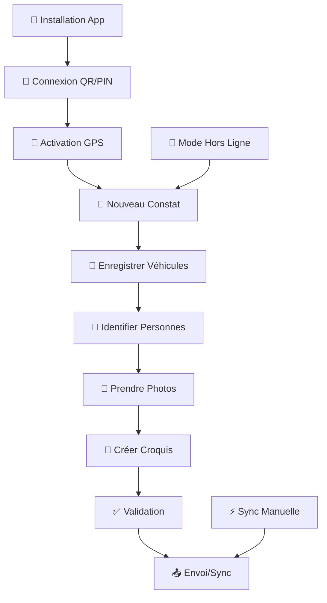

# 🚀 Guide Rapide : Agents Constatateurs

**Durée estimée** : 15 minutes  
**Niveau** : Débutant  
**Version** : 2.0

---

## Pré-requis

- Lire les [principes communs](principes-communs.md) pour vérifier les prérequis matériels, la connexion et les règles de sécurité.  
- Disposer d’un smartphone/tablette Android ou iOS avec l’application **DOSER DATA CAPTURE** installée (version ≥ 2.0).  
- Avoir vos identifiants DOSER, le QR code d’initialisation et l’autorisation d’accéder aux modules Police/Gendarmerie.  
- Activer les permissions **GPS**, **caméra**, **micro**, **stockage** et prévoir un mode de connexion (4G/5G ou WiFi).  
- Se munir des équipements terrain habituels (gilet, carnet de notes, rubalise, appareils de mesure, etc.).

## Checklist de démarrage

### Objectifs du guide

- Installer et configurer l’application mobile.  
- Créer et envoyer un constat complet avec géolocalisation, pièces jointes et validation.  
- Maîtriser le travail hors ligne et la synchronisation différée.

### Avant de partir en intervention

- [ ] Application installée et mise à jour.  
- [ ] QR code scanné, identifiants testés, code PIN créé.  
- [ ] GPS activé, stockage libre suffisant pour photos/vidéos.  
- [ ] Constat de test réalisé puis synchronisé (pour valider la chaîne complète).  
- [ ] Numéros d’urgence et contacts support enregistrés.

## Procédure standard

### 🎬 Workflow complet avec captures d'écran

### Vue d'Ensemble du Workflow



### Workflow Détaillé par Écrans

#### Écran 1 : Installation et Premier Lancement
```
┌─────────────────────────────────────┐
│  📱 DOSER DATA CAPTURE             │
│  Version 2.0 - Police/Gendarmerie  │
│                                     │
│  [🔐 Se connecter]                 │
│  [⚙️  Paramètres]                  │
│  [❓ Aide]                         │
│                                     │
│  Statut: 🟢 Prêt                   │
└─────────────────────────────────────┘
```

#### Écran 2 : Connexion par QR Code
```
┌─────────────────────────────────────┐
│  🔐 Connexion                      │
│                                     │
│  [📷 Scanner QR Code]              │
│                                     │
│  Serveur: https://doser.ditros.org │
│  Utilisateur: [________________]   │
│  Mot de passe: [________________]  │
│                                     │
│  [🔑 Se connecter]                 │
└─────────────────────────────────────┘
```

#### Écran 3 : Configuration PIN
```
┌─────────────────────────────────────┐
│  🔒 Sécurité                       │
│                                     │
│  Créez un code PIN à 4 chiffres    │
│  pour protéger vos données         │
│                                     │
│  Code PIN: [●][●][●][●]            │
│  Confirmer: [●][●][●][●]           │
│                                     │
│  [✅ Valider]                      │
└─────────────────────────────────────┘
```

#### Écran 4 : Accueil Principal
```
┌─────────────────────────────────────┐
│  🏠 Accueil - Agent Constatateur   │
│                                     │
│  [➕ Nouveau Constat]              │
│  [📋 Constats en cours]            │
│  [📊 Statistiques]                 │
│  [⚙️  Paramètres]                  │
│                                     │
│  Statut: 🟢 Connecté               │
│  Sync: 0 en attente                │
└─────────────────────────────────────┘
```

#### Écran 5 : Création de Constat
```
┌─────────────────────────────────────┐
│  📝 Nouveau Constat                │
│                                     │
│  📅 Date: 09/10/2025 14:30         │
│  📍 Localisation: [📍 GPS Actif]   │
│                                     │
│  Type d'accident:                  │
│  ○ Collision frontale              │
│  ● Collision arrière               │
│  ○ Sortie de route                 │
│  ○ Renversement piéton             │
│                                     │
│  [➡️  Continuer]                   │
└─────────────────────────────────────┘
```

#### Écran 6 : Géolocalisation
```
┌─────────────────────────────────────┐
│  📍 Géolocalisation                │
│                                     │
│  🎯 Coordonnées GPS:               │
│  Latitude: 3.8480°N                │
│  Longitude: 11.5021°E              │
│  Précision: ±3 mètres              │
│                                     │
│  📍 Adresse:                       │
│  Avenue Kennedy, Yaoundé           │
│  [✏️  Modifier]                    │
│                                     │
│  [✅ Valider]                      │
└─────────────────────────────────────┘
```

#### Écran 7 : Enregistrement Véhicules
```
┌─────────────────────────────────────┐
│  🚗 Véhicules Impliqués            │
│                                     │
│  Véhicule 1:                       │
│  🏷️  Immatriculation: CE-1234-AB   │
│  🚙 Type: Voiture particulière      │
│  💥 Dégâts: Moyens                 │
│                                     │
│  [➕ Ajouter Véhicule]             │
│  [📷 Scanner Plaque]               │
│                                     │
│  [➡️  Continuer]                   │
└─────────────────────────────────────┘
```

#### Écran 8 : Identification Personnes
```
┌─────────────────────────────────────┐
│  👥 Personnes Impliquées           │
│                                     │
│  Personne 1:                       │
│  👤 Nom: MARTIN Jean               │
│  🎭 Rôle: Conducteur               │
│  🏥 État: Indemne                  │
│                                     │
│  [➕ Ajouter Personne]             │
│  [📷 Scanner Carte ID]             │
│                                     │
│  [➡️  Continuer]                   │
└─────────────────────────────────────┘
```

#### Écran 9 : Prise de Photos
```
┌─────────────────────────────────────┐
│  📸 Documentation Photos            │
│                                     │
│  📷 Photos prises: 8/10            │
│                                     │
│  [📷 Prendre Photo]                │
│  [🖼️  Galerie]                     │
│                                     │
│  📋 Checklist:                     │
│  ✅ Vue d'ensemble                 │
│  ✅ Véhicule 1 (4 angles)          │
│  ✅ Traces de freinage             │
│  ⏳ Signalisation                  │
│                                     │
│  [➡️  Continuer]                   │
└─────────────────────────────────────┘
```

#### Écran 10 : Création Croquis
```
┌─────────────────────────────────────┐
│  🎨 Croquis de l'Accident          │
│                                     │
│  [🖊️  Dessiner]                    │
│  [📐 Outils]                       │
│  [📝 Annotations]                  │
│                                     │
│  Légende:                          │
│  🚗 Véhicule A                     │
│  🚗 Véhicule B                     │
│  🛣️  Sens de circulation           │
│                                     │
│  [💾 Enregistrer]                  │
└─────────────────────────────────────┘
```

#### Écran 11 : Validation et Envoi
```
┌─────────────────────────────────────┐
│  ✅ Validation du Constat          │
│                                     │
│  📊 Complétude: 95%                │
│                                     │
│  ✅ Informations générales         │
│  ✅ Géolocalisation                │
│  ✅ Véhicules (2)                  │
│  ✅ Personnes (2)                  │
│  ✅ Photos (10)                    │
│  ✅ Croquis                        │
│                                     │
│  [📤 Envoyer]                      │
│  [💾 Sauvegarder]                  │
└─────────────────────────────────────┘
```

#### Écran 12 : Mode Hors Ligne
```
┌─────────────────────────────────────┐
│  🔄 Mode Hors Ligne                │
│                                     │
│  📡 Connexion: ❌ Hors ligne       │
│  💾 Données: 3 constats en attente │
│                                     │
│  ✅ Travail possible hors ligne    │
│  ✅ Synchronisation automatique     │
│  ✅ Données sécurisées             │
│                                     │
│  [🔄 Sync Manuelle]                │
│  [⚙️  Paramètres]                  │
└─────────────────────────────────────┘
```

---

### 📱 Étape 1 : Installation de l'application (2 min)

### Sur Android

1. Ouvrez le **Google Play Store**
2. Recherchez "**DOSER DATA CAPTURE**"
3. Tapez sur **Installer**
4. Attendez la fin du téléchargement

### Sur iOS

1. Ouvrez l'**App Store**
2. Recherchez "**DOSER DATA CAPTURE**"
3. Tapez sur **Obtenir**
4. Authentifiez-vous si nécessaire

💡 **Astuce** : L'application pèse environ 50 MB. Utilisez le WiFi pour économiser vos données mobiles.

✓ **Résultat attendu** : L'icône DOSER apparaît sur votre écran d'accueil

---

### 🔐 Étape 2 : Première connexion (3 min)

### Connexion par QR Code

1. Ouvrez l'application DOSER
2. Tapez sur **"Scanner QR Code"**
3. Scannez le QR code fourni par votre administrateur
4. L'adresse du serveur est renseignée automatiquement
5. Entrez votre **nom d'utilisateur** et **mot de passe**
6. Tapez sur **Connexion**


### Configuration du Code PIN

Après la première connexion :

1. L'application vous demande de créer un **code PIN à 4 chiffres**
2. Choisissez un code facile à retenir mais sécurisé
3. Confirmez le code
4. Ce code protégera vos données entre les sessions

✓ **Résultat attendu** : Vous êtes connecté et l'écran d'accueil s'affiche

---

### 📝 Étape 3 : Créer votre premier constat (5 min)

### 3.1 Démarrer un Nouveau Constat

1. Sur l'écran d'accueil, tapez sur le bouton **"+ Nouveau Constat"**
2. L'écran de création s'ouvre

### 3.2 Saisir les Informations Générales

1. **Date et heure** : Pré-remplies automatiquement (modifiables si besoin)
2. **Type d'accident** : Sélectionnez dans la liste
   - Collision frontale
   - Collision arrière
   - Sortie de route
   - Renversement de piéton
   - Autre
3. **Météo** : Sélectionnez les conditions
4. **État de la chaussée** : Sèche / Mouillée / Verglacée

### 3.3 Géolocaliser l'Accident

1. Tapez sur **"Activer GPS"**
2. Autorisez l'accès à votre localisation
3. Le système récupère automatiquement vos coordonnées
4. L'adresse est générée automatiquement
5. Vérifiez et ajustez si nécessaire

💡 **Astuce** : Si le GPS ne fonctionne pas, vous pouvez saisir l'adresse manuellement.

### 3.4 Enregistrer les Véhicules

1. Tapez sur **"Ajouter Véhicule"**
2. Saisissez ou scannez l'**immatriculation**
3. Sélectionnez le **type de véhicule**
4. Indiquez le **degré d'endommagement** (léger / moyen / grave)
5. Tapez sur **"Enregistrer"**
6. Répétez pour chaque véhicule impliqué

### 3.5 Identifier les Personnes

1. Tapez sur **"Ajouter Personne"**
2. Sélectionnez le **rôle** : Conducteur / Passager / Piéton / Témoin
3. Saisissez les **informations personnelles**
4. Indiquez l'**état** : Indemne / Blessé léger / Blessé grave / Décédé
5. Tapez sur **"Enregistrer"**
6. Répétez pour chaque personne

✓ **Résultat attendu** : Les informations de base sont enregistrées

---

### 📸 Étape 4 : Documenter la scène (3 min)

### Prendre des Photos

1. Tapez sur l'onglet **"Photos"**
2. Tapez sur **"Ajouter Photo"**
3. Choisissez **"Prendre une photo"** ou **"Galerie"**
4. Prenez plusieurs photos :
   - Vue d'ensemble de la scène
   - Chaque véhicule (4 angles)
   - Traces de freinage
   - Dégâts matériels
   - Signalisation environnante

💡 **Bonnes pratiques** :
- Minimum 10 photos par accident
- Photos nettes et bien cadrées
- Utilisez le mode HDR si possible

### Créer un Croquis (Optionnel)

1. Tapez sur l'onglet **"Croquis"**
2. Tapez sur **"Créer Croquis"**
3. Dessinez la position des véhicules
4. Indiquez le sens de circulation
5. Ajoutez des annotations
6. Tapez sur **"Enregistrer"**

✓ **Résultat attendu** : La documentation visuelle est complète

---

### 🔄 Étape 5 : Travailler hors ligne (2 min)

### Mode Hors Ligne Automatique

L'application DOSER fonctionne **automatiquement hors ligne** :

- ✅ Toutes les données sont sauvegardées localement
- ✅ Vous pouvez continuer à travailler sans connexion
- ✅ Les données se synchroniseront automatiquement plus tard

### Vérifier le Statut

1. Regardez l'icône en haut à droite :
   - 🟢 **Vert** = Connecté
   - 🟠 **Orange** = Hors ligne (données en attente)
   - 🔴 **Rouge** = Erreur de synchronisation

2. Pour voir les détails :
   - Tapez sur l'icône de statut
   - Consultez le nombre de constats en attente

### Synchronisation Manuelle

Si vous voulez synchroniser immédiatement :

1. Assurez-vous d'avoir une connexion Internet
2. Menu > **Paramètres** > **Synchronisation**
3. Tapez sur **"Synchroniser Maintenant"**
4. Attendez la fin de la synchronisation

✓ **Résultat attendu** : Vos données sont synchronisées avec le serveur

---

### ✅ Étape 6 : Finaliser et envoyer (1 min)

### Vérification Finale

1. Revenez à l'écran récapitulatif
2. Vérifiez chaque section :
   - ✓ Informations générales complètes
   - ✓ Au moins 1 véhicule enregistré
   - ✓ Conducteurs identifiés
   - ✓ Photos prises
   - ✓ Géolocalisation OK

3. L'application affiche un **indicateur de complétude** :
   - 🟢 100% = Toutes les données requises
   - 🟠 75% = Quelques données manquantes
   - 🔴 50% = Données insuffisantes

### Validation et Envoi

1. Tapez sur **"Valider le Constat"**
2. L'application vérifie la cohérence des données
3. Corrigez les erreurs si nécessaire
4. Tapez sur **"Envoyer"**
5. Le constat est envoyé au serveur (ou mis en file d'attente si hors ligne)

✓ **Résultat attendu** : Votre premier constat est créé et envoyé !

---

### 🎯 Workflows spécialisés par type d'accident

### 🚗 Accident Simple (2 véhicules, pas de blessés)

**⏱️ Temps estimé : 5-7 minutes**

#### Workflow Étape par Étape :

```
1. 📱 NOUVEAU CONSTAT
   └── Type: Collision arrière
   └── Météo: Sèche
   └── Chaussée: Sèche

2. 📍 GÉOLOCALISATION
   └── GPS automatique
   └── Vérifier adresse
   └── Précision: ±3m

3. 🚗 VÉHICULES (2)
   └── Véhicule A: CE-1234-AB (dégâts légers)
   └── Véhicule B: CE-5678-CD (dégâts moyens)
   └── Scanner plaques si possible

4. 👥 PERSONNES (2 conducteurs)
   └── Conducteur A: Indemne
   └── Conducteur B: Indemne
   └── Vérifier permis de conduire

5. 📸 PHOTOS (5-10)
   └── Vue d'ensemble
   └── 4 angles par véhicule
   └── Traces de freinage
   └── Signalisation

6. ✅ VALIDATION & ENVOI
   └── Vérifier complétude
   └── Envoyer immédiatement
```

### 🚨 Accident avec Blessés

**⏱️ Temps estimé : 10-15 minutes**

#### Workflow Prioritaire :

```
1. 🚨 ALERTE SANTÉ
   └── Appeler SAMU (15) si nécessaire
   └── Coordonner avec services de secours
   └── Priorité aux soins médicaux

2. 📱 CONSTAT RAPIDE
   └── Type: Accident avec blessés
   └── Gravité: Légère/Moyenne/Grave
   └── Nombre de victimes: X

3. 📍 GÉOLOCALISATION URGENTE
   └── GPS immédiat
   └── Adresse précise pour secours
   └── Points de repère

4. 🚗 VÉHICULES (priorité)
   └── Enregistrer rapidement
   └── Dégâts secondaires
   └── État des véhicules

5. 👥 VICTIMES (détaillé)
   └── Nom, âge, état
   └── Blessures visibles
   └── Transport vers hôpital
   └── Contact famille
   └── Certificats médicaux initiaux
   └── Dépistage alcoolémie/stupéfiants
   └── Enregistrement des plaintes

6. 📸 PHOTOS & INDICES (essentielles)
   └── Scène générale
   └── Position des victimes
   └── Véhicules impliqués
   └── Traces de freinage
   └── Débris et indices
   └── État des feux tricolores
   └── Conditions météorologiques

7. ✅ ENVOI PRIORITAIRE
   └── Validation accélérée
   └── Envoi immédiat
   └── Notification services de santé
```

### 🚛 Accident Multi-Véhicules

**⏱️ Temps estimé : 15-20 minutes**

#### Workflow Collaboratif :

```
1. 👥 COORDINATION ÉQUIPE
   └── Désigner chef d'équipe
   └── Répartir les tâches
   └── Communication radio

2. 📱 CONSTAT PRINCIPAL
   └── Type: Multi-véhicules
   └── Nombre de véhicules: X
   └── Gravité globale

3. 📍 GÉOLOCALISATION PRÉCISE
   └── GPS haute précision
   └── Mesures de distance
   └── Orientation des véhicules

4. 🚗 VÉHICULES (tous)
   └── Véhicule 1: [détails]
   └── Véhicule 2: [détails]
   └── Véhicule 3: [détails]
   └── Position relative
   └── État physique et dommages
   └── Constatations techniques (compteur, vitesse)
   └── Ordinateur de bord/chronotachygraphe

5. 👥 TOUTES LES PERSONNES
   └── Conducteurs (audition détaillée)
   └── Passagers
   └── Témoins (recueil des témoignages)
   └── État de chacun
   └── Dépistage alcoolémie/stupéfiants
   └── Enregistrement des plaintes

6. 📸 PHOTOS SYSTÉMATIQUES
   └── Vue aérienne (si possible)
   └── Chaque véhicule isolé
   └── Positions relatives
   └── Traces et indices

7. 🎨 CROQUIS DÉTAILLÉ
   └── Plan précis
   └── Positions exactes
   └── Sens de circulation
   └── Points de collision

8. ✅ VALIDATION COLLABORATIVE
   └── Vérification croisée
   └── Cohérence des données
   └── Envoi coordonné
```

### 🚶 Accident Piéton

**⏱️ Temps estimé : 8-12 minutes**

#### Workflow Spécialisé :

```
1. 🚨 URGENCE MÉDICALE
   └── Appel SAMU immédiat
   └── Premiers secours
   └── Protection de la victime

2. 📱 CONSTAT PIÉTON
   └── Type: Renversement piéton
   └── Gravité des blessures
   └── Âge de la victime

3. 📍 GÉOLOCALISATION PRÉCISE
   └── Position exacte du piéton
   └── Passage piéton proche
   └── Signalisation

4. 🚗 VÉHICULE IMPLIQUÉ
   └── Immatriculation
   └── État du véhicule
   └── Vitesse estimée

5. 👥 VICTIME + CONDUCTEUR
   └── Identité du piéton
   └── État des blessures
   └── Conducteur + témoins
   └── Audition détaillée du conducteur
   └── Recueil des témoignages
   └── Dépistage alcoolémie/stupéfiants
   └── Certificats médicaux initiaux

6. 📸 PHOTOS LÉGALES
   └── Position de la victime
   └── Véhicule et dégâts
   └── Passage piéton
   └── Signalisation
   └── Traces de freinage
   └── Débris et indices
   └── Conditions météorologiques
   └── État de la chaussée

7. 🎨 CROQUIS OBLIGATOIRE
   └── Trajectoire du piéton
   └── Trajectoire du véhicule
   └── Point d'impact
   └── Distances

8. ✅ ENVOI URGENT
   └── Validation rapide
   └── Envoi prioritaire
   └── Notification famille
```

### 🏍️ Accident Motocycliste

**⏱️ Temps estimé : 6-10 minutes**

#### Workflow Spécialisé :

```
1. 🚨 PROTECTION VICTIME
   └── Ne pas retirer le casque
   └── Immobiliser si nécessaire
   └── Appel secours

2. 📱 CONSTAT MOTO
   └── Type: Accident moto
   └── Équipement de protection
   └── Gravité des blessures

3. 📍 GÉOLOCALISATION
   └── Position moto
   └── Position conducteur
   └── Traces de chute

4. 🏍️ VÉHICULE MOTO
   └── Immatriculation
   └── Type de moto
   └── État du casque
   └── Équipements

5. 👥 CONDUCTEUR MOTO
   └── Identité
   └── Permis moto
   └── État des blessures
   └── Équipement porté

6. 📸 PHOTOS SPÉCIALISÉES
   └── Moto et dégâts
   └── Casque et équipements
   └── Traces de freinage
   └── Position finale

7. ✅ ENVOI RAPIDE
   └── Validation
   └── Envoi immédiat
```

### 📋 Procédures complémentaires

### 🔍 Collecte et Analyse des Indices
- **Traces de freinage** : Mesurer et photographier
- **Débris** : Collecter et identifier
- **État des feux tricolores** : Vérifier le fonctionnement
- **Signalisation** : Contrôler la visibilité et l'état
- **Reconstruction** : Analyser pour reconstituer l'accident

### 🌤️ Documentation Météorologique
- **Conditions météo** : Pluie, vent, verglas, brouillard
- **État de la chaussée** : Sèche, mouillée, verglacée
- **Visibilité** : Distance de visibilité estimée
- **Heure** : Moment précis de l'accident

### 🚧 Mesures Prises sur les Lieux
- **Sécurisation** : Balisage et protection de la zone
- **Déviation du trafic** : Mise en place de déviations
- **Évacuation** : Déblaiement des véhicules
- **Coordination** : Liaison avec les services techniques

### 🏥 Liaison Patients-Victimes
- **Association** : Lier chaque patient à son dossier d'accident
- **Suivi médical** : Coordonner avec les services de santé
- **Certificats** : Collecter les certificats médicaux
- **Famille** : Informer les proches des victimes

### 🎯 Cas d'usage rapides

### Accident Simple (2 véhicules, pas de blessés)

⏱️ Temps estimé : 5-7 minutes

1. Nouveau constat
2. GPS automatique
3. 2 véhicules
4. 2 conducteurs (indemnes)
5. 5-10 photos
6. Envoyer

### Accident avec Blessés

⏱️ Temps estimé : 10-15 minutes

1. Nouveau constat
2. Coordonner avec services de secours
3. Enregistrer véhicules
4. Identifier victimes + état
5. Documentation complète
6. Envoyer en priorité

### Accident Multi-Véhicules

⏱️ Temps estimé : 15-20 minutes

1. Nouveau constat
2. Plusieurs agents peuvent collaborer
3. Enregistrer chaque véhicule
4. Identifier toutes les personnes
5. Photos détaillées
6. Croquis recommandé
7. Envoyer

---

### 💻 Utilisation de l'interface web DOSER

### Accès à la Plateforme Web

L'interface web DOSER est utilisée dans plusieurs cas :

📍 **Déclarations depuis le bureau** : Pour les accidents nécessitant une analyse approfondie ou une saisie détaillée  
🚨 **Transformation d'alertes VAAR** : Conversion des alertes du Module de Vigilance et d'Alerte (issues des réseaux sociaux, médias, ou déclarations citoyennes) en déclarations d'accident officielles  
📱 **Alternative à l'application mobile** : Pour les agents préférant travailler sur ordinateur  
📊 **Enrichissement de données** : Ajout de documents et informations complémentaires

**Adresse d'accès** : `http://51.195.80.167:8098`

### Configuration PC Requise

Pour une utilisation optimale de l'interface web :

| Composant | Spécification Minimale |
|-----------|------------------------|
| **Processeur** | Intel Core i5 CPU 2.30 GHz |
| **RAM** | 8 Go |
| **Système** | Windows 10 64 bits |
| **Espace disque** | 300 Go |
| **Navigateur** | Chrome, Firefox, Edge (dernière version) |

### Connexion à l'Interface Web

1. **Ouvrir votre navigateur** (Chrome, Firefox ou Edge recommandés)
2. **Entrer l'adresse** : `http://51.195.80.167:8098`
3. **Renseigner vos identifiants** :
   - Identifiant (fourni par votre hiérarchie)
   - Mot de passe
4. **Cliquer sur "CONNEXION"**

### Créer une Déclaration d'Accident via Web

#### Étape 1 : Accéder à l'Interface d'Ajout

Après connexion, vous avez **deux options** pour ajouter un accident :

- **Option 1** : Cliquer sur le bouton `➕ Ajouter` dans la page d'accueil des accidents
- **Option 2** : Menu de droite > Module Police > Ajouter un accident

#### Étape 2 : Renseigner les Informations de l'Enquêteur

- **Nom et prénom** de l'agent constatateur
- **Matricule** ou identifiant
- **Unité** ou brigade d'affectation
- **Date et heure** d'intervention

**Cliquer sur "Suivant"** après avoir rempli le formulaire.

#### Étape 3 : Localisation de l'Accident

- **Sélectionner la région/département/arrondissement**
- **Préciser le lieu** (route, intersection, quartier)
- **Coordonnées GPS** (si disponibles)
- **Cliquer sur la carte** pour positionner le marqueur

**Cliquer sur "Suivant"** pour continuer.

#### Étape 4 : Informations sur l'Accident

Renseigner :
- **Date et heure exactes** de l'accident
- **Type d'accident** (collision, renversement, etc.)
- **Gravité** (matériel, blessés légers, graves, mortel)
- **Conditions météorologiques**
- **Visibilité** au moment de l'accident

**Cliquer sur "Suivant"**.

#### Étape 5 : Informations sur la Route

- **Type de route** (nationale, départementale, urbaine)
- **État de la chaussée** (bonne, moyenne, mauvaise)
- **Signalisation** présente (panneaux, feux, marquage)
- **Éclairage** (jour, nuit avec/sans éclairage)

**Cliquer sur "Suivant"**.

#### Étape 6 : Ajout des Véhicules

Pour **chaque véhicule** impliqué :

1. **Renseigner** :
   - Marque, modèle, immatriculation
   - Type de véhicule
   - Dommages observés
   - Position sur le croquis

2. **Ajouter des documents** :
   - Photo du véhicule
   - Photo de la carte grise
   - Photo de l'assurance

3. **Cliquer sur "Enregistrer"**
4. **Répéter** pour chaque véhicule
5. **Cliquer sur "Suivant"** après avoir ajouté tous les véhicules

#### Étape 7 : Ajout des Personnes (Usagers)

Pour **chaque personne** impliquée :

1. **Renseigner** :
   - Nom, prénom, âge
   - Qualité (conducteur, passager, piéton, témoin)
   - État (indemne, blessé, décédé)
   - Coordonnées (si disponibles)

2. **Ajouter des documents** :
   - Photo de la CNI/passeport
   - Photo du permis de conduire (si conducteur)
   - Certificat médical (si blessé)

3. **Cliquer sur "Enregistrer"**
4. **Répéter** pour chaque personne
5. **Cliquer sur "Suivant"**

#### Étape 8 : Ajout du Croquis

**Deux options disponibles** :

**Option A : Dessiner le Croquis**
1. Cliquer sur "📐 Dessiner"
2. Utiliser les outils de dessin pour créer le schéma
3. Placer les véhicules, les personnes, la signalisation
4. Ajouter les légendes et annotations
5. Enregistrer le croquis

**Option B : Importer un Croquis**
1. Cliquer sur "📁 Importer"
2. Sélectionner le fichier (image ou PDF)
3. Valider l'import

**Cliquer sur "Suivant"** après avoir ajouté le croquis.

#### Étape 9 : Procès-Verbal

- **Rédiger les observations** sur les circonstances de l'accident
- **Ajouter les remarques** pertinentes
- **Mentionner les éléments** techniques (traces de freinage, débris, etc.)

**Cliquer sur "Suivant"**.

#### Étape 10 : Dépositions

Pour **chaque déposition** :

1. **Cliquer sur `➕ Déposition`**
2. **Renseigner** :
   - Identité du déclarant
   - Qualité (conducteur, témoin, victime)
   - Texte de la déposition

3. **Enregistrer** la déposition
4. **Répéter** pour chaque témoignage
5. **Cliquer sur "Terminer"** pour finaliser la création

### Enrichir une Déclaration (Statut OPENED)

Une fois la déclaration créée, elle passe au statut **OPENED**. Vous pouvez l'enrichir :

#### Actions Disponibles

Dans la liste des déclarations, **cliquer sur "Actions"** pour :

1. **📄 Générer le Rapport PDF** : Créer et imprimer le rapport complet
2. **✏️ Modifier la Déclaration** : Corriger ou compléter les informations
3. **🎨 Ajouter/Modifier le Croquis** : Améliorer le schéma
4. **✍️ Signer la Déclaration** : Finaliser votre travail

#### Modifier la Déclaration

Vous pouvez modifier :
- **Images** : Ajouter, supprimer, remplacer les photos
- **Localisation** : Corriger les coordonnées GPS
- **Informations accident** : Modifier les détails
- **Informations route** : Ajuster les données
- **Véhicules** : Ajouter, modifier, supprimer des véhicules
- **Personnes** : Gérer les usagers impliqués
- **Procès-verbaux et dépositions** : Compléter les témoignages

**Cliquer sur "Enregistrer"** après chaque modification.

#### Signer la Déclaration

**Étape finale avant validation** :

1. **Cliquer sur "✍️ Signer le Rapport"**
2. **Dessiner votre signature** sur l'interface tactile
3. **Cliquer sur "Enregistrer"**

**⚠️ Important** : Une fois signée, la déclaration passe au statut **READY** et sera transmise à votre supérieur pour validation. Vous ne pourrez plus la modifier.

### Statuts de la Déclaration

| Statut | Description | Actions Possibles |
|--------|-------------|-------------------|
| **OPENED** | Déclaration en cours de rédaction | Modifier, Enrichir, Signer |
| **AJOUTE** | Croquis ajouté récemment | Modifier, Enrichir, Signer |
| **READY** | Prête pour validation | Consultation uniquement |
| **REJECTED** | Rejetée par le validateur | Modifier selon les remarques, Re-signer |
| **ACCEPTED** | Validée et acceptée | Consultation uniquement |

### Délai de Déclaration

**⏱️ Important** : Toutes les déclarations doivent être enregistrées dans le système **sous un délai de 60 jours** maximum après l'accident.

---

### ⚠️ Problèmes fréquents et solutions

### Le GPS ne fonctionne pas

**Solution** :
1. Vérifiez que la localisation est activée sur votre téléphone
2. Allez dans Paramètres > Localisation > Autorisations
3. Autorisez DOSER à accéder à votre position
4. Redémarrez l'application

### Les photos ne s'enregistrent pas

**Solution** :
1. Vérifiez l'espace de stockage disponible
2. Autorisez l'accès à la caméra et au stockage
3. Paramètres > Applications > DOSER > Autorisations

### La synchronisation échoue

**Solution** :
1. Vérifiez votre connexion Internet
2. Menu > Paramètres > Vérifier la connexion
3. Réessayez dans quelques minutes
4. Si le problème persiste, contactez le support

### J'ai oublié mon code PIN

**Solution** :
1. Sur l'écran de connexion, tapez "Code PIN oublié ?"
2. Entrez votre nom d'utilisateur et mot de passe
3. Créez un nouveau code PIN

---

## Aller plus loin

### Manuel Complet

Pour une documentation exhaustive de toutes les fonctionnalités :
📕 [Manuel Complet des Agents Constatateurs](../../manuel/agents-constatateurs.md)

### Formation Avancée

- 🎓 Formations en présentiel disponibles
- 📞 Support technique : support@ditros.org

---

## Support & ressources

### Support Technique
- **📧 Email** : support@ditros.org
- **📞 Hotline** : +237 XXX XXX XXX (24/7)
- **💬 Chat** : Disponible dans l'application

### Contacts Utiles
- **👨‍🏫 Formation** : formation@ditros.org
- **🐛 Signaler un bug** : bugs@ditros.org
- **💡 Suggestions** : feedback@ditros.org

---

**Félicitations ! 🎉**  
Vous êtes maintenant prêt à utiliser DOSER DATA CAPTURE sur le terrain. La [checklist de démarrage](#checklist-de-demarrage) vous permet de valider que tout est prêt avant chaque mission.

**Prochaine étape** : Consultez le [Manuel complet](../../manuel/agents-constatateurs.md) pour découvrir toutes les fonctionnalités avancées.

---

*Guide créé le : 9 octobre 2025*  
*Dernière mise à jour : 9 octobre 2025*  
*Version : 2.0*

