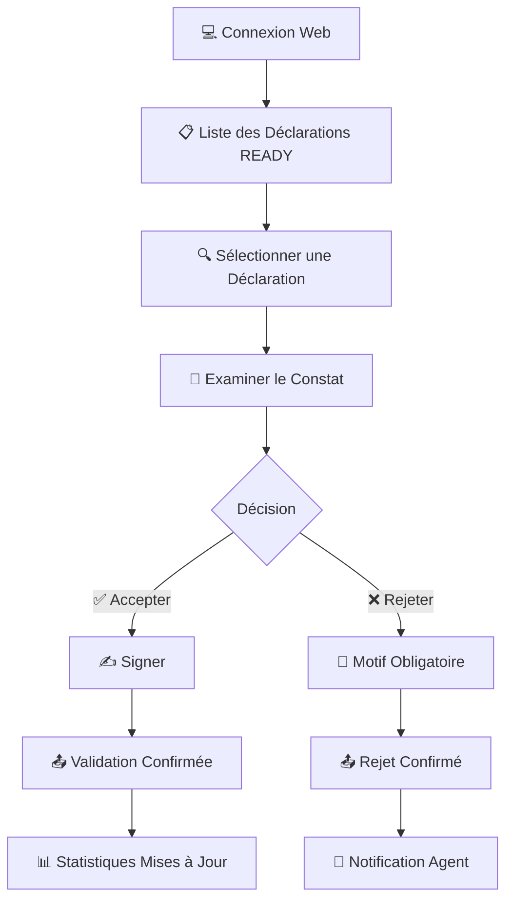

# 🚀 Guide Rapide : Agents Validateurs

**Durée estimée** : 10 minutes  
**Niveau** : Intermédiaire  
**Version** : 2.0

---

## 📋 Ce que vous allez apprendre

À la fin de ce guide, vous saurez :

✅ Accéder à l'interface web de validation  
✅ Consulter les déclarations en attente (statut READY)  
✅ Examiner et analyser un constat d'accident  
✅ Valider ou rejeter une déclaration avec justification  
✅ Suivre les indicateurs de qualité  

---

## 🎯 Votre Rôle en Tant qu'Agent Validateur

En tant qu'agent validateur, vous êtes le **garant de la qualité** des déclarations d'accidents. Votre mission :

🔍 **Contrôler** la conformité des constats selon les standards établis  
✅ **Vérifier** l'exactitude et la complétude des informations  
👍 **Valider** ou ❌ **Rejeter** les constats avec justifications appropriées  
🤝 **Coordonner** avec les agents constatateurs pour les corrections  
📊 **Assurer** la qualité des données pour les statistiques nationales  

---

## 💻 Accès à la Plateforme de Validation

### Configuration PC Requise

| Composant | Spécification Minimale |
|-----------|------------------------|
| **Processeur** | Intel Core i5 CPU 2.30 GHz |
| **RAM** | 8 Go |
| **Système** | Windows 10 64 bits |
| **Espace disque** | 300 Go |
| **Navigateur** | Chrome, Firefox, Edge (dernière version) |

### Connexion à l'Interface Web

1. **Ouvrir votre navigateur** (Chrome, Firefox ou Edge recommandés)
2. **Entrer l'adresse** : `http://51.195.80.167:8098`
3. **Renseigner vos identifiants** :
   - Identifiant (fourni par votre hiérarchie)
   - Mot de passe
4. **Cliquer sur "CONNEXION"**

⚠️ **Important** : Votre compte doit avoir les **droits de validateur** pour accéder aux fonctionnalités de validation.

---

## 📊 Interface de Validation

### Tableau de Bord Principal

Après connexion, vous accédez au **tableau de bord de validation** qui affiche :

📋 **Constats en attente** : Liste des déclarations avec le statut **READY** (prêtes pour validation)  
⏱️ **Priorisation automatique** basée sur :
- Ancienneté du constat
- Gravité de l'accident (mortel > blessés graves > matériel)
- Complexité du dossier

📈 **Indicateurs qualité** en temps réel :
- Nombre de constats validés aujourd'hui
- Taux d'acceptation/rejet
- Temps moyen de traitement

---

## 🎬 Workflow Complet avec Captures d'Écran

### Vue d'Ensemble du Workflow



### Workflow Détaillé par Écrans

#### Écran 1 : Connexion à l'Interface Web
```
┌─────────────────────────────────────────────────────┐
│  🔐 DOSER - Connexion Validateur                   │
│                                                      │
│  Serveur: http://51.195.80.167:8098                │
│                                                      │
│  Identifiant: [_________________________]          │
│  Mot de passe: [_________________________]         │
│                                                      │
│  [🔑 Se connecter]                                 │
│                                                      │
│  ⚠️ Accès réservé aux agents validateurs           │
└─────────────────────────────────────────────────────┘
```

#### Écran 2 : Tableau de Bord des Déclarations
```
┌─────────────────────────────────────────────────────────────────┐
│  📊 Tableau de Bord Validateur - Agent: DUPONT Jean            │
│                                                                  │
│  📈 Statistiques du Jour:                                       │
│  ✅ Validées: 12  |  ❌ Rejetées: 3  |  ⏱️ Temps moyen: 18min │
│                                                                  │
│  📋 Déclarations en Attente (READY): 8                         │
│  ┌──────────────────────────────────────────────────────────┐  │
│  │ Réf.      | Date       | Type        | Priorité | Actions│  │
│  ├──────────────────────────────────────────────────────────┤  │
│  │ ACC-2025-001 | 15/10 14h | 🚨 Mortel  | CRITIQUE | [▶]  │  │
│  │ ACC-2025-002 | 15/10 15h | 🤕 Blessés | HAUTE    | [▶]  │  │
│  │ ACC-2025-003 | 15/10 16h | 🚗 Matériel| NORMALE  | [▶]  │  │
│  │ ACC-2025-004 | 14/10 18h | 🚗 Matériel| NORMALE  | [▶]  │  │
│  └──────────────────────────────────────────────────────────┘  │
│                                                                  │
│  [🔄 Rafraîchir]  [📊 Rapports]  [⚙️ Paramètres]              │
└─────────────────────────────────────────────────────────────────┘
```

#### Écran 3 : Sélection d'une Déclaration
```
┌─────────────────────────────────────────────────────┐
│  📋 Déclaration ACC-2025-001                        │
│  🚨 PRIORITÉ CRITIQUE - Accident Mortel             │
│                                                      │
│  📍 Lieu: Yaoundé, Route Nationale 1                │
│  📅 Date: 15/10/2025 à 14h30                        │
│  👮 Agent: MBARGA Paul (Brigade Yaoundé-Centre)     │
│  📤 Soumis le: 15/10/2025 à 16h45                   │
│                                                      │
│  ┌─────────────────────────────────────────────┐   │
│  │ Actions Disponibles:                        │   │
│  │                                              │   │
│  │  [🔍 Consulter]  [✅ Valider]  [❌ Rejeter] │   │
│  └─────────────────────────────────────────────┘   │
└─────────────────────────────────────────────────────┘
```

#### Écran 4 : Consultation Détaillée du Constat
```
┌─────────────────────────────────────────────────────────────────┐
│  📖 Consultation Détaillée - ACC-2025-001                       │
│  ═══════════════════════════════════════════════════════════════│
│                                                                  │
│  📋 INFORMATIONS GÉNÉRALES                                      │
│  ├─ Date/Heure: 15/10/2025 à 14h30                             │
│  ├─ Lieu: RN1, PK 12, Yaoundé                                  │
│  ├─ Coordonnées GPS: 3.8480° N, 11.5021° E ✅                  │
│  ├─ Météo: Ensoleillé, Chaussée sèche                          │
│  └─ Visibilité: Bonne                                           │
│                                                                  │
│  🚗 VÉHICULES IMPLIQUÉS (2)                                     │
│  ├─ Véhicule A: Toyota Camry, LT-1234-YA                       │
│  │  └─ Photos: [📷][📷][📷][📷] ✅                             │
│  └─ Véhicule B: Moto Yamaha, LT-5678-YA                        │
│     └─ Photos: [📷][📷][📷] ✅                                  │
│                                                                  │
│  👥 PERSONNES IMPLIQUÉES (3)                                    │
│  ├─ Conducteur A: NKOMO Jean, 45 ans, Indemne                  │
│  ├─ Conducteur B: ATEBA Marie, 28 ans, Décédée 💀              │
│  └─ Témoin: FOTSO Paul, 52 ans                                 │
│                                                                  │
│  🎨 CROQUIS: [Voir le croquis] ✅                               │
│  📝 PROCÈS-VERBAL: [Lire le PV] ✅                              │
│  🗣️ DÉPOSITIONS: 3 dépositions enregistrées ✅                 │
│                                                                  │
│  ═══════════════════════════════════════════════════════════════│
│  [⬅️ Retour]  [✅ Accepter]  [❌ Rejeter]                       │
└─────────────────────────────────────────────────────────────────┘
```

#### Écran 5 : Vérification des Photos
```
┌─────────────────────────────────────────────────────┐
│  📸 Galerie Photos - Véhicule A                     │
│                                                      │
│  ┌──────────┐ ┌──────────┐ ┌──────────┐           │
│  │ [Photo 1]│ │ [Photo 2]│ │ [Photo 3]│           │
│  │  Avant   │ │  Arrière │ │ Côté G.  │           │
│  │  ✅ Net  │ │  ✅ Net  │ │  ✅ Net  │           │
│  └──────────┘ └──────────┘ └──────────┘           │
│                                                      │
│  ┌──────────┐                                       │
│  │ [Photo 4]│  Métadonnées:                        │
│  │ Côté D.  │  📅 15/10/2025 14:35                 │
│  │  ✅ Net  │  📍 GPS: 3.8480° N, 11.5021° E       │
│  └──────────┘  📷 Samsung Galaxy S21                │
│                                                      │
│  ✅ Toutes les photos sont exploitables             │
│                                                      │
│  [⬅️ Retour]  [➡️ Suivant]                         │
└─────────────────────────────────────────────────────┘
```

#### Écran 6 : Consultation du Croquis
```
┌─────────────────────────────────────────────────────┐
│  🎨 Croquis de l'Accident                           │
│                                                      │
│              N (Nord)                                │
│               ↑                                      │
│               │                                      │
│    ┌──────────┴──────────┐                         │
│    │    Route RN1        │                         │
│    │                     │                         │
│    │     🚗→             │  Véhicule A              │
│    │        ↘            │  (Toyota Camry)          │
│    │          ↘          │                         │
│    │            🏍💥     │  Point d'impact          │
│    │              ↓      │                         │
│    │              ⚰️     │  Victime (Moto)          │
│    │                     │                         │
│    └─────────────────────┘                         │
│                                                      │
│  Légende:                                           │
│  🚗 = Véhicule A (sens Est→Ouest)                  │
│  🏍 = Véhicule B (Moto, sens Sud→Nord)             │
│  💥 = Point d'impact                                │
│  ⚰️ = Position victime décédée                      │
│                                                      │
│  ✅ Croquis clair et proportionnel                  │
│                                                      │
│  [⬅️ Retour]  [➡️ Suivant]                         │
└─────────────────────────────────────────────────────┘
```

#### Écran 7 : Lecture du Procès-Verbal
```
┌─────────────────────────────────────────────────────┐
│  📝 Procès-Verbal d'Accident                        │
│                                                      │
│  Nous, MBARGA Paul, Agent de Police, certifions     │
│  que le 15 octobre 2025 à 14h30, nous avons été     │
│  appelés sur les lieux d'un accident de la          │
│  circulation survenu au PK 12 de la RN1.            │
│                                                      │
│  CIRCONSTANCES:                                      │
│  Le véhicule A (Toyota Camry, LT-1234-YA) circulait│
│  d'Est en Ouest à vitesse modérée. Au niveau du     │
│  carrefour, une motocycliste (Yamaha, LT-5678-YA)   │
│  a débouché brusquement du Sud sans respecter le    │
│  stop. Collision latérale. La conductrice de la     │
│  moto a été éjectée et est décédée sur le coup.     │
│                                                      │
│  CONSTATATIONS:                                      │
│  - Traces de freinage du véhicule A: 8 mètres       │
│  - Panneau STOP visible et en bon état              │
│  - Aucune trace d'alcoolémie (test négatif)         │
│  - Conditions météo favorables                       │
│                                                      │
│  TÉMOIGNAGES:                                        │
│  M. FOTSO Paul confirme que la moto n'a pas         │
│  marqué l'arrêt au stop.                            │
│                                                      │
│  ✅ PV complet et détaillé                          │
│                                                      │
│  [⬅️ Retour]  [➡️ Suivant]                         │
└─────────────────────────────────────────────────────┘
```

#### Écran 8 : Checklist de Validation
```
┌─────────────────────────────────────────────────────┐
│  ✅ Checklist de Validation                         │
│                                                      │
│  COMPLÉTUDE:                                         │
│  ✅ Tous les champs obligatoires remplis            │
│  ✅ Photos présentes et exploitables (7/7)          │
│  ✅ Croquis clair et proportionnel                  │
│  ✅ Documents légaux lisibles                       │
│  ✅ Procès-verbal complet                           │
│                                                      │
│  COHÉRENCE:                                          │
│  ✅ Photos correspondent aux descriptions           │
│  ✅ Heure cohérente avec luminosité                 │
│  ✅ GPS cohérent avec photos de lieu                │
│  ✅ Témoignages concordants                         │
│  ✅ Aucune contradiction détectée                   │
│                                                      │
│  CONFORMITÉ:                                         │
│  ✅ Procédures respectées                           │
│  ✅ Grille d'évaluation appliquée                   │
│  ✅ Réglementation respectée                        │
│                                                      │
│  SCORE QUALITÉ: 95/100 ⭐⭐⭐⭐⭐                    │
│                                                      │
│  [⬅️ Retour]  [✅ Accepter]  [❌ Rejeter]          │
└─────────────────────────────────────────────────────┘
```

#### Écran 9 : Décision - Accepter la Déclaration
```
┌─────────────────────────────────────────────────────┐
│  ✅ Validation de la Déclaration ACC-2025-001       │
│                                                      │
│  Vous êtes sur le point d'ACCEPTER cette           │
│  déclaration. Cette action est définitive.          │
│                                                      │
│  Commentaire (facultatif):                          │
│  ┌─────────────────────────────────────────────┐   │
│  │ Excellent travail. Constat très complet,    │   │
│  │ photos de qualité, PV détaillé. Procédures  │   │
│  │ parfaitement respectées.                     │   │
│  └─────────────────────────────────────────────┘   │
│                                                      │
│  ✍️ Signature Électronique:                        │
│  ┌─────────────────────────────────────────────┐   │
│  │                                              │   │
│  │         [Zone de signature tactile]         │   │
│  │              Jean DUPONT                     │   │
│  │                                              │   │
│  └─────────────────────────────────────────────┘   │
│                                                      │
│  [❌ Annuler]  [✅ Confirmer la Validation]        │
└─────────────────────────────────────────────────────┘
```

#### Écran 10 : Décision - Rejeter la Déclaration
```
┌─────────────────────────────────────────────────────┐
│  ❌ Rejet de la Déclaration ACC-2025-003            │
│                                                      │
│  Vous êtes sur le point de REJETER cette           │
│  déclaration. L'agent devra la corriger.           │
│                                                      │
│  ⚠️ Motif du Rejet (OBLIGATOIRE):                  │
│  ┌─────────────────────────────────────────────┐   │
│  │ - Photos manquantes du véhicule B (arrière  │   │
│  │   et côté droit)                             │   │
│  │ - Certificat médical non joint pour la      │   │
│  │   victime Monsieur ATEBA                     │   │
│  │ - Croquis imprécis : échelle non respectée, │   │
│  │   positions des véhicules peu claires       │   │
│  │ - PV incomplet : absence de description des │   │
│  │   traces de freinage                         │   │
│  │                                              │   │
│  │ Merci de compléter ces éléments avant       │   │
│  │ re-soumission.                               │   │
│  └─────────────────────────────────────────────┘   │
│                                                      │
│  [❌ Annuler]  [📤 Confirmer le Rejet]             │
└─────────────────────────────────────────────────────┘
```

#### Écran 11 : Confirmation de Validation
```
┌─────────────────────────────────────────────────────┐
│  ✅ VALIDATION CONFIRMÉE                            │
│                                                      │
│  La déclaration ACC-2025-001 a été validée avec    │
│  succès !                                           │
│                                                      │
│  📊 Résumé:                                         │
│  ├─ Statut: ACCEPTED ✅                             │
│  ├─ Validé par: Jean DUPONT                        │
│  ├─ Date: 15/10/2025 à 17:15                       │
│  └─ Temps de traitement: 18 minutes                │
│                                                      │
│  📤 Actions automatiques:                           │
│  ✅ Notification envoyée à l'agent MBARGA Paul     │
│  ✅ Transmission aux assurances                     │
│  ✅ Intégration statistiques nationales             │
│  ✅ Archivage en lecture seule                     │
│                                                      │
│  📈 Vos statistiques du jour:                       │
│  Validées: 13  |  Rejetées: 3  |  Taux: 81%        │
│                                                      │
│  [🏠 Retour à l'accueil]  [➡️ Déclaration suivante]│
└─────────────────────────────────────────────────────┘
```

#### Écran 12 : Confirmation de Rejet
```
┌─────────────────────────────────────────────────────┐
│  ❌ REJET CONFIRMÉ                                  │
│                                                      │
│  La déclaration ACC-2025-003 a été rejetée.        │
│                                                      │
│  📊 Résumé:                                         │
│  ├─ Statut: REJECTED ❌                             │
│  ├─ Rejeté par: Jean DUPONT                        │
│  ├─ Date: 15/10/2025 à 17:30                       │
│  └─ Temps de traitement: 15 minutes                │
│                                                      │
│  📤 Actions automatiques:                           │
│  ✅ Notification envoyée à l'agent MBARGA Paul     │
│  ✅ Motif du rejet transmis                        │
│  ✅ Déclaration retournée au statut OPENED         │
│  ✅ Historique des rejets mis à jour              │
│                                                      │
│  📈 Vos statistiques du jour:                       │
│  Validées: 13  |  Rejetées: 4  |  Taux: 76%        │
│                                                      │
│  [🏠 Retour à l'accueil]  [➡️ Déclaration suivante]│
└─────────────────────────────────────────────────────┘
```

---

## 🔍 Processus de Validation en 5 Étapes

### Étape 1 : Sélectionner une Déclaration à Valider

1. Dans la **liste des déclarations**, identifier celles avec le statut **READY**
2. Les déclarations sont triées par priorité (accidents graves en premier)
3. **Cliquer sur le bouton "Actions"** à droite de la déclaration
4. **Sélectionner "Validation"** dans le menu déroulant

### Étape 2 : Examiner les Informations Générales

Une interface détaillée s'affiche avec toutes les informations :

**📋 En-tête de la Déclaration :**
- Numéro de référence unique
- Date et heure de l'accident
- Lieu précis (région, département, arrondissement)
- Agent constatateur responsable
- Date de création et de soumission

**🚗 Véhicules Impliqués :**
- Liste complète avec photos
- Immatriculations et documents (carte grise, assurance)
- Dommages observés
- Position sur le croquis

**👥 Personnes Impliquées :**
- Conducteurs, passagers, piétons, témoins
- Documents d'identité (CNI, permis de conduire)
- État (indemne, blessé, décédé)
- Certificats médicaux (si applicable)

### Étape 3 : Vérifier la Qualité du Constat

**Points de Vigilance Obligatoires :**

✅ **Complétude** :
- Tous les champs obligatoires sont remplis
- Photos présentes et exploitables
- Documents légaux lisibles et valides
- Croquis clair et compréhensible

✅ **Cohérence** :
- Correspondance entre les descriptions écrites et les photos
- Cohérence temporelle (heure de l'accident vs conditions lumineuses)
- Cohérence spatiale (localisation GPS vs photos de lieu)
- Vraisemblance des témoignages

✅ **Conformité** :
- Respect des procédures établies
- Application des grilles d'évaluation
- Adéquation avec la réglementation locale

**🔴 Signaux d'Alerte (Rejet Probable) :**
- Photos floues ou manquantes
- Incohérences flagrantes entre témoignages
- Données GPS erronées
- Documents illisibles ou suspects
- Procès-verbal incomplet

### Étape 4 : Prendre une Décision

Vous avez **deux options** :

#### Option A : ✅ Accepter la Déclaration

**Quand accepter ?**
- Constat complet, cohérent et conforme
- Toutes les informations nécessaires sont présentes
- Qualité des preuves (photos, documents) satisfaisante

**Procédure :**
1. **Cliquer sur le bouton "Accepter"**
2. **Ajouter un commentaire** (facultatif) :
   - Féliciter l'agent pour la qualité du travail
   - Encourager les bonnes pratiques
   - Exemple : "Excellent travail, photos très claires et croquis précis"
3. **Dessiner votre signature** sur l'interface tactile
4. **Cliquer sur "Enregistrer"** pour confirmer

**Résultat :**
- Le statut passe à **ACCEPTED** ✅
- La déclaration est transmise aux systèmes en aval (assurances, statistiques)
- L'agent constatateur reçoit une notification de validation
- La déclaration devient consultable en lecture seule

#### Option B : ❌ Rejeter la Déclaration

**Quand rejeter ?**
- Constat incomplet ou incohérent
- Informations manquantes ou erronées
- Qualité insuffisante des preuves
- Non-conformité aux procédures

**Procédure :**
1. **Cliquer sur le bouton "Annuler"** ou "Rejeter"
2. **Renseigner OBLIGATOIREMENT un motif de refus** détaillé et constructif :

**Exemples de motifs de rejet :**
- ❌ "Photos manquantes du véhicule B (arrière et côté droit)"
- ❌ "Incohérence : accident déclaré à 14h mais photos montrent un coucher de soleil"
- ❌ "Données GPS erronées - localisation incohérente avec les photos"
- ❌ "Certificat médical manquant pour la victime Monsieur X"
- ❌ "Procès-verbal incomplet - absence de description des circonstances"
- ❌ "Croquis illisible - échelle non respectée, positions imprécises"
- ❌ "Témoignages contradictoires non clarifiés"

3. **Cliquer sur "Enregistrer"** pour confirmer le rejet

**Résultat :**
- Le statut passe à **REJECTED** ❌
- L'agent constatateur reçoit une notification immédiate avec le motif
- La déclaration retourne au statut **OPENED** pour modifications
- L'agent peut corriger et re-soumettre

### Étape 5 : Suivi et Statistiques

Après validation ou rejet :

**Pour les déclarations ACCEPTED :**
- Transmission automatique aux systèmes downstream
- Intégration dans les statistiques nationales
- Consultation en lecture seule uniquement

**Pour les déclarations REJECTED :**
- Notification automatique à l'agent constatateur
- Historique des rejets conservé pour suivi qualité
- Possibilité de re-soumission après corrections

---

## 📈 Indicateurs de Performance

Le système suit automatiquement vos performances :

| Indicateur | Description |
|------------|-------------|
| **Taux de validation** | % de déclarations acceptées vs rejetées |
| **Temps de traitement** | Délai moyen entre soumission et validation |
| **Motifs de rejet** | Catégorisation des problèmes récurrents |
| **Qualité par agent** | Performance de chaque agent constatateur |
| **Tendances** | Évolution de la qualité dans le temps |

---

## ⚖️ Vos Droits et Limites

### ✅ Ce que vous POUVEZ faire :

- Voir toutes les déclarations de votre organisation
- Valider (accepter ou refuser) les déclarations au statut READY
- Commenter vos décisions
- Consulter l'historique complet de chaque déclaration
- Générer des rapports de qualité

### ❌ Ce que vous NE POUVEZ PAS faire :

- Modifier directement une déclaration (seul l'agent constatateur peut le faire)
- Supprimer une déclaration validée
- Valider vos propres déclarations (si vous êtes aussi agent constatateur)

---

## ⏱️ Temps de Traitement Recommandés

| Type d'Accident | Temps Recommandé | Priorité |
|-----------------|------------------|----------|
| **Accident matériel simple** | 10-15 minutes | Normale |
| **Accident avec blessés légers** | 15-20 minutes | Moyenne |
| **Accident avec blessés graves** | 20-30 minutes | Haute |
| **Accident mortel** | 30-45 minutes | **Critique** |
| **Accident multi-véhicules (>3)** | 30-45 minutes | Haute |

⚠️ **Important** : La **qualité prime sur la rapidité**. Prenez le temps nécessaire pour une validation rigoureuse.

---

## 🚨 Cas Particuliers

### Accidents avec Blessés Graves ou Décès

- **Validation prioritaire** sous 2 heures maximum
- **Double validation** obligatoire (par deux validateurs différents)
- **Coordination** avec services judiciaires si nécessaire
- **Vérification renforcée** des certificats médicaux et procédures

### Suspicion de Fraude

**Indicateurs de fraude :**
- Incohérences temporelles ou spatiales
- Témoignages contradictoires
- Documents falsifiés ou illisibles
- Dommages non cohérents avec la description

**Procédure :**
1. Marquer "Suspicion de fraude"
2. Alerter automatiquement les superviseurs
3. Conserver toutes les preuves numériques
4. Ne pas valider - escalader immédiatement

### Données Manquantes ou Corrompues

**Photos manquantes :**
- Contact immédiat avec l'agent constatateur
- Demande de reprise des photos si possible
- Notation de la non-conformité

**Données techniques erronées :**
- Vérification des métadonnées GPS
- Recoupement avec données externes
- Correction manuelle si justifiée et documentée

---

## ⚠️ Problèmes Fréquents et Solutions

### Je ne vois aucune déclaration à valider

**Solutions** :
1. Vérifiez que vous avez les droits de validateur
2. Vérifiez qu'il y a des déclarations au statut READY
3. Rafraîchissez la page (F5)
4. Contactez le support technique

### La signature ne s'enregistre pas

**Solutions** :
1. Vérifiez que vous avez bien dessiné la signature
2. Essayez avec un autre navigateur
3. Vérifiez votre connexion Internet
4. Videz le cache du navigateur

### Je ne peux pas rejeter une déclaration

**Solutions** :
1. Vérifiez que vous avez renseigné un motif de rejet
2. Le motif doit contenir au moins 10 caractères
3. Vérifiez que la déclaration est bien au statut READY

---

## 📚 Pour Aller Plus Loin

### Manuel Complet

Pour une documentation exhaustive de toutes les fonctionnalités :
📕 [Manuel Complet des Agents Validateurs](../../manuel/agents-validation.md)

### Ressources Complémentaires

- 📖 [Grille d'évaluation standardisée](../../manuel/agents-validation.md#grille-dévaluation-standardisée)
- 📖 [Procédures spécialisées](../../manuel/agents-validation.md#procédures-spécialisées)
- 📖 [Gestion des cas sensibles](../../manuel/agents-validation.md#gestion-des-cas-sensibles)

---

## 🆘 Besoin d'Aide ?

### Support Technique
- **📧 Email** : support@doser.cm
- **📞 Hotline** : +237 XXX XXX XXX (24/7)
- **💬 Chat** : Disponible dans l'application

### Contacts Utiles
- **👨‍🏫 Formation** : formation@ditros.org
- **🐛 Signaler un bug** : bugs@ditros.org
- **💡 Suggestions** : feedback@ditros.org

---

## ✅ Checklist de Validation

Avant de valider une déclaration, assurez-vous que :

### Vérifications Obligatoires
- [ ] Tous les champs obligatoires sont complétés
- [ ] Photos présentes et exploitables (minimum 4 par véhicule)
- [ ] Cohérence temporelle et spatiale vérifiée
- [ ] Documents légaux lisibles et valides
- [ ] Croquis clair et compréhensible
- [ ] Procès-verbal complet et détaillé

### Points de Vigilance
- [ ] Correspondance photos/descriptions
- [ ] Témoignages concordants
- [ ] Absence de contradictions flagrantes
- [ ] Respect des procédures métier
- [ ] Données GPS cohérentes avec le lieu

### Décision Finale
- [ ] Décision prise : **ACCEPTER** ✅ ou **REJETER** ❌
- [ ] Commentaire ajouté (obligatoire si rejet)
- [ ] Signature apposée
- [ ] Validation confirmée

---

**Félicitations ! 🎉**  
Vous êtes maintenant prêt à valider les déclarations d'accidents dans DOSER !

**Prochaine étape** : Consultez le [Manuel Complet](../../manuel/agents-validation.md) pour découvrir toutes les fonctionnalités avancées.

---

*Guide créé le : 15 octobre 2025*  
*Dernière mise à jour : 15 octobre 2025*  
*Version : 2.0*

