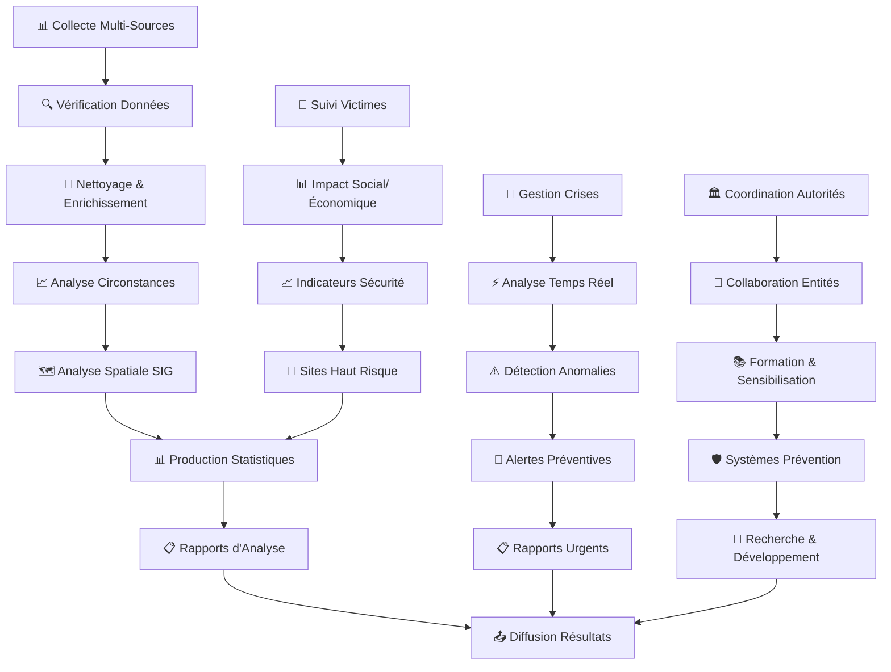

# 🔬 Guide Rapide : Centre d'Analyse

**Version** : 1.0 | **Dernière mise à jour** : 9 octobre 2025

---

## 🎯 Ce que vous allez apprendre

✅ Accéder au portail DOSER Centre d'Analyse  
✅ Vérifier et corriger les données collectées  
✅ Analyser les circonstances des accidents  
✅ Identifier les sites à haut risque  
✅ Produire des rapports d'analyse détaillés  
✅ Organiser des campagnes de sensibilisation  
✅ Collaborer avec les autres entités  
✅ Gérer les bases de données  

---

## 🎬 Workflow Complet avec Captures d'Écran

### Vue d'Ensemble du Workflow



### Workflow Détaillé par Écrans

#### Écran 1 : Connexion Centre d'Analyse
```
┌─────────────────────────────────────┐
│  🔬 DOSER - Centre d'Analyse        │
│                                     │
│  Serveur: http://51.195.80.167:8098│
│                                     │
│  Identifiant: [________________]   │
│  Mot de passe: [________________]  │
│                                     │
│  [🔑 CONNEXION]                    │
│                                     │
│  Statut: 🟢 Prêt                   │
│  Rôle: Analyste Senior             │
└─────────────────────────────────────┘
```

#### Écran 2 : Tableau de Bord Analytique
```
┌─────────────────────────────────────┐
│  📊 Tableau de Bord - Analyse       │
│                                     │
│  [📈 Analyses en Cours]             │
│  [📋 Rapports Générés]              │
│  [🚨 Alertes Actives]               │
│  [📊 Tableaux de Bord]              │
│                                     │
│  📊 Données du Jour:                │
│  • 15 accidents enregistrés         │
│  • 3 analyses terminées             │
│  • 1 alerte préventive              │
│  • 2 rapports générés               │
└─────────────────────────────────────┘
```

#### Écran 3 : Collecte de Données
```
┌─────────────────────────────────────┐
│  📊 Collecte de Données             │
│                                     │
│  Période: [17/10/2025 ▼]           │
│  Source: [Toutes ▼]                │
│  Type: [Accidents ▼]               │
│                                     │
│  Sources disponibles:               │
│  ☑️ Agents Constatateurs            │
│  ☑️ Services de Santé               │
│  ☑️ Compagnies d'Assurance          │
│  ☐ Forces de l'Ordre               │
│                                     │
│  [🔍 COLLECTER] [📊 PRÉVISUALISER] │
└─────────────────────────────────────┘
```

#### Écran 4 : Nettoyage des Données
```
┌─────────────────────────────────────┐
│  🧹 Nettoyage des Données           │
│                                     │
│  Données collectées: 1,247          │
│  Données valides: 1,198             │
│  Erreurs détectées: 49              │
│                                     │
│  Erreurs à corriger:                │
│  • 15 géolocalisations manquantes   │
│  • 12 dates invalides               │
│  • 8 victimes non liées             │
│  • 14 champs obligatoires vides     │
│                                     │
│  [🔧 CORRIGER] [✅ VALIDER]         │
└─────────────────────────────────────┘
```

#### Écran 5 : Analyse Statistique
```
┌─────────────────────────────────────┐
│  📈 Analyse Statistique             │
│                                     │
│  Type d'analyse: [Descriptive ▼]   │
│  Variables: [Gravité, Lieu, Heure] │
│  Période: [Octobre 2025]           │
│                                     │
│  Résultats:                        │
│  • Accidents: 1,198                │
│  • Moyenne/jour: 38.6              │
│  • Pic: 14h-18h (45%)              │
│  • Zone critique: Douala-Centre    │
│                                     │
│  [📊 GRAPHIQUES] [📋 RAPPORT]      │
└─────────────────────────────────────┘
```

#### Écran 6 : Détection de Patterns
```
┌─────────────────────────────────────┐
│  🔍 Détection de Patterns           │
│                                     │
│  Algorithmes: [Tous ▼]             │
│  Sensibilité: [Moyenne ▼]          │
│                                     │
│  Patterns détectés:                 │
│  🚨 Pic d'accidents vendredi 17h    │
│  ⚠️ Zone à risque: Carrefour...     │
│  📈 Tendance: +15% vs mois dernier  │
│  🔄 Répétition: Même type d'accident│
│                                     │
│  [📊 VISUALISER] [📋 DÉTAILLER]    │
└─────────────────────────────────────┘
```

#### Écran 7 : Génération de Rapport
```
┌─────────────────────────────────────┐
│  📋 Génération de Rapport           │
│                                     │
│  Type: [Mensuel ▼]                 │
│  Période: [Octobre 2025]           │
│  Format: [PDF ▼]                   │
│                                     │
│  Sections à inclure:                │
│  ☑️ Résumé exécutif                 │
│  ☑️ Statistiques détaillées         │
│  ☑️ Graphiques et cartes            │
│  ☑️ Recommandations                 │
│  ☐ Données brutes                   │
│                                     │
│  [📄 GÉNÉRER] [👁️ PRÉVISUALISER]  │
└─────────────────────────────────────┘
```

#### Écran 8 : Diffusion des Résultats
```
┌─────────────────────────────────────┐
│  📤 Diffusion des Résultats         │
│                                     │
│  Rapport: Rapport_Octobre_2025.pdf │
│  Taille: 2.3 MB                    │
│                                     │
│  Destinataires:                    │
│  ☑️ Ministère des Transports        │
│  ☑️ Préfecture de Douala            │
│  ☑️ Services de Santé               │
│  ☐ Compagnies d'Assurance          │
│                                     │
│  [📧 EMAIL] [📱 SMS] [📄 PDF]      │
│                                     │
│  [✅ DIFFUSER] [❌ ANNULER]         │
└─────────────────────────────────────┘
```

### Comparaison des Workflows

| Étape | Interface Web | Interface Mobile | Temps Estimé |
|-------|---------------|------------------|--------------|
| Connexion | ✅ Complète | ❌ Non disponible | 1 min |
| Collecte | ✅ Automatique | ❌ Non disponible | 5 min |
| Nettoyage | ✅ Outils avancés | ❌ Non disponible | 10 min |
| Analyse | ✅ Algorithmes | ❌ Non disponible | 15 min |
| Rapports | ✅ Templates | ❌ Non disponible | 5 min |
| Diffusion | ✅ Multi-canaux | ❌ Non disponible | 2 min |

### États des Analyses

| État | Icône | Description | Actions Possibles |
|------|-------|-------------|-------------------|
| Collecte | 📊 | Données en cours de collecte | Surveiller, Interrompre |
| Nettoyage | 🧹 | Correction des erreurs | Corriger, Valider |
| Analyse | 📈 | Calculs en cours | Surveiller, Modifier |
| Validation | ✅ | Résultats validés | Exporter, Diffuser |
| Diffusion | 📤 | Envoi aux destinataires | Suivre, Relancer |
| Archivé | 📁 | Analyse terminée | Consulter, Réutiliser |

### Points de Contrôle Qualité

- ✅ **Intégrité** : Données cohérentes et complètes
- ✅ **Précision** : Calculs statistiques corrects
- ✅ **Actualité** : Données à jour et récentes
- ✅ **Pertinence** : Analyses adaptées aux besoins
- ✅ **Traçabilité** : Source et méthode documentées

---

## 🌐 Étape 1 : Accès au Portail Centre d'Analyse (1 min)

### Connexion

1. Ouvrez votre navigateur
2. Allez sur : **http://51.195.80.167:8098/analyse**
3. Entrez vos identifiants :
   - **Identifiant** : Votre code analyste
   - **Mot de passe** : Votre mot de passe personnel
4. Cliquez sur **CONNEXION**

### Vérification de Connexion

- ✅ **Statut** : Prêt (vert)
- ✅ **Rôle** : Analyste confirmé
- ✅ **Permissions** : Accès complet aux données
- ✅ **Dernière connexion** : Affichée

---

## 📊 Étape 2 : Collecter les Données (5 min)

### Sélection des Sources

1. **Choisissez la période** d'analyse
2. **Sélectionnez les sources** :
   - Agents Constatateurs
   - Services de Santé
   - Compagnies d'Assurance
   - Forces de l'Ordre
3. **Définissez les critères** :
   - Type d'accident
   - Gravité
   - Zone géographique
   - Période

### Lancement de la Collecte

1. Cliquez sur **COLLECTER**
2. **Surveillez** le progrès en temps réel
3. **Vérifiez** la qualité des données
4. **Validez** la collecte terminée

---

## 🧹 Étape 3 : Nettoyer les Données (10 min)

### Identification des Erreurs

#### **Erreurs Communes**
- **Géolocalisation** manquante ou incorrecte
- **Dates** invalides ou incohérentes
- **Champs obligatoires** vides
- **Victimes** non liées aux accidents
- **Doublons** de données

### Correction des Erreurs

1. **Examinez** chaque erreur détectée
2. **Corrigez** manuellement si possible
3. **Supprimez** les données inutilisables
4. **Validez** les corrections
5. **Confirmez** la qualité finale

---

## 📈 Étape 4 : Analyser les Données (15 min)

### Types d'Analyses Disponibles

#### **Analyse Descriptive**
- **Statistiques** de base (moyennes, médianes)
- **Distributions** par catégories
- **Évolutions** temporelles
- **Comparaisons** géographiques

#### **Analyse Prédictive**
- **Tendances** futures
- **Saisonalité** des accidents
- **Corrélations** entre variables
- **Modèles** prédictifs

#### **Analyse Spatiale**
- **Cartes** de chaleur
- **Zones** à risque
- **Clusters** d'accidents
- **Corridors** dangereux

### Configuration de l'Analyse

1. **Sélectionnez** le type d'analyse
2. **Choisissez** les variables à analyser
3. **Définissez** les paramètres
4. **Lancez** le calcul
5. **Examinez** les résultats

---

## 📋 Étape 5 : Générer un Rapport (5 min)

### Sélection du Template

#### **Rapport Mensuel**
- Résumé exécutif
- Statistiques détaillées
- Graphiques et cartes
- Recommandations

#### **Rapport Trimestriel**
- Analyse des tendances
- Comparaisons inter-périodes
- Focus sur les zones critiques
- Plan d'action

#### **Rapport Annuel**
- Bilan complet
- Évolutions sur 5 ans
- Benchmarking régional
- Stratégies futures

### Personnalisation

1. **Choisissez** le template
2. **Sélectionnez** les sections à inclure
3. **Personnalisez** le format
4. **Ajoutez** vos commentaires
5. **Générez** le rapport

---

## 📤 Étape 6 : Diffuser les Résultats (2 min)

### Sélection des Destinataires

#### **Destinataires Standards**
- Ministère des Transports
- Préfecture de Douala
- Services de Santé
- Compagnies d'Assurance

#### **Destinataires Spécialisés**
- Chercheurs universitaires
- Organisations internationales
- Médias spécialisés
- Grand public (Open Data)

### Méthodes de Diffusion

1. **Email** : Envoi direct aux destinataires
2. **Portail Open Data** : Publication publique
3. **API** : Accès programmatique
4. **Téléchargement** : Fichiers PDF/Excel

---

## 🚨 Cas Particuliers et Procédures Spécialisées

### Alertes Préventives

#### **Déclenchement Automatique**
- **Critères** : Pic d'accidents, zone critique, pattern suspect
- **Seuils** : Configurables par type d'alerte
- **Fréquence** : Temps réel, quotidien, hebdomadaire

#### **Procédure d'Alerte**
1. **Détection** automatique de l'anomalie
2. **Validation** manuelle de l'alerte
3. **Génération** du rapport d'urgence
4. **Diffusion** immédiate aux autorités
5. **Suivi** de l'évolution

### Analyses Spécialisées

#### **Analyse de Fraude**
- **Détection** de patterns suspects
- **Corrélation** entre données
- **Scoring** de risque
- **Rapport** d'investigation

#### **Analyse Comparative**
- **Benchmarking** régional
- **Comparaison** temporelle
- **Évaluation** des politiques
- **Recommandations** stratégiques

### Recherche et Développement

#### **Données Anonymisées**
- **Extraction** pour recherche
- **Anonymisation** des données personnelles
- **Export** en formats standards
- **Accord** de confidentialité

#### **Collaboration Académique**
- **Partenariats** universitaires
- **Projets** de recherche
- **Publications** scientifiques
- **Formation** des chercheurs

---

## 📞 Support et Formation

### Ressources Disponibles

#### **Formation Spécialisée**
- **Cours** d'analyse de données
- **Formation** aux outils statistiques
- **Certification** en data science
- **Mise à jour** continue

#### **Support Technique**
- **Hotline** : +237 XXX XXX XXX
- **Email** : analyse@ditros.org
- **Chat** : Support en direct
- **Documentation** : Guides techniques

#### **Contacts Spécialisés**
- **Chef Analyste** : Dr. MARTIN
- **Data Scientist** : M. KOUAM
- **Statisticien** : M. FON

### Modules de Formation

#### **Niveau 1 : Base (3 jours)**
- Interface DOSER Analyse
- Concepts statistiques de base
- Génération de rapports simples
- Interprétation des résultats

#### **Niveau 2 : Avancé (5 jours)**
- Analyses prédictives
- Détection de patterns
- Alertes préventives
- Rapports complexes

#### **Niveau 3 : Expert (7 jours)**
- Data science avancée
- Machine learning
- Développement d'algorithmes
- Formation de formateurs

---

## ✅ Checklist de Démarrage

### Avant la Première Analyse

- [ ] **Accès** au portail obtenu
- [ ] **Formation** de base suivie
- [ ] **Permissions** vérifiées
- [ ] **Outils** installés
- [ ] **Templates** configurés
- [ ] **Destinataires** définis

### Après Chaque Analyse

- [ ] **Données** collectées et nettoyées
- [ ] **Analyse** effectuée correctement
- [ ] **Rapport** généré et validé
- [ ] **Résultats** diffusés
- [ ] **Archives** mises à jour
- [ ] **Suivi** planifié

---

## 🆘 Besoin d'Aide ?

### Support Immédiat

- **📞 Hotline** : +237 XXX XXX XXX (24/7)
- **📧 Email** : analyse@ditros.org
- **💬 Chat** : Support en direct
- **❓ FAQ** : [Questions fréquentes](../faq/index.md)

### Formation et Ressources

- **📖 Manuel complet** : [Centre d'Analyse](../../manuel/centre-analyse.md)
- **👨‍🏫 Formation** : [Sessions de formation](../formation/index.md)
- **📚 Documentation** : [Base de connaissances](../index.md)

---

**Prêt à analyser les données pour améliorer la sécurité routière ?** 🔬📊

---

*Dernière mise à jour : 9 octobre 2025 | Version : 1.0*

