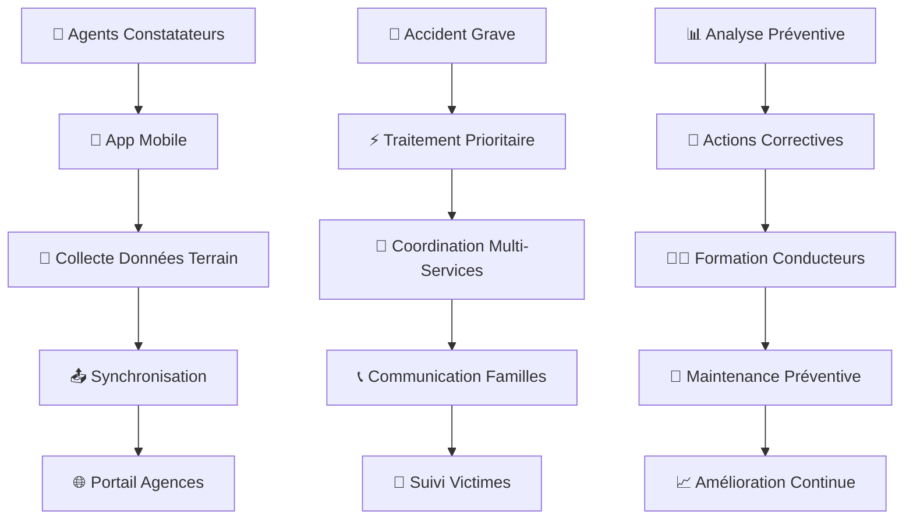

# 🚀 Guide Rapide : Compagnies d'Assurance

**Durée estimée** : 20 minutes  
**Niveau** : Débutant  
**Version** : 1.0

---

## 📋 Ce que vous allez apprendre

À la fin de ce guide, vous saurez :

✅ Accéder au portail DOSER pour les assurances  
✅ Enregistrer et gérer les déclarations de sinistres  
✅ Évaluer les dommages matériels et corporels  
✅ Calculer et verser les indemnités  
✅ Coordonner avec les autres acteurs  
✅ Générer des rapports et statistiques  

---

## 🎬 Workflow Complet avec Captures d'Écran

### Vue d'Ensemble du Workflow



### Workflow Détaillé par Écrans

#### Écran 1 : Connexion au Portail Assurance
```
┌─────────────────────────────────────┐
│  🏢 DOSER - Compagnies d'Assurance │
│                                     │
│  Serveur: http://51.195.80.167:8098│
│                                     │
│  Identifiant: [________________]   │
│  Mot de passe: [________________]  │
│                                     │
│  [🔑 CONNEXION]                    │
│                                     │
│  Statut: 🟢 Prêt                   │
│                                     │
│  Configuration Système Requise:     │
│  • Processeur: Intel Core i5 2.30GHz│
│  • RAM: 8 Go minimum               │
│  • Windows 10 64 bits              │
│  • Espace disque: 300 Go           │
└─────────────────────────────────────┘
```

#### Écran 2 : Tableau de Bord Assurance
```
┌─────────────────────────────────────┐
│  📊 Tableau de Bord - Assurance     │
│                                     │
│  [➕ Nouveau Contrat]              │
│  [📋 Contrats d'Assurance]         │
│  [🚗 Gestion Véhicules]            │
│  [📈 Sinistres en cours]           │
│  [📊 Statistiques]                 │
│  [⚙️  Paramètres]                  │
│                                     │
│  📋 Contrats d'Assurance:          │
│  ┌─────────────────────────────────┐│
│  │  #POL-2025-001 | Actif         ││
│  │  #POL-2025-002 | En cours      ││
│  │  #POL-2025-003 | Expiré        ││
│  └─────────────────────────────────┘│
│                                     │
│  📈 Statistiques:                  │
│  • 156 contrats actifs             │
│  • 12 sinistres ouverts            │
│  • 2.5M FCFA d'indemnités          │
│                                     │
│  Actions Rapides:                   │
│  • Gestion des contrats            │
│  • Consultation des accidents      │
│  • Création de sinistres           │
└─────────────────────────────────────┘
```

#### Écran 3 : Déclaration de Sinistre
```
┌─────────────────────────────────────┐
│  📋 Nouvelle Déclaration Sinistre   │
│                                     │
│  Informations Assuré:               │
│  Nom: [Jean MARTIN        ]        │
│  Police: [POL-2025-001    ]        │
│  Véhicule: [AB-123-CD     ]        │
│  Téléphone: [+237 6XX XX XX]       │
│                                     │
│  Contexte Accident:                │
│  Date: [17/10/2025]                │
│  Lieu: [Douala, Carrefour]         │
│  Type: [Collision ▼]               │
│                                     │
│  [✅ Enregistrer] [❌ Annuler]      │
└─────────────────────────────────────┘
```

#### Écran 4 : Vérification de Police
```
┌─────────────────────────────────────┐
│  🔍 Vérification Police             │
│                                     │
│  Police: POL-2025-001              │
│  Assuré: Jean MARTIN               │
│                                     │
│  ✅ Police active                  │
│  ✅ Véhicule couvert               │
│  ✅ Franchise: 50,000 FCFA         │
│  ✅ Plafond: 5,000,000 FCFA        │
│                                     │
│  📋 Couvertures:                   │
│  • Dommages matériels: OUI         │
│  • Dommages corporels: OUI         │
│  • Défense recours: OUI            │
│                                     │
│  [✅ Valider] [❌ Rejeter]          │
└─────────────────────────────────────┘
```

#### Écran 5 : Évaluation des Dommages
```
┌─────────────────────────────────────┐
│  📊 Évaluation des Dommages         │
│                                     │
│  🚗 Dommages Matériels:            │
│  ├── Carrosserie: 150,000 FCFA     │
│  ├── Mécanique: 75,000 FCFA        │
│  └── TOTAL: 225,000 FCFA           │
│                                     │
│  👤 Dommages Corporels:            │
│  ├── Soins médicaux: 50,000 FCFA   │
│  ├── ITT: 30,000 FCFA              │
│  └── TOTAL: 80,000 FCFA            │
│                                     │
│  💰 TOTAL SINISTRE: 305,000 FCFA   │
│                                     │
│  [✅ Valider] [📝 Modifier]         │
└─────────────────────────────────────┘
```

#### Écran 6 : Calcul des Indemnités
```
┌─────────────────────────────────────┐
│  💰 Calcul des Indemnités           │
│                                     │
│  Montant sinistre: 305,000 FCFA    │
│  Franchise: -50,000 FCFA           │
│  ──────────────────────────────────│
│  Montant brut: 255,000 FCFA        │
│                                     │
│  📋 Répartition:                   │
│  • Dommages matériels: 175,000     │
│  • Dommages corporels: 80,000      │
│                                     │
│  💳 Montant à verser: 255,000 FCFA │
│                                     │
│  [✅ Approuver] [📝 Recalculer]     │
└─────────────────────────────────────┘
```

#### Écran 7 : Coordination avec Agents Constatateurs
```
┌─────────────────────────────────────┐
│  👮 Coordination Agents Constatateurs│
│                                     │
│  📋 Constats reçus: 15              │
│  📊 En attente: 3                   │
│  ✅ Traités: 12                     │
│                                     │
│  [📋 Voir Constats]                 │
│  [📊 Statistiques]                  │
│  [🔄 Synchronisation]               │
│                                     │
│  Dernière sync: 14:30               │
│  Statut: 🟢 Connecté               │
└─────────────────────────────────────┘
```

#### Écran 8 : Consultation des Constats
```
┌─────────────────────────────────────┐
│  📋 Constats d'Accidents Reçus     │
│                                     │
│  #CONST-2025-001 | 17/10/2025      │
│  Agent: Sgt. MARTIN                │
│  Lieu: Douala, Carrefour           │
│  Statut: [En attente ▼]            │
│                                     │
│  [👁️ Consulter] [📊 Évaluer]       │
│                                     │
│  #CONST-2025-002 | 17/10/2025      │
│  Agent: Cpt. DIALLO                │
│  Lieu: Yaoundé, Avenue Kennedy     │
│  Statut: [Traité ✅]                │
└─────────────────────────────────────┘
```

### Workflow des Compagnies d'Assurance

| Aspect | Interface Web Assurance | Coordination avec Agents |
|--------|------------------------|-------------------------|
| **Durée** | 25 minutes | Temps réel |
| **Complétude** | Évaluation complète | Données terrain |
| **Fonctionnalités** | Toutes disponibles | Collecte de base |
| **Contexte** | Bureau/Poste fixe | Terrain/Urgence |
| **Configuration** | Requise | Pré-configurée |
| **Rapports** | PDF détaillés | Synchronisation |
| **Évaluation** | Complète | Données brutes |

### États des Sinistres

🟢 **OUVERT (Ouvert)**
- Sinistre déclaré et en cours de traitement
- Vérification de police en cours
- Modifications possibles
- Actions : Vérifier, Évaluer, Modifier

🟡 **EN_EVALUATION (En évaluation)**
- Dommages en cours d'évaluation
- Expertise en cours
- Calcul des indemnités
- Actions : Finaliser, Modifier, Expertiser

🔵 **EN_ATTENTE (En attente)**
- En attente de validation
- En attente de documents
- En attente de paiement
- Actions : Valider, Compléter, Payer

🔴 **INDEMNISE (Indemnisé)**
- Sinistre traité et indemnisé
- Paiement effectué
- Dossier clos
- Actions : Consulter, Archiver

⚫ **REJETE (Rejeté)**
- Sinistre rejeté
- Motif de rejet documenté
- Dossier clos
- Actions : Consulter, Contester

### Points de Contrôle Qualité

**📋 Vérifications Obligatoires :**
- ✅ Police d'assurance valide et active
- ✅ Véhicule couvert par la police
- ✅ Dommages évalués par un expert
- ✅ Montant des indemnités calculé
- ✅ Documents justificatifs fournis
- ✅ Respect des franchises et plafonds
- ✅ Conformité réglementaire

**🔍 Contrôles de Cohérence :**
- ✅ Cohérence des dates (accident vs déclaration)
- ✅ Logique des montants d'indemnisation
- ✅ Correspondance dommages/évaluation
- ✅ Complétude des documents
- ✅ Validation des expertises

**📊 Indicateurs de Performance :**
- 📈 Temps de traitement des sinistres
- 📈 Taux de règlement rapide
- 📈 Satisfaction des assurés
- 📈 Efficacité des évaluations
- 📈 Coût moyen des sinistres

---

## 🌐 Étape 1 : Accès au Portail (2 min)

### Connexion Web

1. Ouvrez votre navigateur (Chrome, Firefox, Edge)
2. Allez sur : **http://51.195.80.167:8098**
3. Sélectionnez le module **"Compagnies d'Assurance"**
4. Entrez votre **nom d'utilisateur** (format : matricule ou nom d'utilisateur)
5. Entrez votre **mot de passe**
6. Cliquez sur **Connexion**

### Première Connexion

Lors de votre première connexion :
- Configurez vos **préférences d'assurance**
- Définissez vos **templates de sinistres**
- Paramétrez vos **seuils d'indemnisation**

---

## 📋 Étape 2 : Déclaration de Sinistre (5 min)

### Création d'un Nouveau Sinistre

1. Cliquez sur **"[+ Nouveau Sinistre]"**
2. Remplissez les **informations de l'assuré** :
   - Nom et prénom
   - Numéro de police
   - Immatriculation du véhicule
   - Téléphone de contact
3. Saisissez le **contexte de l'accident** :
   - Date et heure
   - Lieu précis
   - Type d'accident
   - Circonstances
4. Cliquez sur **"Enregistrer"**

### Vérification Automatique

Le système vérifie automatiquement :
- ✅ **Validité de la police**
- ✅ **Couverture du véhicule**
- ✅ **Franchises applicables**
- ✅ **Plafonds d'indemnisation**

---

## 🔍 Étape 3 : Vérification de Police (3 min)

### Contrôles Obligatoires

**Vérification de la Police :**
- Statut de la police (active/inactive)
- Période de validité
- Véhicules couverts
- Franchises et plafonds

**Vérification de la Couverture :**
- Dommages matériels
- Dommages corporels
- Défense recours
- Exclusions applicables

### Actions Possibles

- ✅ **Valider** : Police conforme, procéder à l'évaluation
- ❌ **Rejeter** : Police non conforme, notifier l'assuré
- 📝 **Compléter** : Documents manquants, demander des pièces

---

## 📊 Étape 4 : Évaluation des Dommages (8 min)

### Dommages Matériels

**Évaluation par Catégorie :**
- **Carrosserie** : Tôlerie, peinture, pare-chocs
- **Mécanique** : Moteur, transmission, freinage
- **Équipements** : Électronique, accessoires
- **Véhicule tiers** : Dommages causés à d'autres véhicules

**Méthodes d'Évaluation :**
- Expertise visuelle
- Devis de réparation
- Cote véhicule
- Comparaison avec sinistres similaires

### Dommages Corporels

**Types de Dommages :**
- **Soins médicaux** : Frais hospitaliers, médicaments
- **Incapacité Temporaire Totale (ITT)** : Perte de revenus
- **Incapacité Permanente Partielle (IPP)** : Préjudice permanent
- **Préjudice moral** : Souffrance, préjudice d'agrément

**Calcul des Indemnités :**
- Barème légal
- Contrat d'assurance
- Expertise médicale
- Jurisprudence

---

## 💰 Étape 5 : Calcul des Indemnités (4 min)

### Calcul Automatique

Le système calcule automatiquement :
- **Montant brut** du sinistre
- **Franchise** à déduire
- **Montant net** à indemniser
- **Répartition** par type de dommage

### Validation des Montants

**Contrôles de Cohérence :**
- Respect des plafonds contractuels
- Application correcte des franchises
- Cohérence avec l'évaluation
- Validation hiérarchique

### Actions de Validation

- ✅ **Approuver** : Montant validé, procéder au paiement
- 📝 **Recalculer** : Ajuster les paramètres
- 🔍 **Expertiser** : Demander une expertise complémentaire

---

## 💳 Étape 6 : Versement des Indemnités (3 min)

### Procédure de Paiement

1. **Validation finale** du montant
2. **Génération** de l'ordre de paiement
3. **Transmission** au service comptable
4. **Versement** à l'assuré
5. **Confirmation** du paiement

### Modes de Paiement

- **Virement bancaire** (recommandé)
- **Chèque** (pour petits montants)
- **Espèces** (cas exceptionnels)
- **Compensation** (avec d'autres sinistres)

---

## 🚨 Procédures d'Urgence

### Sinistre Grave (P1)

**Actions Immédiates :**
- ⚡ **Traitement prioritaire** (24h)
- 👥 **Coordination** avec les experts
- 📊 **Évaluation approfondie** des dommages
- 💰 **Indemnisation accélérée** (48h)

**Enregistrement Spécial :**
- Code sinistre : **SIN-GRAVE-YYYY-NNN**
- Statut : **URGENT**
- Suivi : **Quotidien**
- Validation : **Hiérarchique**

### Sinistre Multi-Victimes

**Coordination Spéciale :**
- **Gestion** de plusieurs polices
- **Répartition** des responsabilités
- **Évaluation** des dommages croisés
- **Indemnisation** coordonnée

---

## 📊 Cas d'Usage Standards

### Sinistre Standard (P2)

**Traitement Normal :**
- Délai : **5 jours ouvrés**
- Évaluation : **Expertise standard**
- Indemnisation : **Selon barème**
- Suivi : **Hebdomadaire**

### Sinistre Complexe (P3)

**Traitement Étendu :**
- Délai : **10 jours ouvrés**
- Évaluation : **Expertise approfondie**
- Indemnisation : **Négociation**
- Suivi : **Bi-hebdomadaire**

## 🔧 Fonctionnalités Avancées

### Gestion des Contrats d'Assurance
- **Vérification automatique** de la validité des polices
- **Contrôle de couverture** des véhicules
- **Analyse des garanties** applicables
- **Calcul des franchises** et plafonds
- **Historique des sinistres** précédents

### Communication avec les Assurés
- **Notifications automatiques** des étapes importantes
- **Suivi en temps réel** du statut du dossier
- **Réponses aux questions** des assurés
- **Information sur les délais** de traitement
- **Communication des décisions** d'indemnisation

### Collecte et Analyse des Données
- **Statistiques automatiques** de sinistralité
- **Analyse des tendances** et modèles
- **Identification des zones** à risque
- **Calcul des coûts moyens** des sinistres
- **Rapports périodiques** de performance

### Suivi des Victimes
- **Coordination médicale** avec les services de santé
- **Suivi de l'évolution** de l'état de santé
- **Gestion des frais médicaux** et remboursements
- **Calcul des indemnités** journalières
- **Planification des expertises** médicales

### Validation des Frais Médicaux
- **Vérification automatique** de la conformité
- **Contrôle de la nécessité** des soins
- **Validation des tarifs** appliqués
- **Calcul des montants** remboursables
- **Suivi des paiements** aux prestataires

### Collaboration Multi-Services
- **Intégration avec les forces de l'ordre** pour les PV
- **Coordination avec les services de santé** pour les dossiers médicaux
- **Échange avec les experts techniques** pour les expertises
- **Suivi des procédures judiciaires** en cours

---

## 🎯 Procédures Pratiques Détaillées

### 1. Gestion des Contrats d'Assurance

#### Création d'un Nouveau Contrat
**Étapes Détaillées** :
1. **Accès** : Se connecter au portail DOSER
2. **Navigation** : Accéder à la page d'accueil assurance
3. **Création** : Cliquer sur le bouton **"+"** d'ajout
4. **Saisie** : Remplir le formulaire de création
5. **Validation** : Cliquer sur **"Enregistrer"**

**Informations à Saisir** :
- **Données client** : Nom, prénom, coordonnées, identité
- **Données véhicule** : Marque, modèle, immatriculation
- **Données contrat** : Numéro de police, validité, garanties
- **Informations complémentaires** : Franchises, plafonds

#### Actions sur les Contrats
**Consultation** :
1. Cliquer sur **"Action"** puis **"Détails"**
2. Visualiser toutes les informations du contrat
3. Consulter l'historique des modifications

**Modification** :
1. Cliquer sur l'icône **"Modifier"**
2. Modifier les champs nécessaires
3. Cliquer sur **"Enregistrer"** pour valider

**Génération de Rapport** :
1. Cliquer sur **"Action"** puis **"Générer Rapport"**
2. Sélectionner le format (PDF)
3. Télécharger le rapport généré

### 2. Gestion des Accidents

#### Consultation des Accidents
**Navigation** :
1. Mettre le curseur sur **"Assurance"**
2. Cliquer sur **"Véhicule"**
3. La liste des accidents s'affiche

**Actions Disponibles** :
- **Détails** : Consultation complète de l'accident
- **Rapport** : Génération du rapport d'accident

#### Consultation des Détails
**Procédure** :
1. Cliquer sur **"Action"** puis **"Détails"**
2. Visualiser les informations complètes
3. Consulter les détails des victimes
4. Examiner les informations du contrat

**Informations Disponibles** :
- **Détails de l'accident** : Circonstances, lieu, date
- **Informations sur les personnes** : Victimes impliquées
- **Informations sur le contrat** : Garanties applicables
- **Documents associés** : PV, photos, expertises

### 3. Gestion des Sinistres

#### Création d'un Sinistre
**Contexte** : Client victime d'un accident non déclaré

**Procédure** :
1. Accéder à l'interface de gestion des sinistres
2. Cliquer sur le bouton **"+"** pour créer un sinistre
3. Remplir le formulaire de déclaration
4. Saisir toutes les informations demandées
5. Cliquer sur **"Enregistrer"** pour sauvegarder

**Informations à Collecter** :
- **Déclaration du client** : Circonstances de l'accident
- **Dommages constatés** : Matériels et corporels
- **Documents justificatifs** : Photos, témoignages, constats
- **Informations véhicule** : État, dommages, évaluation

#### Actions sur les Sinistres
**Consultation** :
1. Cliquer sur **"Action"** puis **"Détails"**
2. Visualiser toutes les informations du sinistre
3. Consulter l'historique des actions

**Modification** :
1. Cliquer sur **"Action"** puis **"Modifier"**
2. Apporter les modifications nécessaires
3. Cliquer sur **"Enregistrer"** pour valider

**Génération de Rapport** :
1. Cliquer sur **"Action"** puis **"Générer Rapport"**
2. Sélectionner le type de rapport (procès-verbal)
3. Télécharger le rapport généré

---

## 💻 Interface Web Exclusivement

### Pourquoi Interface Web Seulement ?

Les **Compagnies d'Assurance** utilisent exclusivement l'**interface web DOSER** car :

- **Gestion de bureau** : Traitement des sinistres depuis les bureaux
- **Documents complexes** : Génération de rapports détaillés et PDF
- **Coordination multi-services** : Intégration avec d'autres systèmes
- **Analyse approfondie** : Outils d'évaluation et de reporting avancés
- **Sécurité renforcée** : Protection des données sensibles d'assurance

### Application Mobile DOSER DATA CAPTURE

L'application mobile **DOSER DATA CAPTURE** est réservée aux :
- 👮 **Agents Constatateurs** (Forces de l'Ordre)
- 🏥 **Services de Santé** (Hôpitaux, Morgues)

Ces acteurs collectent les données sur le terrain, puis les compagnies d'assurance les consultent et les traitent via l'interface web.

---

## 📚 Pour Aller Plus Loin

### Documentation Complète
- 📖 **[Manuel complet](../../manuel/compagnies-assurance.md)** : Guide détaillé
- 🎓 **[Formation assurance](../../manuel/compagnies-assurance.md#support-et-formation)** : Modules spécialisés
- 📊 **[Rapports et statistiques](../../manuel/compagnies-assurance.md#outils-danalyse-et-reporting)** : Analyses détaillées

### Ressources Spécialisées
- 🔧 **[Outils d'évaluation](../../manuel/compagnies-assurance.md#outils-dévaluation-avancés)** : Calculateurs et barèmes
- 📋 **[Templates de sinistres](../../manuel/compagnies-assurance.md#gestion-des-sinistres-web)** : Modèles prêts à l'emploi
- 🎯 **[Bonnes pratiques](../../manuel/compagnies-assurance.md#cas-particuliers-et-procédures-spécialisées)** : Recommandations

---

## 🆘 Besoin d'Aide ?

### Support Technique
- 📧 **Email** : support-assurance@doser.cm
- 📞 **Téléphone** : +237 6XX XX XX XX
- 💬 **Chat** : Disponible 24/7
- 🎫 **Ticket** : Système de support intégré

### Formation et Assistance
- 🎓 **Formation** : formation-assurance@doser.cm
- 👥 **Mentorat** : Accompagnement personnalisé
- 📚 **Documentation** : Guides et tutoriels
- 🎥 **Vidéos** : Formations en ligne

---

## ✅ Checklist de Démarrage

### Configuration Initiale
- [ ] Connexion au portail réussie
- [ ] Profil assurance configuré
- [ ] Templates de sinistres définis
- [ ] Seuils d'indemnisation paramétrés
- [ ] Accès mobile configuré

### Première Utilisation
- [ ] Premier sinistre enregistré
- [ ] Vérification de police testée
- [ ] Évaluation de dommages réalisée
- [ ] Calcul d'indemnités validé
- [ ] Versement effectué

### Formation Complète
- [ ] Workflow web maîtrisé
- [ ] Application mobile utilisée
- [ ] Procédures d'urgence connues
- [ ] Outils d'évaluation maîtrisés
- [ ] Support contacté si nécessaire

---

**Félicitations ! 🎉**  
Vous êtes maintenant prêt à utiliser DOSER pour gérer efficacement les sinistres d'assurance !

---

*Guide créé le : 17 octobre 2025*  
*Dernière mise à jour : 17 octobre 2025*  
*Version : 1.0 - Guide rapide compagnies d'assurance*

---

## 📸 Note sur les Captures d'Écran

Les captures d'écran présentées dans ce guide sont des représentations visuelles de l'interface DOSER. L'interface réelle peut varier légèrement selon les versions et configurations.

### Fonctionnalités Réelles
- ✅ **Interface web** : Portail complet avec toutes les fonctionnalités
- ✅ **Application mobile** : DOSER DATA CAPTURE avec profil assurance
- ✅ **Synchronisation** : Temps réel entre web et mobile
- ✅ **Mode hors ligne** : Fonctionnement sans connexion Internet

### Support Technique
Pour toute question sur l'utilisation de DOSER, contactez notre équipe de support :
- 📧 **Email** : support@doser.cm
- 📞 **Téléphone** : +237 6XX XX XX XX
- 🌐 **Site web** : https://doser.cm
