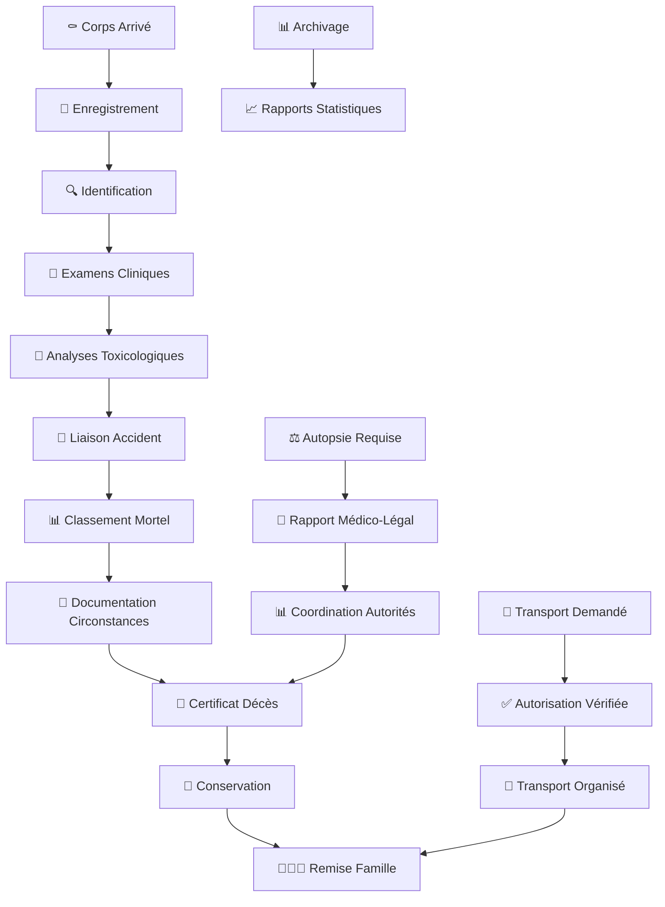

# 🚀 Guide Rapide : Morgue

**Durée estimée** : 10 minutes  
**Niveau** : Débutant  
**Version** : 2.0

---

## 📋 Ce que vous allez apprendre

À la fin de ce guide, vous saurez :

✅ Accueillir et enregistrer les corps des victimes d'accidents  
✅ Identifier les victimes décédées (documents, description physique)  
✅ Réaliser les examens cliniques (liaisons cutanées, examens des organes)  
✅ Effectuer les autopsies médico-légales  
✅ Analyser les substances psychoactives  
✅ Classer les accidents mortels de la route  
✅ Établir les certificats de décès  
✅ Documenter les circonstances du décès  
✅ Coordonner avec les autorités judiciaires  
✅ Gérer les transports et la communication avec les familles  

---

## 🎬 Workflow Complet avec Captures d'Écran

### Vue d'Ensemble du Workflow



### Workflow Détaillé par Écrans

#### Écran 1 : Connexion au Portail

```
┌─────────────────────────────────────────────────────┐
│  ⚰️ DOSER - Portail Morgue                         │
│                                                     │
│  Identifiant: [________________]                   │
│  Mot de passe: [________________]                 │
│                                                     │
│  [🔑 CONNEXION]                                    │
│                                                     │
│  Rôle: Médecin Légiste / Expert Judiciaire         │
│  Établissement: Morgue Centre - Douala             │
└─────────────────────────────────────────────────────┘
```

#### Écran 2 : Tableau de Bord

```
┌─────────────────────────────────────────────────────┐
│  📊 Tableau de Bord - Morgue                      │
│                                                     │
│  📥 Arrivées aujourd'hui: 3                        │
│  ⏳ Corps en attente: 2                            │
│  🔍 Non identifiés: 1                              │
│  📄 Certificats à générer: 1                       │
│                                                     │
│  [➕ Nouvelle Admission]                           │
│  [📋 Corps en Conservation]                        │
│  [📄 Certificats]                                  │
│  [📊 Statistiques]                                 │
│                                                     │
│  🚨 Alertes:                                       │
│  • 1 corps dépasse le délai légal                  │
│  • 2 autopsies en attente                          │
└─────────────────────────────────────────────────────┘
```

#### Écran 3 : Nouvelle Admission

```
┌─────────────────────────────────────────────────────┐
│  ➕ Nouvelle Admission                             │
│                                                     │
│  📅 Date arrivée: [15/10/2025]                     │
│  ⏰ Heure: [14:30]                                 │
│                                                     │
│  📍 Provenance:                                    │
│  ○ Lieu accident  ● Hôpital  ○ Service secours   │
│  Hôpital: [Hôpital Central Douala ▼]              │
│                                                     │
│  🚚 Moyen transport:                               │
│  [Ambulance ▼]                                     │
│                                                     │
│  👤 Accompagnant:                                  │
│  [Dr. MARTIN Jean]                                 │
│                                                     │
│  📄 Documents joints:                              │
│  [➕ Ajouter Document]                             │
│                                                     │
│  [❌ Annuler]  [➡️ Suivant: État du Corps]        │
└─────────────────────────────────────────────────────┘
```

#### Écran 4 : Identification

```
┌─────────────────────────────────────────────────────┐
│  🔍 Identification de la Victime                   │
│                                                     │
│  Statut:                                           │
│  ● Identifié  ○ Non identifié                     │
│                                                     │
│  👤 Informations Personnelles:                     │
│  Nom: [KOUAM]                                      │
│  Prénoms: [Jean Paul]                              │
│  Date naissance: [15/03/1985]                      │
│  Lieu naissance: [Douala]                          │
│  CNI: [123456789]                                  │
│                                                     │
│  📞 Contact Famille:                               │
│  Nom: [KOUAM Marie]                                │
│  Lien: [Épouse ▼]                                  │
│  Téléphone: [+237 6XX XXX XXX]                    │
│                                                     │
│  💡 Aide les services de recherche                 │
│                                                     │
│  [❌ Retour]  [➡️ Suivant: Examens]                │
└─────────────────────────────────────────────────────┘
```

#### Écran 5 : Examens Cliniques

```
┌─────────────────────────────────────────────────────┐
│  🧪 Examens Cliniques                             │
│                                                     │
│  📋 Évaluation des Liaisons Cutanées:              │
│  ┌───────────────────────────────────────────────┐ │
│  │  Plaie 1:                                    │ │
│  │  Localisation: [Front, région temporale]     │ │
│  │  Type: [Contusion]  Dimensions: [5x3 cm]     │ │
│  │  [📷 Photo]                                   │ │
│  └───────────────────────────────────────────────┘ │
│  [➕ Ajouter Plaie]                                │
│                                                     │
│  🫀 Examens des Organes:                           │
│  ┌───────────────────────────────────────────────┐ │
│  │  Observations:                                │ │
│  │  [Traumatisme crânien visible...]             │ │
│  │  [___________________________________]        │ │
│  └───────────────────────────────────────────────┘ │
│                                                     │
│  💡 Aide à comprendre les circonstances            │
│                                                     │
│  [❌ Retour]  [➡️ Suivant: Analyses]              │
└─────────────────────────────────────────────────────┘
```

#### Écran 6 : Analyses Toxicologiques

```
┌─────────────────────────────────────────────────────┐
│  🔬 Analyses des Substances Psychoactives         │
│                                                     │
│  📊 Résultats d'Analyse:                          │
│  ┌───────────────────────────────────────────────┐ │
│  │  Type: [Alcoolémie ▼]                         │ │
│  │  Résultat: [0.8 g/L]                          │ │
│  │  Laboratoire: [Labo Central Douala]           │ │
│  │  Date résultats: [16/10/2025]                 │ │
│  │  [📎 Joindre Rapport]                         │ │
│  └───────────────────────────────────────────────┘ │
│                                                     │
│  [➕ Ajouter Analyse]                              │
│                                                     │
│  Types disponibles:                                │
│  • Alcoolémie                                      │
│  • Drogues                                         │
│  • Médicaments                                     │
│  • Autres substances                               │
│                                                     │
│  [❌ Retour]  [➡️ Suivant: Liaison Accident]      │
└─────────────────────────────────────────────────────┘
```

#### Écran 7 : Liaison à l'Accident

```
┌─────────────────────────────────────────────────────┐
│  🔗 Lier à un Accident DOSER                      │
│                                                     │
│  🔍 Recherche:                                      │
│  Numéro constat: [CON-2025-005678]                │
│  OU                                                │
│  Date: [15/10/2025]  Lieu: [Douala-Centre]       │
│                                                     │
│  ┌───────────────────────────────────────────────┐ │
│  │  ✅ Accident Trouvé                           │ │
│  │  CON-2025-005678                              │ │
│  │  📅 15/10/2025 à 14:25                        │ │
│  │  📍 Douala, Carrefour Akwa                    │ │
│  │  🚗 Collision frontale                        │ │
│  │  Score correspondance: 95%                    │ │
│  └───────────────────────────────────────────────┘ │
│                                                     │
│  📊 Classement Automatique:                        │
│  ✅ Accident mortel                                │
│  ✅ Type: Collision                                │
│  ✅ Gravité: 1 décès                               │
│                                                     │
│  [❌ Annuler]  [✅ Confirmer Liaison]              │
└─────────────────────────────────────────────────────┘
```

#### Écran 8 : Documentation des Circonstances

```
┌─────────────────────────────────────────────────────┐
│  📝 Documentation des Circonstances du Décès      │
│                                                     │
│  📋 Détails de l'Accident:                         │
│  [Informations fournies par la police...]         │
│  [___________________________________]            │
│  [___________________________________]            │
│                                                     │
│  🔍 Circonstances:                                 │
│  [Comment le décès s'est produit...]              │
│  [___________________________________]            │
│                                                     │
│  🌍 Contexte:                                      │
│  Météo: [Pluie ▼]  Route: [Mouillée ▼]           │
│  Visibilité: [Bonne ▼]                            │
│                                                     │
│  📊 Rapport Base de Données:                       │
│  ✅ Enregistré automatiquement                    │
│  ✅ Partagé avec autorités                        │
│  ✅ Utilisé pour statistiques                     │
│                                                     │
│  [❌ Retour]  [✅ Enregistrer]                    │
└─────────────────────────────────────────────────────┘
```

#### Écran 9 : Génération Certificat de Décès

```
┌─────────────────────────────────────────────────────┐
│  📄 Certificat de Décès                           │
│                                                     │
│  👤 Défunt: KOUAM Jean Paul                        │
│  📅 Date décès: 15/10/2025 à 14:25                │
│  📍 Lieu: Douala, Carrefour Akwa                  │
│                                                     │
│  ⚕️ Cause du Décès:                               │
│  Cause immédiate: [Traumatisme crânien]           │
│  Causes antécédentes: [Collision frontale]        │
│                                                     │
│  🔬 Autopsie:                                      │
│  ○ Effectuée  ● Non effectuée                     │
│                                                     │
│  👨‍⚕️ Médecin Certificateur:                      │
│  [Dr. MARTIN Jean - Médecin Légiste]             │
│  [✍️ Signature Électronique]                      │
│                                                     │
│  📤 Distribution:                                  │
│  ✅ État civil (maire)                            │
│  ✅ Famille                                        │
│  ✅ Assurance                                      │
│                                                     │
│  [❌ Annuler]  [✅ Générer Certificat]            │
└─────────────────────────────────────────────────────┘
```

#### Écran 10 : Coordination Autorités Judiciaires

```
┌─────────────────────────────────────────────────────┐
│  ⚖️ Coordination avec Autorités Judiciaires      │
│                                                     │
│  📋 Informations Fournies:                         │
│  ┌───────────────────────────────────────────────┐ │
│  │  ✅ Rapport médico-légal                      │ │
│  │  ✅ Cause du décès                            │ │
│  │  ✅ Analyses toxicologiques                   │ │
│  │  ✅ Documentation circonstances               │ │
│  └───────────────────────────────────────────────┘ │
│                                                     │
│  📞 Demandes en Cours:                             │
│  • Police: Rapport complet (en attente)            │
│  • Procureur: Autopsie requise                     │
│                                                     │
│  🔒 Statut Judiciaire:                             │
│  ○ Sous scellés  ● Normal                         │
│                                                     │
│  💡 En tant qu'expert auprès des tribunaux        │
│                                                     │
│  [📤 Envoyer Rapport]  [📋 Voir Demandes]         │
└─────────────────────────────────────────────────────┘
```

---

## 🌐 Étape 1 : Accès au Portail Morgue (2 min)

### Connexion

1. Ouvrez votre navigateur
2. Allez sur : **https://doser.ditros.org/morgue**
3. Entrez votre **nom d'utilisateur**
4. Entrez votre **mot de passe**
5. Cliquez sur **Connexion**

### Interface Principale

Après connexion, vous accédez à :
- **Tableau de bord** : Arrivées du jour, corps en attente
- **Enregistrement** : Nouveau corps
- **Gestion** : Corps en conservation
- **Certificats** : Génération de documents

---

## ⚚️ Étape 2 : Enregistrer un Corps (4 min)

### 2.1 Nouvelle Admission

1. Sur le tableau de bord, cliquez sur **"Nouvelle Admission"**
2. OU : Menu > **Enregistrement** > **Nouveau Corps**

### 2.2 Informations d'Arrivée

1. **Date et heure d'arrivée** : Pré-remplies (modifiables)
2. **Provenance** :
   - Lieu de l'accident
   - Hôpital (si transfert)
   - Service de secours
3. **Moyen de transport** :
   - Ambulance
   - Véhicule funéraire
   - Autre

### 2.3 État du Corps

1. **État général** :
   - Intact
   - Partiellement endommagé
   - Carbonisé
   - Non identifiable
2. **Vêtements et effets personnels** :
   - Description des vêtements
   - Objets personnels retrouvés
   - Documents d'identité (si présents)

### 2.4 Identification

**Si identifié** :
1. Nom et prénoms
2. Date de naissance
3. Lieu de naissance
4. Numéro CNI/Passeport
5. Adresse
6. Contact famille

**Si non identifié** :
1. Code provisoire : `INCONNU-[DATE]-[HEURE]`
2. Description physique :
   - Sexe
   - Âge estimé
   - Taille approximative
   - Signes distinctifs
3. Photos d'identification (si autorisé)

✓ **Résultat** : Un numéro de dossier morgue est généré

💡 **Important** : L'identification aide les services de recherche à retrouver les proches des victimes.

---

## 🔬 Étape 2bis : Examens Cliniques (3 min)

### Évaluation des Liaisons Cutanées

1. Ouvrez le dossier du corps
2. Section **"Examens Cliniques"** > **"Liaisons Cutanées"**
3. Documentez :
   - **Plaies** : Localisation, type, dimensions
   - **Contusions** : Zones touchées, aspect
   - **Lésions** : Description détaillée
   - **Photos** : Prise de photos médico-légales si nécessaire

### Examens des Organes

1. Section **"Examens des Organes"**
2. Documentez les observations :
   - **Organes visibles** : État, lésions
   - **Traumatismes internes** : Si visibles
   - **Observations médicales** : Notes détaillées
3. Enregistrez les résultats

💡 **Note** : Ces examens aident à comprendre les circonstances ayant conduit à la mort.

---

## 🧪 Étape 2ter : Analyse des Substances Psychoactives (2 min)

### Enregistrement des Analyses

1. Section **"Analyses Toxicologiques"**
2. Documentez les résultats :
   - **Type d'analyse** : Alcool, drogues, médicaments
   - **Résultats** : Concentrations détectées
   - **Laboratoire** : Nom du laboratoire effectuant l'analyse
   - **Date des résultats** : Date de réception
3. Liez les résultats au rapport médico-légal

### Types d'Analyses

- **Alcoolémie** : Taux d'alcool dans le sang
- **Drogues** : Détection de substances illicites
- **Médicaments** : Présence de médicaments dans l'organisme
- **Autres substances** : Selon les besoins de l'enquête

💡 **Important** : Ces analyses sont essentielles pour comprendre les circonstances de l'accident.

---

## 🔗 Étape 3 : Lier à l'Accident et Classement (2 min)

### Recherche de l'Accident

1. Cliquez sur **"Lier à un Accident"**
2. Recherchez par :
   - **Numéro de constat** (si connu)
   - **Date et lieu** de l'accident
   - **Véhicule impliqué** (immatriculation)

3. Le système affiche les accidents correspondants
4. Sélectionnez le bon accident
5. Cliquez sur **"Confirmer la Liaison"**

### Si Accident Non Trouvé

1. Contactez les Forces de l'Ordre
2. Demandez le numéro de constat
3. Créez une note "Liaison en attente"
4. Le système notifiera automatiquement quand le constat sera créé

### Classement des Accidents Mortels

1. Une fois l'accident lié, le système classe automatiquement :
   - **Accident mortel** : Décès confirmé
   - **Type d'accident** : Collision, piéton renversé, etc.
   - **Gravité** : Nombre de décès
2. Ces informations sont utilisées pour :
   - Statistiques de mortalité routière
   - Rapports d'analyse
   - Base de données nationale

💡 **Note** : Le classement aide à l'analyse et à la prévention future des accidents.

---

## 📝 Étape 3bis : Documentation des Circonstances du Décès (2 min)

### Enregistrement des Circonstances

1. Section **"Circonstances du Décès"**
2. Documentez :
   - **Détails de l'accident** : Informations fournies par la police
   - **Circonstances** : Comment le décès s'est produit
   - **Contexte** : Conditions (météo, route, etc.)
   - **Informations pertinentes** : Tout élément utile
3. Liez aux informations de l'accident DOSER

### Rapport à l'Usage de la Base de Données

1. Toutes les informations sont automatiquement :
   - **Enregistrées** dans la base de données DOSER
   - **Partagées** avec les autorités compétentes
   - **Utilisées** pour les statistiques
   - **Archivées** selon les normes légales

💡 **Important** : La documentation complète aide à comprendre les circonstances ayant conduit à la mort.

---

## 📄 Étape 4 : Générer le Certificat de Décès (2 min)

### Prérequis

- Corps identifié
- Cause du décès déterminée (médecin légiste)
- Lié à un accident

### Génération

1. Ouvrez le dossier du défunt
2. Cliquez sur **"Certificat de Décès"**
3. Vérifiez les informations pré-remplies :
   - Identité du défunt
   - Date, heure et lieu du décès
   - Cause du décès
   - Circonstances (accident de la route)
4. Ajoutez les informations manquantes
5. Cliquez sur **"Générer Certificat"**

### Distribution

Le certificat est :
- ✅ Envoyé automatiquement aux autorités (maire)
- ✅ Disponible pour la famille (avec autorisation)
- ✅ Transmis à l'assurance (si liaison établie)
- ✅ Archivé dans le dossier DOSER

---

## 🏥 Étape 5 : Gestion de la Conservation

### Assignation d'une Place

1. Allez dans **"Gestion des Places"**
2. Sélectionnez une chambre froide disponible
3. Notez le numéro :
   - Chambre : A, B, C, etc.
   - Compartiment : 1, 2, 3, etc.
4. Le système met à jour automatiquement

### Suivi

Le système affiche :
- **Durée de conservation** : Compteur automatique
- **Alertes** : Si dépassement du délai légal (7 jours)
- **État** : En attente famille, Prêt inhumation, etc.

### Préparation du Corps

1. Cliquez sur **"Préparer pour Funérailles"**
2. Enregistrez les soins effectués :
   - Toilette mortuaire
   - Habillage
   - Mise en bière
3. Notez le nom de l'entreprise funéraire
4. Changez le statut : **"Prêt pour Remise"**

---

## ⚖️ Étape 5bis : Coordination avec les Autorités Judiciaires (2 min)

### Collaboration avec la Police et le Procureur

1. Section **"Coordination Judiciaire"**
2. Fournissez les informations requises :
   - **Rapport médico-légal** : Résultats des examens
   - **Cause du décès** : Détermination médicale
   - **Analyses toxicologiques** : Résultats des prélèvements
   - **Circonstances** : Documentation complète
3. Répondez aux demandes spécifiques :
   - Demandes d'informations complémentaires
   - Requêtes pour autopsie
   - Documents pour enquête

### Enquêtes Judiciaires

Si une enquête est ouverte :
1. Statut **"Sous Scellés Judiciaires"**
2. Conservation prolongée
3. Accès limité (enquêteurs uniquement)
4. Traçabilité renforcée de tous les accès

💡 **Note** : En tant qu'expert auprès des tribunaux, votre collaboration est essentielle.

---

## 🚚 Étape 5ter : Gestion des Demandes de Transport (2 min)

### Organisation du Transport

1. Section **"Demandes de Transport"**
2. Enregistrez les demandes :
   - **Destination** : Chambre funéraire, autre établissement
   - **Demandeur** : Famille, entreprise funéraire, autorités
   - **Autorisations** : Vérifiez les autorisations légales
   - **Date prévue** : Planification du transport
3. Coordonnez avec :
   - Entreprises funéraires
   - Services de transport
   - Autorités compétentes

### Procédure de Transport

1. Vérifiez les autorisations légales
2. Préparez les documents nécessaires
3. Organisez le transport sécurisé
4. Enregistrez la sortie dans le système
5. Changez le statut : **"Transporté"**

---

## 👨‍👩‍👧 Étape 6 : Communication avec les Familles (2 min)

### Enregistrement Contact Famille

1. Ouvrez le dossier
2. Section **"Famille et Proches"**
3. Ajoutez :
   - Nom du contact principal
   - Lien de parenté
   - Numéro de téléphone
   - Email (optionnel)

### Notifications Automatiques

Le système peut envoyer :
- SMS : "Corps identifié et en conservation"
- Rappels : Retrait du corps
- Informations : Procédures administratives

### Remise du Corps

1. Vérifiez l'identité du demandeur
2. Vérifiez l'autorisation de remise (préfet/maire)
3. Faites signer le registre de remise
4. Enregistrez dans DOSER :
   - Date et heure de remise
   - Nom du récipiendaire
   - Entreprise funéraire
5. Changez le statut : **"Remis à la Famille"**

---

## 📊 Étape 6bis : Archivage et Rapports Statistiques (2 min)

### Archivage des Dossiers Médicaux

1. Tous les dossiers sont automatiquement :
   - **Archivés** dans le système DOSER
   - **Conservés** selon les normes légales
   - **Sécurisés** avec accès contrôlé
   - **Accessibles** pour référence future

### Production de Rapports Statistiques

1. Section **"Statistiques"** > **"Rapports"**
2. Le système compile automatiquement :
   - **Données sur les décès** : Nombre, causes, circonstances
   - **Analyses** : Tendances, patterns
   - **Contributions** : À l'analyse et prévention future
3. Consultez ou exportez les rapports :
   - Rapports mensuels/trimestriels/annuels
   - Analyses par région
   - Statistiques de mortalité routière

💡 **Note** : Ces statistiques aident à améliorer la sécurité routière.

---

## 📊 Cas d'Usage Pratiques

### Corps Identifié, Famille Présente

⏱️ Temps : 10 minutes

1. Enregistrement arrivée
2. Identification avec CNI
3. Liaison à l'accident
4. Génération certificat de décès
5. Assignation chambre froide
6. Contact famille
7. Préparation et remise (24-48h)

### Corps Non Identifié

⏱️ Temps : 15 minutes + suivi

1. Enregistrement avec code INCONNU
2. Description physique détaillée
3. Photos d'identification
4. Recherche dans dossiers personnes disparues
5. Publication avis de recherche
6. Attente identification
7. Conservation prolongée

### Transfert depuis Hôpital

⏱️ Temps : 8 minutes

1. Réception appel hôpital
2. Préparation accueil
3. Arrivée et vérification documents
4. Enregistrement (identité déjà connue)
5. Récupération dossier médical
6. Liaison accident (si pas déjà fait)
7. Certificat et conservation

---

## ⚠️ Situations Particulières

### Médecine Légale Requise

Si autopsie nécessaire :
1. Marquez le statut **"Attente Autopsie"**
2. Ne pas préparer le corps
3. Coordination avec médecin légiste
4. Attente résultats (48-72h)
5. Mise à jour cause du décès

### Personne Étrangère

1. Notification consulat/ambassade automatique
2. Documents supplémentaires requis
3. Coordination rapatriement si demandé
4. Délais de conservation prolongés

### Litige ou Enquête Judiciaire

1. Statut **"Sous Scellés Judiciaires"**
2. Aucune remise sans autorisation juge
3. Conservation prolongée
4. Traçabilité renforcée

---

## ℹ️ Informations Importantes

### Délais Légaux

- **Conservation standard** : 7 jours
- **Non identifié** : 30 jours
- **Enquête judiciaire** : Variable (ordre du juge)
- **Rapatriement** : Selon pays destination

### Confidentialité

- ✅ Respect strict de la dignité du défunt
- ✅ Accès limité au personnel autorisé
- ✅ Photos uniquement pour identification
- ✅ Informations famille protégées

### Obligations Légales

- Certificat de décès obligatoire pour inhumation
- Registre des entrées/sorties à jour
- Conservation dans conditions réglementaires
- Notification autorités (maire, préfet)

---

## ⚠️ Problèmes Fréquents

### Impossible de lier à un accident

**Solution** :
1. Vérifiez que le constat existe
2. Contactez les Forces de l'Ordre
3. Créez une note "Liaison en attente"
4. Le système notifiera automatiquement

### Certificat ne se génère pas

**Solution** :
1. Vérifiez que tous les champs obligatoires sont remplis
2. Assurez-vous que la cause du décès est indiquée
3. Vérifiez la liaison à l'accident
4. Contactez le support si le problème persiste

### Famille ne reçoit pas les notifications

**Solution** :
1. Vérifiez le numéro de téléphone
2. Renvoyez la notification manuellement
3. Contactez la famille par téléphone
4. Notez la communication dans le dossier

---

## 📚 Pour Aller Plus Loin

### Manuel Complet

📕 [Manuel Complet Morgue](../../manuel/morgue.md)

---

## 🆘 Besoin d'Aide ?

### Support Morgue
- **📧 Email** : morgue-support@doser.ditros.org
- **📞 Hotline** : +237 XXX XXX XXX (24/7)
- **💬 Chat** : Support technique dans le portail

### Urgences et Coordination
- **🏥 Médecine légale** : [Contact région]
- **⚖️ Autorités judiciaires** : [Contact région]
- **🏛️ État civil** : [Mairie]

---

## ✅ Checklist

- [ ] J'ai accédé au portail morgue
- [ ] Je sais accueillir et enregistrer les corps des victimes
- [ ] Je sais identifier les victimes (identifiées ou non identifiées)
- [ ] Je sais réaliser les examens cliniques (liaisons cutanées, organes)
- [ ] Je sais effectuer les analyses de substances psychoactives
- [ ] Je sais classer les accidents mortels de la route
- [ ] Je sais documenter les circonstances du décès
- [ ] Je sais lier un défunt à un accident
- [ ] Je sais générer un certificat de décès
- [ ] Je sais coordonner avec les autorités judiciaires
- [ ] Je sais gérer les demandes de transport
- [ ] Je sais communiquer avec les familles
- [ ] Je sais archiver les dossiers et produire des rapports statistiques

---

**Félicitations ! 🎉**  
Vous savez maintenant utiliser DOSER pour la gestion mortuaire !

---

*Guide créé le : 9 octobre 2025*  
*Dernière mise à jour : 9 octobre 2025*  
*Version : 2.0*

