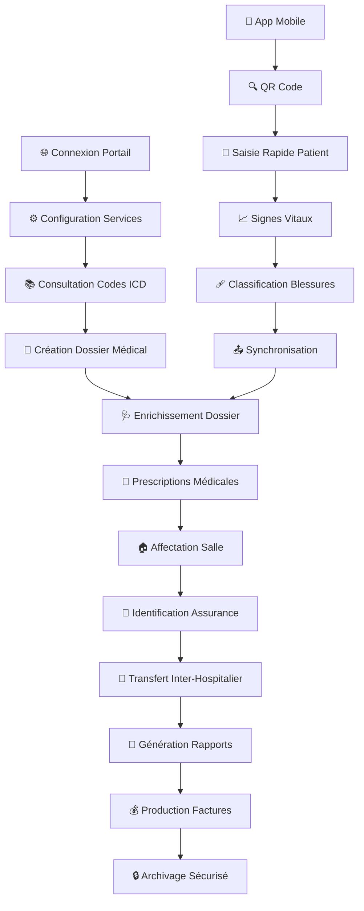

# 🚀 Guide Rapide : Services de Santé

**Durée estimée** : 12 minutes  
**Niveau** : Débutant  
**Version** : 2.0

---

## 📋 Ce que vous allez apprendre

À la fin de ce guide, vous saurez :

✅ Accéder au portail DOSER Services de Santé  
✅ Configurer les produits et services (première utilisation)  
✅ Créer un dossier médical complet  
✅ Enrichir le dossier avec examens, traitements et diagnostics  
✅ Gérer les transferts inter-hospitaliers  
✅ Générer des rapports et factures  
✅ Respecter la confidentialité médicale  

## 🎬 Workflow Complet avec Captures d'Écran

### Vue d'Ensemble du Workflow



### Workflow Détaillé par Écrans

#### Écran 1 : Connexion au Portail Web
```
┌─────────────────────────────────────┐
│  🌐 DOSER - Services de Santé      │
│                                     │
│  Serveur: http://51.195.80.167:8098│
│                                     │
│  Identifiant: [________________]   │
│  Mot de passe: [________________]  │
│                                     │
│  [🔑 CONNEXION]                    │
│                                     │
│  Statut: 🟢 Prêt                   │
└─────────────────────────────────────┘
```

#### Écran 2 : Configuration Initiale
```
┌─────────────────────────────────────┐
│  ⚙️ Configuration Services          │
│                                     │
│  🏥 Hôpital                        │
│  ├── [🔬 Examens]                  │
│  ├── [💊 Traitements]              │
│  ├── [💉 Médicaments]              │
│  ├── [🏠 Chambres]                 │
│  └── [🏥 Services]                 │
│                                     │
│  [📚 Codes ICD]                    │
│                                     │
│  Statut: ⚠️ Configuration requise   │
└─────────────────────────────────────┘
```

#### Écran 3 : Création Dossier Médical
```
┌─────────────────────────────────────┐
│  📋 Nouveau Dossier Médical        │
│                                     │
│  Informations Patient:             │
│  Nom: [Jean MARTIN        ]        │
│  Prénom: [Pierre          ]        │
│  Âge: [45 ans]                     │
│  Téléphone: [+237 6XX XX XX]       │
│                                     │
│  Contexte Accident:                │
│  Date: [17/10/2025]                │
│  Mode: [Conducteur ▼]              │
│                                     │
│  [✅ Enregistrer] [❌ Annuler]      │
└─────────────────────────────────────┘
```

#### Écran 4 : Enrichissement du Dossier
```
┌─────────────────────────────────────┐
│  🩺 Dossier: Jean MARTIN - Pierre   │
│                                     │
│  Actions: [Détails] [Modifier]     │
│                                     │
│  📊 Sections:                      │
│  ├── 📈 Paramètres médicaux        │
│  ├── 🔬 Examens des soins          │
│  ├── 💊 Traitements                │
│  ├── 💉 Médicaments                │
│  ├── 🩺 Diagnostics                │
│  └── 🏠 Salle de soins             │
│                                     │
│  Statut: 🟢 OPENED                 │
└─────────────────────────────────────┘
```

#### Écran 5 : Prescription d'Examens
```
┌─────────────────────────────────────┐
│  🔬 Examens des Soins              │
│                                     │
│  [+ Prescrire Examen]              │
│                                     │
│  Type: [Radio thorax ▼]            │
│  Date: [17/10/2025]                │
│  Observations: [Fracture côte]     │
│                                     │
│  [✅ Enregistrer] [❌ Annuler]      │
│                                     │
│  📋 Examens prescrits:             │
│  • Radio thorax - 17/10/2025       │
│  • Scanner crânien - 17/10/2025    │
└─────────────────────────────────────┘
```

#### Écran 6 : Génération de Rapports
```
┌─────────────────────────────────────┐
│  📄 Génération de Rapport          │
│                                     │
│  Patient: Jean MARTIN - Pierre     │
│  Date: 17/10/2025                  │
│                                     │
│  📋 Contenu:                       │
│  ✅ Informations personnelles      │
│  ✅ Paramètres médicaux            │
│  ✅ Examens réalisés               │
│  ✅ Traitements administrés        │
│  ✅ Médicaments prescrits          │
│  ✅ Diagnostics                    │
│                                     │
│  [📄 Générer PDF] [👁️ Prévisualiser]│
└─────────────────────────────────────┘
```

#### Écran 7 : Application Mobile
```
┌─────────────────────────────────────┐
│  📱 DOSER DATA CAPTURE             │
│  Version 2.0 - Services de Santé   │
│                                     │
│  [👤 Nouveau Patient]              │
│  [🔍 Rechercher Patient]           │
│  [📊 Dossiers Ouverts]             │
│  [🔄 Synchronisation]              │
│                                     │
│  Statut: 📶 Hors ligne             │
│  Sync: 15/20 dossiers              │
└─────────────────────────────────────┘
```

#### Écran 8 : Saisie Rapide Mobile
```
┌─────────────────────────────────────┐
│  📋 Nouveau Patient                 │
│                                     │
│  Nom: [Jean MARTIN        ]        │
│  Prénom: [Pierre          ]        │
│  Âge: [45 ans]                     │
│  Sexe: [M] [F]                     │
│                                     │
│  🚗 Mode de déplacement:           │
│  [Conducteur] [Passager] [Piéton]  │
│                                     │
│  📍 Lieu accident: [GPS activé]    │
│                                     │
│  [✅ Enregistrer] [❌ Annuler]      │
└─────────────────────────────────────┘
```

### Comparaison des Workflows

| Aspect | Interface Web | Application Mobile |
|--------|---------------|-------------------|
| **Durée** | 31 minutes | 7 minutes |
| **Complétude** | Dossier complet | Saisie essentielle |
| **Fonctionnalités** | Toutes disponibles | Fonctions de base |
| **Contexte** | Bureau/Poste fixe | Terrain/Urgence |
| **Configuration** | Requise | Pré-configurée |
| **Rapports** | PDF détaillés | Synchronisation |
| **Transfert** | Inter-hospitalier | Liaison accident |

### États des Dossiers

🟢 **OPENED (Ouvert)**
- Dossier créé et en cours de traitement
- Modifications possibles
- Enrichissement en cours
- Actions : Consulter, Modifier, Enrichir

🟡 **IN_PROGRESS (En cours)**
- Traitement médical en cours
- Prescriptions actives
- Suivi régulier
- Actions : Mettre à jour, Suivre

🔵 **TRANSFERRED (Transféré)**
- Patient transféré vers autre établissement
- Dossier transmis
- Suivi externe
- Actions : Consulter, Suivre

🔴 **CLOSED (Fermé)**
- Traitement terminé
- Dossier finalisé
- Archivage sécurisé
- Actions : Consulter, Archiver

⚫ **DECEASED (Décédé)**
- Patient décédé
- Code OMS enregistré
- Certificat de décès
- Actions : Consulter, Transmettre

### Points de Contrôle Qualité

**📋 Vérifications Obligatoires :**
- ✅ Informations patient complètes
- ✅ Mode de déplacement enregistré
- ✅ Signes vitaux saisis
- ✅ Classification des blessures (AIS)
- ✅ Codes ICD pour diagnostics
- ✅ Informations d'assurance
- ✅ Respect de la confidentialité

**🔍 Contrôles de Cohérence :**
- ✅ Cohérence des dates (accident vs admission)
- ✅ Logique des prescriptions
- ✅ Correspondance patient-accident
- ✅ Complétude des transferts
- ✅ Validation des codes OMS

**📊 Indicateurs de Performance :**
- 📈 Temps de prise en charge
- 📈 Taux de complétude des dossiers
- 📈 Rapidité de synchronisation
- 📈 Qualité des données
- 📈 Satisfaction utilisateur

---

## 🌐 Étape 1 : Accès au Portail (2 min)

### Connexion Web

1. Ouvrez votre navigateur (Chrome, Firefox, Edge)
2. Allez sur : **http://51.195.80.167:8098**
3. Sélectionnez le module **"Services de Santé"**
4. Entrez votre **nom d'utilisateur** (format : matricule ou nom d'utilisateur)
5. Entrez votre **mot de passe**
6. Cliquez sur **Connexion**

### Première Connexion

Lors de votre première connexion :

1. Vous devez **changer votre mot de passe**
2. Créez un mot de passe fort (min. 12 caractères)
3. Activez l'**authentification à deux facteurs** (recommandé)
4. Configurez vos **préférences** de notification
5. Complétez votre **profil médical**

### Configuration Initiale (Première Utilisation)

**⚠️ Important :** Cette configuration ne se fait qu'une seule fois !

#### Configuration des Produits et Services

1. **Accéder au menu** Hôpital
2. **Configurer les examens** : Hôpital > Examen
   - Cliquer sur "+" pour ajouter
   - Renseigner nom et prix
   - Enregistrer
3. **Configurer les traitements** : Hôpital > Traitement
   - Même procédure que pour les examens
4. **Configurer les médicaments** : Hôpital > Médicament
   - Même procédure que pour les examens
5. **Configurer les chambres** : Hôpital > Chambre
   - Renseigner numéro, service et prix
6. **Configurer les services** : Hôpital > Service
   - Ajouter les services hospitaliers

#### Visualisation des Codes ICD

1. **Cliquer sur le bouton** "ICD Codes"
2. **Consulter** la liste complète des codes
3. **Utiliser** les codes appropriés pour les diagnostics

### Interface Mobile (Alternative)

Pour une utilisation sur mobile/tablette :

1. **Téléchargez** l'application DOSER DATA CAPTURE
2. **Scannez** le code QR de votre établissement
3. **Connectez-vous** avec vos identifiants
4. **Sélectionnez** le profil "Services de Santé"

✓ **Résultat attendu** : Vous êtes sur le tableau de bord Services de Santé

---

## 🏥 Étape 2 : Créer un Dossier Médical (5 min)

### 2.1 Accéder au Formulaire

1. Sur le tableau de bord, cliquez sur l'**icône d'ajout d'un dossier médical**
2. OU : Menu > **Hôpital** > **Nouveau Dossier**

### 2.2 Informations Basiques du Patient

1. **Données personnelles** :
   - Nom et prénoms
   - Date de naissance
   - Sexe
   - Adresse
   - Téléphone

2. **Informations médicales** :
   - Groupe sanguin
   - Allergies connues
   - Antécédents médicaux
   - Traitements en cours

3. **Contexte de l'accident** :
   - Date et heure de l'accident
   - Lieu de l'accident
   - Mode de déplacement (obligatoire)
   - Circonstances de l'accident

### 2.3 Ajout des Contacts

1. **Cliquer sur "+"** pour ajouter un contact
2. **Renseigner** les coordonnées du contact
3. **Valider** en cliquant sur "Ajouter"
4. **Répéter** pour tous les contacts nécessaires

### 2.4 Enregistrement

- Cliquer sur **"Enregistrer"** pour finaliser la création du dossier
- Le dossier passe à l'état **"OPENED"**

💡 **Important** : Si la victime est inconsciente et non identifiée, utilisez le code "INCONNU-[DATE]-[HEURE]"

### 2.4 Liaison avec l'Accident

1. Cliquez sur **"Lier à un Accident"**
2. Recherchez par :
   - Numéro de constat
   - Date et lieu
   - Véhicule impliqué

3. Sélectionnez l'accident correspondant
4. Le système crée automatiquement le lien

✓ **Résultat attendu** : La victime est enregistrée et liée à l'accident

---

## 🩺 Étape 3 : Saisir les Données Médicales (4 min)

### 3.1 Triage et Évaluation Initiale

1. **Niveau de gravité** (Échelle de triage) :
   - 🔴 Urgence absolue (P1)
   - 🟠 Urgence relative (P2)
   - 🟡 Peu urgent (P3)
   - 🟢 Non urgent (P4)

2. **Signes vitaux** :
   - Tension artérielle
   - Fréquence cardiaque
   - Saturation O2
   - Température
   - Score de Glasgow (si applicable)

### 3.2 Traumatismes et Blessures

1. Cliquez sur **"Ajouter Traumatisme"**
2. Sélectionnez la **localisation** :
   - Tête
   - Cou
   - Thorax
   - Abdomen
   - Membres supérieurs
   - Membres inférieurs
   - Multiple

3. Type de blessure :
   - Contusion
   - Fracture
   - Plaie
   - Brûlure
   - Traumatisme crânien
   - Autre

4. **Gravité** (AIS - Abbreviated Injury Scale) :
   - 1 = Mineure
   - 2 = Modérée
   - 3 = Sérieuse
   - 4 = Sévère
   - 5 = Critique
   - 6 = Maximale

### 3.3 Soins Prodigués

1. **Examens réalisés** :
   - Radio
   - Scanner
   - IRM
   - Échographie
   - Analyses sanguines

2. **Traitements administrés** :
   - Médicaments (nom, dosage)
   - Interventions chirurgicales
   - Soins infirmiers
   - Rééducation

3. **Évolution** :
   - Stable
   - Amélioration
   - Aggravation
   - Décès

### 3.4 Enrichissement du Dossier Médical

**Accès :** Cliquer sur "Détails" dans la liste des actions

#### Prescription des Examens
1. **Cliquer sur "+"** pour prescrire un examen
2. **Renseigner** : Type d'examen, date, observations
3. **Cliquer sur "Enregistrer"** pour valider

#### Prescription des Traitements
1. **Cliquer sur "+"** pour prescrire un traitement
2. **Renseigner** : Nom, dosage, fréquence, durée
3. **Cliquer sur "Enregistrer"** pour valider

#### Prescription des Médicaments
1. **Cliquer sur "+"** pour prescrire un médicament
2. **Renseigner** : Nom, dosage, posologie, durée
3. **Cliquer sur "Enregistrer"** pour valider

#### Diagnostics
1. **Cliquer sur "+"** pour prescrire un diagnostic
2. **Utiliser les codes ICD** appropriés
3. **Renseigner** : Code ICD, description, date
4. **Cliquer sur "Enregistrer"** pour valider

#### Affectation à une Salle de Soins
1. **Cliquer sur "+"** pour créer une affectation
2. **Renseigner** : Numéro de chambre, service, date d'admission
3. **Cliquer sur "Enregistrer"** pour valider

**Actions disponibles pour chaque section :**
- **Modifier** : Cliquer sur "Modifier", ajuster, enregistrer
- **Supprimer** : Cliquer sur "Supprimer", confirmer

✓ **Résultat attendu** : Le dossier médical est enrichi et complet

---

## 🏢 Étape 4 : Identifier les Compagnies d'Assurance (2 min)

### 4.1 Informations d'Assurance

1. **Nom de la compagnie** :
   - Assurance maladie
   - Assurance auto
   - Assurance complémentaire

2. **Numéro de police** :
   - Référence du contrat
   - Numéro de sinistre

3. **Contact assureur** :
   - Téléphone
   - Email
   - Adresse

4. **Plafond de prise en charge** :
   - Montant maximum
   - Conditions particulières

### 4.2 Vérification des Véhicules

1. **Informations véhicule** :
   - Marque et modèle
   - Numéro d'immatriculation
   - État des dommages

2. **Conducteur** :
   - Identité
   - Permis de conduire
   - Statut d'assurance

---

## 🔗 Étape 5 : Partage des Informations (1 min)

### Avec les Assurances

1. Menu > **Partage** > **Assurances**
2. Vérifiez la **police d'assurance** de la victime
3. Sélectionnez les informations à partager :
   - ✓ Diagnostic
   - ✓ Soins reçus
   - ✓ Pronostic
   - ✓ Factures détaillées
   - ✗ Dossier médical complet (respect secret médical)

4. Cliquez sur **"Envoyer à l'Assurance"**

### Avec d'Autres Services

1. **Transfert vers autre hôpital** :
   - Menu > Transfert
   - Sélectionnez l'établissement
   - Joignez le dossier médical
   - Envoyez

2. **Notification aux autorités** :
   - Pour les cas graves/mortels
   - Le système notifie automatiquement

✓ **Résultat attendu** : Les informations nécessaires sont partagées en toute sécurité

---

## 🔄 Étape 6 : Transfert Inter-Hospitalier (3 min)

### 6.1 Procédure de Transfert

1. **Cliquer sur le bouton "Transférer"**
2. **Renseigner** les informations :
   - Hôpital de destination
   - État des soins
   - Méthode de transfert
   - Description de l'état du patient
3. **Cliquer sur "Enregistrer"** pour valider le transfert

### 6.2 Suivi des Patients Transférés

1. **Cliquer sur "Transfert de Soins"**
2. **Consulter** la liste des patients transférés
3. **Suivre** l'évolution des dossiers

---

## 📄 Étape 7 : Génération des Rapports (2 min)

### 7.1 Génération du Rapport Médical

1. **Cliquer sur "Générer Rapport"**
2. **Télécharger** la version PDF complète
3. **Imprimer** directement depuis l'interface

### 7.2 Modification du Dossier Médical

1. **Cliquer sur l'icône "Modifier"**
2. **Ajuster** les champs nécessaires
3. **Cliquer sur "Enregistrer"** pour valider les modifications

---

## 💰 Étape 8 : Production de Factures Médicales (2 min)

### 8.1 Génération Automatique

1. Menu > **Facturation** > **Nouvelle Facture**
2. Sélectionnez le **patient** concerné
3. Vérifiez les **soins prodigués** :
   - Consultations
   - Examens
   - Médicaments
   - Hospitalisation
   - Interventions

### 8.2 Détail des Coûts

**Soins Médicaux :**
- Consultation : [Montant]
- Examen radiologique : [Montant]
- Analyses biologiques : [Montant]

**Médicaments :**
- [Nom du médicament] : [Quantité] x [Prix unitaire]
- [Nom du médicament] : [Quantité] x [Prix unitaire]

**Hospitalisation :**
- Chambre : [Nombre de jours] x [Prix/jour]
- Repas : [Nombre] x [Prix unitaire]
- Soins infirmiers : [Nombre] x [Prix unitaire]

### 8.3 Envoi à l'Assurance

1. **Vérification** des informations d'assurance
2. **Calcul** de la prise en charge
3. **Génération** de la facture
4. **Envoi** automatique à l'assureur
5. **Suivi** du remboursement

✓ **Résultat attendu** : Facture générée et envoyée à l'assurance

---

## 🔐 Étape 7 : Respect de la Confidentialité (1 min)

### Secret Médical

L'application DOSER protège automatiquement :

- ✅ **Chiffrement** de toutes les données sensibles
- ✅ **Accès basé sur les rôles** (vous ne voyez que ce dont vous avez besoin)
- ✅ **Traçabilité** (toutes les consultations sont enregistrées)
- ✅ **Anonymisation** pour les statistiques

### Bonnes Pratiques

1. **Ne partagez JAMAIS** vos identifiants
2. **Déconnectez-vous** après chaque session
3. **Verrouillez votre écran** si vous vous absentez
4. **Vérifiez** que vous êtes seul avant d'afficher des données sensibles
5. **Ne partagez** que les informations strictement nécessaires

⚠️ **Attention** : Toute violation du secret médical est tracée et peut faire l'objet de sanctions.

---

## 🚨 Procédures d'Urgence

### Cas Critique (P1 - Urgence Vitale)

⏱️ **Temps cible : 3 minutes maximum**

**Actions Immédiates :**
1. **Évaluation** des fonctions vitales (ABC)
2. **Stabilisation** d'urgence
3. **Alerte** automatique des spécialistes
4. **Enregistrement** minimal dans DOSER
5. **Communication** avec l'équipe de réanimation

**Enregistrement DOSER (après stabilisation) :**
- Nom : "URGENCE-[HEURE]"
- Gravité : P1 (Urgence absolue)
- Signes vitaux : Tous les paramètres
- Traumatismes : Classification AIS
- Soins : Médicaments d'urgence

### Victime Inconsciente (État Grave)

⏱️ **Temps estimé : 8-10 minutes**

**Procédure :**
1. **Évaluation** neurologique (Score de Glasgow)
2. **Stabilisation** des fonctions vitales
3. **Enregistrement** complet dans DOSER
4. **Coordination** avec neurochirurgie
5. **Communication** avec les familles

### Accident Multi-Victimes

⏱️ **Temps estimé : 15-20 minutes**

**Organisation :**
1. **Déclenchement** du plan blanc
2. **Triage** des victimes (P1, P2, P3, P4)
3. **Enregistrement** groupé dans DOSER
4. **Coordination** des équipes
5. **Communication** centralisée

## 📊 Cas d'Usage Standards

### Victime Consciente (Blessures Légères)

⏱️ **Temps estimé : 5 minutes**

**Procédure :**
1. Enregistrer la victime
2. Lier à l'accident
3. Saisir signes vitaux
4. Enregistrer blessures (contusions)
5. Soins prodigués
6. Sortie

### Victime Modérément Blessée

⏱️ **Temps estimé : 7-8 minutes**

1. Enregistrer comme "INCONNU"
2. Triage P1 (urgence absolue)
3. Signes vitaux critiques
4. Traumatismes multiples
5. Soins intensifs
6. Mise à jour régulière de l'état
7. Identification ultérieure

### Cas Mortel

⏱️ **Temps estimé : 10-15 minutes**

**Procédure d'Enregistrement :**
1. **Constation** médicale du décès
2. **Enregistrement** de l'heure du décès
3. **Identification** de la cause probable
4. **Code OMS** (CIM-10) :
   - **V01-V09** : Piéton blessé
   - **V10-V19** : Cycliste blessé
   - **V20-V29** : Motocycliste blessé
   - **V40-V49** : Occupant automobile
   - **V50-V59** : Occupant camionnette
   - **V60-V69** : Occupant véhicule lourd
   - **V70-V79** : Occupant autobus
   - **V80-V89** : Autre transport terrestre

5. **Documentation** médicale complète
6. **Coordination** avec les autorités
7. **Communication** avec les familles

**Codes OMS Principaux :**
- **V01-V99** : Accidents de transport
- **V01-V09** : Piétons blessés
- **V10-V19** : Cyclistes blessés
- **V20-V29** : Motocyclistes blessés
- **V40-V49** : Automobilistes blessés

**Actions Complémentaires :**
- Notification automatique aux autorités
- Préparation du certificat de décès
- Contact avec la famille
- Transfert vers la morgue

---

## ⚠️ Problèmes Fréquents et Solutions

### Je ne trouve pas l'accident correspondant

**Solution** :
1. Élargissez les critères de recherche
2. Vérifiez l'orthographe du lieu
3. Recherchez par plage de dates
4. Contactez les Forces de l'Ordre pour le numéro de constat

### Les signes vitaux ne se saisissent pas

**Solution** :
1. Vérifiez votre connexion Internet
2. Actualisez la page (F5)
3. Utilisez un autre navigateur
4. Contactez le support technique

### Erreur lors du partage avec l'assurance

**Solution** :
1. Vérifiez que la police d'assurance est renseignée
2. Assurez-vous d'avoir les autorisations nécessaires
3. Vérifiez votre connexion
4. Réessayez dans quelques minutes

---

## 📚 Pour Aller Plus Loin

### Manuel Complet

📕 [Manuel Complet des Services de Santé](../../manuel/services-sante.md)

### Formation Continue

- 🎓 Formations médicales spécialisées
- 🎥 Webinaires mensuels
- 📞 Support médical : support-sante@ditros.org

---

## 🆘 Besoin d'Aide ?

### Support Technique
- **📧 Email** : support-sante@ditros.org
- **📞 Urgences** : +237 XXX XXX XXX (24/7)
- **💬 Chat** : Disponible dans le portail

### Contacts Médicaux
- **🩺 Coordination médicale** : coordination@ditros.org
- **🐛 Signaler un problème** : bugs-sante@ditros.org
- **💡 Suggestions** : feedback-sante@ditros.org

---

## ✅ Checklist de Démarrage

Avant de quitter ce guide, assurez-vous d'avoir :

- [ ] Accédé au portail DOSER Services de Santé
- [ ] Configuré les produits et services (examens, traitements, médicaments, chambres)
- [ ] Consulté la liste des codes ICD
- [ ] Créé un dossier médical complet
- [ ] Enrichi le dossier avec examens, traitements, médicaments et diagnostics
- [ ] Testé le transfert inter-hospitalier
- [ ] Généré un rapport médical PDF
- [ ] Modifié un dossier médical existant
- [ ] Identifié les compagnies d'assurance
- [ ] Testé la production de factures médicales
- [ ] Compris l'enregistrement des codes OMS pour les décès
- [ ] Compris les règles de confidentialité
- [ ] Testé le partage avec une assurance (en mode test)

---

**Félicitations ! 🎉**  
Vous êtes maintenant prêt à utiliser DOSER pour enregistrer et gérer les victimes d'accidents !

---

*Guide créé le : 9 octobre 2025*  
*Dernière mise à jour : 17 octobre 2025*  
*Version : 7.0 - Vue d'ensemble structurée comme guide agent constatateur*

---

## 📸 Note sur les Captures d'Écran

**Les captures d'écran présentées dans ce guide sont des représentations visuelles de l'interface DOSER. Elles montrent :**

- ✅ **L'apparence réelle** des écrans et formulaires
- ✅ **Les boutons et menus** disponibles
- ✅ **Le flux de navigation** entre les sections
- ✅ **Les champs de saisie** et options de sélection
- ✅ **Les actions possibles** à chaque étape

**Pour une expérience optimale :**
- 📱 **Testez** chaque étape avec l'application réelle
- 🔄 **Pratiquez** les workflows sur des données de test
- 📚 **Consultez** le manuel complet pour plus de détails
- 🆘 **Contactez** le support en cas de difficulté

