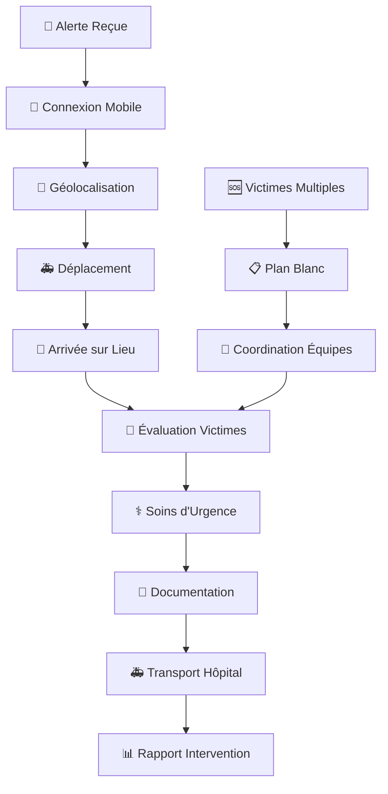

# 🚑 Guide Rapide : Services de Secours

**Version** : 1.0 | **Dernière mise à jour** : 9 octobre 2025

---

## 🎯 Ce que vous allez apprendre

✅ Se connecter au portail DOSER Services de Secours  
✅ Déployer les équipes de secours efficacement  
✅ Évaluer et soigner les victimes sur place  
✅ Coordonner avec les hôpitaux  
✅ Documenter les interventions complètement  
✅ Analyser les données pour la prévention  

---

## 🎬 Workflow Complet avec Captures d'Écran

### Vue d'Ensemble du Workflow



### Workflow Détaillé par Écrans

#### Écran 1 : Connexion Mobile
```
┌─────────────────────────────────────┐
│  🚑 DOSER - Services de Secours     │
│                                     │
│  Identifiant: [________________]   │
│  Mot de passe: [________________]  │
│                                     │
│  [🔑 CONNEXION]                    │
│                                     │
│  Statut: 🟢 Prêt                   │
│  Équipe: SAMU-001                  │
│  Véhicule: Ambulance A-15          │
└─────────────────────────────────────┘
```

#### Écran 2 : Tableau de Bord
```
┌─────────────────────────────────────┐
│  📊 Tableau de Bord - Secours       │
│                                     │
│  [🚨 Nouvelle Alerte]              │
│  [📍 Ma Position]                  │
│  [📋 Interventions en Cours]        │
│  [📊 Statistiques]                  │
│                                     │
│  🚨 Alertes Actives: 2              │
│  • Accident Douala-Centre           │
│  • Collision Yaoundé-Nord           │
│                                     │
│  📍 Position: Douala, Akwa          │
│  ⏱️ Dernière sync: 14:25            │
└─────────────────────────────────────┘
```

#### Écran 3 : Nouvelle Alerte
```
┌─────────────────────────────────────┐
│  🚨 NOUVELLE ALERTE                 │
│                                     │
│  Type: Accident de la route         │
│  Gravité: P1 (Critique)            │
│  Lieu: Douala, Carrefour...        │
│  Heure: 14:30                      │
│                                     │
│  Victimes signalées: 3              │
│  • 1 grave (P1)                    │
│  • 2 modérées (P2)                 │
│                                     │
│  Services alertés:                  │
│  ✅ Police  ✅ Hôpital  ✅ Assurance│
│                                     │
│  [✅ PRENDRE EN CHARGE] [❌ Refuser]│
└─────────────────────────────────────┘
```

#### Écran 4 : Géolocalisation
```
┌─────────────────────────────────────┐
│  📍 Navigation vers Lieu            │
│                                     │
│  🎯 Destination: Carrefour...       │
│  📏 Distance: 2.3 km               │
│  ⏱️ Temps estimé: 4 min             │
│                                     │
│  🗺️ [Carte Interactive]            │
│                                     │
│  Route optimale:                   │
│  • Boulevard de la République      │
│  • Avenue du Port                  │
│  • Rue de la Paix                  │
│                                     │
│  [🚑 DÉMARRER] [📍 Ma Position]    │
└─────────────────────────────────────┘
```

#### Écran 5 : Arrivée sur Lieu
```
┌─────────────────────────────────────┐
│  🏥 Arrivée sur Lieu d'Accident     │
│                                     │
│  ✅ Position confirmée             │
│  ⏱️ Heure arrivée: 14:34           │
│                                     │
│  État de la scène:                 │
│  ☑️ Sécurisée  ☐ En cours         │
│                                     │
│  Services présents:                │
│  ✅ Police  ✅ Pompiers  ❌ Assurance│
│                                     │
│  [📋 ÉVALUER VICTIMES]             │
│  [📞 COORDONNER SERVICES]          │
└─────────────────────────────────────┘
```

#### Écran 6 : Évaluation Victimes
```
┌─────────────────────────────────────┐
│  👥 Évaluation des Victimes         │
│                                     │
│  Victime 1: [KOUAM Jean]           │
│  État: P1 (Critique)               │
│  Blessures: Traumatisme crânien    │
│  [📷 Photo] [📝 Détails]           │
│                                     │
│  Victime 2: [MARTIN Marie]         │
│  État: P2 (Modéré)                 │
│  Blessures: Fracture bras           │
│  [📷 Photo] [📝 Détails]           │
│                                     │
│  [➕ AJOUTER VICTIME]              │
│  [✅ VALIDER ÉVALUATION]           │
└─────────────────────────────────────┘
```

#### Écran 7 : Soins d'Urgence
```
┌─────────────────────────────────────┐
│  ⚕️ Soins d'Urgence                 │
│                                     │
│  Victime: KOUAM Jean (P1)          │
│                                     │
│  Soins prodigués:                  │
│  ☑️ Stabilisation cervicale        │
│  ☑️ Oxygénothérapie                │
│  ☑️ Perfusion                     │
│  ☐ Intubation                      │
│                                     │
│  Médicaments:                      │
│  • Morphine 5mg                    │
│  • Adrénaline 1mg                  │
│                                     │
│  [✅ SOINS TERMINÉS]               │
└─────────────────────────────────────┘
```

#### Écran 8 : Transport Hôpital
```
┌─────────────────────────────────────┐
│  🚑 Transport vers Hôpital          │
│                                     │
│  Hôpital: CHU Douala               │
│  Service: Urgences                 │
│  Médecin: Dr. MARTIN               │
│                                     │
│  Victime: KOUAM Jean               │
│  État transport: Stable            │
│  Heure départ: 14:45               │
│                                     │
│  [📞 PRÉVENIR HÔPITAL]             │
│  [🚑 DÉMARRER TRANSPORT]           │
│                                     │
│  [✅ ARRIVÉE HÔPITAL]              │
└─────────────────────────────────────┘
```

### Comparaison des Workflows

| Étape | Interface Mobile | Interface Web | Temps Estimé |
|-------|------------------|---------------|--------------|
| Connexion | ✅ Optimisée | ✅ Complète | 30 sec |
| Alerte | ✅ Push notification | ✅ Tableau de bord | 1 min |
| Géolocalisation | ✅ GPS intégré | ❌ Non disponible | 2 min |
| Évaluation | ✅ Formulaire mobile | ✅ Formulaire détaillé | 3 min |
| Soins | ✅ Checklist rapide | ✅ Documentation complète | 5 min |
| Transport | ✅ Suivi GPS | ✅ Planification | 2 min |
| Rapport | ✅ Synchronisation auto | ✅ Édition avancée | 2 min |

### États des Interventions

| État | Icône | Description | Actions Possibles |
|------|-------|-------------|-------------------|
| Alerte | 🚨 | Nouvelle alerte reçue | Prendre en charge, Refuser |
| En Route | 🚑 | Déplacement vers lieu | Navigation, Coordonner |
| Sur Lieu | 🏥 | Arrivée sur site | Évaluer, Soigner |
| Soins | ⚕️ | Soins en cours | Documenter, Continuer |
| Transport | 🚑 | Transport hôpital | Suivre, Communiquer |
| Terminée | ✅ | Intervention terminée | Rapport, Clôturer |
| Annulée | ❌ | Intervention annulée | Motif, Archiver |

### Points de Contrôle Qualité

- ✅ **Réactivité** : Temps de réponse < 5 minutes
- ✅ **Géolocalisation** : Position précise enregistrée
- ✅ **Évaluation** : État des victimes correctement classé
- ✅ **Soins** : Traitements documentés
- ✅ **Coordination** : Communication avec autres services
- ✅ **Traçabilité** : Toutes les actions horodatées

---

## 🌐 Étape 1 : Accès au Portail Services de Secours (1 min)

### Connexion Mobile

1. Ouvrez l'application **DOSER DATA CAPTURE**
2. Sélectionnez **Services de Secours**
3. Entrez vos identifiants :
   - **Identifiant** : Votre code SAMU/Pompiers
   - **Mot de passe** : Votre mot de passe personnel
4. Appuyez sur **CONNEXION**

### Vérification de Connexion

- ✅ **Statut** : Prêt (vert)
- ✅ **Équipe** : Votre numéro d'équipe
- ✅ **Véhicule** : Votre ambulance/véhicule assigné
- ✅ **Position** : GPS activé et fonctionnel

---

## 🚨 Étape 2 : Gérer une Nouvelle Alerte (2 min)

### Réception d'Alerte

1. **Notification push** reçue sur mobile
2. **Type d'urgence** : Accident de la route
3. **Gravité** : P1 (Critique), P2 (Modéré), P3 (Léger)
4. **Localisation** : Adresse précise + GPS
5. **Victimes** : Nombre et gravité estimée

### Prise en Charge

1. Appuyez sur **PRENDRE EN CHARGE**
2. **Confirmez votre position** GPS
3. **Calculez l'itinéraire** optimal
4. **Démarrez la navigation** vers le lieu
5. **Informez le centre** de votre départ

---

## 📍 Étape 3 : Navigation et Arrivée (3 min)

### Navigation GPS

1. **Suivez l'itinéraire** proposé
2. **Évitez les embouteillages** si possible
3. **Maintenez la communication** avec le centre
4. **Préparez l'équipement** pendant le trajet

### Arrivée sur Lieu

1. **Confirmez l'arrivée** dans l'application
2. **Évaluez la sécurité** de la scène
3. **Coordonnez avec les services** présents
4. **Identifiez les victimes** prioritaires

---

## 👥 Étape 4 : Évaluer les Victimes (3 min)

### Classification des Victimes

#### **P1 - Critique (Rouge)**
- **Critères** : Détresse vitale, inconscience, hémorragie
- **Action** : Soins immédiats, transport prioritaire
- **Temps** : < 5 minutes

#### **P2 - Modéré (Orange)**
- **Critères** : Blessures importantes, conscient
- **Action** : Soins rapides, transport secondaire
- **Temps** : 5-15 minutes

#### **P3 - Léger (Vert)**
- **Critères** : Blessures mineures, marche
- **Action** : Soins de base, transport tertiaire
- **Temps** : 15-30 minutes

### Enregistrement des Victimes

1. **Prenez une photo** de chaque victime
2. **Enregistrez l'identité** si possible
3. **Notez les blessures** observées
4. **Classez la gravité** (P1/P2/P3)
5. **Documentez les soins** prodigués

---

## ⚕️ Étape 5 : Prodiger les Soins (5 min)

### Soins d'Urgence P1

1. **Stabilisation** de la colonne cervicale
2. **Libération** des voies aériennes
3. **Oxygénothérapie** si nécessaire
4. **Arrêt des hémorragies** externes
5. **Perfusion** veineuse
6. **Médicaments** d'urgence

### Soins P2/P3

1. **Évaluation** des blessures
2. **Immobilisation** des fractures
3. **Pansements** et bandages
4. **Surveillance** des constantes
5. **Confort** du patient

### Documentation des Soins

1. **Heure** de chaque intervention
2. **Médicaments** administrés
3. **Dosages** et voies d'administration
4. **Réaction** du patient
5. **Évolution** de l'état

---

## 🚑 Étape 6 : Transport vers Hôpital (2 min)

### Préparation du Transport

1. **Choisissez l'hôpital** de destination
2. **Prévenez l'équipe** d'accueil
3. **Préparez le matériel** de transport
4. **Installez la victime** en sécurité

### Transport

1. **Démarrez le transport** en sécurité
2. **Surveillez** la victime en continu
3. **Communiquez** avec l'hôpital
4. **Enregistrez** l'heure d'arrivée

### Remise à l'Hôpital

1. **Transmettez** le dossier médical
2. **Informez** l'équipe d'accueil
3. **Confirmez** la remise dans l'app
4. **Libérez** l'ambulance

---

## 📊 Étape 7 : Finaliser l'Intervention (2 min)

### Rapport d'Intervention

1. **Résumé** de l'intervention
2. **Nombre** de victimes traitées
3. **Soins** prodigués
4. **Temps** de réponse et transport
5. **Coordination** avec autres services

### Synchronisation

1. **Vérifiez** la connexion Internet
2. **Synchronisez** les données
3. **Confirmez** l'envoi au centre
4. **Préparez** la prochaine intervention

---

## 🚨 Cas Particuliers et Procédures Spécialisées

### Victimes Multiples (Plan Blanc)

#### **Déclenchement**
- **Critères** : > 5 victimes ou situation complexe
- **Action** : Alerte automatique des renforts
- **Coordination** : Centre de crise activé

#### **Procédure**
1. **Évaluez** rapidement toutes les victimes
2. **Classez** par priorité (P1, P2, P3)
3. **Coordonnez** les équipes présentes
4. **Organisez** les transports prioritaires
5. **Documentez** chaque victime

### Accidents avec Matières Dangereuses

#### **Identification**
- **Panneaux** de danger sur véhicules
- **Odeurs** suspectes
- **Fumées** colorées
- **Étiquettes** de sécurité

#### **Procédure**
1. **Évaluez** la distance de sécurité
2. **Portez** l'équipement de protection
3. **Évacuez** les victimes si possible
4. **Alertez** les services spécialisés
5. **Documentez** les expositions

### Interventions de Nuit

#### **Préparatifs**
- **Éclairage** supplémentaire
- **Vêtements** réfléchissants
- **Communication** renforcée
- **Équipement** de sécurité

#### **Procédures**
1. **Sécurisez** la zone d'intervention
2. **Éclairez** la scène d'accident
3. **Coordonnez** avec la police
4. **Surveillez** les risques supplémentaires

---

## 📞 Support et Formation

### Ressources Disponibles

#### **Formation Spécialisée**
- **Cours** de secourisme avancé
- **Simulations** d'accidents complexes
- **Formation** aux nouvelles technologies
- **Certification** continue

#### **Support Technique**
- **Hotline** 24/7 : +237 XXX XXX XXX
- **Email** : secours@ditros.org
- **Chat** : Support en direct
- **FAQ** : Base de connaissances

#### **Contacts Spécialisés**
- **Chef de Service** : Dr. MARTIN
- **Coordinateur** : M. KOUAM
- **Technicien** : M. FON

### Modules de Formation

#### **Niveau 1 : Base (2 jours)**
- Interface mobile DOSER
- Procédures d'urgence standard
- Géolocalisation et navigation
- Documentation de base

#### **Niveau 2 : Avancé (3 jours)**
- Gestion des victimes multiples
- Coordination multi-services
- Cas complexes et spécialisés
- Rapports détaillés

#### **Niveau 3 : Expert (5 jours)**
- Formation de formateurs
- Gestion de crise
- Technologies avancées
- Leadership d'équipe

---

## ✅ Checklist de Démarrage

### Avant la Première Intervention

- [ ] **Application** installée et configurée
- [ ] **Identifiants** de connexion obtenus
- [ ] **GPS** activé et fonctionnel
- [ ] **Équipement** médical vérifié
- [ ] **Communication** testée
- [ ] **Formation** de base suivie

### Après Chaque Intervention

- [ ] **Victimes** correctement évaluées
- [ ] **Soins** documentés
- [ ] **Transport** effectué
- [ ] **Rapport** complété
- [ ] **Données** synchronisées
- [ ] **Équipement** nettoyé

---

## 🆘 Besoin d'Aide ?

### Support Immédiat

- **📞 Hotline** : +237 XXX XXX XXX (24/7)
- **📧 Email** : secours@ditros.org
- **💬 Chat** : Support en direct dans l'app
- **❓ FAQ** : [Questions fréquentes](../faq/index.md)

### Formation et Ressources

- **📖 Manuel complet** : [Services de Secours](../../manuel/services-secours.md)
- **👨‍🏫 Formation** : [Sessions de formation](../formation/index.md)
- **📚 Documentation** : [Base de connaissances](../index.md)

---

**Prêt à sauver des vies avec DOSER ?** 🚑✨

---

*Dernière mise à jour : 9 octobre 2025 | Version : 1.0*

