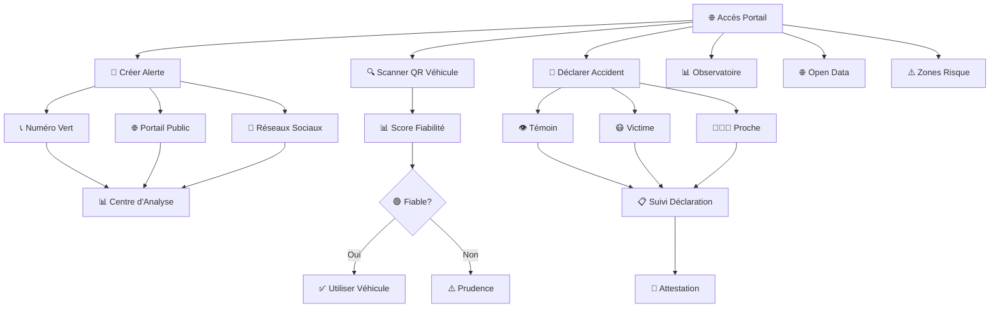

# 🚀 Guide Rapide : Usagers (Grand Public)

**Durée estimée** : 8 minutes  
**Niveau** : Débutant  
**Version** : 2.0

---

## 📋 Ce que vous allez apprendre

À la fin de ce guide, vous saurez :

✅ Créer une alerte d'accident (portail, réseaux sociaux, numéro vert)  
✅ Vérifier la fiabilité d'un véhicule en scannant son QR code  
✅ Déclarer un accident dont vous êtes témoin ou victime  
✅ Suivre l'évolution de votre déclaration  
✅ Accéder aux données publiques et statistiques  
✅ Consulter les zones accidentogènes  
✅ Obtenir une attestation d'accident  

---

## 🎬 Workflow Complet avec Captures d'Écran

### Vue d'Ensemble du Workflow



### Workflow Détaillé par Écrans

#### Écran 1 : Page d'Accueil du Portail

```
┌─────────────────────────────────────────────────────┐
│  🌐 DOSER - Portail Citoyen                        │
│                                                     │
│  [🚨 Créer une Alerte]  [🔍 Scanner QR Véhicule] │
│  [📱 Déclarer un Accident]  [📊 Observatoire]    │
│                                                     │
│  ┌───────────────────────────────────────────────┐ │
│  │  🚨 En cas d'urgence, appelez :              │ │
│  │  🚔 Police: 117  🚑 Ambulance: 119          │ │
│  │  🚒 Pompiers: 118                            │ │
│  └───────────────────────────────────────────────┘ │
│                                                     │
│  [🔑 Se Connecter]  [➕ Créer un Compte]         │
│                                                     │
│  📊 Statistiques du jour:                          │
│  • Accidents déclarés: 23                          │
│  • Alertes créées: 15                              │
│  • Zones à risque: 5                              │
└─────────────────────────────────────────────────────┘
```

#### Écran 2 : Créer une Alerte (Portail)

```
┌─────────────────────────────────────────────────────┐
│  🚨 Créer une Alerte d'Accident                    │
│                                                     │
│  📍 Localisation:                                  │
│  [📍 Utiliser ma position]  [✏️ Saisir adresse]   │
│  Adresse: [___________________________]            │
│                                                     │
│  📝 Description:                                   │
│  [___________________________________]            │
│  [___________________________________]            │
│                                                     │
│  📷 Photos (optionnel):                            │
│  [➕ Ajouter Photo 1]  [➕ Ajouter Photo 2]     │
│                                                     │
│  📞 Vos coordonnées (optionnel):                   │
│  Téléphone: [________________]                     │
│  Email: [____________________]                      │
│                                                     │
│  [❌ Annuler]  [✅ Envoyer l'Alerte]              │
│                                                     │
│  💡 L'alerte sera transmise au Centre d'Analyse   │
└─────────────────────────────────────────────────────┘
```

#### Écran 3 : Scanner QR Code Véhicule

```
┌─────────────────────────────────────────────────────┐
│  🔍 Vérifier la Fiabilité d'un Véhicule           │
│                                                     │
│  📷 [Cadre de Scan QR Code]                       │
│                                                     │
│  Positionnez le QR code dans le cadre              │
│  Le scan se fait automatiquement                   │
│                                                     │
│  ┌───────────────────────────────────────────────┐ │
│  │  📊 Résultat du Scan                        │ │
│  │                                              │ │
│  │  Véhicule: ABC-123-XY                        │ │
│  │  Score de Fiabilité: 🟢 85/100              │ │
│  │                                              │ │
│  │  📈 Détails:                                 │ │
│  │  • Accidents: 0                              │ │
│  │  • Infractions: 2 (mineures)                │ │
│  │  • Antécédents chauffeur: Aucun             │ │
│  │                                              │ │
│  │  ✅ Véhicule fiable                          │ │
│  └───────────────────────────────────────────────┘ │
│                                                     │
│  [📊 Voir Rapport Complet]  [🔄 Scanner Autre]    │
└─────────────────────────────────────────────────────┘
```

#### Écran 4 : Déclarer un Accident (Témoin)

```
┌─────────────────────────────────────────────────────┐
│  📱 Déclarer un Accident                          │
│                                                     │
│  Votre rôle:                                       │
│  ○ Témoin  ● Victime  ○ Proche                    │
│                                                     │
│  📅 Date et Heure:                                 │
│  Date: [15/10/2025 ▼]  Heure: [14:30]            │
│                                                     │
│  📍 Lieu:                                          │
│  [📍 Ma position]  [✏️ Saisir adresse]            │
│  [Douala, Carrefour Akwa________________]         │
│                                                     │
│  🚗 Type d'accident:                               │
│  [Collision frontale ▼]                            │
│                                                     │
│  📝 Description:                                   │
│  [Deux véhicules se sont percutés...]             │
│  [___________________________________]            │
│                                                     │
│  📷 Photos (0-10):                                 │
│  [📷 Photo 1] [📷 Photo 2] [➕ Ajouter]          │
│                                                     │
│  👤 Vos coordonnées:                               │
│  Nom: [________________] (optionnel)              │
│  Téléphone: [________________] (requis)            │
│                                                     │
│  [❌ Annuler]  [✅ Envoyer la Déclaration]        │
└─────────────────────────────────────────────────────┘
```

#### Écran 5 : Confirmation de Déclaration

```
┌─────────────────────────────────────────────────────┐
│  ✅ Déclaration Envoyée avec Succès !             │
│                                                     │
│  ┌───────────────────────────────────────────────┐ │
│  │  📋 Numéro de Déclaration                    │ │
│  │  DEC-2025-001234                             │ │
│  │                                              │ │
│  │  📱 SMS de confirmation envoyé                │ │
│  │  📧 Email de confirmation envoyé              │ │
│  │                                              │ │
│  │  [📱 QR Code pour Suivi]                     │ │
│  └───────────────────────────────────────────────┘ │
│                                                     │
│  📊 Statut: 🟡 En attente de vérification          │
│                                                     │
│  Vous serez notifié(e) lorsque:                    │
│  • Votre déclaration sera vérifiée                │
│  • Un constat officiel sera établi                │
│  • Le dossier sera clôturé                        │
│                                                     │
│  [📋 Suivre ma Déclaration]  [🏠 Retour Accueil]  │
└─────────────────────────────────────────────────────┘
```

#### Écran 6 : Suivre une Déclaration

```
┌─────────────────────────────────────────────────────┐
│  📋 Mes Déclarations                               │
│                                                     │
│  🔍 Rechercher: [________________] [🔍]          │
│                                                     │
│  ┌───────────────────────────────────────────────┐ │
│  │  DEC-2025-001234                             │ │
│  │  📅 15/10/2025 à 14:30                       │ │
│  │  📍 Douala, Carrefour Akwa                   │ │
│  │  👁️ Témoin                                   │ │
│  │  Statut: 🟢 Constat Établi                   │ │
│  │  [📄 Télécharger Attestation]                │ │
│  └───────────────────────────────────────────────┘ │
│                                                     │
│  ┌───────────────────────────────────────────────┐ │
│  │  DEC-2025-001189                             │ │
│  │  📅 14/10/2025 à 10:15                       │ │
│  │  📍 Yaoundé, Boulevard de l'Indépendance     │ │
│  │  😷 Victime                                  │ │
│  │  Statut: 🔵 Vérifiée                         │ │
│  │  [📋 Voir Détails]                           │ │
│  └───────────────────────────────────────────────┘ │
│                                                     │
│  [➕ Nouvelle Déclaration]                         │
└─────────────────────────────────────────────────────┘
```

#### Écran 7 : Détails d'une Déclaration

```
┌─────────────────────────────────────────────────────┐
│  📋 Déclaration DEC-2025-001234                   │
│                                                     │
│  📊 Statut: 🟢 Constat Établi                     │
│  📅 Date: 15/10/2025 à 14:30                      │
│  📍 Lieu: Douala, Carrefour Akwa                  │
│  👁️ Rôle: Témoin                                  │
│                                                     │
│  📝 Description:                                   │
│  Deux véhicules se sont percutés à l'intersection. │
│  Un véhicule a renversé un panneau de signalisation│
│                                                     │
│  📷 Photos:                                        │
│  [🖼️ Photo 1] [🖼️ Photo 2] [🖼️ Photo 3]       │
│                                                     │
│  📄 Constat Officiel:                              │
│  ✅ Constat établi par la Police                  │
│  Numéro: CON-2025-005678                          │
│  [📥 Télécharger le Constat]                      │
│                                                     │
│  📄 Attestation:                                   │
│  [📥 Télécharger l'Attestation PDF]               │
│                                                     │
│  📊 Historique:                                    │
│  • 15/10 14:30 - Déclaration reçue                │
│  • 15/10 15:45 - Déclaration vérifiée            │
│  • 16/10 09:20 - Constat officiel établi         │
│                                                     │
│  [🏠 Retour]  [📋 Mes Déclarations]               │
└─────────────────────────────────────────────────────┘
```

#### Écran 8 : Observatoire et Statistiques

```
┌─────────────────────────────────────────────────────┐
│  📊 Observatoire des Accidents                     │
│                                                     │
│  📈 Statistiques Nationales                        │
│  ┌───────────────────────────────────────────────┐ │
│  │  Accidents aujourd'hui: 23                   │ │
│  │  Accidents ce mois: 456                      │ │
│  │  Tendance: ⬇️ -5% vs mois dernier            │ │
│  └───────────────────────────────────────────────┘ │
│                                                     │
│  🗺️ Carte Interactive:                            │
│  [Carte avec points d'accidents]                  │
│                                                     │
│  ⚠️ Zones Accidentogènes:                          │
│  • Douala-Centre (15 accidents/mois)              │
│  • Yaoundé-Nkoldongo (12 accidents/mois)          │
│  • Bafoussam-Centre (8 accidents/mois)            │
│                                                     │
│  📚 Informations de Sensibilisation:               │
│  • Vidéos de prévention                           │
│  • Conseils de sécurité                           │
│  • Campagnes en cours                            │
│                                                     │
│  [🌐 Open Data]  [⚠️ Zones à Risque]              │
└─────────────────────────────────────────────────────┘
```

#### Écran 9 : Portail Open Data

```
┌─────────────────────────────────────────────────────┐
│  🌐 Portail Open Data DOSER                       │
│                                                     │
│  📊 Données Publiques Disponibles                 │
│                                                     │
│  📁 Catégories:                                    │
│  • Statistiques d'accidents                        │
│  • Analyses par région                             │
│  • Données temporelles                             │
│  • Données géographiques                           │
│                                                     │
│  📥 Téléchargements:                               │
│  ┌───────────────────────────────────────────────┐ │
│  │  📄 Statistiques_Accidents_2025.xlsx         │ │
│  │  📄 Zones_Accidentogenes_2025.csv            │ │
│  │  📄 Analyse_Temporelle_2025.json             │ │
│  └───────────────────────────────────────────────┘ │
│                                                     │
│  🔍 Rechercher: [________________] [🔍]          │
│                                                     │
│  📊 Formats disponibles:                           │
│  • Excel (.xlsx)                                   │
│  • CSV (.csv)                                      │
│  • JSON (.json)                                    │
│                                                     │
│  [📥 Télécharger]  [📊 Visualiser]                │
└─────────────────────────────────────────────────────┘
```

#### Écran 10 : Zones Accidentogènes

```
┌─────────────────────────────────────────────────────┐
│  ⚠️ Zones Accidentogènes                          │
│                                                     │
│  🗺️ Carte des Zones à Risque                     │
│  [Carte interactive avec zones colorées]          │
│                                                     │
│  🔴 Zone à Haut Risque                            │
│  🟡 Zone à Risque Modéré                          │
│  🟢 Zone Sécurisée                                │
│                                                     │
│  📋 Liste des Zones:                              │
│  ┌───────────────────────────────────────────────┐ │
│  │  🔴 Douala-Centre                             │ │
│  │  • 15 accidents/mois                          │ │
│  │  • Types: Collisions, Piétons                 │ │
│  │  • Heures critiques: 17h-19h                  │ │
│  │  [📊 Voir Rapport]                            │ │
│  └───────────────────────────────────────────────┘ │
│                                                     │
│  ┌───────────────────────────────────────────────┐ │
│  │  🟡 Yaoundé-Nkoldongo                         │ │
│  │  • 12 accidents/mois                          │ │
│  │  • Types: Collisions                          │ │
│  │  • Heures critiques: 7h-9h, 17h-19h          │ │
│  │  [📊 Voir Rapport]                            │ │
│  └───────────────────────────────────────────────┘ │
│                                                     │
│  [📊 Rapports Détaillés]  [🔔 Alertes Zones]      │
└─────────────────────────────────────────────────────┘
```

---

## 🌐 Étape 1 : Accès au Portail Citoyen (2 min)

### Première Visite

1. Allez sur : **https://citoyen.doser.ditros.org**
2. Cliquez sur **"Créer une Alerte"**, **"Déclarer un Accident"** ou **"Créer un Compte"**

### Créer un Compte (Optionnel)

1. Cliquez sur **"S'inscrire"**
2. Remplissez vos informations :
   - Nom et prénoms
   - Numéro de téléphone
   - Email (optionnel)
3. Créez un mot de passe
4. Validez votre compte par SMS

💡 **Note** : Vous pouvez créer des alertes et déclarer sans compte, mais un compte permet le suivi de vos déclarations.

## 🚨 Étape 1bis : Créer une Alerte d'Accident (2 min)

### Méthode 1 : Portail Public

1. Allez sur le portail citoyen DOSER
2. Cliquez sur **"Créer une Alerte"**
3. Remplissez :
   - Lieu de l'accident (géolocalisation ou adresse)
   - Description rapide
   - Photos si disponibles
4. Envoyez l'alerte au Centre d'Analyse

### Méthode 2 : Numéro Vert

1. Appelez le **numéro vert** : **+237 XXX XXX XXX**
2. Décrivez la situation à l'opérateur
3. Fournissez la localisation précise
4. L'alerte est créée automatiquement

### Méthode 3 : Réseaux Sociaux

1. Utilisez les comptes officiels DOSER sur :
   - Facebook
   - Twitter/X
   - WhatsApp
2. Envoyez un message avec :
   - Localisation
   - Description
   - Photos si possible
3. L'alerte est traitée et transmise au Centre d'Analyse

💡 **Note** : Les alertes permettent d'interpeler rapidement le Centre d'Analyse sur un éventuel cas d'accident.

---

## 🔍 Étape 1ter : Vérifier la Fiabilité d'un Véhicule (1 min)

### Scanner le QR Code d'un Véhicule

1. Ouvrez l'application DOSER ou le portail
2. Cliquez sur **"Scanner QR Code Véhicule"**
3. Scannez le QR code du véhicule (sur la plaque ou le pare-brise)
4. Consultez le **score de fiabilité** affiché :
   - **Score basé sur** :
     - Rapport statistique des accidents impliquant ce véhicule
     - Infractions déjà commises par ce véhicule
     - Antécédents du chauffeur
   - **Interprétation** :
     - 🟢 Score élevé : Véhicule fiable
     - 🟡 Score moyen : Prudence recommandée
     - 🔴 Score faible : Risque élevé

💡 **Utile** : Avant de monter dans un véhicule (taxi, transport en commun), vérifiez son score de fiabilité !

## 📱 Étape 2 : Déclarer un Accident (3 min)

### En Tant que Témoin

1. Cliquez sur **"Déclarer un Accident"**
2. Sélectionnez **"Je suis témoin"**

3. **Informations de base** :
   - Date et heure approximative
   - Lieu (adresse ou description)
   - Type d'accident (collision, piéton renversé, etc.)

4. **Détails** (si connus) :
   - Nombre de véhicules impliqués
   - Nombre de victimes approximatif
   - Gravité apparente

5. **Vos coordonnées** :
   - Nom (optionnel)
   - Téléphone pour contact
   - Email (optionnel)

6. **Photos** (si possible) :
   - Vue d'ensemble de la scène
   - Véhicules impliqués
   - Cliquez sur "Ajouter Photos"

7. **Envoyez** la déclaration

### En Tant que Victime

1. Sélectionnez **"Je suis victime"**
2. Remplissez les mêmes informations que ci-dessus
3. **Ajoutez** :
   - Votre rôle (conducteur, passager, piéton)
   - État de santé (indemne, blessé)
   - Véhicule impliqué (si applicable)

✓ **Résultat** : Vous recevez un numéro de déclaration par SMS/email

---

## 📞 Étape 3 : Contacter les Urgences (1 min)

### Numéros d'Urgence

Le portail affiche directement :

- 🚔 **Police** : 117
- 🚑 **Ambulance** : 119
- 🚒 **Pompiers** : 118

**Boutons d'appel direct** disponibles sur mobile.

### Géolocalisation Partagée

1. Activez la géolocalisation
2. Cliquez sur **"Partager ma Position"**
3. Les services d'urgence reçoivent vos coordonnées exactes

---

## 📊 Étape 3bis : Accéder aux Données et Statistiques (2 min)

### Observatoire des Accidents

1. Allez dans **"Observatoire"** ou **"Statistiques"**
2. Consultez :
   - **Données de sensibilisation** : Informations sur la sécurité routière
   - **Statistiques nationales** : Nombre d'accidents, tendances
   - **Zones accidentogènes** : Carte des zones à haut risque
   - **Rapports d'analyse** : Analyses détaillées des accidents

### Portail Open Data

1. Accédez au **portail Open Data** DOSER
2. Consultez les **données publiques** :
   - Statistiques ouvertes
   - Analyses disponibles
   - Données anonymisées
3. Téléchargez les données si nécessaire

### Zones Accidentogènes

1. Allez dans **"Zones à Risque"** ou **"Carte des Accidents"**
2. Visualisez :
   - Les zones classées comme à haut risque
   - Les points noirs identifiés
   - Les statistiques par zone
3. Consultez les rapports détaillés sur chaque zone

## 🔍 Étape 4 : Suivre Votre Déclaration (1 min)

### Avec Compte

1. Connectez-vous
2. Allez dans **"Mes Déclarations"**
3. Consultez le statut :
   - 🟡 En attente de vérification
   - 🔵 Vérifiée et enregistrée
   - 🟢 Constat officiel établi
   - 🟣 Clôturée

### Sans Compte

1. Cliquez sur **"Suivre une Déclaration"**
2. Entrez votre **numéro de déclaration**
3. Entrez votre **numéro de téléphone**

---

## 📄 Étape 5 : Obtenir une Attestation (1 min)

### Pour les Victimes

Si vous êtes victime enregistrée :

1. Allez dans **"Mes Déclarations"**
2. Cliquez sur la déclaration concernée
3. Cliquez sur **"Télécharger Attestation"**
4. L'attestation contient :
   - Numéro de constat officiel
   - Date et lieu de l'accident
   - Votre rôle (victime/témoin)
   - QR code de vérification

💡 **Usage** : Pour assurance, employeur, démarches administratives

---

## 🎯 Cas d'Usage Pratiques

### Créer une alerte rapide

⏱️ Temps : 2 minutes

1. J'appelle le numéro vert ou j'utilise le portail
2. Je décris rapidement la situation
3. Je fournis la localisation
4. L'alerte est transmise au Centre d'Analyse
5. Je reçois une confirmation

### Vérifier un véhicule avant de monter

⏱️ Temps : 30 secondes

1. J'ouvre l'application DOSER
2. Je scanne le QR code du véhicule
3. Je consulte le score de fiabilité
4. Je prends ma décision en connaissance de cause

### Accident dont je suis témoin

⏱️ Temps : 5 minutes

1. J'accède au portail citoyen
2. Je clique "Déclarer un Accident"
3. Je sélectionne "Témoin"
4. Je remplis lieu, date, heure
5. Je prends 2-3 photos
6. J'envoie
7. Je reçois numéro de déclaration

### Accident dont je suis victime

⏱️ Temps : 7 minutes

1. J'accède au portail
2. Je sélectionne "Victime"
3. Je remplis informations personnelles
4. Je décris l'accident
5. J'ajoute photos de mes blessures/dégâts
6. J'envoie
7. Je suis dirigé vers services appropriés

### Suivi de mon dossier

⏱️ Temps : 2 minutes

1. Je me connecte
2. "Mes Déclarations"
3. Je consulte le statut
4. Je télécharge l'attestation si disponible

---

## ℹ️ Informations Utiles

### Vos Droits en Cas d'Accident

Le portail citoyen vous informe sur :

- **Droits des victimes** : Indemnisation, soins médicaux
- **Démarches assurance** : Comment déclarer à votre assureur
- **Aide juridique** : Où obtenir de l'aide légale
- **Suivi médical** : Centres de soins disponibles

### Vie Privée et Confidentialité

- ✅ Vos données personnelles sont protégées
- ✅ Vous choisissez ce que vous partagez
- ✅ Vous pouvez déclarer anonymement (témoin)
- ✅ Accès sécurisé à vos déclarations

---

## ⚠️ Problèmes Fréquents

### Je n'arrive pas à uploader mes photos

**Solution** :
1. Vérifiez la taille (max 5 MB par photo)
2. Formats acceptés : JPG, PNG
3. Utilisez le WiFi si possible
4. Compressez les photos si nécessaire

### Je n'ai pas reçu mon numéro de déclaration

**Solution** :
1. Vérifiez vos SMS/emails
2. Vérifiez le numéro de téléphone saisi
3. Cliquez sur "Renvoyer le code"
4. Contactez le support si problème persiste

### Ma déclaration n'apparaît pas

**Solution** :
1. Attendez quelques minutes (synchronisation)
2. Rafraîchissez la page (F5)
3. Vérifiez que vous êtes connecté au bon compte
4. Utilisez "Suivre une Déclaration" avec votre numéro

---

## 📚 Pour Aller Plus Loin

### Manuel Complet

Pour une documentation exhaustive :
📕 [Manuel Complet Usagers](../../manuel/usagers.md)

### Ressources Utiles

- 📄 Code de la route camerounais
- 📄 Droits et devoirs des usagers
- 📄 Contacts utiles (assurances, avocats)

---

## 🆘 Besoin d'Aide ?

### Support Citoyen
- **📧 Email** : citoyen@doser.ditros.org
- **📞 Hotline** : +237 XXX XXX XXX (8h-18h)
- **💬 Chat** : Disponible sur le portail

### En Cas d'Urgence
- **🚔 Police** : 117
- **🚑 Ambulance** : 119
- **🚒 Pompiers** : 118

---

## ✅ Checklist

Avant de quitter ce guide :

- [ ] J'ai accédé au portail citoyen
- [ ] Je sais créer une alerte (portail, numéro vert, réseaux sociaux)
- [ ] Je sais vérifier la fiabilité d'un véhicule (QR code)
- [ ] J'ai créé un compte (optionnel)
- [ ] Je sais déclarer un accident
- [ ] Je connais les numéros d'urgence
- [ ] Je sais accéder aux données et statistiques
- [ ] Je sais consulter les zones accidentogènes
- [ ] Je sais suivre ma déclaration
- [ ] Je sais obtenir une attestation

---

**Félicitations ! 🎉**  
Vous savez maintenant utiliser le portail citoyen DOSER !

---

*Guide créé le : 9 octobre 2025*  
*Dernière mise à jour : 9 octobre 2025*  
*Version : 2.0*

