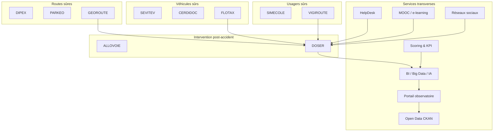

# 3. L’écosystème DITROS : une approche à 360°

DITROS (Digital Technologies for Road Safety) est une suite de **11 solutions modulaires** et de services transverses conçus pour couvrir l’ensemble du spectre de la sécurité routière. Ensemble, ils matérialisent la vision “Safe System” prônée par l’ONU, l’OMS et l’AIPCR.

## Tableau de synthèse

| Module | Pilier | Objectif principal | Acteurs clés | Données majeures | Intégration DOSER |
| --- | --- | --- | --- | --- | --- |
| DIPEX | Routes sûres | Gestion des péages et de l’exploitation routière | Gestionnaires d’infrastructures | Trafic, incidents, opérations | Croisement avec points noirs |
| PARKEO | Routes sûres | Gestion intelligente du stationnement | Collectivités, opérateurs urbains | Occupation, infractions | Corrélation congestion / accidents |
| GEOROUTE | Routes sûres | Système SIG des infrastructures | Ministères des transports, urbanistes | Référentiels routiers, travaux | Cartographie des accidents, analyse infrastructurelle |
| SEVITEV | Véhicules sûrs | Sécurisation du contrôle technique | Centres techniques, autorités | Résultats de visites, conformité | Détection de défaillances récurrentes |
| CERDIDOC | Véhicules sûrs | Sécurisation des titres et documents | Ministères, forces de l’ordre | Titres, licences, documents véhicules | Validation des identités & documents |
| FLOTAX | Véhicules sûrs | Géolocalisation et suivi de flotte | Transporteurs, agences de voyage | Trajectoires, vitesse, incidents | Analyse comportement conducteurs |
| SIMECOLE | Usagers sûrs | Formation et simulateurs de conduite | Auto-écoles, citoyens | Parcours pédagogiques, résultats | Alignement formation / incidentologie |
| VIGIROUTE | Usagers sûrs | Contrôle et prévention routière | Forces de l’ordre, ministère intérieur | Infractions, comportements | Corrélation facteurs de risque |
| ALLOVOIE | Post-accident | Centre d’urgence et coordination | Services de secours, SAMU | Alertes, délais d’intervention | Synchronisation interventions / constats |
| DOSER | Post-accident | Collecte, gestion, analyse accidents | Tous les acteurs | Données multi-sources accidents | Cœur analytique, ID accident |

### Services transverses

- **BI / Big Data / IA** : moteur analytique multi-niveaux (descriptif → prescriptif).
- **Portail observatoire** : visualisation statistique, cartographie, rapports publics.
- **Open Data CKAN** : diffusion des données ouvertes (CSV, JSON, API).
- **HelpDesk** : support 24/7, suivi des tickets, base de connaissances.
- **MOOC / e-learning** : formation continue, certifications, communauté.
- **Réseaux sociaux** : diffusion de campagnes, engagement citoyen, veille.
- **Scoring & KPI** : indicateurs de performance, notation des acteurs, suivi Décennie ONU.

## Synergies majeures

- **Routes ↔ DOSER** : géolocalisation précise des accidents pour prioriser les investissements.
- **Véhicules ↔ DOSER** : suivi des véhicules impliqués et de leur historique technique.
- **Usagers ↔ DOSER** : lien entre formation, infractions et comportements accidentogènes.
- **Post-accident ↔ Services transverses** : transformation des données en insights, diffusion, accompagnement.

!!! info "Une proposition de valeur unique"
    La plupart des solutions du marché couvrent un segment isolé. DITROS offre une approche holistique, pré-intégrée et orchestrée autour de DOSER.

## Adoption progressive

| Phase | Objectif | Modules prioritaires | Résultat attendu |
| --- | --- | --- | --- |
| 1. Stabilisation | Fiabiliser la collecte et la validation | DOSER (Collecte, Validation), ALLOVOIE | Données consolidées et traçables |
| 2. Analyse | Comprendre et piloter | DOSER (Analyse, Cartographie, Statistiques), BI/IA | Identification des points noirs et facteurs de risque |
| 3. Extension | Couvrir l’écosystème | GEOROUTE, SEVITEV, FLOTAX, VIGIROUTE | Vision 360° des accidents |
| 4. Transformation | Gouvernance proactive | DIPEX, PARKEO, SIMECOLE, Services transverses | Politiques ciblées et prévention intégrée |

Cette trajectoire permet aux États d’avancer à leur rythme tout en capitalisant sur les synergies de la suite DITROS.

