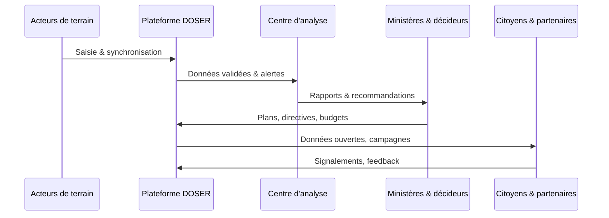

# 5. Gouvernance Collaborative et Standardisation

Le succès de DOSER repose autant sur l’orchestration humaine que sur l’innovation technologique. Le cadre de gouvernance organise les responsabilités, fluidifie les échanges de données et aligne tous les acteurs autour d’une mission commune : sauver des vies sur les routes.

## 5.1 Matrice multi-acteurs

| Acteur | Rôle principal | Données clés fournies | Outils DOSER/DITROS | Valeur reçue |
| --- | --- | --- | --- | --- |
| Police / Gendarmerie | Collecte, validation, action | PV, croquis, géolocalisation, témoignages, photos | Application mobile, Portail collecte | Dossiers consolidés, suivi des interventions |
| Services de secours | Collecte, action | Alertes, délais d’intervention, évaluation initiale | Application mobile, ALLOVOIE | Coordination en temps réel, priorisation |
| Hôpitaux / Morgues | Collecte, action | Blessures, soins, certificats de décès | Interfaces hospitalières, Portail web | Traçabilité des victimes, statistiques santé |
| Assurances | Collecte, analyse | Déclarations sinistre, contrats, indemnisations | Portail partenaire, Analytics | Détection fraude, tarification risques |
| Agences de voyages / Flottes | Collecte, analyse | Parc véhicules, itinéraires, incidents | FLOTAX, Portail flotte | Scoring chauffeurs, maintenance proactive |
| Ministères (Transports, Santé, Finances) | Analyse, action | Politiques, budgets, plans sectoriels | Observatoire, Dashboards, Open Data | Vision consolidée, priorisation investissements |
| Centre d’analyse / Observatoire | Analyse, stratégie | Rapports, recommandations, points noirs | BI/IA, Cartographie, Scoring | Pilotage stratégique, redevabilité |
| Citoyens / Grand public | Signalement, consultation | Alertes terrain, usages open data | Application mobile, Open Data CKAN, réseaux sociaux | Information, sensibilisation, engagement |

!!! info "Un réseau d’informations bidirectionnel"
    Chaque acteur est tour à tour producteur, consommateur et validateur. DOSER formalise cette chaîne de valeur et garantit que chacun contribue à partir d’un référentiel commun.

## 5.2 Flux d’orchestration

Cette orchestration crée une **boucle d’amélioration continue** où chaque action est mesurée et réinjectée dans la stratégie.

## 5.3 Standardisation & réduction de la “friction des données”

La “friction des données” apparaît lorsque des organisations aux cultures différentes saisissent des informations avec des niveaux de détail hétérogènes. DOSER la combat via :

- **Formulaires standardisés** : définitions partagées, règles métier harmonisées.  
- **Guides et formations** : procédures pas-à-pas, bonnes pratiques par rôle.  
- **Contrôles embarqués** : validation immédiate des champs critiques.  
- **Feedback en boucle** : anomalies signalées automatiquement au centre d’analyse.  
- **Valorisation des contributions** : renforcer la motivation des acteurs de terrain en montrant l’impact de leurs données.

## 5.4 Validation multi-niveaux

- **Source** : application mobile hors ligne-first avec champs obligatoires, QR codes, géolocalisation, pièces jointes.  
- **Serveur** : règles métier avancées, scoring qualité, rapprochement multi-sources (police, hôpitaux, assurances).  
- **Supervision humaine** : centre d’analyse, validation des alertes VAAR, gestion des cas particuliers.

!!! warning "Validation humaine = filet de sécurité"
    Les algorithmes détectent les anomalies, mais la décision finale reste entre les mains des analystes pour préserver la fiabilité.

## 5.5 Rituels et comités

- **Comité national de pilotage** : arbitrage stratégique, allocation budgétaire, priorisation des modules DITROS.  
- **Cellule opérationnelle** : coordination quotidienne, suivi des indicateurs, gestion des incidents.  
- **Communauté utilisateurs** : retours d’expérience, amélioration continue, partage de bonnes pratiques.

## 5.6 Formation & accompagnement

- **MOOC / e-learning** : parcours personnalisés par profil (agent, analyste, décideur).  
- **Sessions présentielles** : entraînement à la saisie, simulations, exercices de validation.  
- **HelpDesk 24/7** : support technique, base de connaissances, suivi des tickets.  
- **Campagnes internes** : sensibilisation aux enjeux de qualité de données et d’éthique.

DOSER ne vend pas uniquement un logiciel : il apporte une **méthodologie d’alignement** des acteurs, indispensable pour transformer la donnée en intelligence collective.

