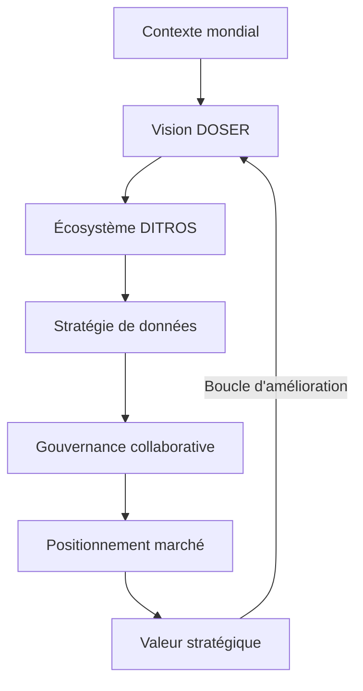

# Vision & Stratégie DOSER

DOSER n’est pas qu’une plateforme logicielle : c’est une vision complète de la sécurité routière qui transforme la donnée brute en intelligence décisionnelle au service des politiques publiques. Cette section rassemble les éléments stratégiques qui fondent le projet et permettent d’aligner tous les acteurs autour d’un modèle de gouvernance 360°.

## Parcours de lecture

1. **Contexte mondial** — comprendre l’ampleur de la crise routière et le déficit de données qui freine l’action publique.
2. **Vision DOSER** — découvrir la philosophie d’intégration, le triple cycle d’intervention et la place de DOSER dans l’écosystème DITROS.
3. **Écosystème DITROS** — explorer les modules complémentaires (routes, véhicules, usagers, post-accident) et leurs synergies avec DOSER.
4. **Stratégie de données** — suivre le cycle de vie complet de la donnée, du terrain jusqu’à la décision prescriptive.
5. **Gouvernance collaborative** — cartographier les parties prenantes, les responsabilités et les mécanismes de standardisation.
6. **Positionnement marché** — situer DOSER face aux systèmes hérités et aux solutions modernes, analyser ses différenciateurs.
7. **Valeur stratégique** — lier les bénéfices tangibles aux objectifs nationaux et internationaux (Décennie d’action ONU).

!!! tip "Besoin d’une vue opérationnelle ?"
    Consultez les pages `modules/` pour découvrir comment chaque brique fonctionnelle et service transverse contribue à cette vision.

## Principes directeurs

- **Pilotage par la donnée** : chaque décision repose sur des informations complètes, fiables et mises à jour en continu.
- **Intégration multi-acteurs** : la plateforme fédère forces de l’ordre, services de santé, assurances, ministères, opérateurs et citoyens.
- **Conformité internationale** : alignement avec l’OMS, l’AIPCR et la norme ISO 39001:2012 pour garantir crédibilité et financements.
- **Approche 360°** : complémentarité des modules DITROS pour couvrir routes, véhicules, usagers et réponse post-accident.
- **Amélioration continue** : boucles de feedback et analyses prédictives/prescriptives pour passer de la réaction à la prévention.

## Diagramme de référence

Cette boucle illustre l’ambition de DOSER : transformer les données en actions, les actions en politiques publiques efficaces, et mesurer en continu l’impact sur la sécurité routière.

