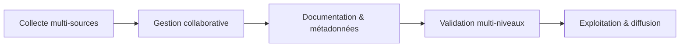
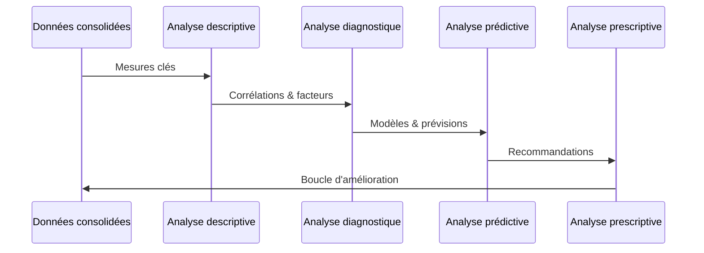

# 4. Stratégie de Données DOSER

La stratégie de données DOSER encadre le **cycle de vie complet de l’information**, depuis son entrée sur le terrain jusqu’à sa transformation en intelligence décisionnelle prescriptive. Elle garantit que chaque donnée collectée devient une action mesurable pour améliorer la sécurité routière.

## 4.1 Cycle de vie de la donnée

1. **Collecte centralisée**  
   - Sources : forces de l’ordre, services de secours, hôpitaux, compagnies d’assurance, opérateurs de transport, citoyens.  
   - Interfaces : application mobile DOSER DATA CAPTURE, portails web, intégrations API.  
   - Identifiant unique d’accident généré dès la saisie pour lier toutes les contributions.

2. **Gestion collaborative**  
   - Validation et enrichissement par chaque partie prenante.  
   - Coordination pilotée par le centre d’analyse / observatoire.  
   - Journalisation complète des modifications pour assurer la traçabilité.

3. **Documentation & métadonnées**  
   - Catalogue des données : dictionnaires, définitions, référentiels.  
   - Description des champs, formats, règles métier, niveaux d’accès.  
   - Objectif : rendre la donnée **compréhensible, partageable et auditable**.

4. **Validation multi-niveaux**  
   - **À la source** : contrôles embarqués dans l’application (champs obligatoires, formats, coordonnées).  
   - **Automatisée** : matrices de vérification IA (détection d’anomalies, cohérences inter-champs).  
   - **Humaine** : revue par les analystes pour les cas complexes ou les alertes VAAR.

5. **Exploitation & diffusion**  
   - Tableau de bord temps réel, cartographie, exports CSV/PDF, API Open Data.  
  - Diffusion adaptée à chaque audience : décideurs, opérateurs, chercheurs, grand public.

!!! tip "Une donnée = une action"
    Chaque étape vise à transformer l’information en résultats concrets : intervention plus rapide, politiques ciblées, campagnes efficaces, suivi des progrès.

## 4.2 Moteur analytique à quatre niveaux

1. **Descriptive** : « Que s’est-il passé ? » — volumes, tendances, répartitions spatio-temporelles.
2. **Diagnostique / exploratoire** : « Pourquoi cela s’est-il produit ? » — corrélations, comportements à risque, facteurs infrastructurels.
3. **Prédictive** : « Que pourrait-il se passer ? » — modélisation statistique et IA (probabilité d’accidents futurs, scénarios météo, flux de trafic).
4. **Prescriptive** : « Que devons-nous faire ? » — recommandations ciblées (campagnes, contrôles, investissements), simulations « what-if ».

## 4.3 Assurance qualité et fiabilité

- **Matrices de contrôle qualité** : détection d’âges impossibles, incohérences victimes/véhicules, coordonnées hors zone.  
- **Scores de confiance** : chaque enregistrement reçoit une note basée sur la complétude, la cohérence et la validation.  
- **Alertes proactives** : anomalies remontées au centre d’analyse pour investigation.

!!! warning "La qualité des données se décide sur le terrain"
    Formations, accompagnement et standardisation sont indispensables pour garantir une saisie homogène entre acteurs.

## 4.4 Interopérabilité et partage

- **API sécurisées** pour intégrer les systèmes partenaires (SIG, ERP, assurances).  
- **Portail Open Data CKAN** pour diffuser des jeux de données agrégés et anonymisés.  
- **Exports personnalisés** : CSV, JSON, PDF, infographies.  
- **Versioning** et historique pour traçabilité réglementaire.

## 4.5 Protection et gouvernance

- **Sécurité by design** : gestion des habilitations, chiffrement, journalisation, audits réguliers.  
- **Conformité** au RGPD et aux normes nationales en matière de protection des données.  
- **Gouvernance** pilotée par un comité multi-acteurs (ministères, opérateurs, société civile) pour garantir transparence et accountability.

DOSER fait de la donnée un **actif national** au service de la sécurité routière, capable de soutenir les objectifs de la Décennie d’action et de générer une amélioration continue des politiques publiques.

